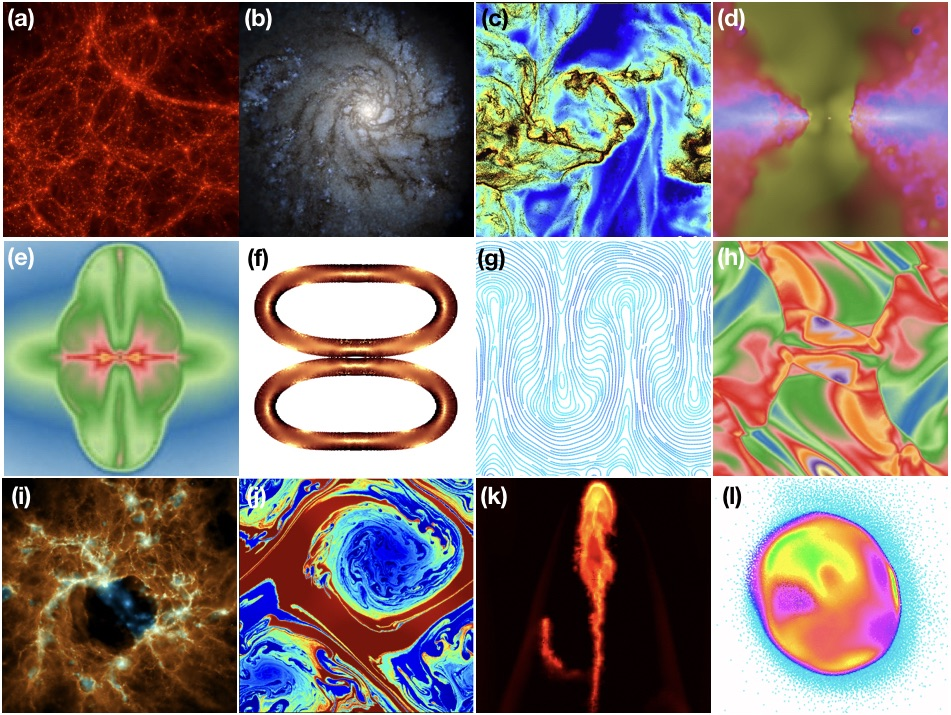
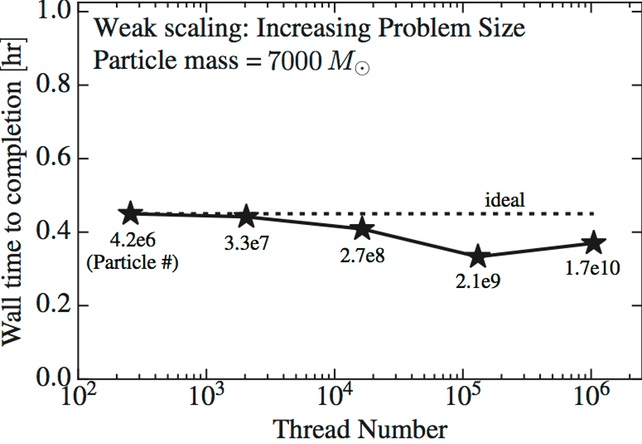
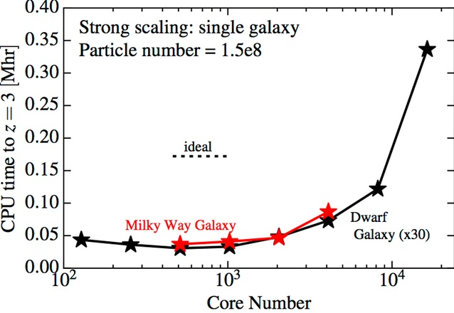
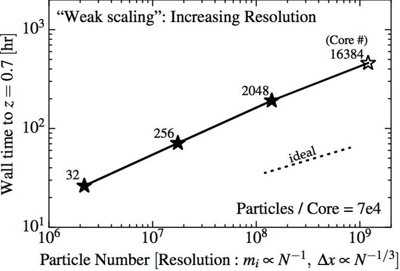
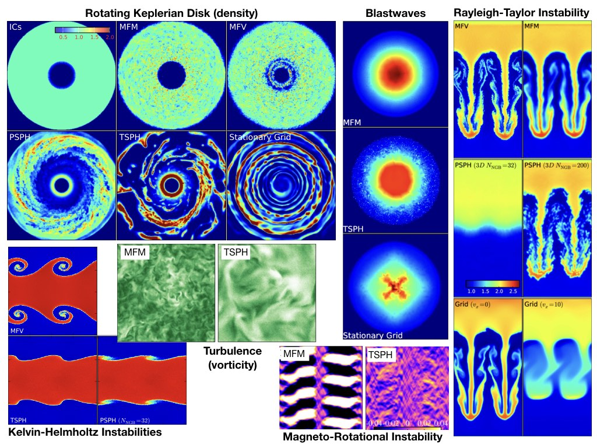
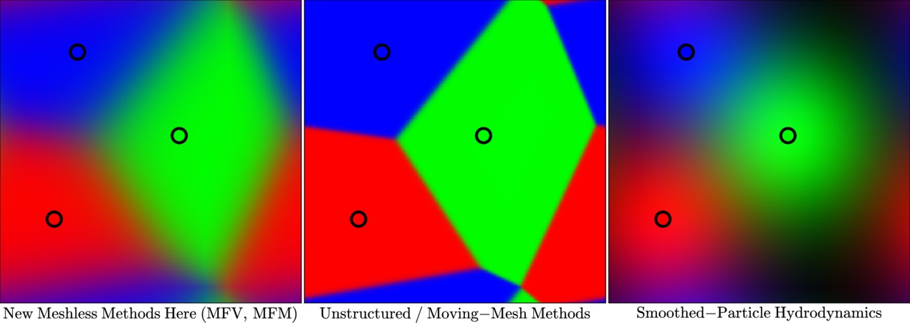
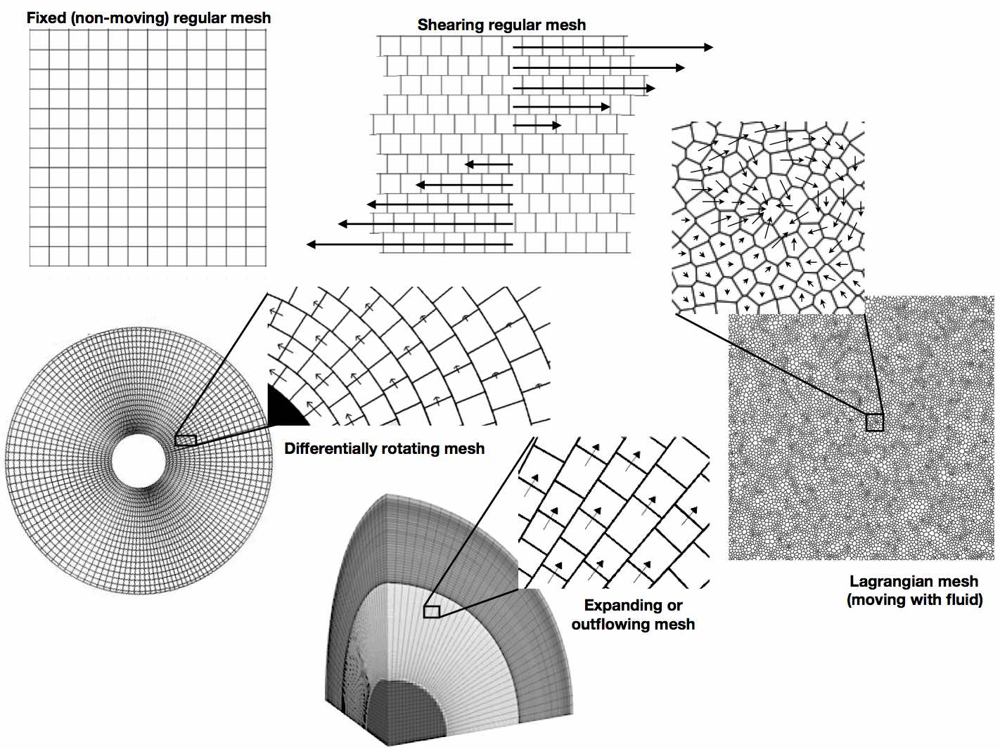

# GIZMO Users Guide 
***
#Table of Contents
1. [Code Overview](#codeoverview)
2. [Feature Set (Types of Physics Modules)](#features)
    + [Examples of Different Simulations Run with GIZMO](#features-examples)
    + [Code Scaling (Parallelism & Performance)](#codescaling)
    + [Notes on Public vs. Proprietary Code Modules](#features-private)
3. [Code Use, Authorship, Citation, Sharing, & Development Rules](#requirements)
    + [Use, Authorship, & Citation Requirements](#requirements-authorship)
    + [Code Sharing Guidelines](#requirements-sharing)
    + [Code Development & Extensions (New Physics and Code)](#requirements-development)
4. [Fluid (Hydro) Solvers](#hydro)
    + [Examples (Demonstrations, Animations, and Talks)](#hydro-examples)
    + [MFV](#hydro-mfv), [MFM](#hydro-mfm), [Grid](#hydro-grid), [SPH](#hydro-sph), [other](#hydro-mmm) 
    + [Mesh Motion](#hydro-meshmotion) ([Lagrangian/Fixed-Mass](#hydro-meshmotion-lagrangian), [User-Specified (Arbitrary/Hybrid)](#hydro-meshmotion-ale), [Eulerian/Fixed-Grid](#hydro-meshmotion-eulerian))
5. [Similarities & Differences from GADGET (+other codes)](#gadget)
    + [What's the same?](#gadget-same), [What's not?](#gadget-different), [Code modes](#gadget-mimic)
6. [Compiling and Using the Code (a very brief tutorial)](#tutorial)
    + [Compilation Requirements](#tutorial-requirements)
    + [Starting & Running the Code](#tutorial-running)  
    + [Restarting a Run](#tutorial-restart) 
7. [Modules in Config.sh (Setting compile-time options, i.e. Physics)](#config)
    + [Overview](#config-overview)
    + [Boundary Conditions & Dimensions](#config-boundaries)
    + [Hydro Solver Method](#config-hydro)
    + [Additional Fluid Physics](#config-fluids)
        + [Equations-of-State](#config-fluids-eos)
        + [Magnetic Fields](#config-fluids-mhd)
        + [Conduction & Viscosity](#config-fluids-navierstokes)
        + [Passive Scalars, Metals, & Sub-Grid Turbulent Mixing](#config-fluids-metalsturb)
        + [Dust-Gas (Particulate) Mixtures](#config-fluids-dust)
    + [Particle-in-Cell (PIC) and Cosmic Ray-Laden Gas Simulations](#config-cosmicray)
        + [MHD-PIC Simulations](#config-cosmicray-pic)
        + [Continuum Cosmic Ray-MHD Simulations](#config-cosmicray-mhd)
    + [Turbulent 'Stirring' (Large Eddy Simulations)](#config-turb)
    + [Gravity & Cosmological Integrations](#config-gravity)
        + [Numerical Solvers & Optimization](#config-gravity-numerics)
        + [Adaptive Force Softenings](#config-gravity-adaptive)
        + [External Fields and/or Disabling Gravity](#config-gravity-external)
        + [Non-Standard Dark Matter, Dark Energy, Gravity, or Expansion](#config-gravity-nonstandardDM)
        + [On-the-Fly Analysis](#config-gravity-analysis)
        + [Artificial Pressure Floors](#config-gravity-pressure)
    + [On-the-Fly Group (Halo, Galaxy, Cluster, etc) Finding](#config-fof)
    + [Galaxy & Galactic Star Formation Options](#config-galsf)
        + [Star Formation Criteria/Particle Spawning](#config-galsf-sflaw)
        + [Sub-Grid Feedback Models](#config-galsf-fb)
        + [Explicit (Resolved) Feedback Models](#config-galsf-explicitfb)
        + [FIRE Feedback Models](#config-galsf-fire)
    + [Sink-Particle Dynamics (IMF, Star formation, Planets, Compact Objects)](#config-sf)
        + [N-Body Dynamics, Integration, Regularization](#config-sf-integration)
        + [Sink Creation and Accretion](#config-sf-seedacc)
        + [Star and Planet Formation Physics](#config-sf-sfphysics)
        + [Optional and De-Bugging Modules](#config-sf-debug)
    + [SuperMassive Black Hole Options](#config-bh)
        + [Seeding and BH-Creation](#config-bh-seed)
        + [BH Dynamics (Dynamical Friction, Drag)](#config-bh-dynamics)
        + [BH Accretion Models](#config-bh-accretion)
        + [BH Feedback Models](#config-bh-feedback)
    + [Radiative Cooling & Chemistry](#config-fluids-cooling)
        + [Built-In Cooling & Thermochemistry Physics](#config-fluids-cooling-builtin)
        + [Grackle Thermochemistry Libraries](#config-fluids-cooling-grackle)
        + [CHIMES Thermochemistry Libraries](#config-fluids-cooling-chimes)        
    + [Radiation Hydrodynamics](#config-rhd)
        + [Radiation Transport Methods](#config-rhd-methods)
        + [Numerical Solvers & Optimization](#config-rhd-numerical)
        + [Frequencies/Wavebands Evolved](#config-rhd-freqs)
        + [Additional Options](#config-rhd-special)
    + [Multi-Threading (Parallelization) Options](#config-openmp)
    + [Input/Output Options](#config-io)
    + [De-Bugging and Special Code Behaviors](#config-debug)
        + [General De-Bugging and Special Behaviors](#config-debug-general)
        + [Hydrodynamics](#config-debug-hydro)
        + [Additional Fluid Physics and Gravity](#config-debug-fluids)
        + [Particle IDs](#config-debug-ids)
        + [Particle Merging/Splitting/Deletion/Boundaries](#config-debug-mergedelete)
        + [MPI & Parallel-FFTW De-Bugging](#config-debug-mpi)
        + [Load-Balancing](#config-debug-loadbalance)
8. [The Parameterfile (Setting run-time parameters)](#params)
    + [Generic (Always-Required) Parameters](#params-generic)
        + [Filenames, Directories, & Formats](#params-generic-files)
        + [Output Parameters](#params-generic-outputs)
        + [TimeStepping and Run Begin & End Times](#params-generic-times)
        + [Units & Cosmological Parameters](#params-generic-units)
        + [Memory & Load-Balancing (Domain) Parameters](#params-generic-memory)
        + [Hydro Parameters](#params-generic-hydro)
        + [Gravity Parameters](#params-generic-gravity)
    + [Parameters of Optional Physics Modules (Examples)](#params-optional)
        + [Additional Fluid Physics](#params-optional-fluids)
        + [Star, Black Hole, and Galaxy Formation](#params-optional-sf)
        + [Grackle Cooling Module](#params-optional-grackle)
        + [Driven Turbulence (Large-Eddy Simulations)](#params-optional-turb)
        + [Non-Standard Dark Matter, Dark Energy, Gravity, or Expansion](#params-optional-expansion)
        + [Solid Body and Impact Simulations](#params-optional-impact)
    + [Developer-Mode Parameters](#params-debug)
9. [Snapshot & Initial Condition Files](#snaps)
    + [Initial Conditions (Making & Reading Them)](#snaps-ics)
    + [Snapshots](#snaps-snaps)
    + [Units](#snaps-units)
    + [Reading Snapshots (Examples)](#snaps-reading)
10. [Log Outputs & Diagnostic Files](#logs)
11. [Test Problems](#tests)
    + [Equilibrium and Steady-State Tests](#tests-eqm) (e.g. [soundwaves](#tests-eqm-soundwave), ['square test'](#tests-eqm-square), [Gresho vortex](#tests-eqm-gresho), [Keplerian disks](#tests-eqm-keplerian))
    + [Shock and Non-Linear Jump Tests](#tests-shocks) (e.g. [shock tubes](#tests-shocks-sod), [interacting blastwaves](#tests-shocks-woodward), [Sedov explosions](#tests-shocks-sedov), [Noh implosions](#tests-shocks-noh))
    + [Fluid Mixing Tests](#tests-mixing) (e.g. [Kelvin-Helmholtz](#tests-mixing-kh), [Rayleigh-Taylor](#tests-mixing-rt), ['blob test'](#tests-mixing-blob))
    + [Self-Gravity & Cosmological Tests](#tests-grav) (e.g. [Evrard collapse](#tests-grav-evrard), [Zeldovich pancakes](#tests-grav-zeldovich), ['Santa Barbara Cluster'](#tests-grav-sbcluster), [galactic disks](#tests-grav-galdisk))
    + [Magneto-Hydrodynamics Tests](#tests-mhd) (e.g. waves, shocktubes, field-loops, current sheets, Orszag-Tang vortex, rotors, MRI, jets, MHD-mixing/gravity)
    + [Elasto-Dynamics Tests](#tests-elastic) (e.g. bouncing rubber cylinders)
    + [Dust/Particulate-Dynamics Tests](#tests-dust) (e.g. [uniform dust-gas acceleration](#tests-dust-dustybox), [damped two-fluid waves](#tests-dust-dustywave))
12. [Useful Additional Resources](#rscr)
    + [Visualization, Radiative Transfer, and Plotting](#rscr-vis)
    + [Halo/Group-Finding and Structure Identification](#rscr-halofinders)
    + [Other Analysis Tools](#rscr-otheranalysistools)
    + [General Super-Computing Questions](#rscr-generalsupercomputing)
13. [Frequently Asked Questions](#faqs)
    + [Where to Go for Help?](#faqs-help)
    + [What Are 'Optimal' Code Settings? (aka 'My Run is Slow')](#faqs-optimal)
    + [Are There 'Best' (More Accurate) Physics Modules or Solvers?](#faqs-best)
    + [My Run Won't Start, What Did I Do Wrong?](#faqs-startup)
    + [How do I Avoid Memory Errors/Crashes?](#faqs-memory)
    + [My Large Simulation Hangs, but Smaller Runs Work?](#faqs-big)
    + [Why Did Everything Drop to TimeBin=1?](#faqs-timebin)
    + [Are there Public ICs? Analysis Tools? Image/Movie-Makers?](#faqs-rscr)
    + [What Does this Variable Mean?](#faqs-variable)
    + [What are the Code Units?](#faqs-units)
    + [Can I use this Module? What should I cite?](#faq-citation)
    + [Can the Code do 'X'?](#faq-capabilities)
14. [Disclaimer](#disclaimer)

***

<a name="codeoverview"></a>
# 1. Code Overview 

Welcome to **GIZMO**.

The simulation code **GIZMO** is a flexible, massively-parallel, multi-method multi-physics code, with a wide range of different physics modules described in the "Feature Set" below. The code is descended from P-GADGET, itself descended from GADGET-2, and is fully compatible with GADGET analysis codes, initial conditions, and snapshots. GIZMO is not an acronym -- it refers both to the code's multi-purpose applications and to its historical relationship to GADGET.

The code is extensively documented. **Please read the User Guide** before asking questions of me or other users: most questions I get are already answered here.

The code is written in standard ANSI C, and should run on all parallel platforms that support MPI. The portability of the code has been confirmed on a large number of systems ranging from a laptop to >1 million threads/cores on national super-computers.

The original reference for the numerical methods (the original fluid+gravity solver) is the paper [here](https://arxiv.org/abs/1409.7395). It is recommended that you read it before using (or modifying) the code, although of course there have been many updates and improvements (including in the core algorithms) since this paper, for which this User Guide provides many more details. For more details on GADGET, which underpins some aspects here, see the [GADGET-2 methods paper](http://adsabs.harvard.edu/cgi-bin/nph-bib_query?bibcode=2005MNRAS.364.1105S&db_key=AST) or [GADGET-2 user guide](http://www.mpa-garching.mpg.de/gadget/users-guide.pdf).

The un-official code website (showing examples, demonstrations, and giving an overview of the code) is [here](http://www.tapir.caltech.edu/~phopkins/Site/GIZMO.html), but the actual [public code](https://bitbucket.org/phopkins/gizmo-public) is hosted on Bitbucket [here](https://bitbucket.org/phopkins/gizmo-public). The development (non-public) code repository is also hosted on Bitbucket, but in a separate repository [here](https://bitbucket.org/phopkins/gizmo).

**GIZMO** was written by me, Philip F. Hopkins (PFH), although the codebase builds on parts of Volker Springel's GADGET code. If you find the code useful, please reference the numerical methods paper in all studies using simulations run with **GIZMO**. You should also reference the GADGET paper for the domain decomposition and N-body algorithms. Various modules have their own methods papers, contributed by different authors, that should be cited if they are used; these are specified in the "Config.sh (Setting compile-time options)" section of this Guide.


***

<a name="features"></a>
# 2. Feature Set 

The GIZMO code is a flexible, massively parallel, multi-purpose fluid dynamics + gravity code. Some (not all!) current physics include:


+ **Hydrodynamics** using any of several fundamentally different methods (e.g. new Lagrangian finite-element Godunov schemes, or various "flavors" of smoothed particle hydrodynamics, or Eulerian fixed-grid schemes). 

+ **Ideal and non-ideal magneto-hydrodynamics (MHD)**, including Ohmic resistivity, ambipolar diffusion, and the Hall effect. Coefficients can be set by-hand or calculated self-consistently from the code chemistry.

+ **Radiation hydrodynamics** using any of several methods: the LEBRON (locally-extincted background radiation in optically-thin networks) approximation, the M1 (1st-moment), flux-limited diffusion (FLD), or optically thin variable eddington tensor (OTVET) approximations, or explicit on-the-fly ray-tracing (integrating intensities across the grid). Arbitrary, modular combinations of wavebands are implemented and can be mixed-and-matched. Full radiation pressure, radiative coupling to ionization and heating/cooling networks are implemented.

+ **Radiative heating and cooling; ionized, atomic, and molecular multi-species thermo-chemistry**, including pre-built libraries with photo-ionization, photo-electric, dust, Compton, Brehmstrahhlung, recombination, fine structure, molecular, species-by-species metal line cooling. Radiative cooling for both optically-thin and optically-thick limits, with consistent ionization and molecular chemistry. Hooks for popular external chemistry networks and cooling libraries.

+ **Star formation and stellar feedback** on galactic scales (appropriate for galaxy-formation or ISM studies) or individual-star scales (appropriate for IMF studies or individual proto-stellar disk/planet formation simulations), including conversion of gas into sink particles according to various user-defined criteria (e.g. density, self-gravity, molecular thresholds). This includes mass return and feedback with resolved mass, metal, and energy input into the surrounding ISM (jets, winds, supernovae, radiation) and various popular "sub-grid" galactic wind models. Individual-star formation models include proto-stellar and pre-main-sequence evolution tracks and accretion models.

+ **Black holes** including on-the-fly formation and seeding with user-defined criteria (based on local or group properties), mergers, growth via various sub-grid accretion models (with or without models for an un-resolved accretion disk), or via explicitly resolved gravitational capture, and "feedback" in the form of heating, outflows, radiation, or jets, scaled with the accretion rates.

+ **Elastic and plastic dynamics**, with support for arbitrary Tillotson-type equations-of-state for solid, liquid, or vapor media, negative-pressure media, anisotropic deviatoric stresses and plasticity, von Mises-type yield models for plasticity, and various pre-defined material properties.

+ **Arbitrary equations-of-state (EOSs)**, including support for trivially-specifiable modular EOSs, multi-fluid systems, and pre-programmed EOSs for stellar systems or degenerate objects (Helmholtz-type EOSs), as well as solid/liquid/vapor mixtures (Tillotson-type EOSs). 

+ **Sink Particles**, with dynamical accretion and formation properties, and user-specified formation conditions from local gas or group properties. 

+ **Anisotropic conduction and viscosity**, i.e. "real" Navier-Stokes or fully-anisotropic Spitzer-Braginskii conduction and viscosity, with dynamically calculated or arbitrarily chosen coefficients. 

+ **Dust-gas mixtures**, e.g. aerodynamically coupled grains or other particles. The treatment is flexible and can handle both sub and super-sonic cases, compressible fluids, and grain-gas back-reaction, with arbitrary dust drag laws (Epstein, Stokes, Coulomb drag), Lorentz forces on charged grains from magnetic fields, and grain-grain collisions (allowing sticking, bouncing, shattering).

+ **Self-gravity** for arbitrary geometries and boundary conditions, with fully-adaptive Lagrangian gravitational softenings for all fluids and particle types. Arbitrary analytic potentials can be added trivially. 

+ **Turbulent eddy diffusion** of passive scalars and dynamical quantities (Smagorinski diffusion for subgrid-scale turbulence).

+ **Shearing boxes** (stratified or unstratified), **"large-eddy simulations"** (driven turbulent boxes with arbitrarily specify-able compressible/solenoidal driving properties), **periodic** (cubical or irregular), **open**, or **reflecting** boundary conditions are also supported, and can be mixed-and-matched along different axes. One, two, or three-dimensional calculations are supported. 

+ **Cosmological integrations** (both large-volume and "zoom-in" cosmological simulations), with support for **"non-standard" cosmological models** including dynamical dark energy equations-of-state, arbitrary user-specified expansion histories (time-dependent Hubble constants), or time-dependent gravitational constants.

+ **Group-finding**, run on-the-fly, for arbitrary combinations of "target" species (e.g. halo or galaxy or cluster-finding).

+ **Particle splitting/merging** according to arbitrary user-defined criteria, to allow for super-Lagrangian "hyper-refinement" in some simulations.

+ **Passive scalar** fields (e.g. metals and arbitrary tracer species) are followed. These can be included in arbitrary numbers with simple modular functions for their injection. For example, R-process enrichment and abundances are one such set.

+ **Self-interacting dark matter and scalar-field gravity** with multi-species (mixed) dark matter physics are supported, with arbitrary (specify-able) cross sections or screening properties.

+ **Cosmic ray** physics on ISM, single-cloud or SNe, sub-galactic through cosmological scales. This includes injection via stars and SNe, MHD-dependent transport via advection, diffusion, and streaming (both isotropic and anisotropic, magnetic-field dependent terms), adiabatic heating/cooling, and catastrophic and coulomb losses and subsequent gas heating. 

+ **MHD-Particle-in-Cell (PIC) simulations** using the hybrid MHD-PIC method where arbitrary particulate species (e.g. cosmic rays, protons, dust) with large gyro-radii are integrated explicitly via particle-in-cell methods while those with smaller gyro-radii (e.g. electrons) are treated as a background fluid.


<a name="features-examples"></a>
## Examples of Different Simulations Run with GIZMO

<p align="center">
  
</p>

**GIZMO** and its methods have been used in a large number of simulations and well over a hundred different papers (for a partial list of works which reference the original methods paper, click [here](http://adsabs.harvard.edu/cgi-bin/nph-ref_query?bibcode=2015MNRAS.450...53H&amp;refs=CITATIONS&amp;)). Some examples are shown above, including: **(a)** Cosmology: Large-volume dark matter+baryonic cosmological simulation ([Davé et al. 2016](http://adsabs.harvard.edu/abs/2016MNRAS.462.3265D)). **(b)** Galaxy formation: with cooling, star formation, and stellar feedback ([Wetzel et al. 2016](http://adsabs.harvard.edu/abs/2016ApJ...827L..23W)). **(c)** Dust (aero)-dynamics: grains moving with Epstein drag and Lorentz forces in a super-sonically turbulent cloud ([Lee et al. 2017](http://adsabs.harvard.edu/abs/2017MNRAS.469.3532L)). **(d)** Black holes: AGN accretion according to resolved gravitational capture, with feedback driving outflows from the inner disk ([Hopkins et al. 2016](http://adsabs.harvard.edu/abs/2016MNRAS.458..816H)). **(e)** Proto-stellar disks: magnetic jet formation in a symmetric disk around a sink particle, in non-ideal MHD ([Raives 2016](http://adsabs.harvard.edu/abs/2016MNRAS.455...51H)). **(f)** Elastic/solid-body dynamics: collision and compression of two rubber rings with elastic stresses and von Mises stress yields. **(g)** Plasma physics: the magneto-thermal instability in stratified plasma in the kinetic MHD limit ([Hopkins 2017](http://adsabs.harvard.edu/abs/2017MNRAS.466.3387H)). **(h)** Magneto-hydrodynamics: the Orszag-Tang vortex as a test of strongly-magnetized turbulence ([Hopkins & Raives 2016](http://adsabs.harvard.edu/abs/2016MNRAS.455...51H)). **(i)** Star formation: star cluster formation (with individual stars) including stellar evolution, mass loss, radiation, and collisionless dynamics ([Grudic et al. 2016](http://adsabs.harvard.edu/abs/2016arXiv161205635G)). **(j)** Fluid dynamics: the non-linear Kelvin-Helmholtz instability ([Hopkins 2015](http://adsabs.harvard.edu/abs/2015MNRAS.450...53H)). **(k)** Multi-phase fluids in the ISM/CGM/IGM: ablation of a cometary cloud in a hot blastwave with anisotropic conduction and viscosity ([Su et al. 2017](http://adsabs.harvard.edu/abs/2017MNRAS.471..144S)). **(l)** Impact and multi-material simulations: giant impact (lunar formation) simulation, after impact, showing mixing of different materials using a Tillotson equation-of-state ([Deng et al. 2017](http://adsabs.harvard.edu/abs/2017arXiv171104589D)).


<a name="codescaling"></a>
## Code Scaling (Parallelism & Performance)

**GIZMO** uses a hybrid MPI+OpenMP parallelization strategy with a flexible domain decomposition and hierarchical adaptive timesteps, which enable it to scale efficiently on massively-parallel systems with problem sizes up to and beyond billions of resolution elements. In addition, we have implemented a large number of optimizations for different problems and physics, including e.g. rolling sub-routines and communication together, implementing problem-specific weighting schemes for domain decomposition, solving gravity with a hybrid tree-nested particle mesh approach, and adopting fully adaptive spatial and time resolution. Remarkably, despite the additional computational complexity, the new fluid solvers are actually faster in **GIZMO** than their SPH counterparts, owing both to the reduced neighbor number needed and to several custom optimizations. 

Code scalings are always (highly) problem-and-resolution-dependent, so it is impossible to make completely general statements about how **GIZMO** scales. However, we can illustrate one example here. This shows the code scalings of **GIZMO** (in hybrid MPI+OpenMP mode) on full production-quality FIRE-2 cosmological simulations of galaxy formation, including the full physics of self-gravity, hydrodynamics, cooling, star formation, and stellar feedback (from [Hopkins et al. 2017, arXiv:1702.06148](http://adsabs.harvard.edu/abs/2017arXiv170206148H)). 

<div class="image" style="display:inline-block">
 
<div>Weak scaling (making the computational problem larger in size, but increasing the processor number proportionally) for a full cosmological box, populated with high resolution particles (fixed particle mass), run for a short fraction of the age of the Universe. We increase the cosmological volume from 2 to 10,000 cubic comoving Mpc. In these units, theoretically “ideal” weak scaling would be flat (dashed line shown). The weak scaling of GIZMO’s gravity+MHD algorithm is near-ideal (actually slightly better at intermediate volume, owing to fixed overheads and statistical homogeneity of the volume at larger sizes) to greater than a million threads (>250,000 CPUs and >16,000 independent nodes). 
</div>
</div>


<div class="image" style="display:inline-block">
 
<div>Strong scaling (CPU time on a fixed-size problem, increasing the processor number) for a "zoom-in” simulation of a Milky Way-mass galaxy (1e12 solar-mass halo, 1e11 solar-masses of stars in the galaxy) or a dwarf galaxy (1e10 solar-mass halo, 1e6 solar-masses in stars in the galaxy), each using 1.5e8 (150 million) baryonic particles in the galaxy, run to 25% of the present age of the Universe. In these units, “ideal” scaling is flat (dashed line), i.e. the problem would take same total CPU time (but shorter wall-clock time as it was spread over more processors). Our optimizations allow us to maintain near-ideal strong scaling on this problem up to ~16,000 cores per billion particles (~2000 for the specific resolution shown). 
</div>
</div>


<div class="image" style="display:inline-block">
 
<div>Test increasing the resolution instead of the problem size (specifically, increasing the particle number for the same Milky Way-mass galaxy, while increasing the processor number proportionally). Because the resolution increases, the time-step decreases (smaller structures are resolved), so the ideal weak scaling increases following the dashed line. The achieved scaling is very close to ideal, up to >16,000 cores for ~1 billion particles. 
</div>
</div>


This is an extremely inhomogeneous, high-dynamic-range (hence computationally challenging) problem with very dense structures (e.g. star clusters) taking very small timesteps, while other regions (e.g. the inter-galactic medium) take large timesteps — more “uniform” problems (e.g. a pure dark-matter only cosmological simulation or pure-hydrodynamic turbulence simulation) can achieve even better scalings. 


<a name="features-private"></a>
## Important Notes on Public vs. Proprietary Code 

The public version of the code has full functionality for the "core" physics in **GIZMO**, including almost all physics listed above. This is intended for a wide range of science applications, as well as learning, testing, and code methods studies. A few modules are not yet in the public code (i.e. they are only present in the development code, which is not public). Usually, this is because they are in active development and not yet de-bugged or tested at the level required for use "out of the box" -- those modules will be made public as soon as this stage is reached. In some cases, however, it is because a module involves proprietary code developed by others with their own collaboration policies, which must be respected. 

If you wish to contribute to the active code development or new physics, first read the use policies below, and then contact me directly. Access to the development code, however, *DOES NOT* imply permission to use any modules identified as proprietary either in the README or User Guide or `Template_Config.sh` file. These are modules being actively developed or used by their original authors to finish PhD theses and related projects. For example, the set of modules identified as part of the FIRE project are specifically developed by a collaboration which has its own authorship and collaboration policies (akin to many observational collaborations). I (PFH) do not have sole authority (even though I am a member of that collaboration) to grant anyone permission to use those parts of the code. If in doubt about whether use of a given module is permitted, *ask*.

Permission to access and use the development code, and any modules therein, is *not transferrable*. If you have postdocs/students/collaborators, they must request permission as well. You should not distribute copies of the development code. If you move on from the original project for which permissions were granted, you must re-request permissions. Permission is granted only for the originally specified use purposes. 

***


<a name="requirements"></a>
# 3. Code Use, Authorship, Citation, Sharing, & Development Rules 

<a name="requirements-authorship"></a>
## Use, Authorship, & Citation Requirements

### _Citation Requirements_:

Any paper using **GIZMO** should, at a minimum, cite the methods paper: Hopkins 2015 ("A New Class of Accurate, Mesh-Free Hydrodynamics Methods"). You should also cite the **GADGET** methods paper (Springel, 2005, MNRAS, 364, 1105) for the domain decomposition and N-body algorithms.

When using specific modules, the relevant code papers must also be cited: for example, papers using the MHD version of the code should cite the MHD methods paper: Hopkins & Raives 2015 ("Accurate, Meshless Methods for Magneto-Hydrodynamics"). Anisotropic diffusion operators (conduction, viscosity, radiation, cosmic rays, non-ideal MHD, passive scalar diffusion) should site Hopkins 2016 ("Anisotropic Diffusion in Mesh-Free Numerical Magnetohydrodynamics"). The citations required for the various code modules are all given in the "Config.sh (Setting Compile-Time Options)" section of this Guide, where the modules are described. 

Remember, these modules were developed at great expense in both time and grant funding by their authors. Moreover readers may want to see more detailed numerical tests. So please, respect the citation requirements for all modules or your access to **GIZMO** will be revoked.

### _Authorship Requirements & Acceptable Use: Public Code_:

If you are using the public version of **GIZMO**, there are no requirements for offering authorship of papers resulting from the code, only the citation requirements above.

### _Authorship Requirements & Acceptable Use: Private Code_:

However, if you are using the development version of the code, it is important to remember that many of the modules are *not* provided for common use under *any* license whatsoever, regardless of whether or not you have permission to see/access them. It is not acceptable to use these modules for any work without the explicit consent of the authors of these modules. In general, access to the development version of the code is granted *only* on the condition that all users understand and agree to this, and will *only* use non-public modules which they have developed themselves or for which they have explicitly gotten the approval of the relevant authors. 

In the `Template_Config.sh` file included in the code, many of the relevant modules specifically outline their guidelines -- the relevant modules are specifically described as requiring consent of various authors or groups for their use. Again, these permissions are required to use these modules in any scientific work; access to the development code does not imply permission to use any modules labeled as proprietary anywhere in the User Guide, `Template_Config.sh` file, README, or source code.

But if you are unsure whether or not you have permission to use a module, please contact the developers. If you do not know whether or not you have permission to use some module, and it is *not* in the public code, the only safe assumption is that you *do not* have that permission.

For example, a few of the modules in GIZMO are specifically developed either as part of the FIRE project or are imported from GADGET-3, these have specific, known policies. Any projects using the FIRE stellar and/or black hole feedback physics routines must be agreed to by the entire FIRE core development team (PFH, D. Keres, C.A. Faucher-Giguere, and E. Quataert), and the FIRE collaboration has a requirement that project plans be approved by the collaboration before work begins, and that authorship be offered to all the team members and papers be distributed internally among the collaboration before they are made public. GADGET-3 has long-standing user policies set by its main developer, V. Springel; if you had permissions to use a specific module in GADGET-3, it is probably safe to assume that permission extends to its imported version in GIZMO, but if you are unsure and the code is not public, Volker is the person to contact. Other modules were developed by individual students/postdocs, as part of their ongoing research, and are proprietary - they can only be used with explicit permission from the developer.

Users who violate these policies will have their access to the private version[s] of **GIZMO** immediate revoked.


<a name="requirements-sharing"></a>
## Code Sharing Guidelines 

The public version of the code is free software, distributed under the [GNU General Public License](http://www.gnu.org/copyleft/gpl.html). This implies that you may freely distribute and copy the public code. You may also modify it as you wish, and distribute these modified versions as long as you indicate prominently any changes you made in the original code, and as long as you leave the copyright notices, and the no-warranty notice intact. Please read the General Public License for more details. Note that the authors retain their copyright on the code. 

The private version of the code is closed and can only be shared with the explicit permission of the author (PFH). Any sub-section of the non-public code can only be shared, distributed, or incorporated into other work with the explicit permission of the author and the developer(s) of the relevant code (see the policies for acceptable use, above). 

**Permissions are not transferrable.** If you are working with collaborators, postdocs, or students, they must request permission as well to access the development code, and their permissions are restricted to the same set of modules as the project lead. Do not distribute tarballs of the private code to others; they should be accessing the development repository if they are using the development code. Permission is granted on a project basis: if the scope of the project changes, or if new modules are needed, or any proprietary parts of the code requested, permission must be re-requested. 

Users who violate these policies will have their access to the private version[s] of **GIZMO** immediate revoked.


<a name="requirements-development"></a>
## Code Development & Extensions (New Physics and Code) 

You are encouraged to study and modify this code (public or private)! Please, if you have ideas for interesting physics to add, add it! You are only asked to do a few things, to make your experience and that of everyone else much easier. 

+ **Communicate Your Plans.** As the lead developer (PFH), I'd really appreciate knowing what kinds of physics you're adding. It may be that someone else has already done this, or that there is partial code already in place, to save you a huge amount of effort.

+ **Build your modifications as a branch (or fork) to the Bitbucket repository.** The repository is designed to make it very easy to branch, modify, and re-integrate codes, use it to make everything easy! This will make it very easy for you to keep your version of the code up-to-date even after you branched it (rather than it being frozen to an old version). It will also make it easy if you want to ever push back into the main code. Otherwise your code will not be supported.

+ **Always protect against conflicts.** Non-standard code extensions should always be written such that they can be switched off, if not needed, and have no side effects on existing code. Normally this means that they have to be enclosed in conditional compilation precompiler statements (#ifdef), especially if variables in the global structures of the code need to be allocated for the extension. However, if the extension's execution can also be controlled at run-time by simple variables, then consider introducing a parameterfile-variable to control the extension. In general, the number of Makefile symbols to control conditional compilation should be kept to a minimum.

+ Do not place any substantial piece of code belonging to your extension into existing functions of the code. Write your own functions for the code extension, and only place a function call (if needed bracketed by an #ifdef) into the appropriate place of the primary code. Also, place your extension functions into separate source files. The source files for any new module should go into their own folder, with an appropriate name -- just like the existing modules in the code for things like hydro, gravity, galaxy formation, etc. Otherwise the code will quickly become impossible to manage.

+ If you're willing to push the changes back and share them, it adds incredibly to the value of the code and (likely) to your own citation rates. Consider it!


### _General Code-style Principles (Good Practices)_:

+ Code formatting: Try to be consistent with the code formatting of the main code, which is more or less GNU-style, with a few small differences. You can run the indent-command with the options: 

        indent -gnu -npsl -npcs -nbs -nsaf -nsai -nsaw -nprs -bap -pmt -l110 *.c

    on your source file(s) to make the indention consistent.

+ Name functions all in lower case as a "command" that is descriptive of what the function does. Words are separated by underscores, e.g. `calculate_normal_vector_for_triangle(...)`. For all functions, input arguments should come first, output arguments last.

+ Global variables (which should be kept to a minimum!) start with an upper case character. They are nouns, with words separated by mixed lower/upper case characters, and contain no underscores. Use abbreviations that are clear, e.g. NumForceCalculations.

+ Local variables start with lowercase, and should have descriptive names too, except for simple loop iterators and the like. Try to narrow the scope of a variable as much as possible, for example by declaring them inside a block where they are needed. Declaration and initialization should be combined in one command where possible, e.g.

        int n = get_particle_count();

    instead of

        int n;
        n = get_particle_count();


+ Avoid repetition of code, write a function instead. Break up long functions into smaller more manageable pieces.

+ Preprocessor macros (compile-time flags) that have arguments should be avoided if possible (but do whatever you can to minimize the number of compile-time flags). If needed, their names should be fully capitalized. They should always be named with a consistent prefix naming scheme (as currently in the code, where for example all the galaxy star formation flags begin with `GALSF_`).

+ Magic numbers (including numerical constants) in the code should be avoided and instead be replaced by a symbolic constant (all uppercase) declared with #ifdef in a header file.

+ Address all warnings emitted by the compiler when compiled with "-Wall". Unless there are very or necessary good reasons, the code should compile without any warning (not without a crash, without a *warning*).

+ Include consistent commenting in your code. The meaning of all global variables should be commented where they are introduced, ideally with doxygen syntax, e.g:

        int MyGlobalCount; /*!< counts the number of timesteps */

    Functions should be preceded by a brief explanation of what the function does, including warnings/instructions, if any, about how the function may be used, e.g.:

        /*!
         * Insert the point P[i] into the list of active particles. Return 
         * the new number of active paticles.
        */
        int insert_point_into_active_list(int i)
        {
        ...
        }

    You do not need to state here *how* the function achieves what it does, but this can be stated if appropriated in comments in the function body. There, avoid superfluous comments that just reflect what's obvious from the code anyway. Instead, focus on comments that help one to quickly understand/check what the code tries to do at an algorithmic level. If complicated formulae are implemented, try to include in a comment a reference to the equation that is implemented. Avoid c++ style comments in C-code.

***

<a name="hydro"></a>
# 4. Fluid (Hydro) Solvers 

GIZMO is unique in that it allows the user (at compile time) to choose the method with which they would like to solve the fluid (hydrodynamic, MHD, RHD) equations. This flexibility goes far deeper than in most codes. We're not talking about the difference between e.g. different Riemann solvers or different ways of writing the SPH equation of motion, we're talking about different methods for how the simulation volume is decomposed (e.g. the "grid" underlying everything).


<a name="hydro-examples"></a>
## Examples (Demonstrations, Animations, and Talks)

<p align="center">
  
</p>

For a variety of images and movies demonstrating how these produce different results in real simulations (a few random examples are shown above), and highlighting the regimes where the new Lagrangian Godunov-type methods (MFV and MFM) in GIZMO have unique advantages, see the [code overview site here](http://www.tapir.caltech.edu/~phopkins/Site/GIZMO.html). 

Much more detailed quantitative discussions are found in the GIZMO methods paper [here](https://arxiv.org/abs/1409.7395) and the follow-up GIZMO MHD methods paper [here](https://arxiv.org/abs/1505.02783), or see [my notes here](http://www.tapir.caltech.edu/~phopkins/public/notes_pfh_numerical_methods.pdf) (or in the downloads section of the Bitbucket site) from a summer-school lecture for a broader overview of different methods (SPH, AMR, MFM/MFV, moving-Voronoi-meshes).


## Mesh Structure: Overview of the Different Methods

<p align="center">
  
</p>

Below are the current solvers in GIZMO, with some descriptions. For more detail, see the [**GIZMO** methods paper](https://arxiv.org/abs/1409.7395). The illustration above  demonstrates some of the key conceptual differences between some of the methods here. For an irregularly distributed set of sampling/grid points or "particles" (black circles) with locations $x_{i}$, any simulation code requires a way to partition the volume to solve the equations of fluid dynamics between them. *Left:* The meshless finite-mass/finite-volume (MFM and MFV) methods here. The volume partition is given by a smooth kernel decomposition at every point (red/green/blue channels represent the fraction of the volume at each point associated with the corresponding particle). This resembles a Voronoi tessellation with smooth edges. Despite the kernel function being spherical, the domains associated with each particle are not, and the entire volume is represented. The fluid equations are then solved by integrating over the domain of each particle/cell. *Center:* The unstructured/moving Voronoi-mesh partition. Now the boundaries are strict step functions at the faces given by the tessellation. Note that this is (exactly) the limit of our MFM/MFV method for an infinitely sharply-peaked kernel function. The volume integrals are then reduced to surface integrals across the faces. *Right:* The SPH partition. In SPH the contribution to volume integrals behaves as the kernel, centered on each particle location; the whole volume is "counted" only when the kernel size is infinitely large compared to the inter-particle spacing (number of neighbors is infinite). The equations of motion are evaluated at the particle locations $x_{i}$, using the weighted-average volumetric quantities from the volume partition. 

If you are interested in additional comparisons, see the [methods paper](https://arxiv.org/abs/1409.7395) for a more technical description specific to **GIZMO**, or see [my notes here](http://www.tapir.caltech.edu/~phopkins/public/notes_pfh_numerical_methods.pdf) (or in the downloads section of the Bitbucket site) from a summer-school lecture for a broader overview of different methods (SPH, AMR, MFM/MFV, Voronoi-meshes).

<a name="hydro-mfv"></a>
### _MFV (Meshless Finite-Volume) Method_: 

Enabled by `HYDRO_MESHLESS_FINITE_VOLUME`: This method was developed in pieces by many people in the fluid dynamics community, and the foundations for this implementation (as well as various convergence proofs, etc) are given in Lanson & Vila 2008 (papers [here](http://www.researchgate.net/publication/220179584_Renormalized_Meshfree_Schemes_II_Convergence_for_Scalar_Conservation_Laws) and [here](http://www.researchgate.net/publication/220179273_Renormalized_Meshfree_Schemes_I_Consistency_Stability_and_Hybrid_Methods_for_Conservation_Laws)). It is an evolution of the first implementation for astrophysical use in Gaburov & Nitadori 2010 ([paper here](http://arxiv.org/abs/1006.4159)). The method uses a kernel function to partition the volume (unlike SPH, the partition is analytically exact and only serves to divide the volume -- it is not a 'smoothing function'); it then derives a second-order accurate and consistent set of hydrodynamic equations from that partition. The discretized equations define an "effective face" for the particles (the "partition generating points" the same way that particles define the "mesh generating points" for Voronoi-type mesh methods), across which an exactly conservative Riemann problem is solved with a Godunov-type scheme. The method is simultaneously second-order accurate and fully conservative (see the methods paper for demonstrations). It is very similar to moving-mesh methods using Voronoi or other geometric tesselation, and captures contact discontinuities more accurately than any of the other methods below. Particles will gain and lose mass according to the motion at the faces -- the actual motion of the mesh-generating points is, in principle, arbitrary. In the default mode, the mesh-generating points move with the center-of-mass velocity of the cells (which still means there are mass fluxes, but they are relatively small); however as described in the section on mesh motion below, the mesh motion can in principle be arbitrarily specified in this method. If desired, on-the-fly (fully conservative) particle splitting and merging prevents particle masses from becoming too disparate. 


<a name="hydro-mfm"></a>
### _MFM (Lagrangian Meshless Finite-Mass) Method_: 

Enabled by `HYDRO_MESHLESS_FINITE_MASS`: This method is similar to the meshless finite volume method, except that when solving the Riemann problem between particles, we implicitly assume a deformation of the face between the particles such that there is no mass flux between the particles (essentially, we solve the Riemann problem not for the "fixed" face located halfway between the two particles, but for the -Lagrangian- face moving with the mass sheet that defined the "original" face). Thus the particle masses stay fixed (at least under hydro operations). The elements are therefore necessarily moving with the mean fluid flow (one cannot, in MFM, force the mesh motion to be different from the fluid motion). The method is therefore "Lagrangian" in that fluid elements can be trivially tracked with time. As shown in the methods paper, this is still a second-order consistent method. However, it does introduce a second-order (non-linear) error in the advection equation: basically, when we implicitly re-map to the next timestep, the "new" face does not exactly match the Lagrangian deformation used in the step before. So we trade a small amount of accuracy for certain types of problems at fixed resolution for the convenience of tracking a fixed Lagrangian fluid element and guaranteeing that we don't have wildly different particle masses interacting gravitationally (which can seed noise). On some problems where advection would be very large and the problem is coupled to self-gravity (so differing particle masses can introduce noise), this is the most accurate of the methods in GIZMO. This is the "default" method of the code if no method is specified. 


<a name="hydro-grid"></a>
### _Regular-Mesh (Cartesian Fixed-Grid) Method_: 

Enabled by `HYDRO_REGULAR_GRID`, this is a standard finite-volume Godunov scheme solved on a fixed (non-moving), regular Cartesian mesh. This is built on the architecture of the MFV method, so the mesh-generating points are simply fixed relative to one another (a *uniform* boost of the whole system is trivial to add, if desired, but would have to be hard-coded for the problem), using the assumption of a geometric grid to exactly calculate closed, regular geometric faces. This is an "Eulerian" or "fixed-grid" method. However, mesh motion is allowed, so long as it preserves the regularity of the mesh (see the discussion in the mesh motion section, below) -- for example, the mesh can be uniformly shearing or boosted. This mode also can used to define grids of other regular geometries (e.g. cylindrical or spherical grids) -- in those cases the mesh can be rotating or spherically expanding/contracting with regular speeds, as well. For some problems (e.g. highly sub-sonic problems, where the constant mesh deformation implicit in MFM or MFV can seed sound wave), this can be more accurate or give smoother solutions, but it encounters challenges when the fluid is moving rapidly over the mesh or collapsing under self-gravity.


<a name="hydro-sph"></a>
### _SPH (Smoothed-Particle Hydrodynamics)_: 

This is SPH, well-known from astrophysics and fluid dynamics (going back to Gingold & Monaghan 1977). A kernel function is used to smooth volumetric field quantities. From these approximate (smoothed values), the equations of motion are derived. All the formulations of SPH supported here are derived from the modern "Lagrangian" formulation (see [Springel & Hernquist 2002](http://adsabs.harvard.edu/cgi-bin/nph-bib_query?bibcode=2002MNRAS.333..649S&db_key=AST)), in which the equations of motion are derived from a particle Lagrangian, and so are manifestly conservative. All of the SPH methods used, by default, include the most current bleeding-edge formulations of things like artificial dissipation (viscosity, conductivity, diffusion), higher-order kernels, corrections for adaptive kernel softenings, timestepping, etc.

The SPH methods supported come in two flavors: 

(a) Enabled by `HYDRO_PRESSURE_SPH`: This enables the "pressure SPH" or "density-independent SPH" from Hopkins 2013 ([see paper here](http://arxiv.org/abs/1206.5006)) or [Saitoh and Makino 2013](http://adsabs.harvard.edu/abs/2012arXiv1202.4277S). This computes both the density and pressure (all volumetric quantities) from direct kernel-smoothing, and self-consistently propagates these into the equation of motion. This solves the "surface tension" problem well-known in "traditional" SPH (in which the two sides of a contact discontinuity see different pressures, leading to a surface-tension-like repulsive term across the discontinuity). The tradeoff for this is greater noise and diffusion at pressure discontinuities (shocks), as well as less accurate energy conservation in radiative cooling steps. 

(b) Enabled by `HYDRO_DENSITY_SPH`: This is the "traditional" or "density" form of SPH, in which only the density is kernel-averaged, and the pressure is computed from this plus the particle-carried entropy or internal energy.

Note that --any-- SPH method, no matter how accurate the artificial dissipation terms is, or which form of the equation of motion is used, is not second-order consistent. This is the origin of the well-known fact that SPH only converges (formally speaking) in the limit where the number of neighbors inside the kernel goes to infinity at the same time that the total number of neighbors also goes to infinity. See the methods paper for more discussion of this point. As a result, for almost any problem you can think of, SPH at fixed resolution is substantially less accurate, and converges less rapidly, compared to other methods in GIZMO. It is, however, exceptionally stable (numerically speaking): in conditions which would crash any other hydro solver, SPH will keep running (this is not necessarily an advantage, however: if it would crash the other solvers, SPH may well give you the --wrong-- answer. It will just give you an answer.)


<a name="hydro-mmm"></a>
### _Moving Voronoi Meshes_: 

Moving Voronoi-type meshes (with exact geometric tesselation, as opposed to the MFM/MFV volume partition) are currently partially implemented. Check back!


<a name="hydro-meshmotion"></a>
## Mesh Motion:  


<p align="center">
  
</p>


Above, we described different methods (MFM, MFV, regular grids, SPH, Voronoi-meshes) which refer to the manner in which the volume is partitioned among mesh-generating points or fluid elements, or equivalently the *geometry* of the mesh (or the way effective "faces" are defined between elements for purposes of computing the fluxes). 

However, this is (at least for some methods) separate from the question of how the mesh *moves*. Some methods above (e.g. MFM or SPH) require certain assumptions about the mesh motion, while others (e.g. MFV) allow essentially arbitrary mesh motion ("upon which" the fluid equations are solved each timestep with the method). **GIZMO** allows the user to define essentially any arbitrary mesh motion desired. 

Some examples of different kinds of mesh motion allowed in **GIZMO** are shown in the Figure above. Broadly-speaking, there are three categories into which different mesh-motion schemes fall: 


<a name="hydro-meshmotion-eulerian"></a>
### _Eulerian (Fixed-Volume or Non-Moving) Meshes_: 

The simplest "Eulerian" schemes, and still the standard for traditional fixed-grid or AMR methods, do not allow the mesh to move at all. The mesh-generating points (which determine the locations of the "cells" or "particles") are simply "frozen" and the fluid is advected over them. 

This is the default behavior if you use the **REGULAR\_GRID** fluid method (enabled with the `HYDRO_REGULAR_GRID` flag), since the grid usually is static in time. 

You can also force it to be true with other methods, like **MFV**, by setting the compile-time parameter `HYDRO_FIX_MESH_MOTION=0`. The mesh can then have an arbitrary geometry, but not move. Note, though, that this can often lead to some nasty errors if your mesh is not well-ordered initially (e.g. if the cells are asymmetric, and the mesh cannot move to "regularize" then, you will imprint this asymmetry onto the global solution). 

Although the discussion above in the section about different methods (and in the linked talks) describe many advantages of moving meshes or "Lagrangian" methods for problems with large bulk motion, advection, gravitational collapse, etc, there are certainly problems where fixed (non-moving) grids can still be advantageous (if the grid is well-ordered or regular). For example, on problems where you wish to follow highly sub-sonic motion accurately, moving meshes generate "grid noise" because the mesh is constantly moving and deforming. This deformation of the system generates pressure fluctuations on a scale of order the integration error, which in turn launch sound waves, that can significantly corrupt the desired behavior. A regular (e.g. Cartesian) non-moving mesh has no "grid noise" however, so avoids these issues. Of course, the method is more diffusive if the grid is not moving, especially if there is substantial advection across the cells, and one has to be careful about imprinting preferred directions on the flow. But in general, in problems where it is very important to maintain a "smooth" background flow (e.g. reduce noise at all costs, even at the cost of significant numerical diffusivity), this can be useful.


<a name="hydro-meshmotion-lagrangian"></a>
### _Lagrangian (Fixed-Mass) Meshes Moving with the Fluid_: 

At the opposite extreme, in traditional "Lagrangian" schemes, the mesh moves with the fluid velocities exactly. Specifically, the mesh-generating points move with the center-of-mass fluid velocity of the cell/element. This will of course lead to arbitrary deformations of the mesh, so your method needs to be capable of handling this (it is simply not possible to maintain a regular Cartesian "cuboid" mesh while advecting all the cells with arbitrary local fluid velocities, for example). 

In **MFM** or **SPH**, the method solves the fluid equations *for a fixed mass element*. Therefore, the mesh *must* move with the mean fluid motion, or else the equations give contradictory and meaningless (unphysical) results. These methods follow fixed mass elements and the mesh is continuously moving and de-forming along with the mean fluid flow (determined self-consistently according to the hydrodynamic equations). They are therefore traditional "Lagrangian" methods, and the mesh will always behave this way if they are chosen as the fluid method. 

Usually, with other quasi-Lagrangian methods (e.g. **MFV**), this is also the preferred (default) motion of the mesh, as described below. This is for example, the behavior of **MFV** used in the original **GIZMO** methods paper and in the work by Gaburov & Nitadori 2010. One can force **MFV** to behave this way by setting the compile-time parameter `HYDRO_FIX_MESH_MOTION=7`. 

These schemes have the advantages discussed above, for problems involving e.g. highly super-sonic motion, gravitational collapse, angular momentum, etc, especially when the "preferred" geometry of the problem is unknown (or un-defineable), so one does not wish to imprint preferred directions on the code and wishes to minimize advection errors as much as possible.


<a name="hydro-meshmotion-ale"></a>
### _Meshes with Arbitrarily User-Defined Motion (Arbitrary Lagrangian-Eulerian or Hybrid Methods)_: 

In principle, however, some methods (such as the **MFV** method or moving Voronoi-mesh-type methods) allow for arbitrary mesh motion -- the mesh can move with the fluid, or not. **GIZMO** allows the User, if desired, to control the mesh motion as they like, by setting the compile-time parameter `HYDRO_FIX_MESH_MOTION`. 

This can be set to any of several values, which determine the mesh motion:

+ **0**: Fixed (non-moving) mesh: if this is chosen, the mesh-generating points do not move at all, and the fluid is purely-advected over them (i.e. the scheme is "Eulerian" as described above).  

+ **1**: Fixed velocity from ICs (Cartesian): if this is chosen, the code will read the mesh-generating point velocities out of the initial conditions file (from the field titled `ParticleVelocities`, see below). The mesh will then be moved with these velocities for the duration of the simulation. It is assumed that the velocities and motion are in Cartesian coordinates, i.e. ${\bf v}_{\rm mesh} = (v_{x},\,v_{y},\,v_{z})$ is what is actually defined. This can be used, for example, to construct arbitrarily boosted simulation domains, or boxes that have arbitrary shear flows (like the shearing regular mesh example above, with the initial shear velocity set up in the initial conditions file). Note that in principle the same functionality can be achieved with the flag (**4**) described below.  

+ **2**: Fixed velocity from ICs (Cylindrical): this reads the mesh-generating point velocities from the ICs and assumes they are constant over the simulation, just like (**1**) above, but assumes that what is actually constant is the velocity in *cylindrical* coordinates, not in Cartesian coordinates (so the mesh will move in constant circular orbits, for example, rather than straight-lines). This is useful for defining uniformly-rotating meshes for, say, disks (where the mesh-generating points can move with the mean circular velocity at each radius). This is similar to what is done in the [DISCO](http://duffell.org/disco.html) code by Paul Duffel, for example, which defines a rotating disk mesh. Note that the initial velocities should still be given in the usual Cartesian coordinate vectors $(v_{x},\,v_{y},\,v_{z})$ like always -- the code will transform these into the cylindrical coordinate system. Also note that for periodic boxes, the origin of the cylindrical coordinate system will be assumed to be the box center; for open boxes, the coordinate (0,0,0) will be the origin; however special behavior can also be achieved by using the methods described below for analytic gravitational potentials, to specify a "special" particle (which can move) to act as the center of the coordinate system.  

+ **3**: Fixed velocity from ICs (Spherical): just like (**2**) above, but the velocities will be transformed and assumed constant in spherical coordinates (so the mesh will move in radially expanding-or-contracting shells, rather than straight-lines).  

+ **4**: Arbitrary User-Specified Function: The most flexible option, in this case the mesh-generating points will be assigned velocities at every timestep according to any function the user wishes to define. The function goes in the file `mesh_motion.h` in the **GIZMO** source code, and must set the velocity of the mesh-generating point for a given particle. In that file, at the top, you can see the routine `set_mesh_motion`. Define any function you like, and add it there, un-commented, to have the code use it. For example, a large number of functions are already defined there, including: non-moving meshes, meshes moving on circular (cylindrical) Keplerian orbits (in an analytically-defined Keplerian potential), meshes moving in free fall, or uniform (Hubble-flow-like) contraction or expansion, meshes moving with the mean shear flow corresponding exactly to the equilibrium motion of shearing sheets/boxes (if `BOX_SHEARING` is defined so the code is running with shearing-box boundaries), or meshes moving on circular orbits according to whatever the gravitational field calculated by the actual code gravity solver gives you. These are just examples, in principle you can put anything here! You can make it explicitly time-dependent, so have meshes with time-dependent acceleration or growing/decaying shear, whatever is best for your problem. While this requires some coding, it is usually very trivial to modify the examples already in the code for your desired behavior.  

+ **5**: The mesh-generating points move with a locally-smoothed velocity $\bar{\bf v}_{i}$, calculated according to some weighted average over the fluid element neighbors, as $\bar{\bf v}_{i} = (1-\epsilon)\,{\bf v}_{\rm gas}({\bf x}_{i}) + \epsilon\,\sum {\bf v}_{\rm gas}({\bf x}_{j})\,w_{ij}({\bf x}_{i}-{\bf x}_{j})$, where $w_{ij}$ is a kernel function (normalized to sum to unity), ${\bf v}_{\rm gas}({\bf x}_{i})$ is the gas *fluid* velocity at the position ${\bf x}_{i}$ of the mesh-generating point, and $\epsilon$ is a weight factor (chosen by default to be $\epsilon \approx 0.3$ to maximize stability and accuracy). This is similar to the method proposed in e.g. [Duffel & MacFadyen 2015](https://arxiv.org/abs/1407.7300) (see also [Mocz et al. 2015](https://arxiv.org/abs/1503.07868)), who show for moving Voronoi meshes that this makes the mesh motion more "regular" (smoother), reducing the "grid noise" and local asymmetries generated by mesh motion (at the cost of some additional numerical diffusivity). If you enable **MFV** but do not specify the mesh-motion parameter, this will be used as the default.  

+ **6**: "Glass-generating." The mesh-generating points will move both with the locally-smoothed velocity, but also move away from each other as if according to an inverse-square repulsive force between all neighbors in the kernel (remember, this is not physical motion so there is no actual force here, just mesh motion). The mesh is therefore "self-correcting" towards a locally glass-like distribution. This is akin to some "mesh regularization" schemes used for Voronoi-mesh codes. It will ensure the mesh-generating points are well-ordered (there are not large local asymmetries or "holes" not being sampled). It can also be used to relax a mesh into a glass for initial conditions. However some caution is needed: on an open domain, for example, a "glass" is not well-defined (the points will all move away from each other trying to "fill" the domain). This is also "anti-Lagrangian" in a sense -- it is useful for simulations where one wishes the points to maintain good sampling of the *volume* of the domain, rather than the *mass* distribution of the domain.

+ **7**: The mesh-generating points move with the center-of-mass fluid velocity of the cell/element. This the "Lagrangian" behavior described above. If you run with **MFM** or **SPH**, this is the only method allowed and the code will always assume it is true (any other setting will be ignored).  


This allows a tremendous amount of flexibility for different problems. However note that you should be careful setting the mesh motion to "custom" values. As noted, **MFM** and **SPH** require the mesh move with the fluid, and will always enforce this. If you use the **REGULAR\_GRID** setting, and choose any type of mesh motion (other than `HYDRO_FIX_MESH_MOTION=0`), you must be careful that the motion you choose actually preserves the regularity of the grid. A shearing box with a Cartesian, cuboid grid is a good example where this is well-defined: the different "rows" of the grid can each be shearing past each other at different speeds, but the cells all remain nice cubes (e.g. one can safely set the mesh-generating-point velocity in the "x" direction to be an arbitrary function of "y", $v^{i}_{\rm mesh,\,x} = f(y_{i})$). This is illustrated in the cartoon above. Curvilinear grids with circular motion of the meshes (e.g. the DISCO-like behavior described above) are another good example. But if you set "invalid" mesh motion (e.g. $v^{i}_{\rm mesh,\,x} = f(x_{i})$ in a Cartesian mesh, which could generate arbitrary compression or expansion of neighboring cubical cells), or worse yet allow the cells to move freely with the fluid, you will quickly reach the point where cells cannot possible still be regular (without overlapping or having "holes" between them). At that point the code will give garbage (meaningless) results (or simply crash, if you are lucky). The **MFV** method in the code, in principle, works with any of these settings, but as described above, you will still introduce quite nasty errors and poor behavior on problems if you choose "bad" mesh motion for your problem.

Note that if `HYDRO_FIX_MESH_MOTION` is set, the simulation snapshot files will save a field titled `ParticleVelocities` which includes the motion of the mesh-generating points themselves. This is distinct from the `Velocities` field, which saves the *fluid* velocities at the mesh point locations (and is always saved in the snapshots). If `HYDRO_FIX_MESH_MOTION` is set to values (**1**), (**2**), or (**3**), where the velocities of the mesh-generating points are set in the initial conditions file, then the initial conditions file (or snapshot file, if re-starting from a snapshot) must, of course, contain the field `ParticleVelocities` with a value specified for all fluid elements (just like the initial masses/fluid velocities/positions/etc.). 


***

<a name="gadget"></a>
# 5. Similarities & Differences from GADGET (+other codes) 

<a name="gadget-same"></a>
## What's the same as GADGET? 

GIZMO is originally descended from the GADGET source code, and owes an incredible debt to GADGET's creator Volker Springel. 

While there are many differences in the code, as much as possible, I've tried to keep these "under the hood". The syntax is very similar to GADGET. The basic operation modes of the code, restarting, code variable names, compiler flags, the setup of the Makefiles and compilers, parameterfiles, parameterfile item names and dimensionless values, etc -- many of these should immediately be familiar to anyone who has used GADGET-2 or GADGET-3. 

The initial conditions files are **identical** between GADGET and GIZMO. Anything that worked as a GADGET ICs file, anything that writes out GADGET-format ICs: those ICs can trivially be used as GIZMO ICs with no modification, just as they would for GADGET (and vice versa). 

The snapshot formation is also identical. This includes both "GADGET-format" (unformatted binary -- almost never the recommended format for simulation snapshots!) and HDF5 format (please use this wherever possible). The only way you'll see different behavior in a snapshot file is if you compile and run the code with new physics enabled (physics not in GADGET), which writes out additional quantities to the snapshot files that are not included in standard GADGET snapshots.

Long story short, we want to take advantage of the large community using, developing for, and analyzing GADGET simulations: it should be trivial (require essentially nothing changed) to analyze and make ICs for GIZMO simulations instead, it should require almost no extra time to run GIZMO simulations if you've run GADGET simulations before, and it should be very easy to port code written for GADGET directly into the GIZMO source.

<a name="gadget-different"></a>
## What's different? 

That said, GIZMO is a totally different code from GADGET "under the hood" in many ways. 

Most obviously, the physics options (e.g. magnetic fields, conduction, turbulent diffusion, models for galaxy and star formation, feedback, coupled dust-gas physics, nuclear reaction networks, cooling, exotic dark matter, black holes, etc.) are either completely not present, or are qualitatively totally different from the physics included in GADGET (or in its more direct descendant, AREPO). Where there are some overlaps, they are intentionally included so that we can compare the new code results with the large body of historical simulations. 

But the differences go deeper as well. The actual method for solving the hydrodynamics has almost nothing in common with GADGET. Obviously, if you choose to use a non-SPH hydro solver (e.g. the meshless finite-volume, or lagrangian finite-mass method), you aren't even using an SPH code anymore! But even in SPH mode, the differences are very fundamental, and include: the functional form of the SPH equations (pressure-energy vs density-entropy), constraints used to determine the SPH smoothing lengths (constant-mass vs constant-particle number in kernel), artificial viscosity (higher-order matrix moments following Cullen and Dehnen's 'inviscid SPH' versus 'constant AV'), artificial conductivity (not present in GADGET), pairwise symmetric hydro operations (not present in GADGET), high-order integral-based gradient estimation (not present in GADGET), and timestepping (limiter based on Saitoh et al. with a second-order leapfrog, versus unlimited timestepping in single-step marching). Don't expect to run GIZMO in SPH mode and get exactly the same answer as you would with GADGET!

Even for the N-body code, there have been substantial improvements and revisions to the original GADGET structure. The data structures are somewhat different (for memory reasons), the domain decomposition has been heavily optimized and made more flexible, especially for runs with hybrid openmp+mpi use, the tree walk code has been consolidated, the gravity solver restructured to allow more modular behavior (e.g. additions of external potentials, exotic dark matter or dark energy physics, etc), and the gravitational softenings are now fully adaptive for all particle types (as opposed to fixed). So don't expect to run GIZMO in even pure N-Body mode and expect to get exactly the same answer as you would with GADGET!

<a name="gadget-mimic"></a>
## How do you make GIZMO "act like" another code? 

But, you ask, what if I want to make GIZMO act more like code X? Well, you shouldn't (each code is optimized for its own design). But you still want to? Ok, fine, here's what you can do to get some approximation, for some popular codes:

**GADGET**: Turn on the compiler flags:
```bash
HYDRO_DENSITY_SPH
DISABLE_SPH_PARTICLE_WAKEUP
SPH_DISABLE_CD10_ARTVISC
SPH_DISABLE_PM_CONDUCTIVITY
```
and turn off (along with all additional fluid physics):
```bash
HYDRO_MESHLESS_FINITE_MASS
HYDRO_MESHLESS_FINITE_VOLUME
ADAPTIVE_GRAVSOFT_FORGAS
ADAPTIVE_GRAVSOFT_FORALL
```
If you're using cooling/star formation enable only the top-level switches and the flags labeled "old sub-grid models" (no "new" or "PFH" models). Use 32 neighbors, and an artificial viscosity constant=1.


**GASOLINE**: do everything for as above for GADGET, then enable `TURB_DIFF_ENERGY`. You should also go into the `hydro_core_sph.h` file and uncomment the lines under "GASOLINE-like equation of motion" (this will make the equation of motion revert to the Gingold+Monaghan form)

**RSPH**: be very careful, this method is not conservative and will blow up for all but the most basic test problems. follow the GADGET procedure and then uncomment the lines under "RSPH equation of motion" in `hydro_core_sph.h`

**PHANTOM**: our SPH MHD formulation is identical to the most current version from Tricco+Price. The adaptive gravitational softenings for gas follow Price+Monaghan (also similar). For the standard hydro, turn on the flag `HYDRO_DENSITY_SPH` (and ideally enable the Morris+Monaghan artificial viscosity, but if not, just use the "old" artificial viscosity by turning on `SPH_DISABLE_CD10_ARTVISC`). Disable the `HYDRO_MESHLESS_FINITE_MASS` and `HYDRO_MESHLESS_FINITE_VOLUME` methods. The quintic kernel is optional (but recommended).

**SPHS**: this one is a bit trickier. At least use the quintic kernel, but ideally you'd insert the same triangular kernel used in SPHS with the much-larger required number of neighbors (they use 442). Follow the instructions otherwise for GASOLINE, except disable `TURB_DIFF_ENERGY` and enable `SPHAV_CD10_VISCOSITY_SWITCH`+`SPHAV_ARTIFICIAL_CONDUCTIVITY` (set the artificial conductivity constant to a high value, >=1).

**AREPO**: run GIZMO using a Voronoi tesselation to define faces, with the galaxy formation/gas dynamics/cooling physics set to the same as they are above for GADGET. Turn off `ADAPTIVE_GRAVSOFT_FORALL`.

**ATHENA/RAMSES/ENZO/AMR codes**: if you wish to emulate a fixed-grid code, you can run GIZMO in fixed-mesh mode, and set up your ICs appropriately, to mimic the functionality of these methods. However, refinement or particle-splitting in GIZMO is only implemented for the Lagrangian methods (the regular grid method are not coded to work with an irregular, but strictly Cartesian non-moving grid) as one obtains with AMR, so if that functionality is desired, you need to run RAMESES/ENZO/other AMR codes (sorry)

***

<a name="tutorial"></a>
# 6. Compiling and Running the Code (a brief tutorial) 

<a name="tutorial-requirements"></a>
## Compilation requirements 

First, get a copy of the source code from the [Public Code Site](https://bitbucket.org/phopkins/gizmo-public) or the [development (private) Bitbucket Repository](https://bitbucket.org/phopkins/gizmo).

You should follow the how-to guides from Bitbucket telling you how to use and pull code from the Git repository (allowing you to see all versions, fork your own for modifications without interfering with the main branch, and merge changes/updates in an orderly manner).

The code requires a few common libraries to run. On most clusters, these are considered standard and can be loaded through some sort of module system. Consult your local sysadmin or the user guide for your machine for details. For many of the computers at national centers (or if you're at any of the schools where many of our other users are located), the Makefile within the source code will already have notes specifically telling you how to load the modules for that machine. For example, on the XSEDE "Stampede" machine, you just need to include the line "module load intel mvapich2 gsl hdf5 fftw2" in your `.bashrc` or `.bash_profile` file (or enter it into the command line before compiling), then link to the libraries in the Makefile as is currently done (open the Makefile and search "Stampede" to see these instructions -- there are similar instructions for all other pre-programmed machines within the Makefile, so take a look).

The necessary libraries are: MPI, GSL, FFTW (version 2 or 3), and HDF5: 

+ **MPI** - the ‘Message Passing Interface’ (version 1.0 or higher). Many vendor supplied versions exist, in addition to excellent open source implementations, e.g. MPICH ([`http://www-unix.mcs.anl.gov/mpi/mpich`](http://www-unix.mcs.anl.gov/mpi/mpich)), or OpenMPI ([`https://www.open-mpi.org`](https://www.open-mpi.org)).  

+ **GSL** - the GNU scientific library. This open-source package can be obtained at [`http://www.gnu.org/software/gsl`](http://www.gnu.org/software/gsl), for example. This is used for numerical integration for pre-computing various tables.  

+ **FFTW** - the ‘Fastest Fourier Transform in the West’. This open-source package can be obtained at [`http://www.fftw.org`](http://www.fftw.org). Note that the MPI-capable version FFTW is required, however **either** of version 2.x or 3.x now work with GIZMO. The default code compilation will assume version 2.x (i.e. FFTW2). Version 3.x changes many of the calling and naming conventions, so if you are using version 3, you must set the compile-time flag `USE_FFTW3` so that the syntax of the code is appropriately modified (otherwise it will crash or fail to compile). Thanks to Takashi Okamoto for coding the FFTW3 compatibility. FFTW is only needed for simulations that use the TreePM algorithm. FFTW needs to be compiled with parallel support enabled. This can be achieved by passing the option - -enable-mpi to its configure script. You also need to match the appropriate prefix (single or double precision or "noprefix", to the compiled version of FFTW): flags for the appropriate prefix are in the Config.sh file, or can be directly included in the Makefile.  

+ **HDF5** - the ‘Hierarchical Data Format’ (available at [`http://portal.hdfgroup.org/display/support`](http://portal.hdfgroup.org/display/support)). This optional library is only needed when one wants to read or write snapshot files in HDF format, although this is strongly recommended (and the default code behavior). It is possible to compile and use the code without this library. Note that, like FFTW2, at some point the versions of HDF5 altered the syntax for calling certain functions. If you use HDF5 after version 1.6 or so, you may need to include the flag `-DH5_USE_16_API` in the line following `HDF5INCL` in the GIZMO Makefile, to enable backwards-compatibility (note that it is perfectly compatible with hdf5 1.8 and 1.10, with the appropriate flags). See the Makefile for details.  


The GIZMO code package includes various .c and .h files, folders with different modules, and the following critical files: 

+ **Makefile**: this actually controls the code compilation. A number of systems have been pre-defined here, you should follow these examples to add other system-types. Slight adjustments of the makefile will be needed if any of the above libraries is not installed in a standard location on your system. Also, compiler optimisation options may need adjustment, depending on the C-compiler that is used. The provided makefile is compatible with GNU- make, i.e. typing make or gmake should then build the executable. For example, for the "Stampede" system described above, the Makefile includes the machine-specific set of options: 

        ifeq ($(SYSTYPE),"Stampede") # checks if we are in Stampede according to the Makefile.systype file
        CC       =  mpicc # mpi c compiler
        CXX      =  mpiCC # mpi c++ compiler
        FC       =  $(CC) # option if fortran compiler is needed (entirely for optional libraries)
        OPTIMIZE = -O3 -xhost -ipo -funroll-loops -no-prec-div -fp-model fast=2 -g -Wall  # compiler speed and warnings
        GSL_INCL = -I$(TACC_GSL_INC) # GSL include (Stampede uses the shorthand TACC_X_INC for module-loaded libraries)
        GSL_LIBS = -L$(TACC_GSL_LIB) # GSL libraries
        FFTW_INCL= -I$(TACC_FFTW2_INC) # FFTW include location
        FFTW_LIBS= -L$(TACC_FFTW2_LIB) # FFTW library location
        HDF5INCL = -I$(TACC_HDF5_INC) -DH5_USE_16_API # HDF5 include: the flag is for compatibility with calling conventions of an older version of HDF5 (for hdf5 1.8 or 1.10)
        HDF5LIB  = -L$(TACC_HDF5_LIB) -lhdf5 -lz # HDF5 library: again the flags are for compatibility
        OPT     += -DUSE_MPI_IN_PLACE # additional compiler flags, which can be enabled here (with OPT+=X) or in the Config.sh file. Here the most recent Stampede mpi libraries require this flag to work properly with certain non-standard memory passing.
        endif # closes the "Stampede" compilation options

    Once the parameters for your machine have been entered into the Makefile, you should not ever need to modify it again, unless you modify the source code and add files which need to be compiled (advanced users only!)

+ **Makefile.systype**: This is where you actually specify the machine on which you are running. Simply uncomment your system and comment out all other lines. For example, for the same "Stampede" system described above, we would simply un-comment the line

        SYSTYPE="Stampede"

    If you add a new system, add a block like the above description for Stampede to the Makefile, then add a line with the matching machine name to Makefile.systype. Then you and other users only need to comment/uncomment one line to control compilations!

+ **Config.sh**: This file contains a number of compile-time options, which determine the type of simulations, physics included -- most everything you need to control at compile time. Once you've got the libraries linked and Makefile.systype set for your machine, all different types of simulations will just amount to changing settings in Config.sh (as well as the run-time initial conditions and paramterfiles, of course). On another page, we explain these options. 


<a name="tutorial-running"></a>
## Starting and Running the Code 

To start a simulation, invoke the executable with a command like

    mpirun -np 32 ./GIZMO myparameterfile.param

This will have to be modified for the machine you're using ("mpirun" may have a different syntax, but should be a completely standard MPI call: see the users' guide for whatever system you're on for the details). This example would run the simulation with 32 processors, and with simulation parameters as specified in the parameter file of name myparameterfile.param (discussed in detail on its own page). 

The code does not need to be recompiled for a different number of processors, or for a different problem size. It is necessary to recompile if you are using the code in hybrid OPENMP/MPI or PTHREADS/MPI (multi-threaded) mode, and want to change the number of threads (processors) per MPI process. Note that there is no formal requirement for the processor number to be a power of two (though that can sometimes be most efficient for communication). While GIZMO runs, it will print out various log-messages that inform you about the code activity. If you run a simulation interactively (as in the above call), these log-messages will appear on the screen, but you can also re-direct them to a file. 

For normal runs at any cluster computer, you will usually have to put the "mpirun" comment into a script file submitted to the computing queue (again, see your computers users guide) -- in this case, it will automatically pipe standard output/error messages to files, but you may still want to specify filenames in the script. This is required for the queue systems to organize the jobs, though you can usually put in special requests to run jobs in interactive mode.

Here is a typical example SLURM script (most modern systems use this or PBS as their job submission system): 

    #!/bin/bash
    #SBATCH -J TEST -p normal -N 100 --ntasks-per-node 16 -t 01:00:00 -A ALLOCATIONNAME
    export OMP_NUM_THREADS=2
    source $HOME/.bashrc
    module purge
    module load intel impi hdf5 fftw3 gsl
    ibrun ./GIZMO ./params.txt 0 1>gizmo.out 2>gizmo.err

This is a script submitting job-name `TEST`, requesting it go in the `NORMAL` queue, run on `100` nodes, with `16` MPI tasks per node, running for 1 hour (time in HH:MM:SS format), charged to allocation `ALLOCATIONNAME`. We've set it to use 2 OPENMP threads. We've also used the module system of the machine to load the relevant shared libraries (intel compiler, intel-MPI, hdf5, fftw, and gsl here). We can also load the modules through our personal .bashrc file, so including both calls here is a bit redundant. Then we submit the job, using `ibrun` (this is like `mpirun` above: different compilers and machines have different calls for running MPI executables), to call our compiled `GIZMO` executable in the local directory, with parameterfile `params.txt` in the same directory, restartflag `0` (start from ICs). The `1>gizmo.out 2>gizmo.err` are standard bash prompts that redirect stdout and stderr to files with those names, respectively (otherwise the machine will decide their default names, which you may prefer). Note that on different machines, the modules will be different, as will the `ibrun`/`mpirun` call, as will some of the required flags. Some machines will use `#PBS` instead of `#SBATCH`. You need to read the machine user guide to know how to submit on a particular machine. Also read the SBATCH or PBS (whichever you are using) manual page to learn what all the different flag options are. Finally, you could name this script something like `runscript` and submit it with the command `sbatch runscript`. 


<a name="tutorial-interrupt"></a>
### _Interrupting a run_

Run interruption works just like in GADGET. From that users guide: 
Usually, a single submission to a queue system will not provide enough CPU-time to process a big production run. Therefore, a running simulation can be interrupted after any timestep, and resumed at the very same place later on. If the CPU-time limit is specified correctly in the parameter file, the code will interrupt itself automatically before the CPU-time limit expires, and write a set of ‘restart’-files. Actually, each processor writes its own restart file. These restart-files can be used to continue the run conveniently (see below).
Sometimes you may want to interrupt the code manually with the possibility to resume it later on. This can be achieved by generating a file named "stop" in the output-directory of a simulation, e.g.

    cd /active_run_directory/
    > stop

The code will then write a restart-file and terminate itself after the current timestep is completed, and the file ‘stop’ will be erased automatically. Restart files are also generated when the last timestep of a simulation has been completed. They can be used if one later wants to extend the simulation beyond the original final time.

<a name="tutorial-restart"></a>
## Restarting a run 

<a name="tutorial-restart-restartfile"></a>
### _Restarting from restart-files_

This also functions just like GADGET-2: Quoting that users guide: To resume a run from restart-files, start the code with an optional flag in the form

    mpirun -np 32 ./GIZMO myparameterfile.param 1

This is just the normal run call with the flag "1" after the parameterfile name. This will continue the simulation with the set of restart files in the output-directory, with the latter being specified in the parameterfile. Restarting in this fashion is transparent to the code, i.e. the simulation behaves after the restart exactly as if had not been interrupted to begin with. 

When the code is started with the restart-flag, the parameterfile is parsed, but only some of the parameters are allowed to be changed, while any changes in the others will be ignored. 

It is important to not forget the 1 if you want to restart – otherwise the simulation will restart from scratch, i.e. by reading in the initial conditions again! Also note that upon restarting from restart-files, the number of processors used for a simulation cannot be changed. Also note that restart files can in general not be transferred to another system, and that their structure is completely different than that of snapshot files. If you want to continue a simulation on another system or with a different number of processors, restarting from a snapshot file is the method of choice. This will be discussed next.


<a name="tutorial-restart-snapshot"></a>
### _Restarting from snapshot-files_

This also works just like GADGET-2: There are two possibilities to restart a simulation from a previous snapshot-file. 

In the first possibility, one simply adopts the snapshot file as new initial conditions. Note that this option requires changes in the parameterfile: You need to specify the snapshot-file as initial- conditions-file (and set ICFormat to match the format of this new ICs file), you also need to set TimeBegin (see below) to the correct time corresponding to the snapshot-file if it is a cosmological run (otherwise it will begin with the wrong redshift; for non-cosmological runs the zero-point of time is arbitrary so this won't make any meaningful difference). In addition, you should change the base filename for the snapshot files, since the counter for the outputs will start at 0 again, thereby possibly overwriting outputs you might already have obtained. Once this is done, you can continue the run from the snapshot-file (without the optional 1).

An alternative to this somewhat inconvenient procedure is to restart the code with a flag equal to 2 after the name of the parameterfile, i.e. just like above for the restart from restart-files, but with the 1 replaced by 2. In this case, you only have to change the name of the initial conditions file and make it equal to the name of the snapshot you want to start from, other parameters in the parameterfile need not to be changed. In particular, the code will continue the numbering of all further snapshots starting with 1 plus the number of the snapshot that is used as input file. When you specify a snapshot file that was distributed onto several files (e.g. dump 007.0 to dump 007.7) you should only give the base-name (i.e. here dump 007) as initial conditions file when using this option.

Note that the restart from snapshot files allows a change of the number of processors used for the simulation. This is not possible if you restart from restart-files. However, restarting from restart-files is the preferred method to resume a simulation, because it is much faster, and it minimizes possible perturbations in the time integration scheme of a running simulation (restarting from a snapshot forces the individual timestep scheme to be resynchronized). Because in general not all the particles are synchronized at the time of writing a snapshot file (the others are first-order predicted to the output time), a small perturbation in the time integration is introduced when restarting from a snapshot file.

***

<a name="config"></a>
# 7. Code Modules in Config.sh (Setting compile-time options, aka physics and methods) 

<a name="config-overview"></a>
## Overview 

Many options in GIZMO are controlled with compile-time options in the file "Config.sh" rather than run-time options in the parameterfile. This is done, following GADGET-2, in order to allow the generation of highly optimized binaries by the compiler, even when the underlying source allows for many different ways to run the code. Unfortunately, this technique has the disadvantage that different simulations may require different binary executables. If several simulations are run concurrently, there is hence the danger that a simulation is started or resumed with the ‘wrong’ binary. You should therefore always produce a separate executable for each simulation that is run. A good strategy for doing this in practice is to make a copy of the whole simulation source code together with its makefile in the output directory of each simulation run, and then use this copy to compile the code and to run the simulation. The code and its settings become then a logical part of the output generated in the simulation directory. -- (V. Springel). (Trust me, if you don't do this, it will quickly become impossible to know what version of the code was used to run any simulation -- PFH).

The `Template_Config.sh` file contains a dummy list of all available compile-time code options (with short descriptions), with most of them commented out by default. To activate a certain feature, the corresponding parameter should be un-commented (and given the desired value, where appropriate) and copied into "Config.sh".

The `Template_Config.sh` also contains critical information (also listed below, but check both) about whether a given module is proprietary (which means permissions must be requested of the code developers for use, even if you have access to the nominally full/development code) or free-to-use for users of the development code. Please follow the citation guidelines and cite the relevant code papers whenever you use a given module.

Whenever you change one of the makefile options described below, a full recompilation of the code is necessary: it must be done "from scratch" so you have to type "make clean" in the source directory followed by "make".

Below, we describe the entire contents of the `Template_Config.sh` file, in groups based on their type.


<a name="config-boundaries"></a>
## Boundary Conditions & Dimensions 

For almost any problem, you need to specify things like boundary conditions and how many dimensions the problem is being solved in. So these options are potentially always relevant.

```bash
#################################################################################################### 
#--------------------------------------- Boundary Conditions & Dimensions 
#################################################################################################### 
#BOX_SPATIAL_DIMENSION=3    # sets number of spatial dimensions evolved (default=3D). Switch for 1D/2D test problems: if =1, code only follows the x-line (all y=z=0), if =2, only xy-plane (all z=0). requires SELFGRAVITY_OFF
#BOX_PERIODIC               # Use this if periodic/finite boundaries are needed (otherwise an infinite box [no boundary] is assumed)
#BOX_BND_PARTICLES          # particles with ID=0 are forced in place (their accelerations are set =0): use for special boundary conditions where these particles represent fixed "walls"
#BOX_SHEARING=1             # shearing box boundaries: 1=r-z sheet (r,z,phi coordinates), 2=r-phi sheet (r,phi,z), 3=r-phi-z box, 4=as 3, with vertical gravity
#BOX_SHEARING_Q=(3./2.)     # shearing box q=-dlnOmega/dlnr; will default to 3/2 (Keplerian) if not set
#BOX_LONG_X=140             # modify box dimensions (non-square finite box): multiply X (not compatible with periodic gravity: if BOX_PERIODIC or PMGRID is active, make sure SELFGRAVITY_OFF or GRAVITY_NOT_PERIODIC is on)
#BOX_LONG_Y=1               # modify box dimensions (non-square finite box): multiply Y
#BOX_LONG_Z=1               # modify box dimensions (non-square finite box): multiply Z
#BOX_REFLECT_X=0            # make the x-boundary reflecting (assumes a box 0<x<BoxSize_X, where BoxSize_X=BoxSize*BOX_LONG_X, if BOX_LONG_X is set); if no value set or =0, both x-boundaries reflect, if =-1, only lower-x (x=0) boundary reflects, if =+1, only upper-x (x=BoxSize) boundary reflects
#BOX_REFLECT_Y              # make the y-boundary reflecting (assumes a box 0<y<BoxSize_Y); if no value set or =0, both y-boundaries reflect, if =-1, only lower-y (y=0) boundary reflects, if =+1, only upper-y (y=BoxSize) boundary reflects
#BOX_REFLECT_Z              # make the z-boundary reflecting (assumes a box 0<z<BoxSize_Z); if no value set or =0, both z-boundaries reflect, if =-1, only lower-z (z=0) boundary reflects, if =+1, only upper-z (z=BoxSize) boundary reflects
#BOX_OUTFLOW_X=0            # make the x-boundary outflowing (assumes a box 0<x<BoxSize_X, where BoxSize_X=BoxSize*BOX_LONG_X, if BOX_LONG_X is set); if no value set or =0, both x-boundaries outflow, if =-1, only lower-x (x=0) boundary outflows, if =+1, only upper-x (x=BoxSize) boundary outflows
#BOX_OUTFLOW_Y              # make the y-boundary outflowing (rules follow BOX_OUTFLOW_X, for the y-axis here). note that outflow boundaries are usually not needed, with Lagrangian methods, but may be useful in special cases.
#BOX_OUTFLOW_Z              # make the z-boundary outflowing (rules follow BOX_OUTFLOW_X, for the z-axis here)
####################################################################################################
```

These options determine basic aspects of the boundary conditions and dimensionality of the problem. Because these completely change the nature of the solvers and neighbor searches, they must be set at compile (not run) time.  

**BOX\_SPATIAL\_DIMENSION**: This determines how many dimensions will actually be evolved for the simulation. If not set, defaults to 3 (3D x,y,z). If set =1, the simulation will be one-dimensional, and only follow the x-line, with all $y=z=0$ ($y=z=0$ should be set in the initial conditions, or it may cause the code to crash). If set =2, the simulation will be two-dimensional, and only follow the x-y plane, with all $z=0$ (again, make sure $z=0$ is set in the initial conditions). Higher-than-three dimensional systems are not implemented (sorry, no hyper-cubes). Lower-dimensional integration only works with `SELFGRAVITY_OFF` (gravity off, or the radiation version of this). 

**BOX\_PERIODIC**: set this if you want to have periodic boundary conditions.     

**BOX\_BND\_PARTICLES**: If this is set, particles with a particle-ID equal to zero do not receive any hydrodynamic acceleration. This can be useful for idealized tests, where these particles represent fixed ‘walls’. They can also be modified in kicks.c to give reflecting boundary conditions. 

**BOX\_SHEARING**: This enables shearing-box boundary conditions. It should be set to different values corresponding to the type of shearing box. (=1) is a 2D un-stratified shearing-sheet in the r-z plane. note that if this is set, the output coordinates (0,1,2) correspond to (r,z,phi). (=2) is a 2D shearing sheet in the r-phi plane; coordinates (0,1,2)=(r,phi,z). (=3) is a full 3D box, (0,1,2)=(r,phi,z). (=4) is the full box but vertically stratified (with vertical gravity). 

**BOX\_SHEARING\_Q**: This sets the "q" parameter for shearing boxes. q=-dln(Omega)/dln(R), =3/2 for a Keplerian disk or =1 for a constant-Vc disk. If this isn't set but `BOX_SHEARING` is, it will default to =3/2 (Keplerian).

**BOX\_LONG\_X/Y/Z**: These options can be used when the boundary conditions make the box finite in extent () When set, they make the periodic simulation box rectangular with dimensions `BOX_LONG_?` times BoxSize in each of the `?=X,Y,Z` axes. 

**BOX\_REFLECT\_X/Y/Z**: This makes the boundaries reflecting: set `BOX_REFLECT_?` with the appropriate `?=X,Y,Z` to make the given X, Y, or Z axes reflecting. If the box is 'open', then this will still *assume* the 'reflecting domain' to be effectively a box that stretches from location `x,y,z = 0` to `x,y,z = BoxSize_x,y,z` (the value of the `BoxSize` parameter times any appropriate `BOX_LONG` multipliers you may have enabled). If you have enabled periodic boundaries with `BOX_PERIODIC`, then this will override the periodic boundary in whatever axes you make reflecting. If you simply enable this without specifying a numerical value, or give it the value `=0` (e.g. `BOX_REFLECT_X` or `BOX_REFLECT_X=0`) then it will set *both* axis along the appropriate dimension to be reflecting (i.e. both the 'lower' `x=0` and 'upper' `x=BoxSize_x` boundary will be reflecting). If you set it to the value `=-1` (e.g. `BOX_REFLECT_X=-1`), then only the 'lower' (`x=0`) boundary along the relevant dimension will be reflecting. If you set it to the value `=1` (e.g. `BOX_REFLECT_X=1`), then only the 'upper' (`x=BoxSize_x`) boundary along the relevant dimension will be reflecting. Currently, reflecting boundaries are only implemented for the quasi-Lagrangian code methods (not fixed-grids).

**BOX\_OUTFLOW\_X/Y/Z**: This makes the boundaries outflowing -- any elements which flow through a given boundary will simply be deleted from the simulation domain. The syntax here is identical to that of the `BOX_REFLECT` flags described above. Set `BOX_OUTFLOW_?` with the appropriate `?=X,Y,Z` to make the given X, Y, or Z axes outflowing. If the box is 'open', then this will still *assume* the 'outflow boundary' corresponds to either the 'lower' axis at `x,y,z = 0` or the 'upper' axis at `x,y,z = BoxSize_x,y,z` (the value of the `BoxSize` parameter times any appropriate `BOX_LONG` multipliers you may have enabled). If you have enabled periodic boundaries with `BOX_PERIODIC`, then this will override the periodic boundary in whatever axes you make outflowing. If you simply enable this without specifying a numerical value, or give it the value `=0` (e.g. `BOX_OUTFLOW_X` or `BOX_OUTFLOW_X=0`) then it will set *both* axis along the appropriate dimension to be outflowing (i.e. both the 'lower' `x=0` and 'upper' `x=BoxSize_x` boundary will be outflowing). If you set it to the value `=-1` (e.g. `BOX_OUTFLOW_X=-1`), then only the 'lower' (`x=0`) boundary along the relevant dimension will be outflowing. If you set it to the value `=1` (e.g. `BOX_REFLECT_X=1`), then only the 'upper' (`x=BoxSize_x`) boundary along the relevant dimension will be outflowing. Currently, outflow boundaries are only implemented for the quasi-Lagrangian code methods (not fixed-grids). Note that in many circumstances, there is no actual need for a formal outflow boundary condition -- since the code is Lagrangian, resolution elements can simply expand outwards in e.g. simulations with outflows to infinity, and if the densities are low at infinity, their timesteps will usually be long as well (making it negligible in CPU cost to 'retain' said elements). But in some cases, this can be useful for either physical or numerical reasons.


<a name="config-hydro"></a>
## Fluid Solver Method 

These options control the fluid solver. Note that this applies to almost anything in the code being treated as a fluid so not just hydrodynamics, but hydrodynamics, MHD, radiation in many of the radiation transport modules, cosmic rays in the distribution function limit, some self-interacting dark matter models, and many more. So again, this is usually relevant, though there are also of course cases (like a pure N-body gravity simulation) where there is actually no fluid dynamics in the simulation, in which case you can safely ignore these flags entirely. 


```bash
####################################################################################################
# --------------------------------------- Hydro solver method
####################################################################################################
# --------------------------------------- Finite-volume Godunov methods (choose one, or SPH)
#HYDRO_MESHLESS_FINITE_MASS     # solve hydro using the mesh-free Lagrangian (fixed-mass) finite-volume Godunov method
#HYDRO_MESHLESS_FINITE_VOLUME   # solve hydro using the mesh-free (quasi-Lagrangian) finite-volume Godunov method (control mesh motion with HYDRO_FIX_MESH_MOTION)
#HYDRO_REGULAR_GRID             # solve hydro equations on a regular (recti-linear) Cartesian mesh (grid) with a finite-volume Godunov method
## -----------------------------------------------------------------------------------------------------
# --------------------------------------- Options to explicitly control the mesh motion (for use with the MFV or grid solvers): only set for non-standard behavior
#HYDRO_FIX_MESH_MOTION=0        # mesh with arbitrarily-defined mesh-generating velocities: (0=non-moving, 1=fixed-v [set in ICs] cartesian, 2=fixed-v [ICs] cylindrical, 3=fixed-v [ICs] spherical, 4=analytic function, 5=smoothed-Lagrangian, 6=glass-generating, 7=fully-Lagrangian)
#HYDRO_GENERATE_TARGET_MESH     # use for IC generation (can be used with -any- hydro method: MFM/MFV/SPH/grid): this allows you to specify in the functions 'return_user_desired_target_density' and 'return_user_desired_target_pressure' (in eos.c) the desired initial density/pressure profile, and the code will try to evolve towards this.
## -----------------------------------------------------------------------------------------------------
# --------------------------------------- SPH methods (enable one of these flags to use SPH):
#HYDRO_PRESSURE_SPH             # solve hydro using SPH with the 'pressure-sph' formulation ('P-SPH')
#HYDRO_DENSITY_SPH              # solve hydro using SPH with the 'density-sph' formulation (GADGET-2 & GASOLINE SPH)
# --------------------------------------- SPH artificial diffusion options (use with SPH; not relevant for Godunov/Mesh modes)
#SPH_DISABLE_CD10_ARTVISC       # for SPH only: Disable Cullen & Dehnen 2010 'inviscid sph' (viscosity suppression outside shocks); just use Balsara switch
#SPH_DISABLE_PM_CONDUCTIVITY    # for SPH only: Disable mixing entropy (J.Read's improved Price-Monaghan conductivity with Cullen-Dehnen switches)
## -----------------------------------------------------------------------------------------------------
# --------------------------------------- Kernel Options
#KERNEL_FUNCTION=3              # Choose the kernel function (2=quadratic peak, 3=cubic spline [default], 4=quartic spline, 5=quintic spline, 6=Wendland C2, 7=Wendland C4, 8=2-part quadratic)
#KERNEL_CRK_FACES               # Use the consistent reproducing kernel [higher-order tensor corrections to kernel above, compared to our usual matrix formalism] from Frontiere, Raskin, and Owen to define the faces in MFM/MFV methods. can give more accurate closure, potentially improved accuracy in MHD problems. remains experimental for now.
####################################################################################################
```

These options determine which hydro solver is used (see the section in this guide about the differences between the different hydro methods). Make sure you enable **ONLY ONE** hydro method labeled `HYDRO_...` (i.e. don't enable both `HYDRO_MESHLESS_FINITE_MASS` and `HYDRO_MESHLESS_FINITE_VOLUME` or `HYDRO_PRESSURE_SPH`, etc.), or the code will not behave correctly. 

You should read the section on [Fluid (Hydro) Solvers](#hydro) for more details on these, before choosing any of these options. 

**HYDRO\_MESHLESS\_FINITE\_MASS**: Use the MFM (Meshless Finite Mass) method to solve hydro. As discussed in the ["Hydro Solver"](#hydro) section, if this is set, the mesh must move with the fluid, so any setting for `HYDRO_FIX_MESH_MOTION` will be ignored. 

**HYDRO\_MESHLESS\_FINITE\_VOLUME**: Use the MFV (Meshless Finite Volume) method to solve hydro. This can be used with a variety of options for the mesh motion set by `HYDRO_FIX_MESH_MOTION`.


**HYDRO\_REGULAR\_GRID**: Assume a regular (recti-linear, Cartesian) grid to solve hydro. If this method is used, the initial conditions must have the gas elements laid out in a regular Cartesian mesh with the same number of dimensions as the code is set to run, and the neighbor number must be set large enough that on a regular grid it would include *at least* the nearest neighbors in each cardinal direction -- otherwise it cannot find these neighbors. The kernel-based methods are still used for gradient calculation, as these are more flexible for higher-order gradient estimation, so it is good to use 'normal' kernel numbers (somewhat more than the number of immediate cardinal neighbors -- effectively a larger stencil). As discussed in the ["Hydro Solver"](#hydro) section, this can be used with a limited sub-set of the mesh-motion options, provided they preserve the rectilinear grid.

**HYDRO\_FIX_MESH\_MOTION**: This flag allows you to explicitly control the motion of the mesh, to obtain non-default behavior. It does not need to be set for any method (but unlike the other `HYDRO_...` flags, it can be set in concert with a hydro method). Details are described in the ["Hydro Solver"](#hydro) methods section above. If you use a fixed-mass method (MFM or SPH), this will be ignored, because the mesh motion is only allowed to be with the fluid. If you use MFV the default code behavior is to move with the locally-smoothed velocity field. If you use regular grids, the default behavior is non-moving grids. But setting this with MFV or regular grids allows you to specify arbitrary mesh motion, for example shearing, rotating, expanding/contracting boxes. 

**HYDRO\_GENERATE\_TARGET\_MESH**: This flag is designed for building initial conditions and equilibrium objects for simulations. It can be used with any hydro method. If enabled, you must provide the functions `return_user_desired_target_density` and `return_user_desired_target_pressure`, which are defined in the very top of the `eos/eos.c` file. The code will then attempt to evolve towards these ICs. This is accomplished by re-setting the pressure (and corresponding internal energies) in each timestep to a value $P = P_{target}(\rho/\rho_{target})$ -- in other words, if the density is locally above/below the target value, it will over/under-pressurize the region to move the particles. This is described in more detail in the [Initial Conditions (Making & Reading Them)](#snaps-ics) section below. Note that if you set up your target pressure to have gradients, there must be a restoring force designed to balance them (e.g. a gravitational force, which can be solved via self-gravity or imposed analytically with the appropriate parameter choices). Also note this will obviously generate some motion of the mesh; if you wish that to be damped, to arrive at something non-moving, find the line with this compiler flag in `kicks.c` and un-comment it (that will enable velocity damping).


**HYDRO\_PRESSURE\_SPH**: Use SPH to solve hydro, specifically the Lagrangian "pressure-energy" formulation from Hopkins 2013. This will move the SPH particles with the fluid, so any `HYDRO_FIX_MESH_MOTION` setting is ignored.

**HYDRO\_DENSITY\_SPH**: Use SPH to solve hydro, specifically the Lagrangian "density" formulation from Springel and Hernquist 2002. This will move the SPH particles with the fluid, so any `HYDRO_FIX_MESH_MOTION` setting is ignored.

**SPH\_DISABLE\_CD10\_ARTVISC**: This option is relevant if and only if you are using one of the SPH methods. If turned on, it will disable the matrix-based higher-order gradient switch from Cullen & Dehnen 2010 for the SPH artificial viscosity (a switch to attempt to "turn down" artificial viscosity away from shocks). Instead, the older Morris 1987 constant artificial viscosity + Balsara switch method (as in GADGET) is used.

**SPH\_DISABLE\_PM\_CONDUCTIVITY**: This option is relevant if and only if you are using one of the SPH methods. If turned on, it will disable Price & Monaghan 2008-like "artificial conductivity" -- an artificial thermal diffusion term designed to smear out contact discontinuities and shocks in SPH so that SPH can better treat them and ensuing fluid instabilities (at the cost of substantially increased diffusion and loss of entropy conservation). 

**KERNEL\_FUNCTION**: This option allows you to replace the standard cubic spline kernel (used for the volume partition with any of the mesh-free methods, and for gravitational softening in any method) with alternative kernel functions (all defined in the file kernel.h). Kernels currently implemented include: 1=linear ramp ($\sim(1-r)$); this is not generally recommended (it has certain well-known numerical problems), but is useful for some testing purposes. 2=quadratic 'peaked' kernel ($\sim (1-r)^{2}$). This is use-able for MFM/MFV methods, but should not be used for SPH, since it does not have a well-defined derivative at r=0 (the kernel derivative is a fundamental quantity in SPH, but meaningless in MFM/MFV). Still it is more noisy than higher-order kernels. 3=default (cubic spline). The recommended number of neighbors for the cubic spline is ~32 (in 3D). 4=Morris 1996 quartic spline. The recommended number of neighbors is ~45-62 (in 3D). 5=Morris 1996 quintic spline. Recommended ~64-128 neighbors (in 3D). 6=Wendland C2 kernel (see Cullen & Dehnen 2010 for details of this kernel). Recommend 3D 45-80 neighbors. In SPH, this kernel produces somewhat larger zeroth-order errors in density estimation compare to the quartic spline, but does not suffer the particle pairing instability. 7=Wendland C4 kernel (64-180 3D neighbors). Higher-order kernels are more expensive and more diffusive. They are usually not necessary if MFM-mode, or MFV-mode is used. But if SPH is used, convergence requires (technically) infinite neighbor number. So even though this is more expensive, and more diffusive, it is the only way to "beat down" the zeroth and first-order inconsistency error terms which appear in all SPH formulations. 

**KERNEL\_CRK\_FACES**: Use the consistent reproducing kernel [higher-order tensor corrections to kernel above, compared to our usual matrix formalism] from Frontiere, Raskin, and Owen to define the faces in MFM/MFV methods. Enabling this will augment the usual kernel function (which should still be defined as usual with `KERNEL_FUNCTION`) with the tensor-corrected consistent reproducing kernel as defined in Frontiere, Raskin, and Owen (arXiv:1605.00725). This is currently valid for MFM/MFV. The CRK kernel gives an effective 'face' which is corrected to one-higher-order accuracy, compared to the default matrix-based face elements defined for MFM/MFV. This comes at some cost in memory and extra computations in the gradient step. However because of the higher-order correction, this gives more accurate 'closure' relations for the effective faces, which may reduce certain errors: it reduces numerical diffusion in multi-phase boundaries, allows for better maintaining of irregularly-shaped and sharp contact discontinuities, and most obviously reducing div-B errors in MHD. However it remains in testing/experimental stages right now, so please experiment for yourself.


<a name="config-fluids"></a>
## Additional Fluid Physics 

```bash
####################################################################################################
# --------------------------------------- Additional Fluid Physics
####################################################################################################
```


These options set different fluid physics. This includes changing the equation of state, treating magnetic fields with ideal or non-ideal MHD, enabling explicit conduction, viscosity, and passive scalar diffusion, modeling turbulent eddy diffusivity, explicit integration of aerodynamic particles in fluid or relativistic ("cosmic ray") fluids, and so on.


<a name="config-fluids-eos"></a>
### _Equations-of-State_


```bash
##-----------------------------------------------------------------------------------------------------
#---------------------------------------- Gas Equations-of-State
#EOS_GAMMA=(5.0/3.0)            # Polytropic Index of Gas (for an ideal gas law): if not set and no other (more complex) EOS set, defaults to EOS_GAMMA=5/3
#EOS_HELMHOLTZ                  # Use Timmes & Swesty 2000 EOS (for e.g. stellar or degenerate equations of state); if additional tables needed, download at http://www.tapir.caltech.edu/~phopkins/public/helm_table.dat (or the BitBucket site)
#EOS_TILLOTSON                  # Use Tillotson (1962) EOS (for solid/liquid+vapor bodies, impacts); custom EOS params can be specified or pre-computed materials used. see User Guide and Deng et al., arXiv:1711.04589
#EOS_ELASTIC                    # treat fluid as elastic or plastic (or visco-elastic) material, obeying Hooke's law with full stress terms and von Mises yield model. custom EOS params can be specified or pre-computed materials used.
## 
#---------------------------------------- Custom EOS's useful for certain problems
#EOS_SUBSTELLAR_ISM             # EOS for atomic-molecular mixtures (Vaidya+15) for star formation
#EOS_GMC_BAROTROPIC             # idealized barytropic EOS from Masunaga+Inutsuka 2000.
----------------------------------------------------------------------------------------------------
```

**EOS\_GAMMA**: Sets the polytropic equation of state to use for gas. This will be used instantaneously for operator-split hydro even if cooling or complicated heating is used. Overridden if `EOS_HELMHOLTZ` or other more complicated equation-of-state models are used. If nothing more complicated is set and this is not set as well, then $\gamma=5/3$ is used. Note this is the local polytropic index for e.g. adiabatic operations, setting this *does not* mean that entropy will be constant in the code (there can be initial differences, shocks, conduction, cooling, etc). If you wish to force the gas to lie along a constant entropy adiabat, then you need to use the additional `EOS_ENFORCE_ADIABAT` flag. If you wish to represent an isothermal equation of state, set this to something *close to* but not exactly equal to unity (e.g. 1.0001), or else certain operations that divide by $\gamma-1$ will produce a NaN and crash (whereas for finite values of $\gamma-1$, they behave just like isothermal, as intended).

**EOS\_HELMHOLTZ**: The gas will use the Timmes & Swesty 2000 equation of state (for e.g. stellar or degenerate gas equations of state). The electron fraction and mean atomic weight are taken as input parameters (specified in the IC file or calculated on-the-fly if the appropriate physics is included); the EOS then takes these, the density, and internal energy, and returns the pressure, temperature, and entropy of the system, needed for the hydrodynamic solver. This is a standard Helmholtz EOS approach, and standard parameters of the EOS can be edited in the files in the `helmholtz` folder. Necessary tables are provided in the downloads section of the BitBucket site.

**EOS\_TILLOTSON**: The gas particles (Type=0) will use a Tillotson EOS (Tilloson 1962, "Metallic equations of state for hypervelocity impact," Tech. rep., General Dynamics, San Diego CA, General Atomic Div.). This is designed for solid or liquid bodies and solid/liquid+vapor mixtures, particularly popular for simulating solid bodies and their impacts (e.g. asteroid collisions, moon-impact simulations, comet impacts in water, etc). When this flag is active, all particles of Type=0 have an assigned material composition specified by the parameter "CompositionType" (which should be specified in the initial conditions file, or otherwise hard-coded somehow into the start-up operations). This will invoke pre-tabulated equations of state for different compositions: CompositionType=1,2,3,4,5,6 corresponds to granite,basalt,iron,ice,olivine/dunite,or water, respectively (with parameters compiled in Reinhardt+Stadel 2017,MNRAS,467,4252, Table A1). If CompositionType=0, a custom EOS will be used specified by the parameters in the parameterfile (if no particles have CompositionType=0, then these parameters will be ignored). The Lagrangian methods in GIZMO are particularly well-suited to these simulations; for detailed demonstrations and example simulations, see Deng et al., arXiv:1711.04589. Note because of the composition assumptions, this should only be used with fixed-mass methods (MFM or SPH). Users of this module should cite Reinhardt+Stadel for the equations-of-state (unless a new one is used/implemented), and Deng et al. for the numerical implementation.

**EOS\_ELASTIC**: The "gas" particles (Type=0) will be treated as elastic or plastic or visco-elastic substances (for e.g. solid-body models and collisions). In addition to normal isotropic pressure (obeying whatever equation-of-state is specified), the full anisotropic stress forces are solved. The deviatoric stress tensor is evolved according to Hooke's law, with a von Mises yield model to account for plasticity. When active, the user must specify the shear modulus and elastic limit in the parameterfile, or specify a material composition for each particle if `EOS_TILLOTSON` is active (in which case one of the pre-tabulated compositions can be used). Note because of the composition assumptions, this should only be used with fixed-mass methods (MFM or SPH). 


Note that these are not the only available equations-of-state in GIZMO, but just a subset of the available choices. For example, turning on radiative cooling physics can produce arbitrarily complex local temperature-density distributions, with modules like `COOL_LOW_TEMPERATURES` that include molecular and atomic/ionized gas interpolating between the relevant local adiabatic indices $\gamma$ depending on the molecular fraction of the gas. `EOS_TRUELOVE_PRESSURE` adds artificial pressure floors desired on some problems. `EOS_GMC_BAROTROPIC` enforces an exact barytropic equation-of-state relevant for some idealized problems in star formation. `EOS_SUBSTELLAR_ISM` adopts a more complex equation of state relevant for mixtures of atomic and molecular. These custom equation-of-state options are described below but included in the sections with the flags relevant for the physics they assume (e.g. star formation). 

**EOS\_SUBSTELLAR\_ISM**: This allows for the local equation of state polytropic index to vary between 7/5 and 5/3 (and occasionally outside this range) following the detailed fit from Vaidya et al. A&A 580, A110 (2015) for densities around $n_{H} \sim 10^{7} {\rm cm^{-3}}$ for atomic plus molecular mixtures (relevant in e.g. star formation simulations), which accounts for collisional dissociation at 2e3 K and ionization at 1e4 K, and take the molecular-fraction-weighted average to interpolate between atomic/not self-shielding and molecular/self-shielding. Gamma should technically really come from calculating the species number-weighted specific heats, but since the molecular fraction is itself only approximate in the regime where it matters, this should be OK. See the code and uncomment the noted lines in EOS.c if you want to use the exact version from Vaidya et al. 2015, which rolls the heat of ionization into the EOS. Users of this module should cite Grudic et al., arXiv:2010.11254.

**EOS\_GMC\_BAROTROPIC**: This implements the idealized barotropic EOS calibrated to simplified radiation-hydrodynamic simulations Masunaga & Inutsuka 2000; useful for test problems in small-scale star formation such as cloud collapse, jet launching. See Federrath et al. 2014ApJ...790..128F. You can also set this parameter to a numerical value =1 to instead use EOS used in Bate Bonnell & Bromm 2003. 


<a name="config-fluids-mhd"></a>
### _Magnetic Fields_

```bash
## -----------------------------------------------------------------------------------------------------
# --------------------------------- Magneto-Hydrodynamics
# ---------------------------------  these modules are public, but if used, the user should also cite the MHD-specific GIZMO methods paper
# ---------------------------------  (Hopkins 2015: 'Accurate, Meshless Methods for Magneto-Hydrodynamics') as well as the standard GIZMO paper
#MAGNETIC                       # top-level switch for MHD, regardless of which Hydro solver is used
#MHD_B_SET_IN_PARAMS            # set initial fields (Bx,By,Bz) in parameter file
#MHD_NON_IDEAL                  # enable non-ideal MHD terms: Ohmic resistivity, Hall effect, and ambipolar diffusion (solved explicitly); Users should cite Hopkins 2017, MNRAS, 466, 3387, in addition to the MHD paper
#MHD_CONSTRAINED_GRADIENT=1     # use CG method (in addition to cleaning, optional!) to maintain low divB: set this value to control how aggressive the div-reduction is:
                                # 0=minimal (safest), 1=intermediate (recommended), 2=aggressive (less stable), 3+=very aggressive (less stable+more expensive). [Please cite Hopkins, MNRAS, 2016, 462, 576]
##-----------------------------------------------------------------------------------------------------
```

**MAGNETIC**: Enables magnetohydrodynamics (default is ideal MHD). The code will evolve magnetic fields along with everything else, evolving the induction equation, magnetic forces, etc. Specific sub-options (if you wish to disable different parts of the MHD calculation can be found in allvars.h under the "MAGNETIC" heading). Currently, this is done for SPH following Tricco+Price and for non-SPH methods following Gaburov & Nitadori 2010. Both methods use the hyperbolic-parabolic Dedner 2002 scheme for "divergence cleaning" (maintaining the $\nabla\cdot{\bf B}=0$ constraint, which is numerically challenging). Snapshots will include the B-field and $\nabla\cdot{\bf B}$. We always use the units convention $\mu_{0} = 1$ for MHD. The MHD code works in both "regular" and co-moving integrations.

**MHD\_B\_SET\_IN\_PARAMS**: Set the initial magnetic fields to a constant value in the parameterfile (specifying Bx/By/Bz, in Gauss). If this is enabled the code will search for this in the parameterfile (unless you are restarting from a restart or snapshot file with flags 1 or 2), otherwise, it will assume the fields are given in the initial conditions file (with a Bx/y/z value for every particle). 

**MHD\_NON\_IDEAL**: Enables non-ideal MHD terms, specifically Ohmic resistivity, ambipolar diffusion, and the Hall effect. These are solved operator-split from the ideal MHD Reimann problem, as anisotropic diffusion terms appearing in the induction equation. Currently the numerical implementation of the induction equation terms is well-tested; the developer (PFH) asks that you cite the methods paper Hopkins 2017, MNRAS, 466, 3387, in addition to the GIZMO MHD methods paper, if you use these. However, the coefficients, which the code attempts to calculate based on the physical state of the gas, require careful calibration and testing for physical problems of interest, and authors should explore these for themselves. Some quite detailed modules are already in-code for problems of e.g. star and planet formation and proto-stellar/planetary disk dynamics as well as molecular cloud dynamics: details are in the `notes_nonidealmhd_in_ppds` file ([here](http://www.tapir.caltech.edu/~phopkins/public/notes_nonidealmhd_in_ppds.pdf) or in the downloads section of the Bitbucket site).

**MHD\_CONSTRAINED\_GRADIENT**: Activate this to use the hybrid constrained-gradient method of Hopkins 2015 to further reduce div-B errors (beyond the standard Dedner 2002 scheme described above, which is always enabled when you turn on MAGNETIC). This will perform an extra iteration over particles in the gradient step, to iteratively solve for the reconstruction at faces which goes through all particle-averaged central values and minimizes the divergence errors, while also minimizing the least-squares divergence from the default gradient estimator-based reconstruction at the faces. It is slightly more expensive, but nearly as accurate as constrained-transport methods (which preserve div-B to machine accuracy) in most problems. See the methods paper: Hopkins 2015. You can choose how aggressively you wish to control the errors by setting this value: 0=minimal (safest and most stable, but relatively diffusive formulation which does less to control divergences), 1=intermediate (recommended case), 2=aggressive (this will be somewhat more expensive, doing an additional iteration, and uses weaker slope-limiters, which allows more successful divergence control, but can sacrifice numerical stability on certain types of problems). Please cite Hopkins, MNRAS, 2016, 462, 576, if you use these methods, as they were first presented therein.


<a name="config-fluids-navierstokes"></a>
### _Conduction & Viscosity_

```bash
##-----------------------------------------------------------------------------------------------------
#--------------------------------------- Conduction
#------------------------------------------ [Please cite and read the methods paper Hopkins 2017, MNRAS, 466, 3387]
#CONDUCTION                     # Thermal conduction solved *explicitly*: isotropic if MAGNETIC off, otherwise anisotropic
#CONDUCTION_SPITZER             # Spitzer conductivity accounting for saturation: otherwise conduction coefficient is constant  [cite Su et al., 2017, MNRAS, 471, 144, in addition to the conduction methods paper above].  Requires COOLING to calculate local thermal state of gas.
##-----------------------------------------------------------------------------------------------------
##-----------------------------------------------------------------------------------------------------
#--------------------------------------- Viscosity
#------------------------------------------ [Please cite and read the methods paper Hopkins 2017, MNRAS, 466, 3387]
#VISCOSITY                      # Navier-stokes equations solved *explicitly*: isotropic coefficients if MAGNETIC off, otherwise anisotropic
#VISCOSITY_BRAGINSKII           # Braginskii viscosity tensor for ideal MHD [cite Su et al., 2017, MNRAS, 471, 144, in addition to the viscosity methods paper above]. Requires COOLING to calculate local thermal state of gas.
##-----------------------------------------------------------------------------------------------------
```

**CONDUCTION**: Turn on physical, isotropic or anisotropic thermal conduction. This enables physical conduction for irregular particle/grid distributions, implemented in an operator-split manner. If MAGNETIC is off, the conduction is assumed to be isotropic; if MAGNETIC is on, the conduction is anisotropic (according to the magnetic field direction as it should be). This is implemented for both SPH (following Cleary+Monaghan 1999) and MFM/MFV modes (derived from scratch for our meshless formalism, but very similar to known implementations in other arbitrary-mesh finite-volume methods).  For SPH, be careful: conduction relies on the (noisy and zeroth-order inconsistent) SPH second-derivative operator. So a large kernel is especially useful to minimize the systematic errors. For MFM/MFV methods, the consistent finite-volume formulation is used; this is far more accurate, less noisy, and converges more rapidly, especially for the anisotropic case. In either case, since we solve the conduction equations explicitly, a stronger timestep restriction is necessary (since the equations are parabolic); this is self-consistently calculated. The methods paper for these implementations is Hopkins 2017, MNRAS, 466, 3387; please cite this if these modules are used.

**CONDUCTION\_SPITZER**: Calculate the thermal conductivities of the gas self-consistently following Spitzer, accounting for saturation (when the gradient scale lengths approach the electron mean free paths). This module requires `COOLING` is active or some other chemical module is active, because the coefficients depend on thermodynamic variables such as temperature, ionization state, etc (otherwise fully-ionized monatomic primordial gas assumed). If this is off, the coefficients are simply constants set by hand. In addition to the conduction methods paper, cite Su et al., 2017, MNRAS, 471, 144, where these calculations were presented and the numerical calculation of said terms was developed. 

**VISCOSITY**: Turn on physical, isotropic or anisotropic viscosity. By default this enables Navier-Stokes viscosity, with shear and bulk viscosities set in the parameterfile. The operator-splitting is similar to that for conduction. Again this is implemented for both SPH and MFM/MFV modes; but the MFM/MFV mode is much more accurate and highly recommended. If you are going to use SPH, be sure to use a very large kernel. Timesteps are again appropriately limited for solving the physical equations here. As with conduction, in the pure-hydro case, isotropic viscosity is assumed. If MAGNETIC is on, then the physically correct anisotropic tensor viscosity is used. For material simulations, one can simulate visco-elastic materials by setting the appropriate shear and bulk viscosity modulus, and these can be made to depend on local material properties by editing the lines in `gradients.c` where the particle-carried local coefficients `SphP[i].Eta_ShearViscosity` and `SphP[i].Zeta_BulkViscosity` are set (if `EOS_TILLOTSON` is set, one can assign different properties to different materials specified in the `CompositionType` flag). The methods paper for these implementations is Hopkins 2017, MNRAS, 466, 3387; please cite this if these modules are used.

**VISCOSITY\_BRAGINSKII**: Calculates the leading-order coefficients for viscosity in ideal MHD for an ionized plasma following Braginskii. This module requires `COOLING` is active or some other chemical module is active, because the coefficients depend on thermodynamic variables such as temperature, ionization state, etc (otherwise fully-ionized monatomic primordial gas assumed). If this is off, the viscosity coefficients are simply set by hand. In addition to the conduction/viscosity methods paper, cite Su et al., 2017, MNRAS, 471, 144, where these calculations were presented and the numerical calculation of said terms was developed.


<a name="config-fluids-metalsturb"></a>
### _Passive Scalars, Metals, & Sub-Grid Turbulent Mixing_

The fluids in code can carry arbitrary mixes of scalar fields. These control some of the most-often used. Metals is really a much more generic field, used for tracing different heavy element species, pure passive-scalar tracer fields in many of the optional galaxy and star formation models in the code, dust types, and more. But we also here control different solver options for how those tracers and fields can diffuse or mix, in different ways. 


```bash
##-----------------------------------------------------------------------------------------------------
#--------------------------------------- Smagorinsky Turbulent Eddy Diffusion Model
#---------------------------------------- Users of these modules should cite Hopkins et al. 2017 (arXiv:1702.06148) and Colbrook et al. (arXiv:1610.06590)
#METALS                         # enable metallicities (with multiple species optional) for gas and stars [must be included in ICs or injected via dynamical feedback; needed for some routines]
#TURB_DIFF_METALS               # turbulent diffusion of metals (passive scalars); requires METALS
#TURB_DIFF_ENERGY               # turbulent diffusion of internal energy (conduction with effective turbulent coefficients)
#TURB_DIFF_VELOCITY             # turbulent diffusion of momentum (viscosity with effective turbulent coefficients)
#TURB_DIFF_DYNAMIC              # replace Smagorinsky-style eddy diffusion with the 'dynamic localized Smagorinsky' model from Rennehan et al. (arXiv:1807.11509 and 2104.07673): cite those papers for all methods. more accurate but more complex and expensive.
##-----------------------------------------------------------------------------------------------------
```


**METALS**: Enables tracking metallicities/passive scalars associated with gas and stars. Enrichment will be handled by the different specific physics modules below (e.g. some of the star formation modules attempt to inject metals on-the-fly), or can be added to the initial conditions (or specified in the parameterfile, if you wish to initialize the simulation to a uniform metallicity and set of abundance ratios). This specific flag does not require GALSF be enabled; if you turn it on without GALSF metals are treated as fixed by the ICs or passive scalars which can diffuse if e.g. models for turbulent metal diffusion are enabled, and can act in the metal-line cooling routines (they just do not have a dynamical mechanism for enrichment). Citation is not required for the specific passive-scalar routines, but the relevant cooling and diffusion routines do ask for appropriate citations.

**TURB\_DIFF\_METALS**/**TURB\_DIFF\_ENERGY**/**TURB\_DIFF\_VELOCITY**: Enables turbulent diffusion following the Smagorinsky (1963) eddy mixing model. This model assumes that for a scalar A, the diffusion time derivative follows $\nabla\cdot(K\nabla A)$, where the diffusion coefficient $K = C\,|S|\,h^2$ where h is the interparticle spacing, C is a dimensionless constant set in the parameterfile, and |S| is the norm of the trace-free shear tensor. Essentially this assumes that the grid-scale velocity gradients are unstable and become a cascade, mixing scalars on the eddy turnover time. `TURB_DIFF_ENERGY` enables diffusion of thermal energy, `TURB_DIFF_VELOCITY` of momentum (essentially a true 'turbulent viscosity'), and `TURB_DIFF_METALS` of metals (treated as passive scalars, requires METALS enabled). All follow the same scaling (required for consistency). The SPH implementation of this is similar to that in Shen et al. 2009, with some numerical tweaks to improve accuracy, conservation, and integration stability; the MFM/MFV implementation follows our more accurate modeling of diffusion terms as described above for conduction and viscosity, with limiters based on a hybrid MFV-solution to prevent excessive diffusivity in many circumstances. Users of these modules should cite Hopkins et al. 2017 (arXiv:1702.06148) and Colbrook et al. (arXiv:1610.06590); a detailed description of the numerical methodology is given in the arXiv:1702.06148 paper, Appendix F3, or in Rennehan et al. (arXiv:1807.11509). 

**TURB\_DIFF\_DYNAMIC**: This replaces the default code method for calculating the diffusion with the more sophisticated localized dynamical Smagorinsky model developed and tested in Rennehan et al. (arXiv:1807.11509 and 2104.07673). Please cite those papers if you use this for any applications. This requires more computational and memory expense as it performs multiple passes on the velocity field, smoothing it on various scales, to construct more accurate and robust estimators of the true local turbulent diffusivity (as compared to terms coming from shear or resolution-scale noise). If it is important to track turbulent diffusion but the standard code Smagorinsky method is too diffusive, this may yield dramatic improvement. However it is less trivially cross-compatible with all other models, so some care is needed. If this is on, the user must specify a few additional parameters in the params file: (1) `TurbDynamicDiffFac` sets the ratio of the higher-level filter size to the hydrodynamic kernel size (the smallest filter size): this is the ratio $\hat{h}/\bar{h}$ in Rennehan et al., and following that paper, optimal behavior appears to result from setting this to $=2$. (2) `TurbDynamicDiffSmoothing` sets the smoothing parameter $\epsilon$ used in weighting the contribution of the local resolution element versus its neighbors in constructing smoothed field values. Only values $0<\epsilon<1$ are physical, and really only values $0.7 < \epsilon < 1$ give effective smoothing. Following Rennehan et al. a good compromise default is $=0.8$. (3) `TurbDynamicDiffMax` sets the maximum dimensionless value of $C_{\rm dyn}$ or $C_{s}^{2}$ (the dimensionless coefficient in the diffusivity, which appears linearly in front of the diffusion rate. You can set this to some very large value to simply allow the code to do whatever it wants, but extremely large values resulting sometimes from numerical error can produce instability. A default value is $=1$, which should be rarely if ever reached. If you want to enforce lower diffusivity, however, this can be correspondingly lower. Note also that enabling `IO_TURB_DIFF_DYNAMIC_ERROR` allows you to record and save to snapshots the error terms tracked in that paper.


<a name="config-fluids-dust"></a>
### _Dust-Gas Mixtures_

In the last few years there have been many simulations by different groups using GIZMO to simulate the dynamics of dust grains in different media. The code can follow the dynamics of arbitrary populations of grains with arbitrary spectra of sizes, charges, chemical composition, including all the major known collisional drag terms, Coulomb drag and other charge effects, Lorentz forces (interactions between grains and magnetic fields), the forces from grains on gas and vice-versa, creation and destruction of grains, grain-grain collisions, dynamical interaction of grains with explicitly-evolved radiation fields, the role of grains determining those fields (i.e. grain re-emission, dust temperatures, and more). Explicit grain dynamics means following individual grain orbits and trajectories, sampled in the same kind of particle-in-cell manner as a standard PIC or N-body gravity code, which is necessary to represent certain kinds of grain distribution functions (as opposed to treating grains as a single fluid, which cannot represent many physical situations because it assumes grains are strongly collisional and will give unphysical answers in many situations). Following grains this way is necessary to capture many of the most interesting grain behaviors, like the streaming instability, resonant drag instabilities, correct grain-grain collision and bouncing/shattering behaviors, and more. Grain self-gravity, we should note, is trivial to add -- all you need to do is turn on the standard self-gravity modules, using whatever masses you've assigned to the grains. 

Examples of different parameterfile choices to set up different grain runs are in the example parameterfile and parameterfile section below.

```bash
## ----------------------------------------------------------------------------------------------------
# --------------------------------------- Aerodynamic Particles
# ----------------------------- (This is developed by P. Hopkins, who requests that you inform him of planned projects with these modules
# ------------------------------  because he is supervising several students using them as well, and there are some components still in active development.
# ------------------------------  Users should cite: Hopkins & Lee 2016, MNRAS, 456, 4174, and Lee, Hopkins, & Squire 2017, MNRAS, 469, 3532, for the numerical methods
#GRAIN_FLUID                    # aerodynamically-coupled grains (particle type 3 are grains); default is Epstein drag
#GRAIN_EPSTEIN_STOKES=1         # uses the cross section for molecular hydrogen (times this number) to calculate Epstein-Stokes drag; need to set GrainType=1 (will use calculate which applies and use appropriate value); if used with GRAIN_LORENTZFORCE and GrainType=2, will also compute Coulomb drag
#GRAIN_BACKREACTION             # account for momentum of grains pushing back on gas (from drag terms); users should cite Moseley et al., 2018, arXiv:1810.08214.
#GRAIN_LORENTZFORCE             # charged grains feel Lorentz forces (requires MAGNETIC); if used with GRAIN_EPSTEIN_STOKES flag, will also compute Coulomb drag. Need to set GrainType=2.
#GRAIN_COLLISIONS               # model collisions between grains (super-particles; so this is stochastic). Default = hard-sphere scattering, with options for inelastic or velocity-dependent terms. Approved users please cite papers above and Rocha et al., MNRAS 2013, 430, 81
#GRAIN_RDI_TESTPROBLEM          # top-level flag to enable a variety of test problem behaviors, customized for the idealized studies of dust dynamics in Moseley et al 2019MNRAS.489..325M, Seligman et al 2019MNRAS.485.3991S, Steinwandel et al arXiv:2111.09335, Ji et al arXiv:2112.00752, Hopkins et al 2020MNRAS.496.2123H and arXiv:2107.04608, Squire et al 2022MNRAS.510..110S. Cite these if used.
##-----------------------------------------------------------------------------------------------------
```


**GRAIN\_FLUID**: Enables the treatment of grain 'super-particles' (which will be assigned particle type=3), which couple to the gas via aerodynamic forces. The grain drag equations are solved semi-implicitly for a neutral gas. Arbitrary size spectra can be used, as the grains are 'super-particles' so they sample the population in a Monte-Carlo fashion. The implementation of the drag equations here explicitly allows for compressible (non-constant density) gas, and supersonic or sub-sonic gas flows and relative grain-gas motion; this is especially important in GMC-like environments. Parameters of the grain population are specific in the parameterfile. By default, grains are assumed to be in the Epstein regime (size much smaller than the gas mean free path); this makes their dynamics independent of the absolute value of various fluid quantities. These modules are made free to use for users of the development code, but as the developer of the modules, PFH asks that you please inform him of planned projects using the modules -- this is because there are several undergraduate and graduate students working with him on projects involving these physics, so we can hopefully avoid any project "collisions." Users of this module (or *any* of the GRAIN modules) should cite the methods papers for the basic integration scheme: Hopkins & Lee 2016, MNRAS, 456, 4174, and Moseley, Squire, and Hopkins 2019, MNRAS, 489, 325. Both papers contains details and various rigorous tests of the integration scheme (showing it reproduces linear tests, converges, does not produce spurious clumping): for example, although there are some (much simpler) tracer-particle integration schemes which produce large integration errors between the dust and gas, it is shown there that this scheme produces only about ~0.05 dex of artificial numerical scatter in the separation between dust and gas under "worst case" conditions.

**GRAIN\_EPSTEIN\_STOKES**: Uses the physical units of the code (and specified grain parameters) to calculate whether or not grains are actually in the Epstein (size smaller than gas mean free path) or Stokes regime, and modifies the aerodynamic equations appropriately. This is important for very large grains or dense, hot systems, and for terrestrial systems. To determine the gas mean-free path, the cross-section for molecular hydrogen is assumed; however by setting `GRAIN_EPSTEIN_STOKES` to a value not equal to unity, this cross section is multiplied by that value. This is useful to represent different atmospheric compositions, for example. If this is set and `GRAIN_LORENTZFORCE` is also active, it will also compute the Coulomb forces on the grains (because it can calculate grain charges); these will use a simple approximation for the ionization state of the gas (needed for the Coulomb drag term) based on its temperature, unless COOLING is also active in which case this is done self-consistently. Grain particles with GrainType=1 are recognized as Epstein/Stokes particles.

**GRAIN\_BACKREACTION**: Explicitly account for the momentum deposited into the grain population (modify the gas momentum appropriately). This requires specifying the absolute dust-to-gas ratio and other physical parameters -- that is done in the initial conditions (when the actual masses of dust 'super-particles' is assigned), although it can easily be done in the `init.c` file as well (hard-coding some dust-to-gas ratio). In either case, the dust super-particle masses define the total mass of dust, which in turn determines the strength of its force on the gas (if this is dis-abled, the total mass in dust in the system has no dynamical effect). This module is now public: users should cite Moseley et al., 2018, arXiv:1810.08214.

**GRAIN\_LORENTZFORCE**: Explicitly account for the Lorentz forces on grains (integrated efficiently with a semi-implicit Boris integrator scheme that can accurately preserve gyro orbits, even with numerical discretization errors). The grain charge is calculated self-consistently from grain sizes and densities and ambient gas conditions, assuming the grains obey local charge equilibrium (following Draine and Sutin 1987). Requires MAGNETIC be active. With `GRAIN_EPSTEIN_STOKES` turned on, this will also compute the electro-static (Coulomb) drag on the grains. See Lee, Hopkins, & Squire 2017, MNRAS, 469, 3532, for details and examples. Grain particles with GrainType=2 are recognized as charged particles (feel both Epstein/Stokes drag and Lorentz force).

**GRAIN\_COLLISIONS**: Enables grain-grain collisions. This uses the same framework as the SIDM modules, in fact, to model collisons/scattering/destruction/sticking of mostly-collisionless species represented via super-particles. If this is on, then neighboring grain super-particles calculate the ensemble number of grain-grain collisions as they move through one anothers interaction kernel radii (calculated in an SPH-like manner assuming the grain distribution is volume-filling, with neighbor number set by the `AGS_DesNumNgb` parameter). Since the trajectories of individual super-particles are integrated as if they were a single grain, we cannot follow all possible post-collision trajectories at once, but instead the super-particle can then be discretely kicked stochastically with probability equal to the ratio of the true number of collisions relative to the number of grains (represented by the super-particle) in the timestep. By default, the code assumes (by default) simple elastic hard-sphere scattering between grains of the specified size and density, but includes parameters to arbitrarily change the normalization of the rates, to make the interactions dissipative or energetic (inelastic), and to include a velocity-dependence of the grain-grain cross-sections (appropriate if e.g. Coulomb scattering dominates), in the run-time parameters. More detailed models for what happens to grains in collisions (e.g. shattering) can easily be implemented, using the modular functions `return_grain_cross_section_per_unit_mass` and `prob_of_grain_interaction` (which determine the probability of grain-grain interactions, as they say) and `calculate_interact_kick` (which determines the result of an interaction when it occurs), all defined in the `grain_physics.c` file -- users are encouraged to modify these appropriate for the physics at hand. Users should cite Rocha et al., MNRAS 2013, 430, 81, in addition to the other grain methods papers above -- this paper describes the numerical methods (for dark matter there, but the fundamental method is the same), accounting for subtleties like integration through the kernel, etc, which are all handed for you as the user. 

**GRAIN\_RDI\_TESTPROBLEM**: This is a top-level flag to enable a variety of test problem behaviors, customized for the idealized studies of dust dynamics in papers like Moseley et al 2019MNRAS.489..325M, Seligman et al 2019MNRAS.485.3991S, Steinwandel et al arXiv:2111.09335, Ji et al arXiv:2112.00752, Hopkins et al 2020MNRAS.496.2123H and arXiv:2107.04608, Squire et al 2022MNRAS.510..110S, Fuentes et al. 2022, Soliman et al. 2022, and others. This in turn enables a wide range of custom behaviors. For example, it enables the following parameterfile parameters: (1) `Grain_Charge_Parameter`: the dimensionless grain charge parameter, $\tilde{\phi}_{\rm max}$, from Lee et al. 2017MNRAS.469.3532L and Seligman et al 2019MNRAS.485.3991S, defined for the largest grains; (2) `Dust_to_Gas_Mass_Ratio` the mean dust to gas mass ratio of the box (grain super-particle masses will be renormalized assuming their initial total mass in the box is unity, to give this value - don't use this unless your ICs are actually set up appropriately); (3) `Vertical_Gravity_Strength`: the value of the externally imposed, constant analytic gravitational force, in code units; (4) `Vertical_Grain_Accel`: the value of the acceleration from external forces (e.g. radiation) on dust grains, normalized to the largest grains (for simulations with live radiation-dust-magnetohydrodynamics, this normalizes the incident radiation flux to the parameter $a_{0}$ as described in Hopkins et al. arXiv:2107.04608); (5) `Vertical_Grain_Accel_Angle`: an arbitrary angle in degrees between the direction of the grain acceleration and gravity (defining e.g. anti-parallel for this equal to zero); (6) `Pressure_Gradient_Accel`: a parameter defining the acceleration on gas from the background pressure gradient used specifically for radially-stratified (drifting) shearing-box simulations like those in Fuentes et al. 2022 (not used if `BOX_SHEARING` is not set); (7) `Grain_Q_at_MaxGrainSize`: value of the dimensionless grain extinction efficiency $Q$ (cross section relative to geometric, at the wavelength of interest), for the largest grains, if `RT_OPACITY_FROM_EXPLICIT_GRAINS` is set; (8) `Grain_Internal_Density`: value of the internal material density of grains in code units; (9) `Grain_Size_Min`: minimum size of grains in code units (the grain sizes and internal properties will be rescaled, probabilistically sampling grain sizes so there are equal numbers of grains per logarithmic size interval); (10) `Grain_Size_Max`: maximum size of grains in code units (for a single grain size, set `Grain_Size_Min=Grain_Size_Max`); (11) `Grain_Size_Spectrum_Powerlaw`: spectral slope of the grain size distribution, defined as total mass per logarithmic interval in grain size, such that the classic MRN size distribution ($dN/da \propto a^{-3.5}$) corresponds to `Grain_Size_Spectrum_Powerlaw=0.5`; (12) `Grain_Absorbed_vs_Total_Extinction`: fraction of incident radiation absorbed (1-albedo), assumed for grains, if `RT_OPACITY_FROM_EXPLICIT_GRAINS` and `RT_GENERIC_USER_FREQ` are set. If this module is used, please cite the papers above, especially Lee et al 2017MNRAS.469.3532L and Moseley et al 2019MNRAS.489..325M (for any use of these modules), Seligman et al 2019MNRAS.485.3991S (if any magnetic/charge terms are used), Squire et al 2022MNRAS.510..110S (if full size spectra are evolved), Steinwandel et al arXiv:2111.09335 (for stratified boxes), Fuentes et al. 2022 (for shearing boxes), Ji et al arXiv:2112.00752 (for simulations which also include cosmic rays), 

There are also a couple of sub-flags which are only used if the `GRAIN_RDI_TESTPROBLEM` flag is enabled, but vary sub-options within this module. These include:

```bash
## ----------------------------------------------------------------------------------------------------
#GRAIN_RDI_TESTPROBLEM_ACCEL_DEPENDS_ON_SIZE    # Make the idealized external grain acceleration grain size-dependent; equivalent to assuming an absorption efficiency Q=1. Cite GRAIN_RDI_TESTPROBLEM papers.
#GRAIN_RDI_TESTPROBLEM_LIVE_RADIATION_INJECTION # Enables idealized radiation injection by a source population designed to set up outflow test problems with live radiation-hydrodynamics as in Hopkins et al., arXiv:2107.04608. Cite that paper if this module is used.
##-----------------------------------------------------------------------------------------------------
```

**GRAIN\_RDI\_TESTPROBLEM\_ACCEL\_DEPENDS\_ON\_SIZE**: Turning this on assumes the extinction efficiency $Q$ equal to a constant, so that the opacities are just some multiple of geometric, appropriate for grains which are large compared to the incident wavelength ($\lambda \ll a$). As a result, the assumed radiative acceleration in e.g. simulations with a uniform radiation background will scale as $\propto a^{-1}$ (which in turn means that the steady-state drift velocities will be grain-size-independent). By default (with this term off), it is assumed that the relative acceleration between dust and gas (driving the drift) is grain-size independent: that is appropriate either in the regime where the acceleration owes to radiation on grains in the long-wavelength limit ($\lambda \gg a$), *or* for regimes where the relative acceleration is driven by radiation on the gas (e.g. line-driving or ionizing radiation, where the gas-phase optical depth is dominant over the dust-phase optical depth), or some other grainsize-independent difference in forces (if e.g. gravity drives the drift, or the gas is stratified so there are smooth large-scale pressure forces in the gas). If this is used, cite the same papers as the `GRAIN_RDI_TESTPROBLEM` papers described above.

**GRAIN\_RDI\_TESTPROBLEM\_LIVE\_RADIATION\_INJECTION**: Turning this on enables idealized radiation injection by a source population designed to set up outflow test problems with live radiation-hydrodynamics as in Hopkins et al., arXiv:2107.04608, Soliman et al 2022. Cite both of these papers if this is used. This is very custom-designed to work with a very specific initial configuration with a specific setup of boundary ghost cells at the lower boundary of a semi-periodic box with various assumptions about the units and other boundary conditions, so we caution against using it for anything other than the very specific setups described therein.

Note that the if explicit radiation-hydrodynamics is evolved in the code, you can turn on the code option `RT_OPACITY_FROM_EXPLICIT_GRAINS` described below (in the RHD section of this User Guide) to enable fully coupled dynamic radiation-dust-magnetohydrodynamics (RDMHD), where the explicit radiation fields interact directly with the dust grains (appropriate when the grains dominate the opacity), and through those dust grains with the gas, as opposed to approximating their interaction as with the gas with some opacity. 


<a name="config-cosmicray"></a>

## Particle-in-Cell (PIC) and Cosmic Ray-Laden Gas Simulations

GIZMO has been used in many studies to simulate populations of both relativistic and non-relativistic particles in the interstellar and circum/inter-galactic medium, in many different contexts. There are a few different fundamental approaches to doing this, which the code supports. One can simulate individual particle dynamics and trajectories, with large ensembles acting in turn on the gas and each other (i.e. a particle-in-cell or PIC approach), or simulate the evolution of a particle population in the continuum limit -- i.e. simulating how its distribution function evolves (this is sometimes referred to as the fluid limit, but strictly speaking its a more general continuum limit that allows for some non-standard and/or collisionless behaviors). And there are methods that evolve these populations as a sub-grid model, where they are not explicitly integrated at all. The relevant options for these are all described below.

<a name="config-cosmicray-pic"></a>
### _MHD-PIC Simulations_

These options are used for MHD-PIC simulations of different particles. In the MHD-PIC approximation, one population of particles is represented as a background fluid, which obeys whatever the desired equations of motion would be (e.g. ideal or non-ideal MHD, with or without self-gravity, radiation-MHD, etc). A common simple approximation would be MHD. You specify the behavior of that fluid with the usual flags for whatever physics you want to include. But additional populations are represented on top of this with a population of super-particles (i.e. numerical particles each of which represents many true micro-physical particles, in a Monte Carlo sampling sense), each of which is integrated as if it were a true micro-particle. This is the PIC part. This is most useful when there is a large scale separation in the problem: for example, when some characteristic scale (like the mean free path or gyro radius) of the individual particles in the background fluid (say, the non-relativistic electrons or protons) is very small (unresolved), while it is macroscopically large (resolvable, at least in principle) for the PIC-type particles. 

The code can handle arbitrary spectra of different properties of the PIC-type particles, sampled again in Monte Carlo fashion: i.e. different masses/weights, charges, energies/velocities/rigidities/etc. 

This is also written to freely handle arbitrary relativistic or non-relativistic velocities. In practice, it has been used to simulate populations of cosmic rays (PIC) moving through background gas (MHD), in Ji, Squire, & Hopkins, arXiv:2112.00752 and Ji & Hopkins, arXiv:2111.14704, dust grains (heavy non-relativistic PIC particles, handled with their own modules above but using the same numerical methods) in an ISM fluid in a huge number of papers (cite e.g. Moseley et al. 2019MNRAS.489..325M), and other species with long mean-free paths (e.g. some special dark matter models). Its up to the user to specify the detailed properties of the desired particles, in the code. But whatever the forces are exerted on the particles, the code calculates the correct equal-and-opposite force back on the fluid, so that 'back-reaction' is indeed correctly captured. This means phenomena like cosmic-ray driven winds, resonant drag instabilities, the streaming and gyro-resonant instabilities of both dust and cosmic rays, and other related interactions can all be accurately captured, with various methods papers showing that they produce the correct linear growth rates and non-linear behaviors in idealized test problems. 

These are controlled by a couple of simple flags, plus those required for additional physics (noted above), and some user-specified parameters.

```bash
## --------------------------------------------------------------------------------------------------
#PIC_MHD                          #- hybrid MHD-PIC simulations for relativistic particles / cosmic rays (particle type=3). need to set 'subtype'. cite Ji, Squire, & Hopkins, arXiv:2112.00752
#PIC_SPEEDOFLIGHT_REDUCTION=1     #- factor to reduce the speed-of-light for mhd-pic simulations (relative to true value of c). requires PIC_MHD. cite Ji & Hopkins, arXiv:2111.14704
#GRAIN_FLUID_AND_PIC_BOTH_DEFINED #- this tells the code that both GRAIN_FLUID (dust) and MHD_PIC (for e.g. cosmic rays or other applications) are simultaneously active. cite Ji, Squire, & Hopkins, arXiv:2112.00752
## --------------------------------------------------------------------------------------------------
```

**PIC\_MHD**: This is a top-level switch which enables hybrid MHD-PIC simulations for relativistic particles or cosmic rays. The super-particles representing these species will have particle `Type=3` by default. However, they will also be labeled with an arbitrary integer sub-type. This sub-type allows you to mix and match populations with arbitrary different properties: for example different masses, charges, etc. The subtype should indicate different species, like electrons versus protons. Subtypes less than or equal to 2 will be assumed to be dust species, which are non-relativistic and experience drag forces in addition to Lorentz forces. Subtypes greater than or equal to 3 are collisionless except for Lorentz forces, by default, though you can explicitly include collisions or catastrophic losses if desired by adding a simple mass loss rate. You can set several subtypes if desired, and note that its actually quite easy to simulate both dust and cosmic rays in the same box, if you want to, as they use the same numerical modules (and often have very similar gyro radii, see e.g. Squire et al., 2021MNRAS.502.2630S). Note that the energies/rigidities are determined self-consistently from the particle individual masses and velocities -- the velocities are set as usual in the initial conditions file. You will need to set `MHD_PIC_SubType` parameter in initial conditions file or hard-code it into some startup routine. The numerical methods, tests, and first applications of this module are detailed in Ji, Squire, & Hopkins, arXiv:2112.00752 -- any users using these physics should cite this paper.

Note that if this is active, by default, the code will assume there is one subtype/species of CRs, with a charge-to-mass ratio that can be specified in the parameterfile at runtime in the parameter `PIC_Charge_to_Mass_Ratio` (which defines this in dimensionless units of electron charge to proton mass, to a proton is unity). If you wish to specify this differently for different subtypes, its trivial to do so: just un-comment a line like the example in `grain_physics.c`, which reads: `//if(grain_subtype==4) {charge_to_mass_ratio_dimensionless = -1836.15; /* electrons */`, which gives an example for e.g. a simulation where `MHD_PIC_SubType=3` corresponds to protons, and `MHD_PIC_SubType=4` to electrons, to change the appropriate subtype and corresponding number assumed.

Also note that the default code implementations allow the PIC particles to be arbitrarily relativistic, but do assume that the background MHD fluid is non-relativistic.

**PIC\_SPEEDOFLIGHT\_REDUCTION**: Set this equal to a number to define a factor to reduce the speed-of-light for MHD-PIC simulations (relative to true value of c). If not set, the full value of c will be used. But in many applications, this can produce extremely small timesteps. As such a reduced-speed-of-light (RSOL) approximation is standard and allows for much longer timesteps (though the usual rule still applies, that the reduced speed of light should be faster than other signal speeds in the problem). Unlike many other implementations of an RSOL in PIC and MHD-PIC simulations, the formulation in GIMO, following Ji & Hopkins, arXiv:2111.14704 where it is rigorously derived, is mathematically guaranteed to produce the correct steady-state and equilibrium solutions for the distribution function of the evolved particles, and the correct values of all quantities such as energy, momentum, current, number, etc, of the PIC particles, as well as the correct forces on the gas, in any regime where the distribution function is close to steady state (not rapidly evolving). If this is used, cite Ji & Hopkins, arXiv:2111.14704

**GRAIN\_FLUID\_AND\_PIC\_BOTH\_DEFINED**: This tells the code that both `GRAIN_FLUID` (integration of non-relativistic massive dust/particulate/aerosols particles) and `MHD_PIC` (for e.g. cosmic rays or other applications) are simultaneously active. cite Ji, Squire, & Hopkins, arXiv:2112.00752


<a name="config-cosmicray-mhd"></a>
### _Continuum Cosmic Ray-MHD Simulations_


These flags enable and control simulations of a mixed fluid of 'regular' background fluid (which obeys whatever the desired equations-of-motion are, e.g. hydrodynamics, MHD, radiation-MHD, cooling/heating, elasto-dynamics) and populations of cosmic rays. The cosmic rays are assumed to be in the continuum limit -- i.e. we evolve the distribution function of cosmic rays, as opposed to the trajectories of individual cosmic rays (for which you should use the MHD-PIC formulation). The formal derivation and justification of these methods is presented in Hopkins et al., arXiv:2103.10443. Essentially, the methods here evolve the exact equations for a gyrotropic population of cosmic rays, including all the leading-order terms in $|{\bf u}|/c$, where ${\bf u}$ is the characteristic background/MHD fluid velocity (i.e. the CRs can be arbitrarily relativistic, but we assume the background fluid is non-relativistic) and $r_{\rm gyro}/\ell_{\rm macro}$, the ratio of the gyro radius of the CRs to the macroscopic simulated scales. For e.g. a galaxy simulation with ~GeV CRs, both of these are excellent approximations (${\bf u}$ is $\sim 10^{-3}$c and $r_{\rm gyro}$ is $\sim 0.1$ au). But of course there are some processes they cannot capture, like micro-scale plasma/kinetic processes and first-order CR acceleration. These are represented instead via some effective scattering rate and injection (in e.g. supernova remnants or shocks). Importantly, however, as shown in Hopkins et al., arXiv:2103.10443, the full two-moment formalism in GIZMO (activated if you turn on `CRFLUID_M1`) does *not* require or assume that the CR scattering mean-free path is short compared to other scales in the system (this is an important difference from some historical CR transport models). The scattering mean-free path can be arbitrarily long, i.e. the CRs can be free-streaming, with these modules turned on and treated appropriately -- like with kinetic MHD, the key scale is their gyro-radii keeping them confined perpendicular to fields, not their mean-free-path.

The major methods papers for all of these are: Chan et al. 2019MNRAS.488.3716C, and Hopkins et al., 2020MNRAS.492.3465H, arXiv:2103.10443, and arXiv:2109.09762.

Some additional details of the modules are described in the `notes_cosmicrays` file ([here](http://www.tapir.caltech.edu/~phopkins/public/notes_cosmicrays.pdf) or in the downloads section of the BitBucket site), but a more formal and accurate description is in the methods papers cited above.

The specific flags include:

```bash
## ----------------------------------------------------------------------------------------------------
#COSMIC_RAY_FLUID               #- top-level switch to evolve the distribution function (continuum limit) of a population of CRs. includes losses/gains, coupling to gas, streaming, diffusion. if nothing else is set, this will adopt a single-bin and 0th-moment (diffusion) approximation. diffusion will be anisotropic as it should unless MHD is turned off. cite Chan et al. 2019MNRAS.488.3716C, Hopkins et al. 2020MNRAS.492.3465H and arXiv:2103.10443.
#CRFLUID_M1=(10000.)            #- solve the CR transport in the two moment (M1-like) limit [second-order expansion of the collisionless boltzmann eqn] as in Hopkins et al. arXiv:2103.10443 (cite that paper if this is used); value here is the reduced speed of light (maximum free-streaming speed) in code units. requires MAGNETIC for proper behavior for fully-anisotropic equations.
#CRFLUID_DIFFUSION_MODEL=0      #- determine how coefficients for CR transport scale. 0=spatial/temporal constant diffusivity (power law in rigidity), -1=no diffusion (but stream at vAlfven), values >=1 correspond to different literature scalings for the coefficients (see user guide). cite Hopkins et al. arXiv:2002.06211 and arXiv:2112.02153 for all derivations of the models here (and see refs therein for sources for some of the models re-derived and implemented here)
#CRFLUID_ION_ALFVEN_SPEED       #- assume the relevant Alfven speed governing CR transport is not the ideal-MHD Alfven speed, but the Alfven speed for just the ions (applicable in the weak-coupling limit for the resonant Alfven waves at CR gyro-resonance). See discussion in and cite Hopkins et al. arXiv:2002.06211 and arXiv:2112.02153
#CRFLUID_EVOLVE_SPECTRUM=2      #- follow a spectrally-resolved CR population of (=1:e-/p, =2:e-,e+,p,anti-p,B,C/N/O,stable (7-9)Be, unstable 10Be) from ~MeV-TeV (and other species if extended network is enabled), including injection and adiabatic+hadronic/catastrophic/pionic/fragmentation+inverse compton+ionization+coulomb+bremstrahhlung+gyroresonant/streaming+synchrotron+annihilation+radioactive losses and (optionally) re-acceleration. cite Hopkins et al. arXiv:2109.09762 and arXiv:2112.02153 for methods and all numerical details of the implementation in any use (and Girichidis+ 2020MNRAS.491..993G for the fundamental spectral bin-to-bin method)
#CRFLUID_EVOLVE_SCATTERINGWAVES #- follows Zweibel+13,17 and Thomas+Pfrommer 18 to explicitly evolve gyro-resonant wave packets which define the (gyro-averaged) CR scattering rates; requires MAGNETIC and COOLING for detailed MHD and ionization+thermal states. cite Hopkins et al. arXiv:2002.06211 for numerical implementation into various solvers here. 
#CRFLUID_ALT_RSOL_FORM          #- enable the alternative reduced-speed-of-light formulation where 1/reduced_c appears in front of all D/Dt terms, as opposed to only in the flux equation. converges more slowly but accurately. both methods are derived and discussed in Hopkins et al, arXiv:2103.10443, which should be cited here
## ----------------------------------------------------------------------------------------------------
```


**COSMIC\_RAY\_FLUID**: This is a top-level switch needed for these modules: it must be enabled for the other modules here to work. If this is enabled but no other modules are, the CRs will be evolved in the simplest possible approximation: we will make the 'single-bin' approximation (so evolve only the CR total energy/pressure, aking to evolving a narrow bin of $\sim 1-10$ GeV protons), assuming the CRs are ultra-relativistic ($\gamma=4/3$); and use the 'single-moment' or 'zeroth-moment' approximation, i.e. assume the CR flux equation is always in local steady-state with a nearly-isotropic distribution of pitch angles so that the CR energy density equation becomes a diffusion+streaming+advection equation; and will assume a constant-in-time-and-space scattering rate (hence effective diffusion coefficient). Assuming `MAGNETIC` is enabled, the transport even in this limit will be appropriately anisotropic along field lines, with the streaming speed assumed to be the Alfven speed (as appropriate for CRs in the self-confinement limit) with the effective diffusion coefficient ($=v^{2}/3\,\bar{\nu}$ for a pitch-angle-averaged scattering rate $\bar{\nu}$ and CR velocity $v$) set by hand in the parameterfile in code units with the variable `CosmicRayDiffusionCoeff` in that parameterfile. The correct anisotropic advection, streaming, and diffusion behaviors are automatically included, the cosmic rays appropriately act on the gas according to their parallel (scattering) and perpendicular (Lorentz) forces in the Riemann problem, the so-called 'adiabatic' heating/cooling terms are appropriately included modifying the CR energy, and assuming streaming is included, the 'streaming-loss' term is also calculated self-consistently (scaling roughly as $v_{A}\,\nabla P_{\rm CR}$). See e.g. Wentzel 1968, Skilling 1971, 1975, Holman 1979, as updated in Kulsrud 2005, Yan & Lazarian 2008, and Ensslin 2011. If `COOLING` is active, cosmic rays also self-consistently lose energy through Coulomb interactions, ionization, and catastrophic losses (in the single-bin approximation: if other approximations are used, more terms are included as appropriate), with the appropriate fraction of those terms going into heating the gas (see e.g. Volk et al. 1996, Ensslin et al. 1997, Mannheim & Schilickeiser 1994, and Guo & Oh 2008). It is straightforward to include CR injection in different sources -- for example, in the FIRE models, CRs are injected into the gas via supernovae explosions (a fraction, typically $\sim10\%$, of each SNe ejecta kinetic energy is assumed to go into the CR population). If `MAGNETIC` is off, i.e. there are no evolved magnetic fields in the code, then this module will still function, but will assume isotropic diffusion+streaming, with the Alfven speed replaced by the thermal sound speed (i.e. arbitrarily assuming plasma $\beta=1$ everywhere): that is not really physical but may be useful for tests and experiments. The methods paper for the single-bin implementation here is Chan et al. 2019, MNRAS, 488, 3716 (arXiv:1812.10496), with first results, with updates to the method and additional tests presented in Hopkins et al. 2020MNRAS.492.3465H and arXiv:2103.10443.

**CRFLUID\_M1**: This will integrate the CR equations of motion using a two-moment expansion, i.e.\ solving for the energy and flux densities dynamically, loosely akin to the M1 approximation in radiation-hydrodynamics. The exact equations of motion are derived from the general Vlasov equation for an arbitrary gyrotropic distribution of CRs in Hopkins et al., arXiv:2103.10443, including all terms (as noted above) to leading order in $|{\bf u}|/c$ and $r_{\rm gyro}/\ell_{\rm macro}$, and valid in both the nearly-anisotropic and arbitrarily-anisotropic (free-streaming) limits of the CR distribution function. We stress that unlike the radiation M1 equations, as discussed in detail in arXiv:2103.10443, there is a rigorous basis for this expansion in terms of $r_{\rm gyro}/\ell_{\rm macro}$ (i.e. gyrotropy is justified), as opposed to M1 RHD (where the closure is somewhat ad-hoc) -- as such the range of regimes where this accurately captures the full behavior of CRs is extremely broad. If this is *not* turned on, then the single-moment diffusion+streaming equation will be used: that is only formally valid on scales large compared to the CR scattering mean free-path (which is relatively large, $\sim 10\,{\rm pc}\,(R/{\rm GV})^{1/2}$). But this will have no issue on scales either much shorter or much longer than that. This flag must be set to a value: the value given is the reduced speed of light (RSOL) for the CR free-streaming behavior specifically, in code units. The derivation of how the RSOL operates is again in Hopkins et al. arXiv:2103.10443: as shown therein, just like for RHD, this is implemented such that you are guaranteed to recover the exact solutions (with RSOL $=c$) for the DF so long as the system is in any local steady state or the CRs have traveled the same distance to some target, provided the RSOL is not slower than other characteristic speeds in the problem. Cite Hopkins et al. arXiv:2103.10443 (in addition to the other references above) if this module is used. 

**CRFLUID\_DIFFUSION\_MODEL**: This determines the model for the scattering rate coefficients used in cosmic-ray transport (which in turn determine the effective diffusivity and/or streaming speeds). It must be set to a valid integer, with each integer value corresponding to a different model. Default or `=0` will set the diffusion coefficient to a constant in space and time, normalized to the value of `CosmicRayDiffusionCoeff` in code units (if you are evolving the entire CR spectrum, then this normalizes the constant power-law dependence of scattering rate on rigidity, $\bar{\nu} = \bar{\nu}_{0}\,\beta\,(R/{\rm GV})^{-0.6}$, with $\bar{\nu}_{0} = c^{2}/3\,\kappa_{0}$ where $\kappa_{0}$ is the value set). If this variable is set to a value `<0` (e.g. -1), then diffusion will be disabled and the CRs will be transported purely by streaming+advection. If set to a value `>0`, the code will attempt to use different literature models for how the diffusion and/or streaming coefficients should scale with local plasma properties. `=1` gives the Jokipii 1966 classical extrinsic turbulence scaling for an isotropic, un-damped, extrinsic Kolmogorov cascade down to gyro-resonant wavelengths (note, as discussed in detail in arXiv:2112.02153, this is probably never valid, and if it is, it is only mathematically possible for this to be a valid model for scattering for CR energies much, much larger than TeV, and in many regimes larger than PeV). `=2` is the Snodin et al. 2016 extrinsic random-field scaling (this also assumes an undamped isotropic cascade with similar power-spectra to the Kolmogorov model, and again could only possibly apply to extremely high-energy CRs). `=3` uses the toy model Farber et al. 2018-like scaling, where the diffusivity is assumed to be fast in neutral gas, and slow in ionized gas -- this is of course an ad-hoc model rather than one motivating a specific scaling rate, but can represent some potential physical effects discussed therein (the diffusivities are constant in space and time except for an ionization-fraction-dependent normalization, note). Model `=4` is Wiener et al. 2017's estimated equilibrium self-confinement motivated streaming speed for hot plasma (again as discussed in arXiv:2112.02153, this cannot capture, by definition, the correct energy dependence of CR scattering, but can be useful for numerical experiments in the single-bin approximation). `=5` is the Chan et al. 2018 test of streaming at the fast magnetosonic speed (as stated therein this is not motivated by any actual physics, but just a numerical test). `=6` will use the local steady-state scattering rates solving for the combination of extrinsic turbulence and gyro-resonant growth of modes in equilibrium with damping rates including turbulent, linear Landau, non-linear Landau damping, following Hopkins et al. arXiv:2112.02153. `=7` combines the self-confinement scaling and extrinsic turbulence models for single-bin CR transport nominally favored in the parameter study of Hopkins et al 2021MNRAS.501.4184H (note it will not necessarily give physical answers for scattering coefficients for non-single-bin CR transport). 

With this enabled and the flag set to `=6` or `=7`, the behavior can be further customized with the special sub-flags `CRFLUID_SET_SC_MODEL` and `CRFLUID_SET_ET_MODEL`, which change the detailed assumptions in the model for the local steady-state scattering modes. Setting `CRFLUID_SET_SC_MODEL` to different values sets the `mode` parameter in the function `diffusion_coefficient_self_confinement`, where users can of course customize their behavior. Values `=0`, `=1`, `=2`, `=3`, `=4` correspond to the 'SC-default', $f_{\rm QLT}=100$, $f_{\rm cas}=100$, $f_{\rm cas-K41}$, $f_{\rm cas-IK}$ models (respectively) for single-bin scattering explored in Hopkins et al. 2021MNRAS.501.4184H; setting to `=5`, `=6`, `=7` correspond to the favored special modified damping rate $\Gamma_{\rm damp,\,new}$, linear source term $S_{\rm new,\,lin}$ and extrinsic source term $S_{\rm new,\,ext}$ proposed and tested for full-spectrum CR scattering constraints in arXiv:2112.02153. Likewise setting `CRFLUID_SET_ET_MODEL` sets the `mode` variable in `diffusion_coefficient_extrinsic_turbulence` for extrinsic turbulence-dominated CR scattering: setting `=-1` models a self-consistent Alfvenic cascade (any cascade which obeys a critical-balance type assumption or admits any mathematically-possible Alfvenic cascade between parallel/scattering modes; see the discussion in arXiv:2112.02153), as in Hopkins et al. 2021MNRAS.501.4184H for single-bin models. Setting `=1` will use the Yan and Lazarian 2004 model for scattering by fast modes accounting for damping (again see discussion in both arXiv:2112.02153 and 2021MNRAS.501.4184H). Setting `=0` will include both extrinsic turbulence terms. Other values are purely for numerical testing. Obviously the papers above should be cited if these are used, and more details can be found therein.

**CRFLUID\_ION\_ALFVEN\_SPEED**: This assumes that the relevant Alfven speed governing cosmic-ray transport is not the ideal-MHD Alfven speed, but the Alfven speed for *just* the ions (applicable in the weak-coupling limit for the resonant Alfven waves at gyro-resonance). The latter can be much larger in neutral gas. This replaces specific Alfvenic terms which appear in the transport equations, and is usually the correct Alfven speed to use, but we caution that the correct behavior in this limit is not always clear -- it is generally not adviseable to use this with a phenomenological constant scattering rate model, since it will give some unphysical behaviors, but adviseable to use it with more internally self-consistent self-confinement models, so long as certain conditions are met (valid in e.g. galaxy simulations, but not necessarily in e.g. protostellar disk or jet simulations). For the derivation and realms of applicability, see discussion in and cite Hopkins et al. arXiv:2002.06211 and arXiv:2112.02153.

**CRFLUID\_EVOLVE\_SPECTRUM**: This will extend the CR equations to evolve an entire CR spectrum with multiple species, accounting self-consistently for their full spectral evolution, following Hopkins et al. arXiv:2109.09762 and arXiv:2112.02153. This is set to a value: if `=1`, a minimal set of species (just protons and electrons) are followed. If `=2`, an extended network including protons, electrons, anti-protons, positrons, B, C/N/O, stable (7 and 9)Be, unstable (10)Be, are all included. In both cases the spectrum span energies from MeV-TeV. In both cases, assuming `MAGNETIC` and `COOLING` and the `CRFLUID_M1` variables are enabled, the network will include injection and adiabatic, hadronic/catastrophic/pionic/fragmentation, inverse compton, ionization, coulomb+bremstrahhlung, gyroresonant/streaming, synchrotron, annihilation, radioactive, diffusive re-acceleration, secondary (and tertiary and arbitrarily high-order) production terms -- basically all known relevant CR loss/gain terms. The fundamental spectral bin-to-bin method follows directly from Girichidis et al., 2020MNRAS.491..993G, and the implementation and extensions to the various species and processes and coupling in GIZMO are exhaustively described and tested in Hopkins et al. arXiv:2109.09762, both of which should be cited if this is used. If this is on, note that the outputs will include not just the total CR energy in each spectral bin, but the local slope of the isotropic part of the CR distribution function, (optionally) the CR fluxes, and in the header, a large amount of information specifying the different species and information about the different spectral intervals (range of rigidities, species, many other details). 

**CRFLUID\_EVOLVE\_SCATTERINGWAVES**: If this flag is active, the code will follow the methods proposed and outlined in Zweibel 2013 (2013PhPl...20e5501Z) and 2017 (2017PhPl...24e5402Z), and later Thomas and Pfrommer 2019 (2019MNRAS.485.2977T), to explicitly evolve the energy density in gyro-resonant 'wave packets' that define the (gyro and pitch-angle averaged) CR scattering rates. This is essentially a sub-grid model for the un-resolved small-scale scattering modes, that dynamically evolves the scattering rates with a time-dependence (as opposed to models with this off, which allow for complicated variability of these rates, but assume they are not changing if all other properties of the medium are held fixed to a single set of values). The specific equations solved, which extend the Zweibel and Thomas and Pfrommer methods to include various additional terms important in some regimes and a more general set of damping/driving mechanisms per the model set described above, are all given in Hopkins et al arXiv:2112.02153. Note this evolves both the forward and backward propagating mode wavepackets, so also allows for the interpolation between ET and SC limiting behavior for the Alfvenic streaming component. Note that this requires `MAGNETIC` and `COOLING` for proper thermo-chemistry and other quantities. This is still being tested and different assumptions experimented with for more extended applications to full-spectrum cosmic rays, the development version remains in flux as a result.

**CRFLUID\_ALT\_RSOL\_FORM**: By default as noted above, when `CRFLUID_M1` is active, the user can set a reduced speed of light (RSOL) to limit the maximum CR free-streaming speed and therefore allow larger timesteps. (Note, if the pure-diffusion approximation is used, the speed of light does not explicitly enter, so this is not used). Two different but in principle equally-valid formulations of the RSOL for the CR-MHD equations are derived and discussed in detail in Hopkins et al, arXiv:2103.10443, which should be cited here. Both methods are manifestly ensured to converge to the correct (true-speed-of-light) behavior when the CR distribution function is in local steady-state. But they have different behaviors when out-of-steady-state. By default (if this flag is not on), the code will use the formation of their Eq. 51, where the RSOL appears only in the time-derivative term for the CR flux equation (but not the CR energy equation). As discussed in detail therein, this has the advantage that it can converge to the correct steady-state solution more rapidly, especially in regimes where the diffusion/escape time for CRs is very large (e.g. the distant CGM from galaxies). However, this method does have some ambiguity when the CRs are dominated by certain loss terms and far away from steady-state (encapsulated by the $\Psi$ function defined therein) that can produce some inaccuracies in detailed spectral models in special cases. Turning this flag on enables the alternative RSOL formulation, where the RSOL appears in just one power but in both the CR energy and flux equations. This completely removes the ambiguuities above, and so will converge more accurately in general. However, it will also converge more slowly in distant regimes: as a result, significantly higher values of the RSOL are recommended if this flag is active. 


Note that various other special options, including disabling certain terms (cooling, losses, streaming), variable reduced speeds of light, different closure assumptions for comparison with older cosmic ray models, etc, are in the special/debugging options section of the code.


<a name="config-cosmicray-subgrid"></a>
### _Sub-Grid Models for CR Effects on MHD Fluids_

Here we include more simplified sub-grid or toy models which do not actually explicitly evolve CR populations at all, but simply represent them via some approximation in order to calculate their effects on the actually-explicitly-evolved fluid system.

```bash
## ----------------------------------------------------------------------------------------------------
#COSMIC_RAY_SUBGRID_LEBRON      #- uses a simplified sub-grid LEBRON-type model for CR transport for cheap approximation in galaxy simulations
## ----------------------------------------------------------------------------------------------------
```

**COSMIC\_RAY\_SUBGRID\_LEBRON**: Turning this on will enable a simple sub-grid model for the CR population, which can then be used for CR pressure effects (adding the CR pressure to the Riemann problem, as in the tight coupling approximation) and simple heating terms from CR losses and streaming. The approximation is akin to the LEBRON RHD approximation in GIZMO, assuming some losses occur but only local to sources and then CRs propagate with a constant, spherically-symmetric independent steady-state solution for each source following a constant diffusion+effective streaming speed, as detailed and derived and tested in Hopkins et al. 2022 (in prep.). That paper should be cited for any use of this code (not public until published). 


<a name="config-turb"></a>
## Turbulent 'Stirring' (Large Eddy Simulations) 

These flags enable explicit turbulent 'stirring' of the simulation volume, as in 'driven turbulence' or 'large eddy' simulations. These are commonly used to study turbulence for its own sake, or set up initial or boundary conditions for many studies of the ISM and star formation.

```bash
####################################################################################################
# ------------------------------------- Driven turbulence (for turbulence tests, large-eddy sims)
# ------------------------------- users of these routines should cite Bauer & Springel 2012, MNRAS, 423, 3102, and thank A. Bauer for providing the core algorithms
####################################################################################################
#TURB_DRIVING                   # turns on turbulent driving/stirring. see begrun for parameters that must be set
#TURB_DRIVING_SPECTRUMGRID=128  # activates on-the-fly calculation of the turbulent velocity, vorticity, and smoothed-velocity power spectra, evaluated on a grid of linear-size TURB_DRIVING_SPECTRUMGRID elements. Requires BOX_PERIODIC
####################################################################################################
```

**TURB\_DRIVING**: This activates a module, based closely on the original GADGET implementation shared by Andreas Bauer, to include a turbulent driving routine. It assumes a periodic box (`BOX_PERIODIC` on), which is then stirred as in Schmidt 2008, Federrath 2010, Price 2010: a small range of modes (which range set in the parameterfile) are driven in Fourier space as an Ornstein-Uhlenbeck process, with the compressive part of the acceleration optionally projected out via a Helmholtz decomposition in Fourier space so that the driving can range from purely compressive to purely incompressible/solenoidal (most appropriate for sub-sonic turbulence). The parameters of the driving are set in the parameterfile as described below. Users of this module should cite Bauer and Springel 2012, MNRAS, 423, 3102, as described above.

Note that in most driven turbulence experiments, it is common to 'force' the gas to lie along an exact adiabatic equation-of-state (a single adiabat or entropic function), so any energy of e.g. shocks and kinetic dissipation is immediately removed (if this or some cooling physics is not enabled, the turbulent driving will gradually 'heat up' the box, decreasing the mach number). This is accomplished as described above by turning on `EOS_ENFORCE_ADIABAT` in the Config file. For example, for a truly isothermal test, with isothermal sound speed equal to unity, you can simply set `EOS_ENFORCE_ADIABAT=1` and `EOS_GAMMA=1.0001` (this is slightly larger than unity, so the temperature is re-set nearly as if `EOS_GAMMA=1` but various unphysical divergences that arise if GAMMA-1=0 will be avoided). 

**TURB\_DRIVING\_SPECTRUMGRID**: This activates on-the-fly calculation of the turbulent velocity, vorticity, density, and smoothed-velocity power spectra; the power spectra are calculated over a range of modes and dumped to files titled `powerspec_X_NNN.txt` where NNN is the file number and X denotes the quantity the power spectrum is taken of (e.g. velocity, smoothed velocity, etc). The columns in these outputs are (1) k (Fourier mode number), (2) power per mode at k, (3) number of modes in the discrete interval in k, and (4) total discrete power over all modes at that k. To convert to a 'normal' power spectrum, and get e.g. the power per log-interval in k, take column (2) times the cube of column (1). The value to which you set `TURB_DRIVING_SPECTRUMGRID` determines the grid linear size (in each dimension) to which the quantities will be projected in taking the power spectrum. Users of this module should cite Bauer and Springel 2012, MNRAS, 423, 3102, as described above. Note that this only works if the box is periodic: `BOX_PERIODIC` must be enabled.


<a name="config-gravity"></a>
## Gravity & Cosmological Integrations 

```bash
####################################################################################################
## ------------------------ Gravity & Cosmological Integration Options ---------------------------------
####################################################################################################
```

These options all pertain to the gravity solver in the code. They determine how gravity is solved an allow for explicit modifications to the gravitional fields, periodicity of gravity, cosmological expansion history and integration, force softenings, and non-physical terms to prevent self-gravity in certain regimes (such as "artificial pressure" terms)


<a name="config-gravity-numerics"></a>
### _Numerical Solvers & Optimization_

```bash
# --------------------------------------- TreePM Options (recommended for cosmological sims)
#PMGRID=512                     # adds Particle-Mesh grid for faster (but less accurate) long-range gravitational forces: value sets resolution (e.g. a PMGRID^3 grid will overlay the box, as the 'top level' grid)
#PM_PLACEHIGHRESREGION=1+2+16   # adds a second-level (nested) PM grid before the tree: value denotes particle types (via bit-mask) to place high-res PMGRID around. Requires PMGRID.
#PM_HIRES_REGION_CLIPPING=1000  # optional additional criterion for boundaries in 'zoom-in' type simulations: clips gas particles that escape the hires region in zoom/isolated sims, specifically those whose nearest-neighbor distance exceeds this value (in code units)
#PM_HIRES_REGION_CLIPDM         # split low-res DM particles that enter high-res region (completely surrounded by high-res)
## -----------------------------------------------------------------------------------------------------
# --------------------------------------- Pure-Tree Options for Direct N-body of small-N groups (recommended for hard binaries, etc)
#GRAVITY_ACCURATE_FEWBODY_INTEGRATION # enables a suite: GRAVITY_HYBRID_OPENING_CRIT, TIDAL_TIMESTEP_CRITERION, LONG_INTEGER_TIME, to more accurately follow few-body point-like dynamics in the tree. currently compatible only with pure-tree gravity.
##-----------------------------------------------------------------------------------------------------
```

**PMGRID**: This enables the TreePM method, i.e. the long-range force is computed with a PM-algorithm, and the short range force with the tree. The parameter has to be set to the 1-D size of the mesh that should be used, e.g. 64, 96, 128, etc. The mesh dimensions need not necessarily be a power of two, but the FFT is fastest for such a choice. Note: If the simulation is not in a periodic box, then a FFT method for vacuum boundaries is employed, using a mesh with dimension twice that specified by PMGRID.

**PM\_PLACEHIGHRESREGION**: If this option is set (will only work together with PMGRID), then the long range force is computed in two stages: One Fourier-grid is used to cover the whole simulation volume, allowing the computation of the large-scale force. A second Fourier mesh is placed on the region occupied by ‘high-resolution’ particles, allowing the computation of an intermediate-scale force. Finally, the force on very small scales is computed by the tree. This procedure can be useful for ‘zoom-simulations’, where the majority of particles (the high-res particles) are occupying only a small fraction of the volume. To activate this option, the parameter needs to be set to an integer that encodes the particle types that make up the high-res particles in the form of a bit mask. For example, if types 0, 1, and 4 are the high-res particles, then the parameter should be set to `PM_PLACEHIGHRESREGION = 19` or `PM_PLACEHIGHRESREGION=1+2+16`, i.e. to the sum $2^{0} + 2^{1} + 2^{4}$ (sum of $2^{n}$ over all particle types $n$ desired). The spatial region covered by the high-res grid is determined automatically from the initial conditions. Note: If a periodic box is used, the high-res zone is not allowed to intersect the box boundaries.

**PM\_HIRES\_REGION\_CLIPPING**: This is a kluge designed for zoom-in simulations. If gas particles develop kernel lengths larger than the given value, in (comoving) units, or get further than that distance from the box center, they are removed from the simulation, to prevent stray gas particles outside the zoom-in region).

**PM\_HIRES\_REGION\_CLIPDM**: Particle split low-resolution (type =2,3) dark matter particles that are completely surrounded by only high-resolution particles (types 0,1,4). This is done to prevent N-body effects if low-res particles contaminate high-res regions of a zoom-in box. However, it can lead to unstable "splitting chains", so should be used with caution.

**GRAVITY\_ACCURATE\_FEWBODY\_INTEGRATION**: Normally, the default error tolerances in GIZMO's tree-gravity solver will allow relatively large degradation of tight binary orbits if they form, because it is optimized for many-body dynamics with softened gravity (where individual resolution elements are not point-masses). If high accuracy in close few-body encounters is desired, a few flags will ensure this: several of these are rolled together into this convenience flag , which includes **GRAVITY\_HYBRID\_OPENING\_CRIT** (uses both a Barnes-Hut and relative acceleration tree opening criterion, to be more conservative), **LONG\_INTEGER\_TIME** and **STOP\_WHEN\_BELOW\_MINTIMESTEP** (to deal with deeper timestep hierarchies), and **TIDAL\_TIMESTEP\_CRITERION** to timestep carefully through close passages. However, this may drop the timesteps to very small values. To deal with this, the code modules in the `SINGLE_STAR` package allow for some major optimizations, developed by Mike Grudic. This module set is designed for simulations with 'real' point-particle or point-mass-like dynamics, as compared to smoothed gravity, so is only compatible with Tree-only gravity (as opposed to TreePM).


<a name="config-gravity-adaptive"></a>
### _Adaptive Force Softenings_


```bash
## -----------------------------------------------------------------------------------------------------
# ---------------------------------------- Adaptive Grav. Softening (including Lagrangian conservation terms!)
#ADAPTIVE_GRAVSOFT_FORGAS       # allows variable softening length (=Hsml) for gas particles
#ADAPTIVE_GRAVSOFT_FORALL=1+2   # enable adaptive gravitational softening lengths for designated particle types (ADAPTIVE_GRAVSOFT_FORGAS should be disabled). the softening is set to the distance
                                # enclosing a neighbor number set in the parameter file. flag value = bitflag like PM_PLACEHIGHRESREGION, which determines which particle types are adaptive (others use fixed softening). cite Hopkins et al., arXiv:1702.06148
##-----------------------------------------------------------------------------------------------------
```

**ADAPTIVE\_GRAVSOFT\_FORGAS**: When this option is set, the gravitational softening lengths used for gas particles is tied to their kernel length/cell size. This is always recommended, since it means the gravitational equations (Poissons equation) is solved using the **same** mass distribution as the hydrodynamics. Otherwise, using different softenings for hydro and gravity, one obtains inconsistent solutions that many studies have shown will produce unphysical artifacts and may not converge. Unlike GADGET, the adaptive softening is done using the fully-conservative Lagrangian formulation similar to Price+Monaghan 2007 (modified for several important differences in e.g. how we calculate these lengths), which prevents significant energy conservation errors. 

**ADAPTIVE\_GRAVSOFT\_FORALL**: This uses adaptive kernel softenings for all desired particle types, including e.g. collisionless particles and not just gas. As with `ADAPTIVE_GRAVSOFT_FORGAS`, kernel softenings are set to some multiple of the distance to N nearest neighbors, again with appropriate conservation terms. This should be set to an integer bitflag value, like `PM_PLACEHIGHRESREGION` (see above): the integer encodes the particle types that make up the particles for which softenings are adaptive (other particle types will simply used the standard fixed-softenings that they would use without any `ADAPTIVE_GRAVSOFT` flag set). For example, if you want to allow types 0 (gas), 1, and 3 to have adaptive softenings (while types 2, 4, and 5 have fixed softenings), then the parameter should be set to `ADAPTIVE_GRAVSOFT_FORALL = 1+2+8` or `ADAPTIVE_GRAVSOFT_FORALL = 11`, i.e. to the sum of $2^{0}+2^{1}+2^{3}$ (the sum of $2^{n}$, where each $n$ is one desired particle type for adaptive softenings). This flexibility in defining which species are adaptively-softened is handy for many applications where e.g. some particles really should not have adaptive softenings (e.g. black holes, or stars, representing real point-like particles) while others (e.g. gas and dark matter) might represent volume-filling fluids. Enabling this adds the expense of a neighbor search for non-gas particles, and requires a Courant-like timestep condition for the collisionless particles (if they are adaptively softened), but allows greater accuracy in computing gravitational forces and much more flexible spatial resolution (since what is really fixed in an N-body code is the mass resolution). To avoid some redundancies and potential code conflicts/errors in the compilation, if this is enabled, `ADAPTIVE_GRAVSOFT_FORGAS` should be disabled. The same kernel function is used for the adaptive force softening for other particle types as is used for gas (consistent with the hydrodynamic operators), be sure to set the desired neighbor number (in the parameterfile parameter `AGS_DesNumNgb`) appropriately (usually to the same number as used for the gas). In addition to the standard GIZMO methods paper, users of this module should cite Hopkins et al., arXiv:1702.06148, where the timestepping criteria and tests of this are developed.

By default, if a particle type is adaptively softened (part of this bitflag), then its softening is set by the inter-neighbor distance to particles **of the same type** (e.g. that fluid type is assumed to be volume-filling, so e.g. a lone gas particle would have a large softening, even if it has many dark matter particles with small softening around it). In the function `ags_gravity_kernel_shared_BITFLAG` you can, however, define any mutual interactions you like -- for example, if you think particle types 2 and 3 should see one another when computing softenings, you can trivially specify this (see the notes therein). Some examples are pre-coded for specific flags: for example if you set `ADAPTIVE_GRAVSOFT_FORALL` to include stars in simulations with star formation, it will assume stellar softenings are set by the neighbor density of all baryons (gas and stars) rather than just other stars, to prevent newly-born stars from artificially jumping to large softening values (same with black holes, if that physics is enabled). Another example: if `DM_SIDM` is set, particles of all valid SIDM types automatically see one another.

When either `ADAPTIVE_GRAVSOFT_FORGAS` or `ADAPTIVE_GRAVSOFT_FORALL` is set, then the value of `MaxHsml` in the parameterfile sets the **maximum** allowed value of the force softening (though this can be lower for other reasons, e.g. it cannot exceed the largest sizes of all gravity-tree-nodes), while the value of the force softening set for the adaptive particle types (e.g. controlled by `Softening_Type0`, `Softening_Type1`, or `SofteningGas`, `SofteningHalo`, etc) sets the **minimum** allowed value of the softening -- these still need to be set but now they represent a minimum value (for **adaptive** particle types: recall, if the particle type is not one set to be adaptive by `ADAPTIVE_GRAVSOFT_FORGAS` or `ADAPTIVE_GRAVSOFT_FORALL`, then it will use a **fixed** softening, set to this value throughout the simulation, as usual). The minimum value is not simply zero, because there are many occasions where you want to limit it to prevent runaway self-gravitating collapse from e.g. producing un-resolved high densities or other un-desired behaviors. You can set it very small, though, in practice, for many applications: however try not to set it smaller than "floating point error" with respect to typical particle positions or interparticle separatations (e.g. if typical units of distance in code are 1, then setting `SofteningHalo 1e-20` will lead to softenings that are much smaller than the floating point errors when doing things like calculating the separation (numerical difference of two position values) between two particles, which will (in turn) cause the code to think it is zero, which can lead to badness. But it is important that the minimum softening not be set to too **large** a value. If the value is too large, then many, many particles will appear under the same softening 'kernel.' This is fine with fixed (constant) softening, but not fine with adaptive softening, because the adaptive softening algorithm **assumes** the softening reflects the inter-neighbor separation between particles when calculating the correction terms from conservation. This assumption and the Lagrangian from which these terms are derived breaks down if you are forcing the softening to a much larger value (not to mention, you are paying all the costs of adaptive softening in terms of computation and timestep penalties, but not actually getting adaptive softening, since it is just 'piling up' at the minimum). That means you will artificially do bad things like lose energy upon integration, and can get unphysical effects. So set your softening limits carefully: a good rule-of-thumb for adaptively-softened particle types is to set this a factor of a few or ten smaller than the smallest inter-particle separations you want to allow in the simulation. 


<a name="config-gravity-external"></a>
### _External Fields and/or Disabling Gravity_

```bash
## -----------------------------------------------------------------------------------------------------
#SELFGRAVITY_OFF                # turn off self-gravity (compatible with GRAVITY_ANALYTIC); setting NOGRAVITY gives identical functionality
#GRAVITY_NOT_PERIODIC           # self-gravity is not periodic, even though the rest of the box is periodic
## -----------------------------------------------------------------------------------------------------
#GRAVITY_ANALYTIC               # Specific analytic gravitational force to use instead of or with self-gravity. If set to a numerical value
                                #  > 0 (e.g. =1), then BH_CALC_DISTANCES will be enabled, and it will use the nearest BH particle as the center for analytic gravity computations
                                #  (edit "gravity/analytic_gravity.h" to actually assign the analytic gravitational forces). 'ANALYTIC_GRAVITY' gives same functionality
##-----------------------------------------------------------------------------------------------------
```


**SELFGRAVITY\_OFF**: This switches off gravity, for e.g. pure hydro simulations in non-expanding space.

**GRAVITY\_NOT\_PERIODIC**: Makes gravity non-periodic (when the overall box is periodic); useful for some special problems where you need periodic gas boundaries, but don't want periodic gravity.

**GRAVITY\_ANALYTIC**: Add a specific analytic gravitational force. The analytic function is specified in the file `gravity/analytic_gravity.h`, specifically in the routine `add_analytic_gravitational_forces`. Youll see a number of analytic functions already pre-defined there for you, but can always add more or change them. This can be used in addition to the standard self-gravity calculation (if e.g. you want to simulate just gas with its self-gravity in some fixed halo or other potential) or in addition to `SELFGRAVITY_OFF` if you wish to disable self-gravity but still impose some external potential (as in e.g. a Rayleigh-Taylor problem). 


<a name="config-gravity-nonstandardDM"></a>
### _Non-Standard Dark Matter, Dark Energy, Gravity, or Expansion_ 

```bash
##-----------------------------------------------------------------------------------------------------
#--------------------------------------- Self-Interacting DM (Rocha et al. 2012) and Scalar-field DM
#--------------------------------    use of these routines requires explicit pre-approval by developers J. Bullock or M. Boylan-Kolchin (acting for M. Rocha); approved users please cite Rocha et al., MNRAS 2013, 430, 81 and Robles et al, 2017 (arXiv:1706.07514).
#DM_SIDM=2                      # Self-interacting particle types (specify the particle types which are self-interacting DM with a bit mask, as for PM_PLACEHIGHRESREGION above (see description); previous "DMDISK_INTERACTIONS" is identical to setting DM_SIDM=2+4
#DM_SCALARFIELD_SCREENING       # Gravity is mediated by a long-range scalar field, with dynamical screening (primarily alternative DE models)
#DM_FUZZY=0                     # DM particles (Type=1) are described by Bose-Einstein Condensate: within gravity kernel (adaptive), solves quantum pressure tensor for non-linear terms arising from Schroedinger equation for a given particle mass. Still some testing recommended, while this is public we encourage discussion with PFH over different use cases and applications of the method. The value here is: 0=fully-conservative Madelung method. 1=mass-conserving direct SPE integration. 2=direct SPE (non mass-conserving). Cite Hopkins et al., 2019MNRAS.489.2367H if used.
##-----------------------------------------------------------------------------------------------------
# -------------------------------------- arbitrary time-dependent dark energy equations-of-state, expansion histories, or gravitational constants
#GR_TABULATED_COSMOLOGY         # enable reading tabulated cosmological/gravitational parameters (top-level switch)
#GR_TABULATED_COSMOLOGY_W       # read pre-tabulated dark energy equation-of-state w(z)
#GR_TABULATED_COSMOLOGY_H       # read pre-tabulated hubble function (expansion history) H(z)
#GR_TABULATED_COSMOLOGY_G       # read pre-tabulated gravitational constant G(z) [also rescales H(z) appropriately]
##-----------------------------------------------------------------------------------------------------
```


​                    
**DM\_SIDM**: Enables self-interacting dark matter as implemented by M. Rocha, James Bullock, and Mike Boylan-Kolchin. Like `PM_PLACEHIGHRESREGION`, the parameter needs to be set to an integer that encodes the particle types that make up the SIDM particles in the form of a bit mask. For example, if types 1 and 2 are the SIDM particles, then the parameter should be set to `DM_SIDM` = 6 = 2 + 4 (i.e. $2^{1} + 2^{2}$). This allows for arbitrary combinations of SIDM particle types. Note that the legacy flag `DMDISK_INTERACTIONS` is now implicit in this (its identical to setting `DM_SIDM=2+4`). This full module as-written in the development code is proprietary and users must obtain permissions from the developers (JB and MBK) for use in scientific products. But a slightly simpler version is part of the public code; moreover if users wish to use the implemented architecture and replace the actual self-interaction kernel with their own, they are free to do so provided they include the appropriate citations. If this is active, the user must set several parameterfile options that specify the dark matter self-interaction cross-section, its dependence on relative velocity, and the degree of exo-or-endo-thermality (i.e. dissipation or gain of kinetic energy per interaction). See the parameterfile description below for description of these. Users should cite Rocha et al., MNRAS 2013, 430, 81 and Robles et al, 2017 (arXiv:1706.07514).

**DM\_SCALARFIELD\_SCREENING**: Replaces the normal newtonian gravity by a screened scalar-field force. Look at the code if you want to get a better handle on or modify the scalar field parameters (these can trivially be made time-dependent, for example). Used for studying alternative gravity and dark matter theories -- primarily alternatives to dark energy involving dynamical screening. Users should cite the GIZMO source code for implementation details (`http://adsabs.harvard.edu/abs/2014ascl.soft10003H`).

**DM\_FUZZY**: DM particles (specifically those of Type=1) are treated as an ultra-light boson/scalar-field, i.e. Bose-Einstein Condensate (BEC) or scalar-field or ultra-light or fuzzy dark matter (FDM) models. This in fact can be used for evolving any Bose-Einstein condensate, if desired. Within the gravity kernel (gravity is automatically assumed to be adaptive, necessary for the volume domains over which the equations are integrated to be well-defined), this solves the non-linear Shrodinger-Poisson equation in the Madelung formulation (where the density represents the squared amplitude of the field, and the velocity is the local group velocity of the wavefunction). This looks like the collisionless Euler equations with the addition of a quantum pressure tensor. Details of the implementation are in Hopkins 2018 (arXiv:1811.05583). The module is public, it is currently in final testing stages, so users are encouraged to reach out to PFH to discess the different numerical sub-modules available here as detailed in the paper, and which might be the most useful for their particular problem (and where this method may or may not work well for different problems of interest).

**GR\_TABULATED\_COSMOLOGY**: Top-level switch to enable cosmological integrations or regular simulations with non-standard, time-dependent dark energy equations-of-state, expansion histories, or gravitational constants. In this mode, the local gravitational forces will still be Newtonian, but the cosmological history will be different (and the gravitational constant G can, in principle, vary with time). This then allows the sub-switches **GR\_TABULATED\_COSMOLOGY\_W** which will read the dark energy equation of state w(z) from a pre-tabulated file (specified in the parameterfile by "TabulatedCosmologyFile"). For a constant $w(z)=w$, this just amounts to replacing the constant $\Lambda \rightarrow \Lambda_{0}\,a^{-3\,(1+w)}$ in the Hubble function. For a time-varying $w$, the expression used is the integral expression $\Lambda \rightarrow \Lambda_{0}\,\exp{\{ \int_{1}^{a}\,\frac{3\,(1+w[a^{\prime}])}{a^{\prime}}\,d a^{\prime} \}}$. The parameter **GR\_TABULATED\_COSMOLOGY\_H** will read the Hubble function H(z) itself from this file. **GR\_TABULATED\_COSMOLOGY\_G** will also read the value of G(z), the gravitational constant (i.e. allows for time-varying gravitational constant, albeit with an "instantaneously" Newton force). Note that these options will not self-consistently alter the power spectrum of initial conditions. To use the same cosmological initial conditions (assuming these are chosen early enough so that linear growth theory applies) intending to get roughly the same $z=0$ power spectrum, for example, one should change the starting scale factor (or redshift) in the parameterfile so that the linear growth factors match appropriately for the intended "initial time" -- i.e. so $g^{0}(z=0)/g^{0}(z_{\rm ICs}^{\rm original}) = g^{\prime}(z=0)/g^{\prime}(z_{\rm ICs}^{\rm new})$, where $g^{0}$ is the growth factor in the "original" cosmology for which the ICs were built to be used starting at redshift $z_{\rm ICs}^{\rm original}$ and $g^{\prime}$ is the growth factor in the new, modified cosmology and $z_{\rm ICs}^{\rm new}$ is the new starting redshift. Similarly, the initial velocity field should be re-scaled by the factor $[H^{\prime}(z_{\rm ICs}^{\rm new})\,\Omega^{\prime}(z_{\rm ICs}^{\rm new})^{0.6}]/[H^{0}(z_{\rm ICs}^{\rm original})\,\Omega^{0}(z_{\rm ICs}^{\rm original})^{0.6}]$. See the parameters description below for more details. 


<a name="config-gravity-analysis"></a>
### _On-the-Fly Analysis_ 

```bash
#------------------------------- Fine-grained phase space structure analysis (M. Vogelsberger)
#-------------------------------- use of these routines requires explicit pre-approval by developer M. Vogelsberger
#GDE_DISTORTIONTENSOR           #- main switch: integrate phase-space distortion tensor
#GDE_TYPES=2+4+8+16+32          #- track GDE for these types
#GDE_READIC                     #- read initial sheet orientation/initial density/initial caustic count from ICs
#GDE_LEAN                       #- lean version of GDE
#OUTPUT_GDE_DISTORTIONTENSOR        #- write phase-space distortion tensor to snapshot
#OUTPUT_GDE_LASTCAUSTIC            #- write info on last passed caustic to snapshot
##-----------------------------------------------------------------------------------------------------
```

**GDE\_DISTORTIONTENSOR**: Fine-grained phase-space structure of the dark matter is tracked on the fly, according to the algorithm developed and originally implemented in GADGET by M. Vogelsberger. This is useful for on-the-fly studies of dark matter annihilation, and weak lensing (basically looking for caustics). The sub-options allow different outputs to track the various quantities computed. Users who wish to use these modules should contact Mark Vogelberger for permissions, who wrote them for GADGET -- they are in GIZMO as legacy code and are not developed by PFH. 


<a name="config-gravity-pressure"></a>
### _Artificial Pressure Floors_ 

```bash
##-----------------------------------------------------------------------------------------------------
#EOS_TRUELOVE_PRESSURE          # adds artificial pressure floor force Jeans length above resolution scale (means you can get the wrong answer, but things will look smooth).  cite Robertson & Kravtsov 2008, ApJ, 680, 1083
##-----------------------------------------------------------------------------------------------------
```

**EOS\_TRUELOVE\_PRESSURE**: Adds a pressure term to the equations of motion following Truelove 1997, to prevent any fragmentation via self-gravity for which the "bottom scale" (the Jeans length) is smaller than the resolution limit. Note that this is commonly said to prevent "numerical fragmentation" but that is not really correct - the fragmentation it prevents is, in fact, physical (and should happen if we are solving the correct equations). Rather, this term artificially suppresses this fragmentation according to a desired threshold, so that only well-resolved structures appear in the simulation (even if those structures are physically incorrect). Therefore, the results using this criterion are inherently resolution-dependent, and it should be used with caution (it is not a 'cure' but a numerical side-step, and users should be careful). It can also tend to corrupt the temperature evolution of gas which is strongly dominated by the artificial pressure term. In any case, this is done in a manner that couples only to pressure, not to the internal energy or temperature of the gas (so the temperatures still becomes "correctly" cold, but artificial collapse below the resolution limit is suppressed). Users of this module should cite Robertson & Kravtsov 2008, ApJ, 680, 1083.


<a name="config-fof"></a>
## On-the-Fly Group (Halo, Galaxy, Cluster, etc) Finding 

```bash
####################################################################################################
# --------------------------------------- On the fly FOF groupfinder
# ----------------- This is originally developed as part of GADGET-3 by V. Springel
# ----------------- Users of any of these modules should cite Springel et al., MNRAS, 2001, 328, 726 for the numerical methods.
####################################################################################################
## ----------------------------------------------------------------------------------------------------
# ------------------------------------- Friends-of-friends on-the-fly finder options (source in fof.c)
# -----------------------------------------------------------------------------------------------------
#FOF                                # top-level switch: enable FoF searching on-the-fly and outputs (set parameter LINKLENGTH=x to control LinkingLength; default=0.2)
#FOF_PRIMARY_LINK_TYPES=2           # bitflag: sum of 2^type for the primary type used to define initial FOF groups (use a common type to ensure 'start' in reasonable locations)
#FOF_SECONDARY_LINK_TYPES=1+16+32   # bitflag: sum of 2^type for the seconary types which can be linked to nearest primaries (will be 'seen' when calculating group properties)
#FOF_DENSITY_SPLIT_TYPES=1+2+16+32  # bitflag: sum of 2^type for which the densities should be calculated seperately (i.e. if 1+2+16+32, fof densities are separately calculated for types 0,1,4,5, and shared for types 2,3)
#FOF_GROUP_MIN_SIZE=32              # minimum number of identified members required to qualify as a 'group': default is 32
## ----------------------------------------------------------------------------------------------------
# -------------------------------------  Subhalo on-the-fly finder options (uses "subfind" source code).
## ----------------------------------------------------------------------------------------------------
#SUBFIND                            # top-level switch to enable substructure-finding with the SubFind algorithm
#SUBFIND_ADDIO_NUMOVERDEN=1         # for M200,R200-type properties, compute values within in this number of different overdensities (default=1=)
#SUBFIND_ADDIO_VELDISP              # add the mass-weighted 1D velocity dispersions to properties computed in parent group[s], within the chosen overdensities
#SUBFIND_ADDIO_BARYONS              # add gas mass, mass-weighted temperature, and x-ray luminosity (assuming ionized primoridal gas), and stellar masses, to properties computed in parent group[s], within the chosen overdensities
## ----------------------------------------------------------------------------------------------------
#SUBFIND_REMOVE_GAS_STRUCTURES      # delete (do not save) any structures which are entirely gas (or have fewer than target number of elements which are non-gas, with the rest in gas)
#SUBFIND_SAVE_PARTICLEDATA          # save all particle positions,velocity,type,mass in subhalo file (in addition to IDs: this is highly redundant with snapshots, so makes subhalo info more like a snapshot)
####################################################################################################
```

These flags enable group finding via an on-the-fly FOF finder which is run at intervals set by the run-time parameters. This is most commonly used for halo finding in cosmological simulations, to build on-the-fly halo catalogues, or to simply track halos for purposes of seeding black holes and other on-the-fly physics. However it has also been modified in previous applications to track things like star clusters, planet-forming clumps, or really any type of self-gravitating objects on-the-fly. The current defaults assume halo-finding, however, by defining structures as above a traditional virial overdensity. Users of *any* of these modules should cite Springel et al., MNRAS, 2001, 328, 726 for the numerical methods.

**FOF**: Top-level switch required for all modules in this block (as well as any SUBFIND implementation). The default FOF linking length is 0.2 times the mean inter-particle separation of the desired type. This can be adjusted by adding the compiler parameter **LINKLENGTH** set to some desired value.

**FOF\_PRIMARY\_LINK\_TYPES**: This sets the primary particle type for the linking/group-finding. For dark matter, this is typically particle-type 1, which means setting the parameter to 2. The parameter is set as a bit-wise value (see notes in the gravity section)

**FOF\_SECONDARY\_LINK\_TYPES**: This is the list of particle types (set bit-wise again) which should be linked to the primaries, i.e. other particle types that should be included in the FOF group-building and associated with different halos/groups.

**FOF\_DENSITY\_SPLIT\_TYPES**: The list of particle types (set bit-wise again) which should have separately-calculated densities for linking purposes. If e.g. you are halo-finding in a cosmological simulation with star formation, this may need to separate dark matter and stars that have wildly different density distributions, or it will give spurious results.

**FOF\_GROUP\_MIN\_SIZE**: Minimum size for a saved FOF group (in terms of total particle number). Set as desired.


<a name="config-fof-subfind"></a>
### _Sub-Structure (Subhalo, Satellite, etc) Finding_ 

**SUBFIND**: Top-level switch to enable *substructure*-finding with the SUBFIND algorithm from Springel et al., MNRAS, 2001, 328, 726 (cite this if using these algorithms). This identifies local density maxima within an FOF group, then moves outwards to associate material with that maxima while it is part of a 'peak' (with criteria to decide whether and how to 'merge' subgroups at saddle points), followed by an iterative un-binding criterion so that only bound sub-structures are saved. This is originally designed for detecting sub-halos (and associated satellite galaxies) in cosmological simulations, and saving their properties on-the-fly (that can be done in post-processing, of course, but this was intended to allow much more frequent monitoring and saving of these properties). But variants of this algorithm have been used for a variety of structure-finding tasks, including molecular cloud, star cluster, and planetesimal detection. The search is executed alongside the FOF search, whenever snapshots are written (allowing you to specify arbitrary times for writeouts: of course, full snapshots can be compressed or deleted after these writeouts, if they are set very frequent for storage reasons), and by default the outputs are saved in snapshot-like HDF5 files which are numbered alongside the snapshots and contain the group lists, with some gross properties of the group, their membership in the FOF groups, and the complete list of all particle IDs which are members of each group/substructure. These can be used with the snapshots to fully reconstruct the substructures. Additional output options are below (these are off by default because they can always be reconstructed in post-processing). 

In the parameterfile, you must set the parameter `DesLinkNgb`, which is the neighbor number used for density estimation and creation of linked-lists to determine the substructure membership, saddle-points, etc. Usually this is set to the same value as `DesNumNgb` or a a couple times larger, if additional smoothing (to eliminate spurious resolution-scale structures) is desired, but in special cases it can be very different. Note that run-time tests and de-bugging may still be needed for some SUBFIND modules (users: please contribute notes or pushes if you are using these), although they have all been tested to compile properly with all combinations of other modules in GIZMO and basic functionality should work well. Note that the SUBFIND modules remain fundamentally coded in the old GADGET-3 style, meaning they are not multi-threaded, and do not take advantage of the modular parallelism structures, etc (they have not been re-written in the more modern style mainly because the groups using them have not found they are a major expense). Also note that by modern standards, SUBFIND is a relatively 'simple' algorithm for sub-structure finding: its primary utility is when users want something which can run on-the-fly in the simulations. There are a large number of extremely sophisticated sub-structure finders (which involve a large number of additional features and options) which can be run on GIZMO snapshots in post-processing: if you are interested, see the section of this guide on [Halo/Group-Finding and Structure Identification](#rscr-halofinders).

A very similar version of this algorithm (also adapted from the original GADGET3 implementation of SUBFIND) has recently been made public in the public release of AREPO (Weinberger, Springel, and Pakmor, arXiv:1909.04667): users are encouraged to cite that paper for more technical details, as well as the Springel et al., MNRAS, 2001, 328, 726 algorithm paper, if they are using this module. All credit goes to Volker Springel for these algorithms. 


**SUBFIND_ADDIO_NUMOVERDEN**: Set this to a number to compute FOF group quantities (masses, radii, and all properties set with the `SUBFIND_ADDIO_...` flags below) within that number of different 'thresholds' in terms of over-density. Default is =1, i.e. just one density, taken to be (1) $200\bar{\rho}$ (200 times the mean background matter density). Higher values (=2, =3, etc., up to =10) will add (2) the spherical top-hat overdensity for collapse (accounting for full cosmological parameters), (3) 200 times the critical density, (4) 500x critical, (5) 1000x critical, (6) 2500x critical, (7) 500x mean, (8) 1000x mean, (9) 2500x mean, (10) 5000x mean. The output values will be vectors of length `SUBFIND_ADDIO_NUMOVERDEN`, corresponding to the values for each threshold in the order above. You can trivially change this list by editing `Delta_ToEvalList` in `subfind_so.c`. 

**SUBFIND_ADDIO_VELDISP, SUBFIND_ADDIO_BARYONS**: Enable these flags to add additional quantities to the saved sub-structure properties. Each will be evaluated inside of every radius defined by the overdensity list of `SUBFIND_ADDIO_NUMOVERDEN`, i.e. like mass and radius above, these will be saved as vector outputs with each value corresponding to the value inside the relevant overdensity criterion. `SUBFIND_ADDIO_VELDISP` saves the mass-weighted mean (sightline-averaged) 1D velocity dispersion (of all elements) inside the sub-structure. `SUBFIND_ADDIO_BARYONS` adds some baryonic properties including gas mass, stellar mass (assuming stars have Type=4), mass-weighted gas temperature and X-ray luminosity (calculated assuming a fully-ionized primordial-composition gas, with X-rays from bolometric thermal Bremsstrahlung). These modules have been more updated, compared to the rest of the SUBFIND code, to be templated so that users can easily add their own additional quantities to calculate and output in SUBFIND catalogues. Simply search for one of the relevant flags (e.g. `SUBFIND_ADDIO_BARYONS`) to see the 5 or so places in the code where it appears, where the new physics desired can be modularly added (basically the user needs to define the variables to be computed/passed, and define the actual operation on resolution elements which will compute them, then decide which, if any, to write to file. for the writing, see the results of that search, but be sure to follow all the places the relevant output flag appears: for an example see e.g. `SIO_DELTA_MGASSUB`). 

**SUBFIND_REMOVE_GAS_STRUCTURES**: Delete (do not save) any structures which are entirely gas (or have fewer than target number of elements which are non-gas, with the rest in gas). Useful for some applications where there may be a lot of dense gas sub-clumps which you do not want to store (if you are primarily interested in e.g. dark matter halos). This is primarily for storage efficiency.

**SUBFIND_SAVE_PARTICLEDATA**: Save all particle positions, velocities, types, and masses in the SUBFIND output file, for each member associated with a given substructure. Normally, only the ID-list of particles/cells associated with a given substructure are saved to allow you to combine with the snapshot files to re-construct any other quantities in post-processing. This makes the SUBFIND outputs essentially a snapshot onto themselves (and users could easily add additional fields saved), but obviously requires much larger storage.


<a name="config-galsf"></a>
## Galaxy & Galactic Star Formation Options 


This is a large set of flags which control the physics of galaxy-scale star formation. Here star formation refers to the formation of stellar populations, not the explicit resolution of individual stars and explicit resolution of their masses. That is handled by a different set of flags below. Several of the following flags are proprietary and/or in active development, and have their own use policies, so please be careful.


```bash
#################################################################################################### 
#-------------------------------------- Galaxy formation and galactic star formation
##-----------------------------------------------------------------------------------------------------
#GALSF                           # top-level switch for galactic star formation model: enables SF, stellar ages, generations, etc. [cite Springel+Hernquist 2003, MNRAS, 339, 289]
#################################################################################################### 
```

First, there is the 'top-level switch' for galaxy formation and star formation.

**GALSF**: Enables star formation, tracking of 'star particles' and their associated quantities (ages, etc). Required for everything else in this block. Requires COOLING on. These follow the algorithmic star formation model wherein gas elements are individually converted into star particles (on a probabilistic basis, from a smooth continuum star formation rate) as originally described in Springel & Hernquist, 2003, MNRAS, 339, 289 (and that paper should be cited for their use). Use of this module alone is permitted with the use of the development version of the GIZMO code, but the different specific star formation and (especially) stellar feedback sub-routines below have their own, separate permissions and use policies.


<a name="config-galsf-sflaw"></a>
### _Star Formation Criteria/Particle Spawning_ 

```bash
#################################################################################################### 
## ----------------------------------------------------------------------------------------------------
# --- star formation law/particle spawning (additional options: otherwise all star particles will reflect IMF-averaged populations and form strictly based on a density criterion) ---- #
## ----------------------------------------------------------------------------------------------------
#GALSF_SFR_CRITERION=(0+1+2)     # mix-and-match SF criteria with a bitflag: 0=density threshold, 1=virial criterion, 2=convergent flow, 4=local extremum, 8=no sink in kernel, 16=not falling into sink, 32=hill (tidal) criterion, 64=Jeans criterion, 128=converging flow along all principle axes, 256=self-shielding/molecular, 512=multi-free-fall (smooth dependence on virial), 1024=adds a 'catch' which weakens some kinematic criteria when forces become strongly non-Newtonian (when approach minimum force-softening), 2048=time-averaged virial
#GALSF_SFR_MOLECULAR_CRITERION   # estimates molecular/self-shielded fraction in SF-ing gas, only SF from that is allowed. Cite Krumholz & Gnedin (ApJ 2011 729 36) and Hopkins et al., 2017a, arXiv:1702.06148. requires METALS and COOLING.
#GALSF_SFR_VIRIAL_SF_CRITERION=0 # only allow star formation in virialized sub-regions (alpha<1) (0/no value='default'; 1=0+Jeans criterion; 2=1+'strict' (zero sf if not bound)), 3=2+converging-flow+time-smoothed. 4=3+check if converging along all-3 principle axes. 5=4+Tidal Hill criterion (tidal tensor converging in all dimensions). Cite Hopkins, Narayanan, & Murray 2013 (MNRAS, 432, 2647) and Hopkins et al., 2017a, arXiv:1702.06148; (or Grudic et al. arXiv:1708.09065 for option=3,4,5)
#GALSF_SFR_VIRIAL_CONTINUOUS=2   # instead of a threshold, implements a semi-continuous SF efficiency as a function of alpha_vir. set 0=step function between 1 and 0.01; 1=Padoan 2012 prescription; 2=multi-free-fall model, as in e.g. Federrath+Klessen 2012/2013 ApJ 761,156; 763,51 (similar to that implemented in e.g. Kretschmer+Teyssier 2020), based on the analytic models in Hopkins MNRAS 2013, 430 1653, with correct virial parameter
#GALSF_SFR_IMF_VARIATION         # determines the stellar IMF for each particle from the Guszejnov/Hopkins/Hennebelle/Chabrier/Padoan theory. Cite Guszejnov, Hopkins, & Ma 2017, MNRAS, 472, 2107
#GALSF_SFR_IMF_SAMPLING          # discretely sample the IMF: simplified model with quantized number of massive stars. Cite Kung-Yi Su, Hopkins, et al., Hayward, et al., 2017, "Discrete Effects in Stellar Feedback: Individual Supernovae, Hypernovae, and IMF Sampling in Dwarf Galaxies". 
#GALSF_GENERATIONS=1             # the number of star particles a gas particle may spawn (defaults to 1, set otherwise if desired)
## ----------------------------------------------------------------------------------------------------------------------------
####################################################################################################
```

These parameters control the star formation criteria (used to determine when and how star particles are spawned from gas) and algorithmic aspects of the star particle 'spawning'. Use of these specific modules is permitted, as described below, as part of the use of the development code, and users are of course encouraged to modify things like the detailed criteria for spawning star/sink particles based on their specific applications; however proper citations should be included in any published work, to the papers which developed these physics and numerical models.

**GALSF\_SFR\_CRITERION**: This is the preferred flag to set the criteria for star-particle formation (rather than setting individual flags like `GALSF_SFR_MOLECULAR_CRITERION`). You set the value to a bitflag which allows users to specify any arbitrary combination of criteria for star formation (provided they are physically compatible): the bitflag is set to the sum of the values corresponding to each criterion you want to enable, including: **(0)** A density threshold (set by the `CritPhysDensity` parameter in the params file). Note because the value is `0` here, this is effectively always on, but you can essentially disable it by simply setting `CritPhysDensity` very low or zero. **(1)** A local virial criterion (self-gravitating at the resolution scale including kinetic, thermal, and magnetic energy, identical to setting `GALSF_SFR_VIRIAL_SF_CRITERION=1` below (see the description below for details of what this entails and for the proper references if you use it). **(2)** Requires the gas be in a convergent flow ($\nabla\cdot{\bf v}<0$). **(4)** Require the gas cell sit at a local density and potential extremum (evaluated within kernel). **(8)** Require that there are no other sinks inside three times the gas kernel/neighbor radius, and the gas is not a valid 'interacting neighbor' of any other sink particle -- note this is usually only useful in individual-star-formation (sink-particle-type) simulations, but can be useful in galaxy scale simulations (where sinks represent black holes) in some circumstances. **(16)** Require the timescale for the gas element to free-fall onto (using a 2-body orbit) or intercept ($\sim 1/(\Delta{\bf v}\cdot \Delta {\bf r})$) the nearest sink is longer than the local dynamical collapse time -- again this is primarily for single-star sink-particle simulations. Cite Grudic et al. arXiv:2010.11254 for the algorithm. **(32)** Enforce a Hill-type criterion that the local tidal tensor is negative definite (forces are converging along all three principle axes) and that the gas cell lives inside its own Hill sphere. This is a much stronger and more rigorous (Galilean-invariant) version of a local maximum-type criterion. Cite Grudic et al. arXiv:2010.11254 for the algorithm. **(64)** Require that the thermal+magnetic Jeans mass be less than the minimum of 1000 solar masses or the gas cell mass (but no smaller than 100 solar masses). This effectively requires that the gas can fragment down to plausible star-forming scales. Cite Grudic et al. arXiv:2010.11254. **(128)** Require that the flow be converging along all three principle axes by diagonalizing the velocity shear tensor. This is a much stricter version of the converging-flow criterion, though not necessarily always more physical. **(256)** Require that the gas be self-shielding (molecular) and scale the star formation rate to the molecular fraction in the gas cell. This is identical to enabling `GALSF_SFR_MOLECULAR_CRITERION` (see description below for details and references). **(512)** Scale the star formation efficiency per free-fall time not to a constant (the default behavior), but to a multi-free-fall model based on the simulations in Federrath+Klessen 2012/2013 ApJ 761,156; 763,51 (similar to that implemented in e.g. Kretschmer+Teyssier 2020), based on the analytic models in Hopkins MNRAS 2013, 430 1653, with correct virial parameter dependence. **(1024)** Adds a purely-numerical 'catch' where the more complicated kinematic criteria are ignored if the gas kernel size approaches the minimum force softening, where the forces become non-Keplerian and so some of the criteria above (like the virial criteria) are fundamentally ill-defined. **(2048)** Uses a time-averaged version of the virial criterion, identical to setting `GALSF_SFR_VIRIAL_SF_CRITERION=2` below (see description below again).

**GALSF\_SFR\_MOLECULAR\_CRITERION**: Specifically enables molecular-gas dependent star formation. This estimates the molecular fraction $f_{H2}$ in a gas particle, and corrects the calculated star formation rate by this factor (only allowing star formation from the molecules). It uses whatever function the cooling routines are also using to estimate the molecular fractions (see details on this below in the various `COOL_MOLECFRAC...` options), as a function of e.g. local column density, metallicity, radiation field, etc. In evolved galaxies, for a high density threshold for SF (e.g. $n> 100\,{\rm cm^{-3}}$), the molecular fractions are very near unity so this has no effect, but it costs almost nothing to add this criterion to simulations, and it can be useful in lower-resolution simulations to approximate regions where gas can self-shield and cool. Any publications using this module should cite both the relevant reference for where the molecular fraction estimator is taken, and Hopkins et al., 2017a, arXiv:1702.06148 (Appendix C describes the algorithm in detail). Because of the dependence on cooling physics and metallicity, this requires METALS and COOLING be enabled. This is identical to adding the `256` option to the `GALSF_SFR_CRITERION` bitflag above.

**GALSF\_SFR\_VIRIAL\_SF\_CRITERION**: This specifically requires that only gas which is locally self-gravitating forms stars. Self-gravity is calculated via the local virial parameter following Hopkins, Narayanan, & Murray 2013 (arXiv:1303.0285); see that paper for details. This is useful for e.g. mergers and cosmological runs because it is adaptive -- so even if the mean galaxy density is >> your SF threshold, this will only allow SF in the bound sub-regions. However, it can be expensive, since it forces you to resolve those (often very high-density) regions. Physically, this corresponds to the results of idealized turbulent cloud simulations and observations of actual star forming regions (see e.g. Padoan et al.), which show bound clouds have SF efficiencies of ~100% per free-fall time, while unbound clouds have negligible SF. Setting to =0 is the default model. Setting =1 also requires the thermal Jeans mass be below 1000 solar masses (i.e. that fragmentation to stellar masses is possible). Setting =2 requires this and completely zeros any star formation in non-bound regions (otherwise, for numerical reasons, a region with density greater than 100 times the threshold density for star formation will be given a more tolerant criterion on the assumption it has collapsed via self-gravity). Any publications using this module should cite both Hopkins, Narayanan, & Murray 2013 (arXiv:1303.0285) and Hopkins et al., 2017a, arXiv:1702.06148 (Appendix C describes the algorithm in detail). Setting the option =3 will use all the criteria from "2", plus require a converging flow, plus calculate the virial parameter according to a running time-smoothed average (exponential window smoothed over the free-fall time), to reduce noise (particularly useful for star cluster or small-scale sink-particle simulations). Option =4 will use 3 plus require a convergent flow along all three principle axes (diagonalizing the shear tensor). Option =5 will use 4 plus a Hill-type criterion where we calculate tidal tensor and diagonalize it, requiring a convergent acceleration along all three principle axes with the resolution element size within its own Hill sphere. For the options =3,4,5, cite Grudic et al. arXiv:1708.09065. Setting this `=1` is identical to adding the `1` option to the `GALSF_SFR_CRITERION` bitflag above, `=2` is identical to the `2048` option above.

**GALSF\_SFR\_VIRIAL\_CONTINUOUS**: This flag optionally implements a semi-continuous star formation efficiency per free-fall time as a function of the virial parameter, instead of a simple threshold/pure step-function value, in star formation. It requires you have `GALSF_SFR_VIRIAL_SF_CRITERION` or the appropriate values of `GALSF_SFR_CRITERION` set so that a virial criterion is being calculated/used in the first place. If this is set to different values, different models will be used. If `GALSF_SFR_VIRIAL_CONTINUOUS=0`, then the code will use a step function at $\alpha_{\rm vir}=1$ between a star formation efficiency of unity (normalized to whatever is set in the parameter file, so this can be arbitrarily large or small) for $\alpha_{\rm vir}<1$ to $1\%$ of unity for $\alpha_{\rm vir}>1$. If `GALSF_SFR_VIRIAL_CONTINUOUS=1`, then this will use the model from Padoan 2012, with SFE $=\exp{(-1.4 \alpha_{\rm vir}^{1/2})}$. If `GALSF_SFR_VIRIAL_CONTINUOUS=2`, then this will use the multi-free-fall model from Federrath and Klessen 2012 ApJ 761,156; and 2013 ApJ 763,51 (the model implemented in e.g. Kretschmer and Teyssier 2020), which scales based on the analytic models in Hopkins MNRAS 2013, 430 1653, with the correct virial parameter. Cite these papers when the appropriate model is used. Caution is needed here: the Padoan and Hopkins/Federrath+Klessen models have some regimes where they were not intended to apply and can give unphysical results in these regimes: for example predicting normal star formation in laminar, hot gas with a Toomre $Q\gg 1$ if the disk phase structure is not extremely well-resolved, or predicting very high efficiencies in ultrasonic outflows around supernova remnants. 

**GALSF\_SFR\_IMF\_VARIATION**: Self consistently computes the IMF for each star particle from its parent gas properties at the time of formation. This uses the Hopkins/Guszejnov/Hennebelle/Chabrier model, if desired, but the default is a universal IMF. The IMF is then used self-consistently for feedback calculations throughout the simulation. This will also save and dump in snapshots a large number of properties of the star-forming clouds from which every star particle formed, for use in IMF models. This is currently in development by David Guszejnov and PFH, please contact us if you wish to use the module, as it is still in early testing phases and, while modular, requires the IMF scalings desired be input in a specific form. Users should cite Guszejnov, Hopkins, & Ma 2017, MNRAS, 472, 2107. 

**GALSF\_SFR\_IMF\_SAMPLING**: Enables stochastic sampling from the IMF. When a star particle forms, a discrete integer number of massive stars is chosen based on its mass and IMF. These appropriately scale the feedback properties and are lost in SNe. This is potentially important when the particle masses are very small, so that one would otherwise be associating a small fraction of an O-star to each star particle. Note that this module, in isolation, won't do anything. Your stellar evolution/feedback modules must be appropriately coded so that they will use this flag to correctly parse the individual sampling. Users should cite Kung-Yi Su, Hopkins, et al., Hayward, et al., 2017, "Discrete Effects in Stellar Feedback: Individual Supernovae, Hypernovae, and IMF Sampling in Dwarf Galaxies". 

**GALSF\_GENERATIONS**: This sets the number of 'generations' or independent star particles which can be spawned from a single gas particle. If not set, it defaults to 1. If set to an integer larger than 1, each gas particle can spawn multiple stars. Useful in some rare cosmological circumstances, but using values >1 tends to make simulations much more expensive and more poorly load-balanced, so use with caution.

<a name="config-galsf-fb"></a>
### _Sub-Grid Feedback Models_ 


```bash
#################################################################################################### 
## ----------------------------------------------------------------------------------------------------------------------------
# ---- sub-grid models (for large-volume simulations or modest/low resolution galaxy simulations) -----------------------------
# -------- the SUBGRID_WINDS models are variations of the Springel & Hernquist 2005 sub-grid models for the ISM, star formation, and winds.
# -------- Volker has granted permissions for their use, provided users properly cite the sources for the relevant models and scalings (described below)
#GALSF_EFFECTIVE_EQS            # Springel-Hernquist 'effective equation of state' model for the ISM and star formation [cite Springel & Hernquist, MNRAS, 2003, 339, 289]
#GALSF_SUBGRID_WINDS            # sub-grid winds ('kicks' as in Oppenheimer+Dave,Springel+Hernquist,Boothe+Schaye,etc): enable this top-level switch for basic functionality [cite Springel & Hernquist, MNRAS, 2003, 339, 289]
#GALSF_SUBGRID_WIND_SCALING=0   # set wind velocity scaling: 0 (default)=constant v [and mass-loading]; 1=velocity scales with halo mass (cite Oppenheimer & Dave, 2006, MNRAS, 373, 1265), requires FOF modules; 2=scale with local DM dispersion as Vogelsberger 13 (cite Zhu & Li, ApJ, 2016, 831, 52)
#GALSF_WINDS_ORIENTATION=0      # directs wind orientation [0=isotropic/random, 1=polar, 2=along density gradient]
#GALSF_FB_TURNOFF_COOLING       # turn off cooling for SNe-heated particles (as Stinson+ 2006 GASOLINE model, cite it); requires GALSF_FB_THERMAL
## ----------------------------------------------------------------------------------------------------
#################################################################################################### 
```

These flags relate to popular 'sub-grid' models for star formation and feedback. These models replace explicit resolution of the ISM with simple analytic model approximations, and "tuned" models for galactic winds designed to reproduce the stellar mass function. These are useful for comparison studies or for large-volume cosmological simulations where the resolution is ~100pc - kpc, but more explicit ISM physics, wind, and star formation models are also available in the code for small-scale simulations.

**GALSF\_EFFECTIVE\_EQS**: This enables the 'effective equation of state' (EOS) model originally developed by Springel & Hernquist, MNRAS, 2003, 339, 289. We point the interested reader to that paper for the detailed description (and that paper should be cited, if this is used). This replaces explicit resolution of a multi-phase ISM (as well as any cooling below $\sim 10^{4}$ K) with a stiff EOS for gas above some modest density (a single-phase polytropic gas), motivated by a McKee & Ostriker-like analytic toy model for a two-phase ISM. The parameters describing this EOS are specified in the parameterfile. This is the model used in GADGET-2/3 and AREPO, and in many major simulation projects ("Illustris", "OWLS", "Eagle", the Oppenheimer & Dave IGM studies, and more). Note that this is a module for the rather complex physical model for the effective EOS developed therein; if you simply want to insert a pure-polytropic EOS above some density, this can be accomplished by instead adding a single line in the `get_pressure` subroutine in "eos.c" (see what is done with the `EOS_ENFORCE_ADIABAT` or `EOS_TRUELOVE_PRESSURE` flags, for example). Volker Springel originally developed this module for GADGET-3, but he has allowed us to make it public in the current GIZMO form (with slightly modified implementation), on the understanding that users will properly credit the papers that actually developed these modules. Users should specifically cite Springel & Hernquist, MNRAS, 2003, 339, 289.

**GALSF\_SUBGRID\_WINDS**: This enables sub-grid "decoupled" winds: essentially, for every unit mass stars formed, some proportional mass is forced out of the galaxy at a desired velocity, with the "mass loading" set by hand in the parameterfile. As above, this is the 'base' numerical model used in GADGET-2/3 and AREPO, and in many major simulation projects ("OWLS", "Eagle", "Illustris", etc). One can choose to allow the winds to be hydrodynamically de-coupled, or immediately recoupled, using parameterfile options. Users should cite Springel & Hernquist, MNRAS, 2003, 339, 289.

**GALSF\_SUBGRID\_WIND\_SCALING**: The value of this parameter determines the scalings for the sub-grid wind model employed (requires `GALSF_SUBGRID_WINDS`). (0) Fixed (constant) wind velocity and mass-loading. Users should cite Springel & Hernquist, MNRAS, 2003, 339, 289. (1) Prescription developed by Oppenheimer & Dave, in which the halo mass (calculated in the on-the-fly friends-of-friends algorithm, which must be enabled), to launch the winds at the escape velocity with a mass-dependent mass-loading designed to reproduce the observed stellar mass function. Users should cite Oppenheimer & Dave, 2006, MNRAS, 373, 1265. (2) Uses the local DM velocity dispersion (kernel-computed around gas, no FOF required) to estimate escape velocity (otherwise acts like model "1") and mass-loading. This is the method used in the Illustris simulations (Vogelsberger et al.), and implemented in GIZMO by Q. Zhu. Users should cite Zhu & Li, ApJ, 2016, 831, 52.

**GALSF\_WINDS\_ORIENTATION**: Enabling this forces the sub-grid winds to have a desired orientation. 0=isotropic (the particle "kicks" are uniformly randomly oriented), 1=polar (the particle kicks are directed along the direction given by the cross of the particle velocity and acceleration, which should be the polar axis in a disk), 2=along the local density gradient. If not set, and the wind model does not otherwise have a default preference built-in, the default will be isotropic. Users should cite the appropriate paper for the winds model they have adopted/implemented (see notes above). 


**GALSF\_FB\_TURNOFF\_COOLING**: This enables the 'blastwave' or 'cooling turnoff' model developed by Stinson et al. 2006 in GASOLINE. SNe occur (this requires `GALSF_FB_THERMAL` is on), and when they do, a fixed fraction of their energy is coupled thermally to the gas, which is then not allowed to cool for some long timescale (set analytically following Stinson et al. 2006), typically $\sim 10^{7} - 10^{8}$ years (much longer than the physical cooling time of the gas). This is the model used a in wide range of GASOLINE projects (ERIS, MAGICC, etc). Users should cite Stinson et al. 2006 for the physical prescriptions, and consult PFH when using this module (the implementation in GIZMO has been tested under some conditions, but turning off cooling can produce strange interactions with cooling and heating routines under various circumstances so must be treated with caution).


<a name="config-galsf-explicitfb"></a>
### _Explicit (Resolved) Feedback Models_ 

```bash
#################################################################################################### 
## ----------------------------------------------------------------------------------------------------------------------------
# ---- explicit thermal/kinetic stellar models: i.e. models which track individual 'events' (SNe, stellar mass loss, etc) and inject energy/mass/metals/momentum directly from star particles into neighboring gas
# -------- these modules explicitly evolve individual stars+stellar populations. Event rates (SNe rates, mass-loss rates) and associated yields, etc, are all specified in 'stellar_evolution.c'. the code will then handle the actual injection and events.
# -------- users are encouraged to explore their own stellar evolution models and include various types of feedback (e.g. SNe, stellar mass-loss, NS mergers, etc)
#GALSF_FB_MECHANICAL            # explicit algorithm including thermal+kinetic/momentum terms from Hopkins+ 2018 (MNRAS, 477, 1578): manifestly conservative+isotropic, and accounts properly for un-resolved PdV work+cooling during blastwave expansion. cite Hopkins et al. 2018, MNRAS, 477, 1578, and Hopkins+ 2014 (MNRAS 445, 581)
#GALSF_FB_THERMAL               # simple 'pure thermal energy dump' feedback: mass, metals, and thermal energy are injected locally in simple kernel-weighted fashion around young stars. tends to severely over-cool owing to lack of mechanical/kinetic treatment at finite resolution (better algorithm is mechanical)
##-----------------------------------------------------------------------------------------------------
#################################################################################################### 
```

These models attempt to **explicitly** model stellar feedback -- e.g. track individual SNe events and directly model continuous stellar mass loss, associating the return into neighboring gas elements with the results of individual stellar evolution tracks or stellar population tracks. They can be directly enabled here, and also form 'core' underlying parts of the algorithm for more extensive specific feedback models below (e.g. the FIRE models or the SINGLESTAR models).

For both **GALSF\_FB\_MECHANICAL** and **GALSF\_FB\_THERMAL**, you (the user) should specify the SNe or other mechanical feedback properties, including event rates and the mass/energy/velocity/metal content of each 'event' in the routines `mechanical_fb_calculate_eventrates` and `particle2in_addFB_fromstars` which are both defined in `stellar_evolution.c`. If you do not specify anything, the code will default to a very simply model from the AGORA project (Kim et al., 2016 ApJ, 833, 202), assuming your star particles have an IMF-averaged number of core-collapse SNe which all occur at once (in a single timestep) when the particle reaches 5 Myr age, and each SNe injects the identical mass (14.8 solar) energy (1e51 erg) and metal mass (2.6 solar masses with solar abundance ratios). But this is very easy to customize -- you can add stellar wind mass loss, neutron star mergers, Ia supernovae -- you just have to specify the rates and 'loading' parameters (e.g. mass, momentum, energy, metal content) being released at a given timestep, given your star particle properties. The code modules will handle all the actual numerics of the injection. 

The flags here are focused on mechanical-type feedback (e.g. SNe, stellar mass-loss, kilonovae, with associated mass/metal/energy/momentum), as opposed to radiative feedback specifically. However they can be trivially modified to represent local radiation injection or injection of other species such as cosmic rays. If you want to propagate radiation (or cosmic rays) long-distance, of course, you need to turn on the appropriate radiation (or cosmic ray) transport modules.

You must choose one of the two following modules, depending on whether you just want to inject a pure-scalar quantity, without regard for resolving the work done by expanding blastwaves or winds (in which case the simpler 'thermal dump' algorithm is sufficient) or whether you wish to handle vector quantities (e.g. momentum) and ensure isotropy and conservation and proper handling of un-resolved expansion phases (in which case the mechanical module is the correct choice). 


**GALSF\_FB\_MECHANICAL**: This enables the explicit mechanical (e.g. SNe, stellar winds, etc) feedback coupling algorithm described in detail in Hopkins et al. 2018, MNRAS, 477, 1578. This is a sophisticated algorithm which ensures manifest energy and momentum conservation, and statistical isotropy, even with arbitrary particle arrangements around the 'injection' site. As shown in that paper, this is non-trivial: simply depositing momentum with a kernel-weighting around the source leads to large violations of linear momentum and energy conservation which can seriously corrupt predictions for galaxy or star cluster evolution; moreover in quasi-Lagrangian codes this almost always leads to all the ejecta being 'dumped' in the direction of the highest densities (e.g. into thin disks, as opposed to 'venting') which is physically the opposite of the correct solution. Equally or more important, this algorithm also explicitly accounts for whether or not the code resolves (or partially-resolves) the reverse shocks and Sedov-Taylor (energy-conserving) phase of the ejecta. It properly accounts for the conversion of energy into momentum (e.g. the PdV work) done by the ejecta reaching the resolved radii where it is coupled, and for un-resolved cooling. As many studies have shown, including Hopkins et al 2014 (MNRAS 445, 581, where this algorithm was first introduced), and subsequently Kimm and Cen 2014 (ApJ 788, 121), Martizzi et al 2015 (MNRAS 450, 504), Rosdahl et al 2017 (MNRAS 466, 11), and others, this produces the correct solutions at the actual resolved radii of the blastwaves (compared to high-resolution simulations of those blastwaves in uniform media with properties identical to the cell where they explode), and so has stable and orders-of-magnitude superior convergence properties compared to models in which the ejecta energy is simply coupled as 'pure thermal' or 'pure kinetic/momentum' (with some arbitrary specify-able efficiency). Any users of this module should cite Hopkins et al. 2018, MNRAS, 477, 1578 (and ideally the earlier studies above, as well). 

**GALSF\_FB\_THERMAL**: This implements a simple "pure thermal energy dump" feedback: mass, metals, and thermal energy are injected locally in simple kernel-weighted fashion around young stars. The kernel follows a typical SPH-like density kernel, so the deposition is effectively mass-weighted (as opposed to e.g. a more accurate solid-angle weighting). This is an extremely simplified local model for stellar feedback, **not** a model for mechanical feedback (which, critically, must include the actual momentum and solve for wind/SNe shock properties at the resolved interface with the ISM -- this module ignores all of that, which is done instead by completely different routines in `mechanical_fb.c`). As is well-known, owing to the neglect of these terms, such implementations will tend to over-cool (rather severely) at the resolution of typical galaxy simulations (for demonstrations, see Hopkins et al., arXiv:1707.07010). However, this implementation is potentially useful either (a) at extremely high mass resolution (particle masses $\ll 100\,M_{\odot}$), or (b) for historical comparison, as many models in the literature use this. 


<a name="config-galsf-fire"></a>
### _FIRE Project Explicit Feedback Models_ 

```bash
#################################################################################################### 
## ----------------------------------------------------------------------------------------------------
#------ FIRE simulation modules for mechanical+radiative FB with full evolution+yield tracks (Hopkins et al. 2014, Hopkins et al., 2017a, arXiv:1702.06148) ------ ##
##-------- [FIRE_PHYSICS_DEFAULTS, GALSF_FB_FIRE_STELLAREVOLUTION, GALSF_FB_FIRE_RPROCESS, GALSF_FB_FIRE_RT_LONGRANGE, GALSF_FB_FIRE_RT_UVHEATING, GALSF_FB_FIRE_RT_LOCALRP, GALSF_FB_FIRE_RT_HIIHEATING, GALSF_FB_FIRE_RT_CONTINUOUSRP, FIRE_UNPROTECT_FROZEN]
#--------- Use of these follows the FIRE authorship policy. Modules are NOT to be used without authors permission (including P. Hopkins, E. Quataert, D. Keres, and C.A. Faucher-Giguere), even if you are already using the development GIZMO code. (PFH does not have sole authority to grant permission for the modules)
#--------- New projects using these modules must FIRST be PRE-APPROVED by the collaboration (after permission to use the modules has been explicitly granted), and subsequently are required to follow the collaboration's paper approval and submission policies
#FIRE_PHYSICS_DEFAULTS           # enable standard set of FIRE physics packages; note use policy above
#FIRE_SUPERLAGRANGIAN_JEANS_REFINEMENT #- super-lagrangian refinement based on jeans mass or other criteria. this is a generic flag to be used for high-resolution massive-galaxy simulations using hyper-refinement to achieve 'standard' high-resolution FIRE quality in galaxies, without trillion-particle loads
##-----------------------------------------------------------------------------------------------------
#################################################################################################### 
```

These flags control the feedback models used in the series of FIRE papers, explicitly tracking of multiple forms of feedback physics (without free or tuned parameters). As noted above, these modules are proprietary and are not to be used without the explicit permission of the FIRE collaboration core development team, consisting of PFH, D. Keres, C.A. Faucher-Giguere, and E. Quataert. I (PFH) do not have the ability to grant permissions alone, so permission to use the development code does not constitute permission to use all of the modules below. Projects using these modules are subject to the FIRE collaboration standard policies (projects must be pre-approved and posted to the collaboration, authorship offered, collaboration citation policies followed, etc.).

The numerical details and physics are described in great detail in Hopkins et al., 2017a, (arXiv:1702.06148) and Hopkins et al., 2017b (arXiv:1707.07010). Both of these papers should be cited in any publication using these modules (in addition to following the FIRE collaboration citation policies).

**FIRE\_PHYSICS\_DEFAULTS**: Enables the FIRE modules, default values for all below (see FIRE wiki for more details on recommended settings and compiler flags for FIRE simulations). FIRE simulations always should use **exactly** the same code-base and code options -- make sure you consult the FIRE wiki to be sure you are using the correct frozen code version, flags, parameter-settings, etc, so that your run is exactly the same source code and options as all other FIRE runs (all FIRE runs requre this). If this is enabled no other FIRE flags below should be used.

Note there are many sub-flags not explicitly listed in the template Config file, because we prefer they are enabled as part of the default package physics. But we list them here for completeness, so it is possible to turn desired flags on and off in more detail.

**GALSF\_FB\_FIRE\_STELLAREVOLUTION**: Enables explicit tracking of gas mass recycling and energy deposition from stellar winds (OB and AGB) and individual SNe Types Ia (with a fitting function for both prompt and delayed components from Manucci et al. 2006) and II (rates from Starburst99), with stellar evolution tracks, rates, yields, kinetic luminosities all tabulated from stellar evolution models. Rates are continuous and fully time and metallicity-dependent; for SNe at each timestep the number of SNe associated with a given particle is drawn from a Poisson distribution with the appropriate expectation value. For winds mass is moved continuously from star particles to nearby gas, together with the appropriate metal, momentum, and energy content, according to the time, metallicity, and mass-dependent yields from all wind sources in Starburst99. So at early times, for example, when O-star winds dominate, the returned material is very high energy, but later (when AGB winds dominate), it is much lower-energy. This requires `GALSF_FB_MECHANICAL` in order to work properly (set automatically if `FIRE_PHYSICS_DEFAULTS` is enabled).

**GALSF\_FB\_FIRE\_RPROCESS**: This will make the code track an additional set of "dummy" elements (which do not have any dynamical effects). The motivation was to study a wide range of models for R-process element enrichment via neutron-star mergers, but this could easily be used to study any passive scalars in the ISM. The value `GALSF_FB_FIRE_RPROCESS` should be set to an integer giving the number of dummy species. The default `GALSF_FB_FIRE_RPROCESS=4` will follow the default code for 4 different models of R-process enrichment (each of the 4 follows a different delay-time distribution). The additional metals will be appended to the usual metallicity array in the snapshot, following after the "usual" elements in order. For the default implementation here, the assumed enrichment for each species is (0) rate = 1e-5 event/Msun/Myr after tmin=3e7 yr, zero before, and elements shared to all neighbors, (1) tmin=3e6 yr, rate=1e-5, (2) tmin=3e7 yr, rate=1e-6, (3) tmin=3e6 yr, rate=1e-6. This flag requires **GALSF\_FB\_MECHANICAL** to work properly.

**GALSF\_FB\_FIRE\_RT\_LONGRANGE**: Enable long-range radiation pressure effects. Specifically, enabling `GALSF_FB_FIRE_RT_LONGRANGE` calculates the luminosity of each star particle (in standard fashion from Starburst99) and feeds it into the gravity tree as a repulsive $1/r^{2}$ force, with the 'strength' at each point determined by the relevant absorption cross-section (integrated over three crude wavelength intervals in UV, optical, and IR - thats an approximation to a full spectrum, which compared to the other uncertainties here is actually quite accurate). The relevant code is in the "forcetree.c" code. Because its incorporated into the gravtree structure, it incurs very little cost and has no problems with the tree being spread across multiple processors, etc. If `GALSF_FB_FIRE_RT_LONGRANGE` *and* `RT_FIRE_FIX_SPECTRAL_SHAPE` are enabled, then the spectral shape of the emission is assumed to be *uniform* everywhere in time and space in the simulation (the luminosity from each star changes, but the SED shape -- i.e. relative amount in UV/optical/IR -- is fixed). The fraction of the emission in each wavelength interval is then set 'by hand' with the parameters `PhotonMomentum_fUV`/`PhotonMomentum_fOPT` in the parameterfile. If `RT_FIRE_FIX_SPECTRAL_SHAPE` *disabled* (the default), then the SED shape emerging from each local region around each star particle is calculated self-consistently, by calculating the 'initial' emission as a function of stellar age (the Starburst99 spectrum) and then attenuating it with the opacity estimated from the local density and density gradients. In this case, the parameters `PhotonMomentum_fUV`/`PhotonMomentum_fOPT` set a *minimum* escape fraction from each star particle in these wavelengths.

**GALSF\_FB\_FIRE\_RT\_UVHEATING**: When on, the escape fraction of far and near-UV photons from the local region around each star particle (with their UV spectra modeled from Starburst99) is calculated (integrating the local density and density gradients according to the Sobolev approximation), then the escaped photons are propagated through the gravity tree similar to the luminosity in `GALSF_FB_FIRE_RT_LONGRANGE`. For each gas particle they then intercept, the self-shielding around that particle and by intervening material along the line of sight is calculated with a second Sobolev approximation at the location of each particle encounter. The 'surviving' flux is then saved and used in the cooling function to calculate self-consistently the long-range contribution to photoionization heating from stars in the galaxy (as opposed to just the UV background), and to calculate photo-electric heating rates following Wolfire et al. 1995.

**GALSF\_FB\_FIRE\_RT\_LOCALRP**: This module controls the local momentum-deposition from radiation pressure within dense gas surrounding stars (including any possible multiple-scattering of IR photons). If `GALSF_FB_FIRE_RT_LOCALRP` is on, the code will search around all active star particles and follow a simplistic radiation transport calculation by assuming a photon momentum $~(1-\exp(-\tau_{\rm opt,uv}))\,(1+\tau_{\rm IR})\,L/c$ within the kernel is potentially imparted, where $\tau_{\rm IR}$ is the local IR optical depth explicitly calculated from the gas surface density and metallicity. Formally what the code uses is an integral over the flux equation with a differential acceleration per unit mass; so it is identical to an exact gray-opacity radiative transfer calculation if the gas is smooth on the kernel scale. By default, the sources are star particles, as described above.

**GALSF\_FB\_FIRE\_RT\_HIIHEATING**: Enables local photo-ionization heating by young star particles. This calculates the total number of ionizing photons per unit time from Starburst99 for each star, and then makes a stromgren approximation -- moving outward from the star, it ionizes every un-ionized particle until it runs out of photons. those particles are flagged so that they cant cool below some minimum temperature $\sim 10^{4}$ K (set in the parameterfile) for the rest of the timestep (and are heated to that temperature if already below it). This is not meant to mock up cosmological photo-ionization, and in fact will cut off before it gets to the relevant distances (for speed/stability reasons) -- it doesnt include effects like scattering or redshifting out of resonance or finite light travel time that are necessary for those scales.

**GALSF\_FB\_FIRE\_RT\_CONTINUOUSRP**: If enabled, the flux is continuous as opposed to discretized into small events (the discretization speeds up the calculation considerably). 

**GALSF\_FB\_FIRE\_AGE\_TRACERS**: Add explicit tracking of tracer species for arbitrary stellar yields as a function of age from different stellar populations, developed by Andrew Emerick (methods paper Wetzel et al. 2022, in prep). enabled by default with the FIRE defaults for newer FIRE versions.

**FIRE\_UNPROTECT\_FROZEN**: By default, the FIRE-2 code version is 'frozen' so it cannot be changed by any code updates (to ensure published FIRE simulations use exactly the same source code). this removes the protection, so you will use whatever the newest algorithms in GIZMO are, but use it with CAUTION since the algorithm may NOT agree with the other FIRE runs. this is intended for de-bugging purposes only. production and published FIRE simulations should use only the appropriate frozen version of the code.

**FIRE\_SUPERLAGRANGIAN\_JEANS\_REFINEMENT**: This enables a flexible set of super-resolution dynamic refinement models. This will be used for high-resolution simulations of massive halos, to ensure a target mass resolution in galaxies without refining everywhere, which would require an infeasible number of cells, despite most of those being IGM or hot halo gas which requires relatively coarse resolution for purposes of modeling feedback (there are other reasons of course to want high resolution in these regions, but we cannot practically refine everywhere)


<a name="config-sf"></a>
## Sink-Particle Dynamics (IMF, Star formation, Planets, Compact Objects)

This set of flags controls sink particle dynamics for simulations with mass-resolved sink particles intended to represent point-like, accreting subsystems. This is most commonly used for simulations of individual star formation or formation of populations of stars (e.g. simulations modeling the stellar IMF), but can also be used for representing formation or dynamics of other un-resolved accreting systems (planets, compact objects such as black holes and neutron stars, etc.) as well as N-body dynamics of star clusters with individual stars. This uses the same fundamental algorithms as super-massive black holes for galaxy simulations, which are described in a separate section below, but in those cases, a different set of feedback assumptions applies. The evolution and feedback modules here are generally based on the assumption that the sinks represent proto-stars (or planets) and/or stars, but the general dynamics are indepednent of this assumption.

The core algorithms and underlying numerical framework for all of these physics and modules is now public. The specific stellar evolution tracks and modifications to the public modules made for the STARFORGE project remain in development, and permissions from the authors (Mike Grudic and David Guszejnov) is required for their use: please contact them for permissions if you wish to use the full STARFORGE suite. 

```bash
############################################################################################################################
## ----------------------------------------------------------------------------------------------------
# --------------- Star+Planet+Compact Object Formation (Sink Particle + Explicit/Keplerian N-Body Dynamics)
# -------------------- (unlike GALSF options, these sinks are individual accretors, not populations). Much in common with Black Hole modules below.
# -------------------- These are proprietary right now, in development with Mike Grudic, David Guszejnov, and PFH: modules not to be used without authors permission, though basic modules may be ok there is a lot of development happening here]
## ----------------------------------------------------------------------------------------------------
#SINGLE_STAR_SINK_DYNAMICS      # top-level switch to enable any other modules in this section
############################################################################################################################
```


**SINGLE\_STAR\_SINK\_DYNAMICS**: Top-level switch. Must be on for any of the other modules within this block to work. These are essentially different 'skins' or options for the black hole modules, which are described below, so make sure to read both sections if you are planning on using these. More details of the generic black hole modules (including e.g. accretion and dynamics options) are found in the `notes_blackholes` file ([here](http://www.tapir.caltech.edu/~phopkins/public/notes_blackholes.pdf) or in the downloads section of the Bitbucket site). Additional details that are unique to the sink modules in this section will be described in the (currently in-progress) `notes_singlestar` file ([here](http://www.tapir.caltech.edu/~phopkins/public/notes_singlestar.pdf) or in the downloads section of the Bitbucket site), until the methods paper is published.


<a name="config-sf-integration"></a>
### _N-Body Dynamics, Integration, Regularization_ 

Gravity is solved in sink-particle simulations using the same fundamental methods as any other simulations, described above. True point particles can be represented in tree-gravity, simply taking the limit of vanishingly small softening. Depending on the problem, various choices for sink gravity softening and tree versus particle-mesh grids may be optimal. However, a common issue which occurs in simulations with explicit sinks intended to represent unresolved massive point-like particles is the formation of hard binaries or multiples which evolve on much faster timescales as compared to the rest of the simulation. For example, in simulations of star formation with individual sink stars, close binaries will form, which (especially if eccentric) will have close passages requiring very small timesteps to accurately evolve, or else the orbits will tend to degrade over time (if e.g. highly-softened). There are a range of options for dealing with this. 


```bash
############################################################################################################################
## ----------------------------------------------------------------------------------------------------
# ----- time integration, regularization, and explicit small-N-body dynamical treatments (for e.g. hard binaries, etc)
## ----------------------------------------------------------------------------------------------------
#SINGLE_STAR_TIMESTEPPING=1     # use additional timestep criteria to ensure resolved binaries/multiples dont dissolve in close encounters. 0=most conservative. 1=super-timestep hard binaries by operator-splitting the binary orbit. 2=more aggressive super-timestep. cite Grudic et al., arXiv:2010.11254, for the methods here.
#HERMITE_INTEGRATION=32         # Instead of the usual 2nd order DKD Leapfrog timestep, do 4th order Hermite integration for particles matching the bitflag. Allows longer timesteps and higher accuracy collisional dynamics. cite Grudic et al., arXiv:2010.11254, for the methods here.
## ----------------------------------------------------------------------------------------------------
############################################################################################################################
```


Normally, the default error tolerances in GIZMO's tree-gravity solver will allow relatively large degradation of tight binary orbits, because it is optimized for many-body dynamics with softened gravity (where individual resolution elements are not point-masses). If high accuracy in close few-body encounters is desired, a few flags will ensure this: several of these are rolled together into the convenience flag **GRAVITY\_ACCURATE\_FEWBODY\_INTEGRATION**, which includes **GRAVITY\_HYBRID\_OPENING\_CRIT** (uses both a Barnes-Hut and relative acceleration tree opening criterion, to be more conservative), **LONG\_INTEGER\_TIME** and **STOP\_WHEN\_BELOW\_MINTIMESTEP** (to deal with deeper timestep hierarchies), and **TIDAL\_TIMESTEP\_CRITERION** to timestep carefully through close passages. However, this may drop the timesteps to very small values. To deal with this, the code modules here allow for some major optimizations, developed by Mike Grudic.

**SINGLE\_STAR\_TIMESTEPPING**: If enabled, the code will use additional timestep criteria to ensure resolved binaries/multiples dont dissolve in close encounters. Basically, this module operator-splits long-range gravitational forces and short-range forces from hard binaries and other multiples. Using regularization techniques from the N-body dynamics community, this identifies hard binaries in the gravity tree, then computes the long-range TreePM forces on the center-of-mass location of the binary. The binary forces are then solved in an operator-split manner: we explicitly solve for the update assuming the external force is frozen (including the tidal tensor) across the timestep for the 'long timestep' of the binary, while the orbit dynamically evolves, which allows one to take a much longer timestep than if one simply used the normal tree-gravity step evolve the binary. If this is on, it must be set to an integer value to determine how aggressive the timestepping actually is. If set =0, the most conservative mode is used (the operator splitting occurs, but a conservative timestep needed to directly integrate the binary is still adopted) -- so this is more accurate, but does not accelerate the timestepping. If set =1, the binaries are 'super-timestepped' as described above. If set =2, the super-timestepping is more aggressive (the most aggressive it can be before becoming numerically unstable). Cite Grudic et al., arXiv:2010.11254, for the methods here.

**HERMITE\_INTEGRATION**: Instead of the usual 2nd order drift-kick-drift leapfrog timestep used in GIZMO, enabling this flag will do 4th order Hermite integration for any particles matching the bitflag. Note that the Hermite integration is designed (and guaranteed to give nice, Hermitian behavior and benefits) only for collisionless particles evolving under gravity only, so only that part of the position, velocity, and accelerations will be integrated according to this (in other words, this applies only to the N-body parts of the code, not to e.g. integrations of hydrodynamics or other physics). Set the value equal to a bitflag defining the particles for which the integration will be used. This will automatically enable tidal tensor calculations and timesteps based on the tidal timestep: but together with the `SINGLE_STAR_TIMESTEPPING` flag above the real benefits are most apparent, as this allows one to take much larger (nearly order-of-magnitude) timesteps for hard binaries and multiples while maintaining ideal conservation and other desirable properties of a Hermitian integrator. Cite Grudic et al., arXiv:2010.11254, for the methods here.


<a name="config-sf-seedacc"></a>
### _Sink Creation and Accretion_

These modules allow for sinks to be created and grow (as well as merge) 'on-the-fly' in the simulations. 


```bash
############################################################################################################################
## ----------------------------------------------------------------------------------------------------
# ----- sink creation and accretion/growth/merger modules
## ----------------------------------------------------------------------------------------------------
#SINGLE_STAR_SINK_FORMATION=(0+1+2+4+8+16+32+64) # form new sinks on the fly, criteria from bitflag: 0=density threshold, 1=virial criterion, 2=convergent flow, 4=local extremum, 8=no sink in kernel, 16=not falling into sink, 32=hill (tidal) criterion, 64=Jeans criterion, 128=converging flow along all principle axes, 256=self-shielding/molecular, 512=multi-free-fall (smooth dependence on virial). cite Grudic et al., arXiv:2010.11254, for the methods here.
#SINGLE_STAR_ACCRETION=7        # sink accretion [details in BH info below]: 0-8: use BH_GRAVACCRETION=X, 9: BH_BONDI=0, 10:BH_BONDI=1, 11: BH_GRAVCAPTURE_GAS, 12: BH_GRAVCAPTURE_GAS modified with Bate-style FIXEDSINKRADIUS.  cite Grudic et al., arXiv:2010.11254, for the methods here.
## ----------------------------------------------------------------------------------------------------
############################################################################################################################
```


**SINGLE\_STAR\_SINK\_FORMATION**: With this enabled, sink particles can be created 'on the fly' as opposed to simply in the ICs. You set the value to a bitflag which allows users to specify any arbitrary combination of criteria for star formation (provided they are physically compatible): the bitflag is set to the sum of the values corresponding to each criterion you want to enable, including: **(0)** A density threshold (set by the `CritPhysDensity` parameter in the params file). Note because the value is `0` here, this is effectively always on, but you can essentially disable it by simply setting `CritPhysDensity` very low or zero. **(1)** A local virial criterion (self-gravitating at the resolution scale including kinetic, thermal, and magnetic energy, identical to setting `GALSF_SFR_VIRIAL_SF_CRITERION=1` above (see the description above for details of what this entails and for the proper references if you use it). **(2)** Requires the gas be in a convergent flow ($\nabla\cdot{\bf v}<0$). **(4)** Require the gas cell sit at a local density and potential extremum (evaluated within kernel). **(8)** Require that there are no other sinks inside three times the gas kernel/neighbor radius, and the gas is not a valid 'interacting neighbor' of any other sink particle. **(16)** Require the timescale for the gas element to free-fall onto (using a 2-body orbit) or intercept ($\sim 1/(\Delta{\bf v}\cdot \Delta {\bf r})$) the nearest sink is longer than the local dynamical collapse time. Cite Grudic et al. arXiv:2010.11254 for the algorithm. **(32)** Enforce a Hill-type criterion that the local tidal tensor is negative definite (forces are converging along all three principle axes) and that the gas cell lives inside its own Hill sphere. This is a much stronger and more rigorous (Galilean-invariant) version of a local maximum-type criterion. Cite Grudic et al. arXiv:2010.11254 for the algorithm. **(64)** Require that the thermal+magnetic Jeans mass be less than the minimum of 1e4 solar masses or 100x the gas cell mass (but no smaller than 1e-3 solar masses). Cite Grudic et al. arXiv:2010.11254. **(128)** Require that the flow be converging along all three principle axes by diagonalizing the velocity shear tensor. This is a much stricter version of the converging-flow criterion, though not necessarily always more physical. **(256)** Require that the gas be self-shielding (molecular) and scale the star formation rate to the molecular fraction in the gas cell. This is identical to enabling `GALSF_SFR_MOLECULAR_CRITERION` (see description above for details and references). **(512)** Scale the star formation efficiency per free-fall time not to a constant (the default behavior), but to a multi-free-fall model (this is generally only relevant in galaxy-scale simulations; see the description in `GALSF_SFR_CRITERION` above). **(1024)** Adds a purely-numerical 'catch' where the more complicated kinematic criteria are ignored if the gas kernel size approaches the minimum force softening, where the forces become non-Keplerian and so some of the criteria above (like the virial criteria) are fundamentally ill-defined. **(2048)** Uses a time-averaged version of the virial criterion, identical to setting `GALSF_SFR_VIRIAL_SF_CRITERION=2` below (see description above again). If all of the chosen criteria are met, a gas element is immediately converted into a sink. Each of these options involves papers that should be cited: please see the code and documentation for blackhole modules to cite the appropriate paper[s]. Cite Grudic et al., arXiv:2010.11254, for the methods here.

**SINGLE\_STAR\_ACCRETION**: Enables accretion onto sinks after they form. The value chooses the model, but all are described in the blackholes documentation (please read that for details of how the different modules work in detail). Values 0-10 choose 'continuous accretion rate' models, where the accretion rate onto the sink is continuously evaluated from the gas properties of the neighbors through which the sink moves. Within this, values 0-8 specifically are identical to the corresponding value of `BH_GRAVACCRETION`: 0=estimator from Hopkins and Quataert 2010, for accretion in a gravitationally-unstable disk, 1=revision to 0 from Angles-Alcazar et al 2011, 2=fixed accretion per free-fall time from accretion radius, 3=gravito-turbulent scaling from Gammie et al., 4=fixed accretion per free fall within radius where sink dominates potential, 5=hybrid Bondi plus self-gravitating disk model, 6=fixed inflow per free-fall in collisionless Hernquist sphere, 7=hybrid model interpolating between Shu-type isothermal sphere accretion and Bondi-Hoyle, 8=Hubber-type disk-free-fall interpolation. Values 9 and 10 set `BH_BONDI=0,1` respectively, where 0 is default Bondi-Hoyle and 1 is Bondi (ignoring gas velocity). Setting this flag =10 or =11 uses the `BH_GRAVCAPTURE_GAS` flag, where accretion is not continuous but discrete, swallowing gas elements which are bound within the neighbor radius and meet some other basic criteria. =10 sets the default behavior for this flag, =11 sets it to behave like the Bate-style sinks (with a fixed, instead of adaptive, accretion radius, and an angular momentum criterion for accretion). Each of these options involves papers that should be cited: please see the code and documentation for blackhole modules to cite the appropriate paper[s]. Cite Grudic et al., arXiv:2010.11254, for the methods here.


<a name="config-sf-sfphysics"></a>
### _Star and Planet Formation Physics_ 

The flags above make no assumptions about what, physically, the sinks are intended to represent. This block of flags represents flags which are designed specifically for simulations of star and/or planet formation, where the sinks represent accreting objects in the mass range anywhere from super-earths through hyper-massive quasi-stars, but are non-relativistic and obey some basic equations of stellar/planetary structure and evolution. 

```bash
############################################################################################################################
## ----------------------------------------------------------------------------------------------------
# ----- star (+planet) formation-specific modules (feedback, jets, radiation, protostellar evolution, etc)
## ----------------------------------------------------------------------------------------------------
#SINGLE_STAR_STARFORGE_PROTOSTELLAR_EVOLUTION=1 # sinks are assumed to be proto-stars and follow protostellar evolution tracks as they accrete to evolve radii+luminosities, determines proto-stellar feedback properties. 1=simple model [PFH], 2=fancy model [DG+MG]. Cite Grudic et al., arXiv:2010.11254, for the methods here.
#SINGLE_STAR_FB_JETS            # kinematic jets from sinks: outflow rate+velocity set by BAL_f_accretion+BAL_v_outflow. for now cite Angles-Alcazar et al., 2017, MNRAS, 464, 2840 (for algorithm, developed for black hole jets), though now using SPAWN algorithm developed by KY Su. cite Su et al, arXiv:2102.02206, and Grudic et al., arXiv:2010.11254, for the methods here.
#SINGLE_STAR_FB_WINDS           # enable continuous main-sequence mechanical feedback from single stellar sources accounting for OB/AGB/WR winds. with STARFORGE parent flag[s] enabled, this will following STARFORGE methods (Grudic+ arXiv:2010.11254). Otherwise, this will follow a simpler Castor, Abbot, & Klein scaling, for type=4 particles representing single stars, using the standard GALSF_FB_MECHNICAL algorithms in code, for which you should cite Hopkins et al. 2018MNRAS.477.1578H
#SINGLE_STAR_FB_SNE             # enable supernovae from single stellar sources at end of main-sequence lifetime. with STARFORGE flag[s] enabled this will use particle spawning in shells following STARFORGE methods (Grudic+ arXiv:2010.11254). Otherwise, this will act uniformly and in a single timestep at the end of the stellar main-sequence lifetime for type=4 particles representing single stars, using the standard GALSF_FB_MECHNICAL algorithms in code, for which you should cite Hopkins et al. 2018MNRAS.477.1578H
#SINGLE_STAR_FB_RAD             # enable radiative feedback from stars, hooking into the standard radiation hydrodynamics algorithms. you need to determine how the effective temperatures of the stars scale, which will be used to determine their input fluxes into the different explicitly-evolved bands.
## ----------------------------------------------------------------------------------------------------
############################################################################################################################
```


Again a reminder some of the STARFORGE-specific modules are under-development, though they are all described in the methods paper Grudic et al., arXiv:2010.11254. This should be considered to update and replace the older  `notes_singlestar` file ([here](http://www.tapir.caltech.edu/~phopkins/public/notes_singlestar.pdf) or in the downloads section of the Bitbucket site). If you are interested in co-development, please contact Mike Grudic and David Guszejnov.


**SINGLE\_STAR\_STARFORGE\_PROTOSTELLAR\_EVOLUTION**: If this flag is enabled, sinks are assumed to initially be proto-stars (or proto-planets if low enough mass). They follow protostellar evolution tracks as they accrete: this allows you to explicitly follow e.g. the radius of the collapsing object along the Henyey and Hayashi tracks as it both contracts and accretes. Feedback properties (luminosities, jet properties, etc) are calculated appropriately for the stage of evolution and present-state properties of the object. Cite Grudic et al., arXiv:2010.11254, for the methods here: you are encouraged to cite also the other core initial papers of the STARFORGE suite: arXiv:2010.11254, arXiv:2010.11249, arXiv:2201.01781, arXiv:2201.00882

**SINGLE\_STAR\_FB\_RT\_HEATING**: Adds feedback from accreting proto-stars in the form of heating via their accretion luminosity. By default this performs a LEBRON-method radiation hydrodynamic simulation, with the stellar luminosity coming out in the IR. If the radiation hydro module is changed, whatever radiation hydro method is chosen will be used. The accretion luminosity scales with the accretion rate given the radiative efficiency, set by the run-time parameter `BlackHoleRadiativeEfficiency`, unless protostellar evolution is enabled, in which case the appropriate proto-stellar evolution tracks are used to determine the accretion and contraction luminosities (both are then used for feedback). See description of the radiative feedback modules in the blackhole notes for more details of the numerical methods. Importantly, if you are using the public code, then by enabling explicit radiation-hydrodynamics (also in the public code), this is not needed, and the user can treat full radiative feedback in the public code without needing any proprietary modules here.

**SINGLE\_STAR\_FB\_JETS**: Adds feedback from proto-stellar jets. This acts as as kinematic outflows with a specified outflow rate and velocity set in the same manner as black hole-driven accretion-disk outflows. This leverages the `BH_WIND_SPAWN` module, see the description in the black hole notes for the details of the numerical methods. The run-time parameters `BAL_f_accretion`, `BAL_v_outflow`, `BAL_internal_temperature`, `BAL_wind_particle_mass`, are used, as is standard with this module (see the parameterfile notes below for the blackhole modules) to determine the mechanical and thermal energy-loadings (as well as e.g. optional magnetic or cosmic-ray loading) for the jets. The jets, by default, are collimated with a very small opening angle at launch (they almost immediately will expand as they propagate), along the direction of the sink accreted specific angular momentum. Cite Su et al, arXiv:2102.02206, and Grudic et al., arXiv:2010.11254, for the methods here.

**SINGLE\_STAR\_FB\_WINDS**: Adds continuous main-sequence mechanical feedback from single stellar sources accounting for OB/AGB/WR winds. This has two possible algorithmic channels it can adopt, depending on other flags that are set. With STARFORGE parent flag[s] enabled, this will following STARFORGE methods (Grudic+ arXiv:2010.11254). Otherwise, this will follow a simpler Castor, Abbot, & Klein scaling, for type=4 particles representing single stars, using the standard `GALSF_FB_MECHNICAL` algorithms in code, for which you should cite Hopkins et al. 2018MNRAS.477.1578H. Users interested in modifying the relevant scalings or active particle types should modify the code appropriately in the `stellar_evolution.c` file.

**SINGLE\_STAR\_FB\_SNE**: Adds supernovae from single stellar sources at end of main-sequence lifetime. Again this has two possible behaviors, depending on the other flags that are set. With STARFORGE flag[s] enabled this will use particle spawning in shells following STARFORGE methods (Grudic+ arXiv:2010.11254). Otherwise, this will act uniformly and in a single timestep at the end of the stellar main-sequence lifetime for type=4 particles representing single stars, using the standard `GALSF_FB_MECHNICAL` algorithms in code, for which you should cite Hopkins et al. 2018MNRAS.477.1578H. Users interested in modifying the relevant scalings or active particle types should modify the code appropriately in the `stellar_evolution.c` file.

**SINGLE\_STAR\_FB\_RAD**: Adds radiative feedback from stars, hooking into the standard radiation hydrodynamics algorithms. you need to determine how the effective temperatures of the stars scale, which will be used to determine their input fluxes into the different explicitly-evolved bands. The user can modify these in the function `stellar_lum_in_band` in `rt_utilities`. By default it will assume a simple main-sequence scaling, unless explicit stellar evolution tracks are enabled (as in e.g. the STARFORGE models). Cite Grudic+ arXiv:2010.11254 for use.

Note that the flags `EOS_SUBSTELLAR_ISM` and/or `EOS_GMC_BAROTROPIC` are often especially relevant here -- those are described above in the EOS section, but search for them to find details. 


<a name="config-sf-debug"></a>
### _Optional and De-Bugging Modules_ 

There are a variety of flags for additional special behaviors. Here are several most commonly used for the types of simulations above. However users should also carefully read the section on super-massive black holes below, as almost all of those flags are cross-compatible here: in fact the modules here and there are often the same, simply with different operator logic for the sake of user convenience.

```bash
############################################################################################################################
## ----------------------------------------------------------------------------------------------------
# ----- optional and de-bugging modules (intended for specific behaviors)
## ----------------------------------------------------------------------------------------------------
#BH_ACCRETE_NEARESTFIRST        # place all weight for sink/BH 'swallowing' in continuous/stochastic accretion models on single nearest gas element, instead of spreading over same kernel used to calculate mdot
#BH_RETURN_ANGMOM_TO_GAS        # BH/sink particles return accreted angular momentum to surrounding gas (per Hubber+13) to represent AM transfer (loss in accreting material)
#BH_DEBUG_DISABLE_MERGERS       # disable BH-BH (sink-sink) mergers in all the various sink routines
#SINGLE_STAR_FIND_BINARIES      # manually enable identification of close binaries (normally enabled automatically if actually used for e.g. hermite timestepping). cite Grudic et al. arXiv:2010.11254
#SINGLE_STAR_FB_LOCAL_RP        # approximate local radiation pressure from single-star sources, using the same LEBRON-type approximation as in FIRE - useage follows the FIRE collaboration policies
#SINGLE_STAR_FB_RT_HEATING      # proto-stellar heating: luminosity determined by BlackHoleRadiativeEfficiency (typical ~5e-7). This particular module used without radiation-hydrodynamics uses FIRE modules, so permissions follow those. But by enabling explicit radiation-hydrodynamics, this is not needed, and the user can treat full radiative feedback in the public code.
#SINGLE_STAR_FB_SNE_N_EJECTA_QUADRANT=2  # determines the maximum number of ejecta particles spawned per timestep in the supernova shell approximation for spawning. only needs to be modified for testing purposes.
############################################################################################################################
```


**BH\_ACCRETE\_NEARESTFIRST**: When using the 'continuous' accretion models (those not based on resolved gravitational capture explicitly), discrete gas elements are swallowed element-by-element according to the same kernel used for determining the accretion rate. This flag re-weights it so that the nearest gas element receives all of the weight.

**BH\_RETURN\_ANGMOM\_TO\_GAS**: In principle, accreted gas should be losing angular momentum. While in general this will include largely un-resolved processes 'internal' to the sink, and even the angular momentum lost back to the ambient medium outside the sink will be in the form of radiation, magnetic fields, jets, winds, and torques between neighboring elements (including other sinks in the case of binaries, etc), it is nonetheless desired in some cases to mock up the effect as if all of the angular momentum of material captured by the sink were instantly transferred to the immediately surrounding gas. This flag enables 'angular momentum return' in this fashion, following the prescription in Hubber et al. 2013 (where we follow the total accreted angular momentum and inject angular momentum continuously to neighbor gas elements, at a rate proportional to the accretion rate onto the sink). 

**BH\_DEBUG\_DISABLE\_MERGERS**: Disables sink-sink mergers.

**SINGLE\_STAR\_FIND\_BINARIES**: Manually enable identification of close binaries on-the-fly in the code (normally enabled automatically if actually used for e.g. hermite timestepping). cite Grudic et al. arXiv:2010.11254

**SINGLE\_STAR\_FB\_LOCAL\_RP**: Adds an approximate local radiation pressure from single-star sources, using the same LEBRON-type approximation as in FIRE - useage follows the FIRE collaboration policies. But by enabling explicit radiation-hydrodynamics, this is not needed, and the user can treat full radiative feedback in the public code.

**SINGLE\_STAR\_FB\_RT\_HEATING**: Adds proto-stellar heating with a simple non-explicit-RHD approximation, where the luminosity determined by BlackHoleRadiativeEfficiency (typical might be 5e-7 or so). This particular module used without radiation-hydrodynamics uses FIRE modules, so permissions follow those. But by enabling explicit radiation-hydrodynamics, this is not needed, and the user can treat full radiative feedback in the public code.

**SINGLE\_STAR\_FB\_SNE\_N\_EJECTA\_QUADRANT**: This manually determines the maximum number of ejecta particles spawned per timestep in the supernova shell approximation for spawning. only needs to be modified for testing purposes. Default =2.


<a name="config-bh"></a>
## SuperMassive Black Hole Options


This set of flags controls the physics of black holes (or really, compact accreting objects/sink particles of any mass). This includes their formation/seeding (on-the-fly in simulations), their accretion, growth, dynamics in the code, and feedback (radiative and mechanical). All of these modules are under some degree of development; some as part of existing PhD theses or other projects such as FIRE, and therefore these have their own permissions rules (as always, access to the development code does not necessarily imply permissions to use all these modules). If you aren't sure you have permissions to use a given module, consult PFH and the relevant authors of the code before using any of these aspects of the code. Additional details of the modules are described in the `notes_blackholes` file ([here](http://www.tapir.caltech.edu/~phopkins/public/notes_blackholes.pdf) or in the downloads section of the Bitbucket site), until the methods paper is published.


```bash
####################################################################################################
# ---------------- Black Holes (Sink-Particles with Accretion and Feedback)
####################################################################################################
#BLACK_HOLES                    # top-level switch to enable BHs
####################################################################################################
```

**BLACK\_HOLES**: Top-level switch for BH physics. Must be on for any BH-related physics to work. BHs will always be particle type 5.

BH particles, like star particles, carry a number of additional variables with them that are used by the code and saved in the snapshot outputs. See the sections below about snapshots for details on those outputs. For example, a BH particle has a "BH mass" (mass of the assumed BH, which can be arbitrarily small) and a "particle/dynamical mass" (mass of the actual particle in the code, which is used for the gravity equations, etc). The latter can, in principle, be much larger than the BH mass (so the BH is 'sub-grid' in mass, in these cases). 


<a name="config-bh-seed"></a>
### _Seeding and BH-Creation_ 

BH particles can, of course, be placed in the initial conditions. But if you want them to be spontaneously generated over the course of the simulation, one of these options must be set to determine the rule by which BHs are "spawned."

All seed models require certain parameters in the parameterfile: (1) `SeedBlackHoleMass` = the actual seed BH mass, in code units. (2) `SeedBlackHoleMinRedshift` = the minimum redshift where seeding is allowed -- at redshifts below this, no seeds will be created. (3) `SeedBlackHoleMassSigma` = logarithmic dispersion in BH mass, in dex -- BHs will be spawned with a random mass drawn from a lognormal with this width.

```bash
####################################################################################################
## ----------------------------------------------------------------------------------------------------
# ----- seeding / BH-particle spawning
## ----------------------------------------------------------------------------------------------------
#BH_SEED_FROM_FOF=0             # use FOF on-the-fly to seed BHs in massive FOF halos; =0 uses DM groups, =1 uses stellar [type=4] groups; requires FOF with linking type including relevant particles (cite Angles-Alcazar et al., MNRAS, 2017, arXiv:1707.03832)
#BH_SEED_FROM_LOCALGAS          # BHs seeded on-the-fly from dense, low-metallicity gas (no FOF), like star formation; criteria define-able in modular fashion in sfr_eff.c (function return_probability_of_this_forming_bh_from_seed_model). cite Grudic et al. (arXiv:1612.05635) and Lamberts et al. (MNRAS, 2016, 463, L31). Requires GALSF and METALS
##BH_INCREASE_DYNAMIC_MASS=100  # increase the particle dynamical mass by this factor at the time of BH seeding
####################################################################################################
```

**BH\_SEED\_FROM\_FOF**: The code will run an on-the-fly friends-of-friends group finder, and when a group exceeds a critical mass and does not already contain a BH, one will be created from one of the particles which is a member of that group (the particle at the potential minimum of the group). This module requires FOF is active (obviously), with a linking type that includes the relevant particle types being used for the actual seeding. This flag can be set to one of two values at present. If "0", then the dark-matter groups are used to identify the FOF parent halos, and the BH particle is spawned from the gas particle at the potential minimum (among gas particles in the halo). If "1", then the groups used are *stars* (e.g. stellar galaxies as opposed to halos), and the BH is spawned from the star particle at the potential minimum. In the parameterfile, several parameters must be set: (1) `MinFoFMassForNewSeed` = minimum FOF group mass (in code units) for seeding. Note if the FOF parent group is DM, this is the DM halo mass, if the FOF parent group is stars, this is the stellar mass. (2) `TimeBetOnTheFlyFoF` = time (in code units, so scale factor for cosmological runs) between forcing FOF searches for BH seeding. Users of this module should cite Angles-Alcazar et al., MNRAS, 2017, arXiv:1707.03832.

**BH\_SEED\_FROM\_LOCALGAS**: Activate “on-the-fly” seeding of BHs based on local gas properties (instead of FOF group-finding), more appropriate for e.g. highly-resolved (zoom-in or sub-galactic) simulations. When a gas particle is flagged as being "turned into" a star particle, then we assign it some probability of instead turning into a “seed” BH, where the probability is specified by an arbitrary user function (`return_probability_of_this_forming_bh_from_seed_model` in the file `stellar_evolution.c`). The coded example there has a probability that increases strongly in higher-surface density, lower-metallicity gas (default values in the code assume the probability increases significantly above a surface density $>1\,{\rm g\,cm^{-2}}$ and below metallicity $<0.01$ solar), motivated by the simulations and stellar evolution calculations in Grudic et al. (arXiv:1612.05635) and Lamberts et al. (MNRAS, 2016, 463, L31); please cite these if you use something like these default values. But users are encouraged to code up their own seeding prescriptions here. Note that the default version here requires `GALSF` and `METALS` are active.

**BH\_INCREASE\_DYNAMIC\_MASS**: Increases the particle dynamical mass (the total particle mass which enters the gravity equations, as distinct from the 'black hole' mass) by the specified factor (its default value will be the particle mass of whatever is being 'converted' into the BH), when a BH seed is assigned. Used in some circumstances to address the BH dynamics questions below, or as a sub-grid model for BH formation in massive star clusters. 


<a name="config-bh-dynamics"></a>
### _BH Dynamics (Dynamical Friction, Drag)_ 

In cosmological simulations with poor resolution, it is commonly the case that the BHs have mass smaller than the mass of typical neighbor particles, even though the physical BH mass should be large compared to the mass of the true individual stars (let alone DM particles) it is moving through. This has an important consequence: rather than sinking to the galaxy center via dynamical friction, the BH will not be 'special' (or can even get kicked around from numerical N-body noise). These options address this with some fixes of varying realism and efficacy.

```bash
####################################################################################################
## ----------------------------------------------------------------------------------------------------
# ----- dynamics (when BH mass is not >> other particle masses, it will artificially get kicked and not sink via dynamical friction; these 're-anchor' the BH for low-res sims)
## ----------------------------------------------------------------------------------------------------
#BH_DYNFRICTION=0                # apply explicit dynamical friction force to the BHs when m_bh not >> other particle mass: 0=[DM+stars+gas]; 1=[DM+stars]; =2[stars]; >2 simply multiplies the DF force by this number (cite Tremmel, Governato, Volonteri, & Quinn,2015, MNRAS, 451, 1868)
#BH_DYNFRICTION_FROMTREE         # compute dynamical friction forces on BH following the discrete DF estimator in Linhao Ma et al., arXiv:2101.02727. This is a more flexible, general, and less noisy and more accurate version of the traditional Chandrasekhar dynamical friction formula. Cite L Ma et al. 2021 and 2022 if used, and contact author L. Ma for applications as testing is still ongoing.
#BH_DRAG=1                       # drag force on BH due to accretion; =1 uses actual mdot, =2 boost as if BH is accreting at eddington. cite Springel, Di Matteo, and Hernquist, 2005, MNRAS, 361, 776
#BH_REPOSITION_ON_POTMIN=2       # reposition black hole on potential minimum (requires EVALPOTENTIAL). [=0 'jumps', =1 to "jump" onto STARS only, =2 moves smoothly with damped velocity to most-bound particle]. 
####################################################################################################
```

**BH\_DYNFRICTION**: Activates an explicit dynamical friction force for BHs based on the standard analytic Chandrasekhar dynamical friction formula, using the neighbor velocity, density, and mass distribution. Details of the equations solved are given in the `notes_blackholes` file. By default this uses all mass in the kernel. However sometimes (if it is very clumpy owing to local structure, or noisy at low resolution) one may wish to ignore the gas, which can be done by setting this flag =1. Setting =2 uses only stars for the friction (if the dark matter is larger-mass, it is noisy-er). It may also be the case that one wishes to multiply the dynamical friction force by a large factor (to make it "stronger" artificially in order to better anchor the BH), this can be accomplished by setting the flag to any value >2. If you use this flag, cite Tremmel, Governato, Volonteri, & Quinn,2015, MNRAS, 451, 1868 for the methods (our implementation follows their paper).

**BH\_DYNFRICTION\_FROMTREE**: Compute dynamical friction forces on BH following the discrete dynamical friction estimator in Linhao Ma et al., arXiv:2101.02727 and L. Ma et al., 2022, in prep. This is a more flexible, general, and less noisy and more accurate version of the traditional Chandrasekhar dynamical friction formula, and is recommended over that implementation for any simulations which wish to track the un-resolved dynamical friction forces in such a manner. Care is needed to avoid double-counting in the high-resolution limit. While in the public code, users are encouraged to contact Linhao Ma to discuss use, if desired, since some testing is still ongoing for certain applications. Please cite both Ma et al. papers if using this flag.

**BH\_DRAG**: Rather than follow dynamical friction, BH\_DRAG simply enables a drag force on the BH proportional to the accretion rate, and acting to damp BH motion relative to the gas which it is moving through. If this is set to "2," the force is always as strong as it would be if the BH were accreting at Eddington (otherwise the actual accretion rate is used, so if the BH is not accreting rapidly, it effectively feels no drag force). If you use this flag, cite Springel, Di Matteo, and Hernquist, 2005, MNRAS, 361, 776.

**BH\_REPOSITION\_ON\_POTMIN**: This is the most extreme option, and it simply anchors the BH particle to the potential minimum (it will re-position every timestep to the location of the potential minimum within the kernel). Set=0 to use the potential minimum among all neighbors, =1 uses the potential minimum of stars only. A smoother version is obtained by setting it equal to =2, which finds the most deeply-bound particle (not just potential  minimum), and moves continuously with a velocity-damping term, all of which combines to give the most stable centering. The options are explained in more detail in the `notes_blackholes` file. The new (=2) options will be detailed in a paper in prep (Wellons+Angles-Alcazar+PFH et al., 2022, in prep) - please contact PFH for citation information if you use this before that paper is published so proper credit can be given.


<a name="config-bh-accretion"></a>
### _BH Accretion Models_ 

Black holes accrete, but this accretion is generally taking place at scales (the Schwartzschild radius) well below the resolution of the simulations. Therefore different sub-grid models are present to mimic accretion both into an un-resolved accretion disk around the BH, and from that onto the BH itself. All of the accretion models below should enable the BH\_SWALLOWGAS flag.

The accretion models involve several parameterfile settings. `BlackHoleAccretionFactor` arbitrarily multiplies the calculated accretion rate by a constant factor (so its default value is =1). `BlackHoleEddingtonFactor` caps the maximum accretion rate at this multiple of the Eddington limit (so Eddington-limited accretion sets this =1, un-limited accretion sets this to some huge value). `BlackHoleNgbFactor` multiplies the standard kernel neighbor number -- it is recommended this value be set to a few, since some of these estimators rely on things like bulge-disk decomposition inside the kernel (which requires a decent number of elements). `BlackHoleMaxAccretionRadius` sets the maximum radius (in code units) out to which the BH will search for neighbors to achieve this neighbor number (so that it doesnt go indefinitely far, if there is little gas within the radius around the BH). `BlackHoleRadiativeEfficiency` sets the radiative efficiency, important for both feedback and for determining what fraction of mass actually ends up in the BH versus is lost to radiation.

```bash
####################################################################################################
## ----------------------------------------------------------------------------------------------------
# ----- accretion models (modules for gas or other particle accretion)
## ----------------------------------------------------------------------------------------------------
#BH_SWALLOWGAS                  # 'top-level switch' for accretion (should always be enabled if accretion is on). enables BH to actually eliminate gas particles and take their mass.
#BH_ALPHADISK_ACCRETION         # gas accreted goes into a 'virtual' alpha-disk (mass reservoir), which then accretes onto the BH at the viscous rate (determining luminosity, etc). cite GIZMO methods (or PFH private communication)
#BH_SUBGRIDBHVARIABILITY        # model variability below resolved dynamical time for BH (convolve accretion rate with a uniform power spectrum of fluctuations on timescales below the minimum resolved dynamical time). cite Hopkins & Quataert 2011, MNRAS, 415, 1027. Requires GALSF.
#BH_GRAVCAPTURE_NONGAS          # accretion determined only by resolved gravitational capture by the BH, for non-gas particles (can be enabled with other accretion models for gas). cite Hopkins et al., 2016, MNRAS, 458, 816
## ----
#BH_GRAVCAPTURE_GAS             # accretion determined only by resolved gravitational capture by the BH (for gas particles). cite Hopkins et al., 2016, MNRAS, 458, 816
#BH_GRAVACCRETION=1             # family of gravitational/torque/angular-momentum-driven accretion models from Hopkins & Quataert (2011): cite Hopkins & Quataert 2011, MNRAS, 415, 1027 and Angles-Alcazar et al. 2017, MNRAS, 464, 2840. see `notes_blackholes` for details:
#                               # [=0] evaluate at density kernel radius, [=1] evaluate at fixed physical radius, [=2] fixed efficiency per FF time at physical radius, [=3] gravity-turbulent scaling, [=4] fixed per FF at BH radius of influence, [=5] hybrid scaling (switch to Bondi if circularization radius small)
#BH_GRAVACCRETION_STELLARFBCORR # account for additional acceleration-dependent retention from stellar FB in Mdot. cite Hopkins et al., arXiv:2103.10444, for both the analytic derivation of these scalings and the numerical methods/implementation.
#BH_BONDI=0                     # Bondi-Hoyle style accretion model: 0=default (with velocity); 1=dont use gas velocity with sound speed; 2=variable-alpha tweak (Booth & Schaye 2009; requires GALSF). cite Springel, Di Matteo, and Hernquist, 2005, MNRAS, 361, 776
####################################################################################################
```


**BH\_SWALLOWGAS**: Allow the BH to actually consume gas particles. Required for any accretion model. Unless set otherwise by a specific compile flag, the accretion is stochastic, as in Springel et al. 2005 MNRAS 361 776 and Di Matteo et al. 2005 Nature 433 604 (see those papers for more details). The "black hole" mass is separately tracked from the particle mass (according to whatever accretion model). If the black hole mass becomes larger than the particle mass (possible for some choices of parameters below), then nearby neighbor particles are immediately "swallowed" with some probability until the mass is balanced. This is done so that total particle mass in the simulation is properly conserved, without generating arbitrarily large mis-matches in the masses of different particle types.

**BH\_ALPHADISK\_ACCRETION**: Enables a sub-grid model for an "alpha-disk" (a traditional Shakura & Sunyaev viscous disk) around the BH particle. If this is off, accretion into the BH will be instantaneous (whenever the large-scale accretion model determines there is accretion). If this is on, mass is accreted into the viscous disk, then accreted continuously out of that disk onto the BH at a rate following Shakura & Sunyaev (crudely this approaches Eddington when the mass in the disk approaches the pre-existing BH mass); both the BH mass and the viscous disk mass are separately and continuously followed. Note that although BH growth may be strictly limited at Eddington, accretion into the outer accretion disk is not. This smooths out the actual BH accretion rate over the viscous timescale. If you use this module, cite the GIZMO methods paper for now, since this has not been actually published.

**BH\_SUBGRIDBHVARIABILITY**: This enables a model for AGN variability on very small timescales, corresponding to internal variability in e.g. the un-resolved accretion disk. This is 'smoothed over' by finite resolution; however, we can crudely approximate it by including an explicit power-spectrum of fluctuations in dM/dt, integrated from frequencies of infinity down to 1/dt where dt is the simulation timestep (typically ~100 yr in the galaxy centers). We do this following Hopkins & Quataert 2011: assuming fluctuations in ln(dM/dt) follow a Gaussian random walk with equal power per logarithmic time interval from tmin (the orbital time at the innermost stable circular orbit for a non-rotating BH) to tmax (the dynamical time at the resolved BH kernel/accretion radius). If you use this module, cite Hopkins & Quataert 2011, MNRAS, 415, 1027 (the prescription is presented in their footnote 5). `GALSF` must also be enabled.

**BH\_GRAVCAPTURE\_GAS**/**BH\_GRAVCAPTURE\_NONGAS**: `BH_GRAVCAPTURE_GAS` enables gas accretion via explicit resolution of direct gravitational capture of particles: if gas particles are located within the accretion radius (the minimum resolved softening around the BH), then this uses their position and relative velocity with respect to the BH particle we check whether (a) it is gravitationally bound to the BH, and (b) whether the apo-centric radius of the particle about the BH is also within the accretion radius. If both are true, we consider the particle "captured" and immediately add its mass to the BH accretion disk (if `BH_ALPHADISK_ACCRETION` is enabled, otherwise it is added directly to the BH). Use this only if you want to force the code to resolve accretion into the viscous disk (i.e. this is for very high-res simulations). Otherwise de-activate this and use a "sub-grid" accretion rate estimator. `BH_GRAVCAPTURE_NONGAS` does the same, for non-gas particle types (stars/dark matter; note that BH-BH mergers are always allowed, and handled separately from these flags). If this is on, dark matter is always added directly to the BH, while stars add to the accretion disk if `BH_ALPHADISK_ACCRETION` is on, otherwise to the BH (but does not contribute towards feedback or the Eddington limit, i.e. acting as if it is not tidally disrupted). Note that `BH_GRAVCAPTURE_NONGAS` can be turned on with other models (below) for gas accretion. If you use this module, cite Hopkins et al., 2016, MNRAS, 458, 816 (where this was developed and studied in detail).

**BH\_GRAVACCRETION**: Enables the "unresolved limit" accretion rate estimator based on gravitational torques from Hopkins & Quataert 2011, MNRAS, 415, 1027. This is a general family of accretion rate estimators based on the assumption that the rate-limiting step for accretion is angular momentum transport (as opposed to the Bondi-Hoyle-type estimators, which do not include any accounting for angular momentum). The fundamental assumptions here are tested and designed to reproduce the accretion rates through annuli ranging from accretion disk scales <~0.01 pc through galactic ~1000 kpc scales, with a primary focus on scales ~1-100 pc. The dominant mechanism of angular momentum transfer on larger scales are torques due to inhomogeneities (e.g. due to instabilities, clumps, etc) in a gas+stellar disk. See that paper for details. In general this accretion rate estimator can be more accurate by a factor of $\sim 10^{4} - 10^{8}$ compared to e.g. the Bondi estimators below (on scales outside the inner accretion disk, which this is not designed to reproduce). Quantities such as the gas angular momentum around the BH are calculated on the fly and used in the accretion rate estimation. Two variants here (setting =0 or =1) use two slightly different estimators to calculate the angular momentum and disk-mass-fraction around the BH (which enter the accretion rate determination). Setting to [=2] or [=3] uses a simpler gravito-turbulent scaling for the properties of the outer disk, probably more appropriate (or at least more stable) if the outer region is on scales below a kpc or so, highly super-sonically turbulent, and either "thick" or extremely gas-rich (so the thin-disk approximation made in settings [=0] and [=1] doesnt apply). For [=2], the scaling is reduced to simply assume a constant efficiency per dynamical time, which is then set in the parameterfile. For [=4], the assumptions are changed to assume the background medium is uniform on large scales outside the BH radius of gravitational dominance, giving rise to a slightly different scaling. For [=5] a hybrid model is employed, where the circularization radius of gas is explicitly calculated based on its angular momentum content, and if this is sufficiently low, where the Bondi-Hoyle limit should actually apply, the Bondi formula is used. [=6] and [=7] employ scalings which interpolate between fixed accretion per dynamical time for bound gas, and Bondi-Hoyle, appropriately for a density profile scaling as $\rho\propto r^{-1}$ or $r^{-2}$, respectively, in the self-gravitating component. Detailed description of each of these choices and the actual scalings employed is given in the `notes_blackholes` file. If you use any variant of this module, cite Hopkins & Quataert 2011, MNRAS, 415, 1027 (and Angles-Alcazar et al. 2017, MNRAS, 464, 2840 for additional numerical details, including how the on-the-fly bulge-disk decomposition is performed).

**BH\_GRAVACCRETION\_STELLARFBCORR**: Multiple the accretion rate by the appropriate function to account for additional acceleration-dependent retention from stellar feedback in Mdot. This is relevant in simulations where the accretion rate onto the BH is estimated from scales which are still star-forming (larger than 0.01 pc or so, for super-massive black holes). Stellar feedback will expel some of that material, suppressing the accretion rate relative to a model neglecting stellar feedback, in a way that depends on the acceleration scale. If you are using this flag, cite Hopkins et al., arXiv:2103.10444, for both the analytic derivation of these scalings and the numerical methods/implementation.

**BH\_BONDI**: Enable `BH_BONDI` to estimate the BH accretion rate from the Bondi-Hoyle formula. Note that a large number of studies have shown this is not a good approximation to periods of high BH accretion, since it assumes the gas has no angular momentum (when, in fact, understanding gas accretion onto BHs from large scales is primarily an angular momentum problem). Contrary to some claims in the literature, there is no Bondi-Hoyle formula that "accounts" for angular momentum -- the actual scalings in the angular-momentum dominated regime resemble the gravito-turbulent and gravitational-torque accretion models discussed above, which have qualitatively different dimensional scalings (nearly independent of BH mass and sound speed, for example, where Bondi-Hoyle depends strongly on both of these). Still, the Bondi-Hoyle limit is potentially relevant for either situations (1) where the BH is accreting smoothly from a hot, hydrostatic, pressure-supported atmosphere, or (2) where a 'seed' BH is moving through the ISM (on scales where it does not strongly influence the potential), closer to the regime the Bondi-Hoyle accretion theory was designed to represent. The `notes_blackholes` file has additional details of the scalings adopted. The default (=0) implementation is standard Bondi-Hoyle theory, accounting for BH-gas relative velocities (the denominator is $(c_{s}^2 + |{\bf v}_{\rm gas}-{\bf v}_{\rm BH}|^2)^{3/2}$). Set (=1) to ignore the relative velocity and use just the sound speed. Set (=2) to slightly modify the pre-factor in front of the Bondi rate (giving it a power-law density dependence), which will exactly Booth & Schaye 2009, and subsequent papers (OWLS, EAGLE, etc.) -- that particular sub-version requires `GALSF` also be set. If you use this module, cite Springel, Di Matteo, and Hernquist, 2005, MNRAS, 361, 776.

Note that you should only activate at most one of the flags **BH\_BONDI**, **BH\_GRAVACCRETION**, or **BH\_GRAVCAPTURE\_GAS**. These are coded assuming one determines the model for the BH accretion rate of gas, and will give incorrect or un-predictable results if more than one are enabled. You can, however, enable **BH\_GRAVCAPTURE\_NONGAS** "on top of" any of these gas accretion models.


<a name="config-bh-feedback"></a>
### _BH Feedback Models_ 

BHs also act through a variety of "feedback" channels. GIZMO includes a range of detailed hydrodynamic and radiative feedback models for BHs. However, just like for stellar feedback, some of these are under active development or are proprietary with different permissions: these will be clarified below.

These models also involve their own parameterfile settings, in addition to those required for the BH accretion models. These are detailed below. 

```bash
####################################################################################################
## ----------------------------------------------------------------------------------------------------
# ----- feedback models/options
## ----------------------------------------------------------------------------------------------------
#BH_FB_COLLIMATED               # BH feedback is narrowly collimated along the axis defined by the angular momentum accreted thus far in the simulation. Cite Su et al. arXiv:2102.02206
# -- thermal (pure thermal energy injection around BH particle, proportional to BH accretion rate)
#BH_THERMALFEEDBACK             # constant fraction of luminosity coupled in kernel around BH. cite Springel, Di Matteo, and Hernquist, 2005, MNRAS, 361, 776
# -- mechanical (wind from accretion disk/BH with specified mass/momentum/energy-loading relative to accretion rate)
#BH_WIND_CONTINUOUS             # gas in kernel around BH given continuous wind flux (energy/momentum/etc). cite Hopkins et al., 2016, MNRAS, 458, 816
#BH_WIND_KICK=1                 # gas in kernel given stochastic 'kicks' at fixed velocity. (>0=isotropic, <0=collimated, absolute value sets momentum-loading in L/c units). cite Angles-Alcazar et al., 2017, MNRAS, 464, 2840
#BH_WIND_SPAWN=2                # spawn virtual 'wind' particles to carry BH winds out. value=min number spawned per spawn-step. Cite Torrey et al 2020MNRAS.497.5292T, Su et al., arXiv:2102.02206, and Grudic et al. arXiv:2010.11254 for use and numerical methods and tests
# -- radiative: [FIRE] these currently are built on the architecture of the FIRE stellar FB modules, and require some of those be active. their use therefore follows FIRE policies (see details above). however, if explicit-radiation-hydrodynamics is enabled, users can achieve this functionality entirely in the public code, with appropriate hooks in the cooling functions
#BH_COMPTON_HEATING             # enable Compton heating/cooling from BHs in cooling function (needs BH_PHOTONMOMENTUM). cite Hopkins et al., 2016, MNRAS, 458, 816
#BH_HII_HEATING                 # photo-ionization feedback from BH (needs GALSF_FB_FIRE_RT_HIIHEATING). cite Hopkins et al., arXiv:1702.06148
#BH_PHOTONMOMENTUM              # continuous long-range IR radiation pressure acceleration from BH (needs GALSF_FB_FIRE_RT_LONGRANGE). cite Hopkins et al., arXiv:1702.06148
# -- cosmic ray: these currently build on the architecture of the BH_WIND modules, one of those must be enabled, along with the usual cosmic-ray physics set of modules for CR transport. the same restrictions apply to this as CR modules. developed by P. Hopkins
#BH_COSMIC_RAYS                 # explicitly inject and transport CRs from BH. set injection energy efficiency. injected alongside mechanical energy (params file sets ratios of energy in different mechanisms)
####################################################################################################
```

**BH\_FB\_COLLIMATED**: BH feedback is narrowly collimated along the axis defined by the angular momentum accreted thus far in the simulation. This requires `BH_FOLLOW_ACCRETED_ANGMOM`, which it uses to define a preferred axis, and feedback is narrowly collimated along those axis. We say 'narrowly' because resolution and physical expansion of the jets/radiation/cosmic rays will quickly dominate the injection along a ray, as it is done in-code. This modifies all AGN feedback mechanisms, including mechanical, jets and radiation. 

**BH\_THERMALFEEDBACK**: Enables the GADGET/AREPO AGN feedback model, where a fixed fraction of the BH luminosity (set in the parameterfile as `BlackHoleFeedbackFactor`) is coupled to the surrounding gas as purely thermal energy, distributed among the gas particles within the kernel of the BH (the same ones that determine the BH accretion rate) in a kernel-weighted fashion. Users should cite Springel, Di Matteo, and Hernquist, 2005, MNRAS, 361, 776.

**BH\_WIND\_CONTINUOUS**/**BH\_WIND\_KICK**/**BH\_WIND\_SPAWN**: These enable mechanical feedback from BH particles. This corresponds to observed ubiquitous AGN winds with velocities ~500-30,000 km/s, or hydrodynamic jets (if collimated). This is intended to represent the winds not at their initial launching radius, but on larger scales where the winds become hydro-dynamic, and so their basic properties are summarized by two parameters: a mass loading ($\dot{M}_{\rm wind} / \dot{M}_{\rm BH}$) and launch velocity. These are set in the parameterfile, and define the time-dependent mass, momentum, and energy flux. The "notes" document for black holes explains in detail how these relate to physical values. The parameterfile must include `BlackHoleFeedbackFactor`, which multiplies the mass and momentum-loading of the wind (so default=1), `BAL_f_accretion`, which determines the "base" mass-loading of the wind (ratio of what goes into the BH versus wind at the accretion disk; this is then multiplied by `BlackHoleFeedbackFactor` to effectively determine the total mass-loading of the wind on coupling scales), and `BAL_v_outflow`, which determines the wind launch velocity. The difference between the modules is in how they operate, algorithmically. 

**BH\_WIND\_CONTINUOUS**: Wind mass and kinetic luminosity are continuously "injected" into the gas surrounding the BH. Whether the outflow is isotropic or collimated is determined by the **BH\_FB\_COLLIMATED** flag. Roughly, for the collimated cases, the collimation follows roughly the estimates from Roth et al. 2012, ApJ, 759, 36 for the angular dependence. If you use this module, cite Hopkins et al., 2016, MNRAS, 458, 816 (where the model and its scalings were first developed and presented; also see that paper for more tests and numerical details).

**BH\_WIND\_KICK**: Gas in kernel given stochastic "kicks" at fixed velocity. Set <0 for isotropic (radial) kicks, >0 for collimated kicks (all kicks along axis of angular momentum vector of material inside the BH kernel). For historical compatibility, the absolute value of this parameter can be set to an arbitrary value, which sets the momentum-loading of the wind at coupling in units of L/c from the BH -- however this is redundant with the `BlackHoleFeedbackFactor` parameter (do not set both). If you use this module, cite Angles-Alcazar et al., 2017, MNRAS, 464, 2840. 

**BH\_WIND\_SPAWN**: This will spawn 'wind' particles to carry BH winds out. This is the most flexible and accurate algorithm, allowing arbitrary collimation (e.g. jets), and allowing particles to carry arbitrary combinations of thermal/kinetic/magnetic/cosmic ray energies, and allowing one to accurately capture reverse shocks (which are otherwise implicitly lost in the continuous and kicking strategies, unless the mass inside the free-streaming radius of the outflow is extremely well-resolved). However it is also numerically the most expensive and requires care in use. In addition to parameters above, user must set `BAL_internal_temperature` (which determines the internal temperature of the BAL wind, in K) and `BAL_wind_particle_mass` (mass of the virtual particles, in code units). The value here is the number of new elements spawned simultaneously. It is recommended this be set to an even number, as the new elements will then be spawned at alternating antipodal points and directions, ensuring that the algorithm conserves center-of-mass position and linear momentum exactly (not simply statistically). The methods were developed in Torrey et al 2020MNRAS.497.5292T, and applied and extensively tested for AGN in Su et al., arXiv:2102.02206 and for protostellar jets in Grudic et al. arXiv:2010.11254. While this is part of the public code, care is needed: arbitrarily spawning cells without special care for how their properties are initialized (especially with additional physics like MHD, cosmic rays, radiation-hydrodynamics) can lead to unphysical values and crashes easily. So users are strongly encouraged to contact one of those authors and discuss the module with them to determine how best to apply it stably to their problems, without causing numerical errors.

**BH\_COMPTON\_HEATING**: Turn on to enable Compton heating/cooling of gas by the BH radiation field, following Sazonov et al. 2004. Since heating/cooling is dominated by hard X-ray/IR photons, respectively, the heating spectrum is simply scaled by an inverse square law, with a fixed Compton temperature ~3e7 K (see that paper for details). We also follow Faucher-Giguere & Quataert 2012 and do not allow the Compton+free-free cooling rate to exceed the Coulomb energy transfer rate between ions and electrons calculated for an ion temperature T in the limit where the electrons are efficiently cooling. Requires COOLING on. This requires `BH_PHOTONMOMENTUM` is turned on (so the code can propogate the BH flux), but is independent of the strength you set for `BH_PHOTONMOMENTUM` in the parameterfile. Note that this uses some algorithms which are proprietary -- use of this module in and of itself is allowed, but does not imply permissions to use all or develop the other connected/dependent modules on their own. If you use this module, cite the methods and physics test paper where it was presented, Hopkins et al., 2016, MNRAS, 458, 816.

**BH\_HII\_HEATING**: Turn on to enable BH photo-ionization feedback. This requires `GALSF_FB_FIRE_RT_HIIHEATING` (the stellar photo-ionization feedback module) is also enabled. Then photo-ionization is treated from the BH identically to that from the stars, modulo the shape and magnitude of the ionizing spectrum, which is calculated for the BH luminosity following the empirical quasar spectral templates in Hopkins, Richards, & Hernquist 2007. This uses the FIRE HII-heating algorithms and implementation (Hopkins et al., arXiv:1702.06148), so its use follows FIRE policies -- it is proprietary and not free-to-use even for users of the development code, without explicit permissions from the FIRE collaboration [see notes above for the FIRE modules in the stellar feedback section].

**BH\_PHOTONMOMENTUM**: Turn on to enable BH radiation pressure feedback. This follows the mechanisms used to couple stellar radiation pressure to the gas, but with additional corrections for the non-isotropic geometry of the BH accretion disk and obscuration from the torus region, including single-scattering at the dust sublimation radius and IR scattering outside this; this follows the fitting functions taken directly from full radiative transfer calculations by N. Roth (private communication, but see Roth et al. 2012, arXiv:1204.0063, for details). You can set the strength of this mechanism in the parameterfile separately from the other BH feedback mechanisms with the multiplier `BH_Rad_MomentumFactor` (default =1). This uses the FIRE radiation pressure algorithms and implementation (Hopkins et al., arXiv:1702.06148), so its use follows FIRE policies -- it is proprietary and not free-to-use even for users of the development code, without explicit permissions from the FIRE collaboration [see notes above for the FIRE modules in the stellar feedback section].

**BH\_COSMIC\_RAYS**: Turn on to enable BH feedback via cosmic rays, with explicit CR transport. Requires `COSMIC_RAY_FLUID` and appropriate choices there for CR transport. Also requires one of the BH mechanical feedback modules. CRs will be coupled alongside mechanical energy, with specified efficiency (so you can make it 'pure' CR by making mechanical energy weak, CRs large). From then on, trated as 'normal' CRs.


<a name="config-bh-additionalbhoptions"></a>
### _BH Output/Additional Options_ 

These are miscellaneous additional BH options. See also the description of the various modules **SINGLE\_STAR\_TIMESTEPPING**, **BH\_ACCRETE\_NEARESTFIRST**, **BH\_RETURN\_ANGMOM\_TO\_GAS**, **BH\_SWALLOW\_SMALLTIMESTEPS**, **BH\_DEBUG\_DISABLE\_MERGERS**, above in the 'Sink Particle and Single-Star' modules: these are all fully-compatible with the BH modules here as well!

```bash
####################################################################################################
## ----------------------------------------------------------------------------------------------------
# ----- output options
## ----------------------------------------------------------------------------------------------------
#BH_OUTPUT_MOREINFO             # output additional info to "blackhole_details" on timestep-level, following Angles-Alcazar et al. 2017, MNRAS 472, 109 (use caution: files can get very large if many BHs exist)
#BH_CALC_DISTANCES              # calculate distances for all particles to closest BH for, e.g., refinement, external potentials, etc. cite Garrison-Kimmel et al., MNRAS, 2017, 471, 1709
## ----------------------------------------------------------------------------------------------------
####################################################################################################
```

**BH\_OUTPUT\_MOREINFO**: Outputs a number of additional details and useful information to the `blackhole_details` files tracking individual BH particles. Coded by Daniel Angles-Alcazar. These output BH information at the simulation-timestep level, so BH histories can be re-constructed -- this is particularly useful for modeling BH evolution with e.g. different accretion models in post-processing, following the methodology in Angles-Alcazar et al. 2017, MNRAS 472, 109. One important caveat: if your simulation has a very large number of BH particles, these files can quickly blow up to enormously large values, so be careful.

**BH\_CALC\_DISTANCES**: Calculates the position of the nearest BH particle at all times, to all particles, and their position relative to it. This can be useful for various feedback algorithms, but also for on-the-fly refinement criteria (for example, super-Lagrangian refinement schemes which depend on the distance to the BH), or for inputing analytic gravitational potential terms (e.g. if one wishes to evolve a background halo+disk potential which is smooth, in a simulation focused on detailed gas only around the BH, one can treat them analytically using this approach. If you use this for science results, please cite Garrison-Kimmel et al., MNRAS, 2017, 471, 1709 where it was developed (and used for the gravitational-potential models). 
     


<a name="config-fluids-cooling"></a>
## Radiative Cooling & Chemistry

```bash
#############################################################
# ---- Radiative Cooling & Thermo-Chemistry
#############################################################
```

These modules enable different treatments of explicit radiative cooling and thermo-chemistry in GIZMO simulations. They can allow for optically thin and optically thick cooling limits, complicated ion+atomic+molecular gas chemistry in both equilibrium and non-equilibrium regimes, explicit hooks into the various radiation-hydrodynamic modules above (to alter radiative heating rates or track the cooling radiation explicitly), and a choice of different external libraries (if desired) to solve the cooling. The modules here are generally designed to be applicable for gas-phase chemistry relevant at densities $\ll 10^{-6}\,{\rm g\,cm^{-3}}$, or $n_{H}\ll 10^{18}\,{\rm atoms\,cm^{-3}}$, i.e. densities from the lowest-density IGM to high-density regions of proto-planetary and circum-planetary disks. But they are not designed for regimes such as planetary or stellar interiors (where other heating processes like nuclear burning or radioactive decay may dominate) -- in those cases, other modules in GIZMO are designed to give more appropriate behavior. Proper citations for the different sub-modules are given below, but all users should cite Hopkins et al. 2017 (arXiv:1702.06148), where Appendix B details the default cooling physics.


<a name="config-fluids-cooling-builtin"></a>
### _Built-In Cooling & Thermochemistry Physics_


```bash
##------------ Top-level switches -------
#COOLING                        # top-level switch to enable radiative cooling
#METALS                         # top-level switch to enable tracking metals
##---------------------------------------
```

**COOLING**: This is a top-level switch which enables radiative cooling and heating and ionized+atomic+molecular gas chemistry. If no other cooling library (e.g. GRACKLE or CHIMES, as described below) is enabled, this also supplies the default cooling and chemistry libraries written by Phil Hopkins. The standard cooling module is designed for applications like star and galaxy formation simulations but has been extended to planet formation and other contexts, and so assumes by default optically thin radiative cooling, with approximate corrections for the optically thick regime assuming a local slab geometry with a Sobolev-like estimator. The default module includes a huge range of processes, including heating+cooling from H and He ionization+recombination, collisional, free-free, molecular, dust collisional, cosmic ray, and Compton effects. With this enabled, the ionization+recombination requires an assumption for the UV background, specified in tabular format in the "TREECOOL" file (which must be placed in the run directory, i.e. the run-time directory where the compiled binary resides). A copy of this file is included in the source and on the Bitbucket download page. The computed cooling rates effectively extend from $\sim 10^{4}$ K to $10^{9}$ K. Other heating and cooling processes including local radiative heating, photo-electric heating, and fine structure heating/cooling, metal line cooling, nuclear (fission/fusion) heating, and more can be enabled by other compile-time switches (they are not automatically included in this switch). Any cooling associated with metal species requires METALS be enabled and particles have a defined metallicity field. Anyone using this should cite [Hopkins et al. 2017 (arXiv:1702.06148)](https://arxiv.org/abs/1702.06148); a complete list (and description of the physics and fitting functions) of all cooling physics included is given in their Appendix B [the parts enabled by this piece of the code include all components/terms above $10^{4}$ K, except for the **COOL\_METAL\_LINES\_BY\_SPECIES** terms described below]. 

The TREECOOL file uses the compiled UV background data from Claude-Andre Faucher-Giguere's paper: the current default follows [Faucher-Giguere, 2020, MNRAS, 493, 2, 1614, "A cosmic UV/X-ray background model update"](https://arxiv.org/abs/1903.08657), appropriately modified following [Onorbe et al., 2017, ApJ, 837, 2, 106](https://arxiv.org/abs/1607.04218), to reionize at the 'correct' target redshift (this owes to a difference in how the analytic models like Faucher-Giguere et al. treat the neutral fraction in the model, versus how in the simulations with a TREECOOL file the reionization background is applied everywhere uniformly, which can inadvertently lead to earlier reionization than intended). This also includes the updated contribution from AGN following [Shen et al., 2020, arXiv:2001.02696, 'The Bolometric Quasar Luminosity Function at z=0-7'](https://arxiv.org/abs/2001.02696). If you use this file, delete the relevant "header" lines in TREECOOL (preceded by `##`), make sure the file is simple named TREECOOL and included in your run-time directory with the compiled GIZMO binary, and make sure to cite the papers above. Before June 2020, the default TREECOOL file included with GIZMO was based on an earlier version of the UV background, from [Faucher-Giguere et al., 2009, ApJ, 703, 1416](https://arxiv.org/abs/0901.4554).


**METALS**: Enables tracking metallicities/passive scalars associated with gas and stars/sinks. Enrichment will be handled by the different specific physics modules below (e.g. some of the star formation modules attempt to inject metals on-the-fly), or can be added to the initial conditions (or specified in the parameterfile, if you wish to initialize the simulation to a uniform metallicity and set of abundance ratios). This specific flag does not require GALSF be enabled; if you turn it on without GALSF metals are treated as fixed by the ICs or passive scalars which can diffuse if e.g. models for turbulent metal diffusion are enabled, and can act in the metal-line cooling routines (they just do not have a dynamical mechanism for enrichment). Citation is not required for the specific passive-scalar routines, but the relevant cooling and diffusion routines do ask for appropriate citations.


```bash
##------------ Additional options within default (Hopkins+17) COOLING
#COOL_METAL_LINES_BY_SPECIES    # use full multi-species-dependent
#COOL_LOW_TEMPERATURES          # fine-structure+molecular+optically thick cooling
#COOL_MOLECFRAC=1               # choose to how track molecular H2 
#COOL_UVB_SELFSHIELD_RAHMATI    # alternative UVB self-shielding
##---------------------------------------
```

Within the default `COOLING` module there are many sub-modules. Some of these depend on enabling specific radiation-hydrodynamics modules, discussed below. For example, if photo-electric or Lyman-Werner or Compton (X-ray) or dust infrared or ionizing wavelengths are evolved explicitly in the radiation-hydrodynamics, they all automatically are incorporated into this `COOLING` routine. However there are some additional switches here that are important for many simulations. 

**COOL\_METAL\_LINES\_BY\_SPECIES**: Uses full multi-species-dependent metal-line cooling tables. The tables correspond to CLOUDY runs following Wiersma et al. 2009 (MNRAS, 393, 99). The relevant pre-computed tables can be downloaded at the link above or on the BitBucket download page. This requires that METALS and COOLING are on. When active, the code will follow 11 species independently (H, He, C, N, O, Ne, Mg, Si, S, Ca, Fe, in addition to the "total" metallicity), with heating/cooling computed for each assuming its optically thin (and self-consistently computing the ionization states). Users should cite Wiersma et al. 2009 (MNRAS, 393, 99) and Hopkins et al. 2017 (arXiv:1702.06148). To use this module, one must download and unpack the actual cooling tables and have them (un-zipped and un-tarred) in a folder named `spcool_tables` placed within the run-time directory of GIZMO. The tables can be download either [here](http://www.tapir.caltech.edu/~phopkins/public/spcool_tables.tgz) or on the GIZMO public or private (either one) code repository website. 

**COOL\_LOW\_TEMPERATURES**: Adds fine-structure and molecular cooling, to extend the cooling curves down to ~10 K. The cooling rates at low-temperatures are explicitly metal-species-dependent if `COOL_METAL_LINES_BY_SPECIES` is also enabled (any version of this requires `METALS` enabled). These follow a detailed ensemble of processes including molecular and fine structure cooling, dust-gas collisional cooling, cosmic ray heating, photo-electric and other terms. Some terms are taken from fits to CLOUDY models, but most are separated because each can depend on the local abundances and radiation fields in different ways. The list of terms, and the sources for each expression used, are given in arXiv:1702.06148. This requires COOLING is enabled; any cooling associated with metal species requires METALS be enabled and cells have a defined metallicity field. Note that while this includes an approximate treatment of optically-thick cooling, it is designed for simulations of star and galaxy formation and should be extrapolated to dense systems (e.g. stars, planetary atmospheres, etc) with caution and does not even attempt to include physics such as neutrino cooling. Anyone using this should cite Hopkins et al. 2017 (arXiv:1702.06148); a complete list (and description of the physics and fitting functions) of all cooling physics included is given in their Appendix B [the parts enabled by this piece of the code include all components/terms below $10^{4}$ K].

**COOL\_MOLECFRAC**: If `COOL_LOW_TEMPERATURES` is enabled, the code will attempt to extend the ionized+atomic molecular network to include Hydrogen (H2) molecular chemistry. This switch (set to a given value) determines how the H2 fractions and cooling rates are estimated. Generally speaking, higher values involve more complicated models for H2, which may require more additional fields are set as they also depend on quantities like the local abundances, dust-to-gas ratio, FUV radiation field, etc. The values here correspond to: (1) Default to an extremely-oversimplified scaling for H2 fraction as a function of density and temperature, set by fits to the temperature below which gas at a given density becomes molecular from cloud simulations presented in Glover+Clark 2012. (2) Estimate H2 fraction with Krumholz & Gnedin 2010 fitting function, assuming simple scalings of radiation field, clumping, and other factors with basic gas properties so this is a function only of surface density (estimated with a Sobolev-type approximation) and metallicity, truncated at low values (or else it gives non-sensical answers). (3) Estimate H2 fractions from the approximate large-scale expressions from Gnedin & Draine (2014ApJ...795...37G). use the sub-grid final expression calibrated to ~60pc resolution simulations with equilibrium molecular chemistry and post-processing radiative transfer from Gnedin & Draine 2014 (See their Eqs. 5-7). This depends on density, metallicity, column density, and the local FUV field. (4) Estimate H2 fractions from the approximate large-scale expressions from Krumholz, McKee, & Tumlinson (2009ApJ...693..216K). This is an equilibrium model of spherical clouds of internally uniform properties exposed to incident radiation. Depends on density, column density, metallicity, and incident FUV field. (5) Estimate molecular fractions for thermochemistry+cooling from local equilibrium H2 formation+destruction with clumping and self-shielding (Hopkins+2022, in prep; module is not for public use until methods have been published). This solves the full set of H2 formation and destruction equations from Nickerson, Teyssier, & Rosdahl et al. 2018 (including dust and gas-phase formation, 3-body formation and collisional H-H2 and H2-H2 dissociation, Lyman-Werner and ionizing and cosmic ray dissociation). For the radiation terms this accounts for line self-shielding with turbulent and cell line-blanketing terms from Gnedin & Draine 2014, and dust self-shielding in the radiation hydro module, with clumping factors and the turbulence model using a combination of the code local turbulent (eddy) estimator plus a standard lognormal distribution at the cell scale. The network is solved assuming local equilibrium fully-implicitly. (6) This network is identical to (5), the only difference is that the H2 fraction is explicitly evolved, allowing it to have non-equilibrium values. Citations for these stem from Hopkins et al. 2021; to be public as soon as the methods are written.

**COOL\_UVB\_SELFSHIELD\_RAHMATI**: This replaces the self-shielding approximation used for the UV background with a slightly different but more accurate approximation (Hopkins et al. 2022, in prep; not to be used until methods paper can be cited). This follows Rahmati et al. 2013MNRAS.431.2261R, who calibrate to variation radiation-transport calculations, but with an additional simple correction to account for the fact that the fitting functions from that paper decline (unphysically) too slowly at high gas densities, which leads to artificial suppression of molecular gas even at arbitrarily high densities. 


<a name="config-fluids-cooling-grackle"></a>
### _Grackle Thermochemistry Libraries_

Grackle is an alternative chemical network using external libraries for solving thermochemistry+cooling. These treat molecular hydrogen, in particular, in more detail than our default networks, and so can be more accurate for 'primordial' (e.g. 1st-star) gas. But they also have less-accurate treatment of effects such as dust-gas coupling and radiative feedback (Compton and photo-electric and local ionization heating) and high-optical-depth effects, so are usually less accurate for low-redshift, metal-rich star formation or planet formation simulations, depending on which of the modules above you choose to enable (or not).

```bash
##---------------------------------------
## ---- GRACKLE: alternative chemical network 
#COOL_GRACKLE                   # enable Grackle: cooling+chemistry package
#COOL_GRACKLE_CHEMISTRY=1       # choose Grackle cooling chemistry
#COOL_GRACKLE_APIVERSION=1      # set the version of the grackle api
##---------------------------------------
```

**COOL_GRACKLE**: Enables Grackle. This replaces the default cooling routines with the public cooling and chemistry package available at the url given. Note that this requires the separate installation of the Grackle libraries - these are independent, open source code which is not in any way affiliated with GIZMO. You can get them at: [`https://grackle.readthedocs.org/en/latest`](https://grackle.readthedocs.org/en/latest). Once the libraries are installed, and all the relevant paths are appropriately linked (see the lines activated in the Makefile when COOL_GRACKLE is active), this will turn on the relevant code to compile with those libraries and build a set of wrappers to those routines, using them instead of the otherwise default cooling routines. In addition to the standard GIZMO methods paper[s], users of these modules should cite the Grackle methods papers.

**COOL_GRACKLE\_CHEMISTRY**: Chooses the cooling chemistry to be used for the Grackle package. 0=tabular (just use pre-computed cooling tables as a function of temperature and density; the simplest option). 1=Assume atomic chemistry (i.e. actually compute ionization, but not molecular chemistry). 2=atomic plus limited molecular chemistry. 3=atomic plus more extended molecular chemistry (still limited to primordial species). Any cooling associated with metal species requires METALS be enabled and particles have a defined metallicity field. In addition to the standard GIZMO methods paper[s], users of these modules should cite the Grackle methods papers.

**COOL\_GRACKLE\_APIVERSION**: This sets the version of the Grackle API to assume is installed and linked at compile-time. The default value here (=1) will work with versions of Grackle before 2.2. After this version, some substantial changes were made to the Grackle API including names and definitions and numbers of variables for core functions, types of pointers/structures which can be passed, etc. So if you are using more recent Grackle versions, you need to set this to a larger integer (=2). Note the newest API is only partially-tested, so you may need to change one or two settings for the modules to compile correctly.


<a name="config-fluids-cooling-chimes"></a>
### _CHIMES Thermochemistry Libraries_

CHIMES is another alternative non-equilibrium chemical (ion+atomic+molecular) network, developed by Alex Richings. The core methods are laid out in 2014MNRAS.440.3349R, 2014MNRAS.442.2780R, but have been substantially extended in a number of ways in GIZMO to interact with additional fields that can be present. Unlike Grackle you do not have to install additional libraries here. However, you do have to download additional cooling tables for the code to use. 

Per permissions from the lead-developer of CHIMES, Alex Richings, CHIMES is now available as part of the public GIZMO code. Please note that some of the CHIMES sub-modules (optional flags below) couple to different parts of the code written by other authors, and a couple of these may be non-public code; these are designated below. Be sure to cite the papers above with the CHIMES methods in any publications that make use of these modules. For additional questions about CHIMES, and additional guidance about whether the modules can be ported into other codes (per their license), please contact Alex Richings to obtain the relevant permissions and or ask questions, as they are the developer.

This has additional hooks to use the various gizmo radiation fields if desired. The modules solve a large molecular and ion network, so can trace predictive chemistry for species in dense ISM gas in much greater detail than the other modules above (at additional CPU cost). 

The CHIMES modules in this code have many additional options, only some of the most general are given below. So a special README and Mini-User-Guide documentation is included. In the `chimes` folder of this GIZMO install (within the cooling directory), please read both `README.txt` and `chimes_gizmo_doc.md` before using CHIMES.


```bash
##---------------------------------------
## ---- CHIMES: alternative chemical network 
##-----------------------------------------------------------------------------------------------------
#CHIMES                         # top-level switch to enable CHIMES.
#CHIMES_SOBOLEV_SHIELDING       # enables local self-shielding 
#CHIMES_HII_REGIONS             # disables shielding withing HII region
#CHIMES_STELLAR_FLUXES          # couple UV fluxes from the luminosity tree
#CHIMES_TURB_DIFF_IONS          # turbulent diffusions of CHIMES abundances
#CHIMES_METAL_DEPLETION         # uses density-dependent metal depletion
##---------------------------------------
## ------------ CHIMES de-bugging and special behaviors 
##---------------------------------------
#CHIMES_HYDROGEN_ONLY           # hydrogen-only. Ignored if METALS are also set.
#CHIMES_REDUCED_OUTPUT          # full abundances only output in some snapshots
#CHIMES_NH_OUTPUT               # write column densities to snapshots
#CHIMES_INITIALISE_IN_EQM       # initialise CHIMES abundances in equilibrium
##---------------------------------------
```

**CHIMES**: Top-level switch required to enable CHIMES and any of the other flags below. Requires `COOLING` be set above. Also requires `COOL_METAL_LINES_BY_SPECIES` be turned on if you wish to include metals or dust processes (otherwise this reverts to a primordial network only). 

**CHIMES\_SOBOLEV\_SHIELDING**: This allows for self-shielding terms for the different species, using the build-in simple Sobolev-type estimator for a shielding length in GIZMO. This sets $L_{\rm shield} = f_{SL}\,(\Delta x  + \rho / |\nabla \rho|)$ where $\Delta x$ is the local inter-cell separation, and $f_{SL}$ is the `Shielding_length_factor` described in the CHIMES documentation. 

**CHIMES\_HII\_REGIONS**: Disables shielding withing HII region (requires FIRE modules for radiation transport/coupling: uses `GALSF_FB_FIRE_RT_HIIHEATING`, and permissions follow those modules; can be ported to other HII region approximators, but not necessary if explicit ionizing RHD is used). 

**CHIMES\_STELLAR\_FLUXES**: Tracks stellar fluxes in different age bins through the luminosity tree, using the LEBRON method from FIRE, and couples these to the CHIMES chemistry routines. Note that this should be used instead of FIRE's standard `GALSF_FB_FIRE_RT_UVHEATING` routine, if those options are desired with CHIMES.

**CHIMES_TURB_DIFF_IONS**: Switches on the turbulent diffusion of individual ions and molecules. This is treated in the same way as FIRE's standard metal diffusion option. Requires `TURB_DIFF_METALS` and `TURB_DIFF_METALS_LOWORDER`. Citations follow the citations policy for those modules.

**CHIMES_METAL_DEPLETION**: Reduces the abundance of metals in the gas-phase according to observed density-dependent metal depletion factors from Jenkins (2009) and De Cia et al. (2016). It also computes a density-dependent dust to gas ratio that is consistent with these depletion factors. 


<a name="config-rhd"></a>
## Radiation Hydrodynamics 

This set of options controls the explicit radiation-hydrodynamics options in the code. These flags allow you to integrate radiation explicitly or implicitly in the simulations. The code is written to be fully modular: this means you can choose things like the transport algorithm, solver, effective speed of light, frequencies/bands to be tracked, physics of their source functions and opacities and interactions with matter, and chemical networks *independently*. Any new additions to these modules should follow the same policies. Thus the user can 'pick and choose' the set of solvers and wavebands that is most appropriate for their problem. This is recently-developed (and still in progress in some respects) by PFH with extensive input from grad students David Khatami, Mike Grudic, and Nathan Butcher (very special thanks also go to Alessandro Lupi and Clement Bonnerot). Please consult the authors before using any part of the code (some of it may not be fully-debugged, some of it may be currently in-use by a student for an existing project) -- much is public but some sub-modules are proprietary (at least until some of the key methods papers are completed). Additional details, including helpful descriptions of how you, the user, can easily choose your radiation-hydro methods, which equations are actually being solved, 

Note that the current implementations include all terms to leading orders in $O(v/c)^2$, so have Lorentz corrections but do assume the fluid velocities are not highly relativistic (which should be ok since we are not doing relativistic hydro in general). They do include all the relevant radiation-matter coupling terms, corrections to this order from emission/absorption/radiation pressure/back-reaction, and allow for arbitrary absorption and scattering coefficients. More details are found in the `notes_rhd` file ([here](http://www.tapir.caltech.edu/~phopkins/public/notes_rhd.pdf) or in the downloads section of the Bitbucket site).


<a name="config-rhd-methods"></a>
### _Radiation Transport Methods_


```bash
############################################################################################################################
# -------------------------------------- Radiative Transfer & Radiation Hydrodynamics:
# -------------------------------------------- modules developed by PFH with David Khatami, Mike Grudic, and Nathan Butcher (special  thanks to Alessandro Lupi)
# --------------------------------------------  these are now public, but if used, cite the appropriate paper[s] for their methods/implementation in GIZMO
############################################################################################################################
# -------------------- methods for calculating photon propagation (one, and only one, of these MUST be on for RT). whatever method is used, you must cite the appropriate methods paper.
#RT_FLUXLIMITEDDIFFUSION                # RT solved using the moments-based 0th-order flux-limited diffusion approximation (constant, always-isotropic Eddington tensor). cite Hopkins & Grudic, 2018, arXiv:1803.07573
#RT_M1                                  # RT solved using the moments-based 1st-order M1 approximation (solve fluxes and tensors with M1 closure; gives better shadowing; currently only compatible with explicit diffusion solver). cite Hopkins & Grudic, 2018, arXiv:1803.07573
#RT_OTVET                               # RT solved using the moments-based 0th-order OTVET approximation (optically thin Eddington tensor, but interpolated to thick when appropriate). cite Hopkins & Grudic, 2018, arXiv:1803.07573
#RT_LOCALRAYGRID=1                      # RT solved using the exact method of Jiang et al. (each cell carries a mesh in phase space of the intensity directions, rays directly solved over the 6+1D direction-space-frequency-time mesh [value=number of polar angles per octant: N_rays=4*value*(value+1)]. this is still in development, DO NOT USE without contacting PFH
#RT_LEBRON                              # RT solved using the ray-based LEBRON approximation (locally-extincted background radiation in optically-thin networks; default in the FIRE simulations). cite Hopkins et al. 2012, MNRAS, 421, 3488 and Hopkins et al. 2018, MNRAS, 480, 800 [former developed methods and presented tests, latter details all algorithmic aspects explicitly]
############################################################################################################################-
```

This block controls the algorithm used to actually *transport* the radiation (indendent of the sources, absorption, bands, effects of the radiation, and even the solver for the transport equations). Because the exact radiation-hydro equations are to expensive to solve on-the-fly in full generality, each module here makes some approximation to simplify the transport equations. Consider carefully whether those approximations are valid or acceptable for your problem -- none of these (nor any on-the-fly method in the literature) is truly exact, even in the infinite-resolution limit.

The code here includes several different radiation-hydrodynamics solvers, each of which has been presented or used in various different papers. The core modules are therefore now public. However their development is active and I encourage users who can contribute to the codebase to do so (after obtaining the appropriate permissions and checking with the developers of this code), in order to help keep these modules updated and state-of-the-art. Use of any module, of course, requires appropriate citation, even if in the public code. Note that one of the modules must always be chosen to use radiation-hydro.

All of these methods follow Hopkins and Grudic, arXiv:1803.07573 and attempt to follow the *face-integrated* formulation of the radiative transfer equations for coupling radiation pressure to gas, in order to avoid potentially serious under-estimation of the pressure terms in the vicinity of point sources.


**RT\_FLUXLIMITEDDIFFUSION**: Propagate radiation using the FLD (flux-limited diffusion) approximation. This is a zeroth-order moments closure of the RT equations, reducing them to diffusion, valid in the optically thick limit. Like all moments methods, it cannot reproduce photons moving through one another correctly, but is manifestly photon-conserving. It cannot capture shadowing. Please cite Hopkins and Grudic arXiv:1803.07573.

**RT\_M1**: Propagate radiation using the M1 (first-moment) approximation (Levermore 1984). This expands to one moment higher than FLD/OTVET so a pair of advection equations for flux and energy are solved. It is manifestly photon-conserving and captures shadowing, at the cost of noise and grid effects from propagating vector transport. But like all moments methods, it cannot capture collisionless rays passing through one another. Please cite Hopkins and Grudic arXiv:1803.07573 (for this or any of the other moments-based RHD implementations; but for M1 please also cite Rosdahl et al., 2013, MNRAS, 436, 2188, whose implementation of M1 in RAMSES is an approximate template for the GIZMO implementation).

**RT\_OTVET**: Propagate radiation using the OTVET (optically-thin eddington tensor) approximation (Gnedin+Abel 2001). This is nearly-identical to flux-limited diffusion, in that it is a zeroth-order moments closure of the RT equations valid in the optically thick limit, but it uses the eddington tensor calculated as in the LEBRON method from optically thin media to more accurately capture photon propagation directions in that limit (less accurate in the true optically-thick limit). Like all moments methods, it cannot reproduce photons moving through one another correctly, but is manifestly photon-conserving. It cannot capture shadowing. Please cite Hopkins and Grudic arXiv:1803.07573 (please also cite Gnedin+Abel 2001, New Astronomy, 6, 437, who proposed the OTVET scheme).

**RT\_LOCALRAYGRID**: Propagate radiation using an explicit grid of rays, evolved on top of the spatial mesh of gas resolution elements, following the method of Jiang et al. 2014, ApJS, 213, 7. Essentially, this method integrates the *real* radiative transfer equations directly in the fully 8-dimensional phase space. Each spatial domain (normal gas resolution element) is a phase-space grid, because in addition to the frequency bins, it carries explicitly a grid of angular directions/rays, each of which has a value of the intensity. The intensity is transported across these rays according to a standard finite-volume method. Unlike the other methods here, this does not make any fundamental assumptions throwing out terms -- this is the only method in GIZMO which will, in principle, converge to exact solutions of the full time-dependent radiation-hydrodynamics equations under any circumstances. Of course, this formally requires an infinite number of rays in addition to infinite spatial resolution. The value $N$ set here is the number of independent polar angles of the grid per octant on the unit sphere -- the total number of rays evolved will be $=4 N (N+1)$ (so setting `RT_LOCALRAYGRID=4` means 80 rays are evolved for every frequency bin). So be aware that the computational cost scales steeply with increasing values of this number. 

**RT\_LEBRON**: Propagate radiation using the LEBRON (locally-extincted background radiation in optically-thin networks) approximation from Hopkins et al. 2012 (MNRAS 2012, 421, 3488) and Hopkins et al., 2017, arXiv:1702.06148 (where Appendix E gives a complete description of the numerical implementation). This is the default radiation transport approximation in the FIRE simulations, but the pure radiation hydro model is separable from the rest of the FIRE physics (although at the moment, the way it is coded anchors it to the particular set of bands used in the FIRE simulations -- it is in principle fully modular to work with the arbitrary set of frequencies here, but this hasn't been fully-updated yet). See the methods paper from 2017 for a discussion of the actual approximations made in the module. This approximation is distinct from moments-based methods in that it actually correctly allows rays to propagate through one another and exactly reduces to the correct solutions for optically thin media for arbitrary source distributions. However it does not capture shadowing (unlike M1) and is not manifestly photon-conserving. If you use these modules in scientific work, please cite Hopkins et al. 2012 (MNRAS 2012, 421, 3488) and Hopkins et al., 2017, arXiv:1702.06148.


<a name="config-rhd-numerical"></a>
### _Numerical Solvers & Optimization_ 

```bash
############################################################################################################################
#--------------------- solvers (numerical) --------------------------------------------------------
#RT_SPEEDOFLIGHT_REDUCTION=1            # set to a number <1 to use the 'reduced speed of light' approximation for photon propagation (C_eff=C_true*RT_SPEEDOFLIGHT_REDUCTION)
#RT_COMOVING                            # solve RHD equations formulated in the comoving frame, as compared to the default mixed-frame formulation; see Mihalas+Mihalas 84
#RT_DIFFUSION_IMPLICIT                  # solve the diffusion part of the RT equations (if needed) implicitly with Conjugate Gradient iteration (Petkova+Springel): less accurate and only works with some methods, but allows larger timesteps [otherwise more accurate explicit used]
############################################################################################################################
```

This governs decisions of *how* the transport algorithm above is solved, for example whether the full speed of light is used or a reduce speed-of-light approximation, or whether an implicit or explicit solver is used. 

**RT\_SPEEDOFLIGHT\_REDUCTION**: Set to a value below unity to enable the 'reduced speed of light' approximation, reduced by this factor

**RT\_COMOVING**: By default, the code uses the more common mixed-frame approximation to RHD, where the RHD equations are solved in the lab/simulation frame, then boosted after solution/update into the appropriate translating-with-the-cells frame if one is using a Lagrangian solver (e.g. SPH, MFM, etc). By turning this module on, the code will instead solve the RHD equations directly formulated in the comoving frame, as compared to the default mixed-frame formulation. See Mihalas and Mihalas 1984 for detailed discussion of the differences. Formally these are equivalent to leading order in u/c, where u is the characteristic fluid velocity. The lab-frame system includes some slightly higher terms relevant at higher fluid velocities, but is also less accurate and less robust to very small reduced-speed of light if that is used with a comoving/Lagrangian formulation (note that none of the formulations included by default in GIZMO RHD right now is valid for fully-relativistic MHD plus RHD).

**RT\_DIFFUSION\_IMPLICIT**: Solve the diffusion part of the RT equations fully-implicitly using a Conjugate Gradient iteration. This allows much larger timesteps if a pure-diffusion (FLD or OTVET) method us used, but in non-linear problems with a deep timestep hierarchy this can be problematic because it requires a global solve. For M1 or LEBRON methods, there is no speedup so this will not be used. If this is used, please also cite Petkova & Springel, MNRAS, 2009, 396, 1383 for the CG-iteration method.


<a name="config-rhd-freqs"></a>
### _Frequencies/Wavebands Evolved_

```bash
############################################################################################################################
# -------------------- physics: wavelengths+coupled RT-chemistry networks (if any of these is used, cite Hopkins et al. 2018, MNRAS, 480, 800) -----------------------------------
#RT_SOURCES=1+16+32                     # source types for radiation given by bitflag (1=2^0=gas,16=2^4=new stars,32=2^5=BH)
#RT_XRAY=3                              # x-rays: 1=soft (0.5-2 keV), 2=hard (>2 keV), 3=soft+hard; used for Compton-heating
#RT_CHEM_PHOTOION=2                     # ionizing photons: 1=H-only [single-band], 2=H+He [four-band]
#RT_LYMAN_WERNER                        # specific lyman-werner [narrow H2 dissociating] band
#RT_PHOTOELECTRIC                       # far-uv (8-13.6eV): track photo-electric heating photons + their dust interactions
#RT_NUV                                 # near-UV: 1550-3600 Angstrom (where direct stellar emission dominates)
#RT_OPTICAL_NIR                         # optical+near-ir: 3600 Angstrom-3 micron (where direct stellar emission dominates)
#RT_FREEFREE                            # scattering from Thompson, absorption+emission from free-free, appropriate for fully-ionized plasma
#RT_INFRARED                            # infrared: photons absorbed in other bands are down-graded to IR: IR radiation + dust + gas temperatures evolved independently. Requires METALS and COOLING.
#RT_GENERIC_USER_FREQ                   # example of an easily-customizable, grey or narrow band: modify this to add your own custom wavebands easily!
#RT_OPACITY_FROM_EXPLICIT_GRAINS        # calculate opacities back-and-forth from explicitly-resolved grain populations. Cite Hopkins et al., arXiv:2107.04608, if used.
############################################################################################################################
```

This governs the wavelengths and source functions to be solved in the code. Note that one can choose an arbitrary combination of source particle types and wavebands -- the code is modular so any set of bands is perfectly valid. For any given band, of course, the source functions and opacities must actually exist. If you wish to add a band to the code, you can do so by adding the appropriate source function and opacity functions to the existing functions `rt_get_source_luminosity` and `rt_kappa` within the file `rt_utilities.c`. Follow the template that exists there now. 

If you use any of these, please cite the relevant methods papers where these modules were presented and developed. A methods paper with the details for these modules is Hopkins et al., 2019, MNRAS, "Radiative Stellar Feedback in Galaxy Formation: Methods and Physics". But you can also cite Hopkins et al. 2018, MNRAS, 480, 800. 

**RT\_SOURCES**: Particle types which can act as radiation sources. This should be set as a bitmask (see notes on gravity flags)

**RT\_XRAY**: Follow RT for X-ray bands. Value determines which bands: 1=soft (0.5-2 keV), 2=hard (>2 keV), 3=soft+hard. If the standard COOLING modules are turned on, this will directly enter the cooling module calculations for Compton heating.

**RT\_CHEM\_PHOTOION**: Follows RT for H and He photo-ionizing energies (912 Angstrom through 0.5 keV). If set =1, then this is a single band (all ionizing radiation is lumped together, energies 13.6-500 eV). If set =2, then a four-band H+He set is followed, with bands 13.6-24.6, 24.6-54.4, 54.4-70, and 70-500 eV. This allows independent bands for Helium-ionizing and doubly-ionizing photons, and very hard photons. If the standard COOLING modules are turned on, these will directly enter the cooling and ionization state calculations, and full non-equilibrium ionization states for H and He will be evolved.

**RT\_LYMAN\_WERNER**: Follow RT for Lyman-Werner band (H2-dissociating) flux. Sources and opacities are implemented, but self-consistent chemistry linking this to the H2 fraction is not yet fully-developed. Partial implementation in standard cooling; this physics can easily be linked to the Grackle cooling libraries as well (development encouraged as needed on a problem-by-problem basis).

**RT\_PHOTOELECTRIC**: Follow RT for a photo-electric heating band (far-UV from 8-13.6eV). If the standard COOLING modules are turned on, this will directly enter the cooling module calculations for the photo-electric heating rate (using the local dust properties and photo-electric band photon densities).  

**RT\_NUV**: Follow RT for a near-UV band (from 1550-3600 Angstrom), where direct stellar emission dominates. 

**RT\_OPTICAL\_NIR**: Follow RT for an optical-NIR band (from 3600 Angstrom to 3 microns), where direct stellar emission dominates. 

**RT_FREEFREE**: Follow RT for a broad-band (grey) treatment of scattering and free-free absorption and emission for a fully-ionized plasma. The scattering opacity here is isotropic Thompson scattering, while emission and absorption coefficients follow free-free gas scalings.

**RT\_INFRARED**: Follow RT for IR bands. The IR band is treated slightly differently from the other bands; rather than follow many narrow bands to treat a detailed IR spectrum, the follow the IR as a quasi-blackbody spectrum with a single band. However, the IR radiation temperature, dust temperature, and gas temperatures are strictly de-coupled and evolved independently according to the correct equations (they can of course come into equilibrium in sufficiently dense environments). The opacities and source functions account for this, and for the local dust abundance (if dust tracking is not explicit, this is scaled to a constant dust-to-metals ratio). Photons absorbed in other bands *except* for the ionizing bands (or others, if the user specifies by hand in the code) are assumed to down-grade into the IR and be re-emitted there. The explicitly solved dust temperatures and IR radiation temperatures are used in the cooling functions if the standard COOLING module is enabled. Because of this detailed modeling, this module requires both METALS and COOLING to function fully as intended.

**RT\_GENERIC\_USER\_FREQ**: This is a handy convenience flag. Turning it on enables an easily-customizable grey or narrow-band for RHD. Search the code for the flag and you'll see the couple places where you need to specify something, like the source injection rate, and opacities, but otherwise everything will work automatically. Modify this to add your own custom wavebands easily.

**RT\_OPACITY\_FROM\_EXPLICIT\_GRAINS**: Calculate opacities back-and-forth from explicitly-resolved grain populations. Specifically, with this flag on, the code will assume that the opacities to different wavelengths are dominated by dust, and use the explicitly-evolved populations of dust grains in the code to calculate those opacities at every position, in order to do the radiation transport, while simultaneously interpolating the radiation to the positions of the grains for calculation of quantities like their radiative accelerations. This follows the methodology detailed and tested in Hopkins et al., arXiv:2107.04608 -- the full radiation-dust-magnetohydrodynamics (RDMHD) simulations therein. This requires `GRAIN_FLUID` be active, as well as one of the explicit radiation-hydrodynamics methods where the radiation fields are evolved on the gas cell grid (it has only been seriously tested with `RT_M1` used). You can use an arbitrary set of wavelengths with this: since the grain sizes are known, the code will default to assuming a geometric opacity for them, unless you specify how the absorption efficiency $Q$ scales as a function of grain size and wavelength, which you can easily do in the function `return_grain_extinction_efficiency_Q` in `grain_physics.c` -- that's where different radiative physics should be included. You can also specify an arbitrary function to give the grain albedo as a function of grain size and wavelength in the function `rt_absorb_frac_albedo` in `rt_utilities.c`. By default, if you have this flag and `RT_GENERIC_USER_FREQ` active so you are using a custom band, it will take a constant albedo from the parameterfile parameter `Grain_Absorbed_Fraction_vs_Total_Extinction`. Otherwise it will default to the albedos specified for all the other bands in the code. Make sure to cite Hopkins et al., arXiv:2107.04608 for any use of this, and reach out to PFH if this is planned to be used for new projects since it is still a set of modules under active development.

<a name="config-rhd-special"></a>
### _Additional Options_

```bash
############################################################################################################################
#--------------------- radiation pressure options -------------------------------------------------
#RT_DISABLE_RAD_PRESSURE                # turn off radiation pressure forces (included by default)
#RT_RAD_PRESSURE_OUTPUT                 # print radiation pressure to file (requires some extra variables to save it)
#RT_ENABLE_R15_GRADIENTFIX              # for moments [FLD/OTVET/M1]: enable the Rosdahl+ 2015 approximate 'fix' (off by default) for gradients under-estimating flux when under-resolved by replacing it with E_nu*c
############################################################################################################################
```

Flags governing the radiation pressure terms (photon momentum transfer to gas), which are included by default for any RT method

**RT\_DISABLE\_RAD\_PRESSURE**: Disable radiation pressure terms

**RT\_RAD\_PRESSURE\_OUTPUT**: Output radiation pressure terms incident on all gas particles to the simulation snapshots

**RT\_ENABLE\_R15\_GRADIENTFIX**: This is relevant for radiation pressure if and only if one of the moments methods (M1/FLD/OTVET) is being used to evolve the radiation. If those methods are used, then if this is on (it is off by default), the radiation pressure force is calculated using the approximate fix from Rosdahl et al. 2015, MNRAS, 451, 34 (Appendix B), whereby the optically-thin flux (${\bf F}\rightarrow e_{\nu}c\hat{\bf F}$) is used to replace the explicitly-calculated ${\bf F}$, as the latter is smoothed over ~10 grid cells around any point sources owing to the fact that it depends on numerical sourcing of the relevant gradient terms. This being on is generally more accurate in simulations with lots of point sources where the initial single-scattering mean-free-paths are poorly-resolved (e.g. star and galaxy formation simulations). However, if there are not point sources or the mean-free-paths are well-resolved, turning this off will yield more accurate behavior with these methods.


```bash
############################################################################################################################
# ----------- alternative, test-problem, or special behavior options
## ----------------------------------------------------------------------------------------------------
#RT_SELFGRAVITY_OFF                     # turn off gravity: if using an RT method that needs the gravity tree (FIRE, OTVET), use this -instead- of SELFGRAVITY_OFF to safely turn off gravitational forces
#RT_USE_TREECOL_FOR_NH=6                # uses the TreeCol method to estimate effective optical depth using non-local information from the gravity tree; cite Clark, Glover & Klessen 2012 MNRAS 420 754. Value specifies the number of angular bins on the sky for ray-tracing column density.
#RT_INJECT_PHOTONS_DISCRETELY           # do photon injection in discrete packets, instead of sharing a continuous source function. works better with adaptive timestepping (default with GALSF)
#RT_USE_GRAVTREE_SAVE_RAD_FLUX          # save radiative fluxes incident on each cell if using RHD methods that propagate fluxes through the gravity tree when these wouldn't be saved by default
#RT_REPROCESS_INJECTED_PHOTONS          # re-process photon energy while doing the discrete injection operation conserving photon energy, put only the un-absorbed component of the current band into that band, putting the rest in its "donation" bin (ionizing->optical, all others->IR). This would happen anyway during the routine for resolved absorption, but this may more realistically handle situations where e.g. your dust destruction front is at totally unresolved scales and you don't want to spuriously ionize stuff on larger scales. Assume isotropic re-radiation, so inject only energy for the donated bin and not net flux/momentum. follows STARFORGE methods (Grudic+ arXiv:2010.11254) - cite this
#RT_BH_ANGLEWEIGHT_PHOTON_INJECTION     # uses a solid-angle as opposed to simple kernel weight (requires extra passes) for depositing radiation from sinks/BHs when the direct deposition is used. also ensures the sink uses a 2-way search to ensure overlapping diffuse gas gets radiation. cite Grudic+ arXiv:2010.11254
#RT_ISRF_BACKGROUND=1                   # include Draine 1978 ISRF for photoelectric heating (appropriate for solar circle, must be re-scaled for different environments); rescaled by a constant normalization given by this constant, if defined
############################################################################################################################
```

**RT\_SELFGRAVITY\_OFF**: Turn off self-gravity without turning off RHD. If you are using an RT method that needs the gravity tree (e.g. LEBRON or OTVET), use this -instead- of `SELFGRAVITY_OFF` to safely turn off gravitational forces: otherwise the code will skip the gravity tree, and those methods will not work correctly.

**RT\_USE\_TREECOL\_FOR\_NH**: Uses the TreeCol method to estimate effective optical depth using non-local information from the gravity tree; cite Clark, Glover & Klessen 2012 MNRAS 420 754. Value specifies the number of angular bins on the sky for ray-tracing column density.

**RT\_INJECT\_PHOTONS\_DISCRETELY**: Do photon injection in discrete packets, instead of sharing a continuous source function. This works better with adaptive timestepping, if timestep hierarchies are deep, because it can allow for arbitrary injection for non-gas cells (e.g. stars, black holes) which have arbitrary timestepping relative to the gas. As a result simulations of galaxies and stars (enabling `GALSF`) will automatically turn this option on by default.

**RT\_USE\_GRAVTREE\_SAVE\_RAD\_FLUX**: Save radiative fluxes incident on each cell (and output them to snapshots) if using RHD methods that propagate fluxes through the gravity tree, when these wouldn't be saved by default.

**RT\_REPROCESS\_INJECTED\_PHOTONS**: Re-process photon energy while doing the discrete injection operation conserving photon energy. This will put only the un-absorbed component of the current band into that band, putting the rest in its donation bin (ionizing photons will be converted to optical, all others to IR). This would happen anyway during the routine for resolved absorption, but this may more realistically handle situations where e.g. your dust destruction front is at totally unresolved scales and you don't want to spuriously ionize material on larger scales. Assume isotropic re-radiation, so inject only energy for the donated bin and not net flux/momentum. cite Grudic et al. arXiv:2010.11254 for this method.

**RT\_BH\_ANGLEWEIGHT\_PHOTON\_INJECTION**: This uses a solid-angle as opposed to simple kernel weight (requires extra passes) for depositing radiation from sinks/BHs when the direct deposition is used. also ensures the sink uses a 2-way search to ensure overlapping diffuse gas gets radiation. cite Grudic+ arXiv:2010.11254

**RT\_ISRF\_BACKGROUND**: Enabling this will include Draine 1978 ISRF for photoelectric heating (appropriate for the solar circle, must be re-scaled for different environments); rescaled by a constant normalization given by this constant, if defined. Otherwise in simulations with GALSF and COOLING just a meta-galactic UVB will be the uniform background. Enable for simulations where you want a galactic background but dont actually simulate galactic stellar populations that can source this.


<a name="config-openmp"></a>
## Multi-Threading (Parallelization) Options 


```bash
####################################################################################################
# --------------------------------------- Multi-Threading and Parallelization options
####################################################################################################
#OPENMP=2                       # top-level switch for explicit OpenMP implementation
#PTHREADS_NUM_THREADS=4         # custom PTHREADs implementation (don't enable with OPENMP)
#MULTIPLEDOMAINS=16             # Multi-Domain option for the top-tree level (alters load-balancing)
####################################################################################################
```

These flags govern the implementation of multi-threading in the code. Must be enabled and set appropriately to run multi-threaded code.
     
**OPENMP**: This enables the code to run in hybrid OpenMP-MPI (multi-threaded) mode. If you enable this, you need to edit the makefile compile command appropriately to be sure you are actually compiling with the required flags for OPENMP (on many machines the code will still compile and appear to be working normally, but you wont actually be multi-threading!). For example, on the XSEDE Stampede machine "-parallel -openmp" are added to the intel compiler OPT line. Set the value of OPENMP equal to the number of threads per MPI process. This can be anything from 1 (which is not useful, so make it at least 2 if you enable it at all) to the number of MPI cores on the node (some systems allow more threads than cores, but you should read up on your machine before you attempt anything like that). In the submission script for the job, you will also usually need to specify a flag for the number of threads you are using -- again, consult the guide for your local machine for running in hybrid OpenMP+MPI mode. The OpenMP threads use shared memory, so they must be on the same node; but only certain parts of the code can be multi-threaded. In general, this option is here to both allow larger parallelization and better code scaling for large simulations, and to help deal with memory errors (since OpenMP is shared memory, two threads on two cores will have effectively double the memory of two MPI processes on two cores). However, the gains (or losses) are highly dependent on both the specific problem, resolution, processor number, and machine configuration. You should experiment with this setting to get an idea of which values may be useful.

**PTHREADS\_NUM\_THREADS**: This functions like OPENMP, but implements a custom PTHREADS multi-threading implementation. While more highly customized, the compilers for OpenMP have improved to the point where, for the same hybrid configurations, OPENMP is usually faster. That said, this can still be useful for some machines (particularly older ones) and certain highly customized applications.

**MULTIPLEDOMAINS**: This subdivides the tree into smaller sub-domains which can be independently moved to different processors. This makes domain de-composition dramatically less dependent on spatial co-location, at the cost of increased communication and less ability to take advantage of multi-threading. Experiment with values here to see what works best -- in general, for problems with greater degrees of inhomogeneity, a higher value of this parameter can help.


​     
<a name="config-io"></a>
## Input/Output Options 

These flags govern snapshot outputs (what is saved and how it is saved).

```bash
####################################################################################################
# --------------------------------------- Input/Output options
####################################################################################################
#OUTPUT_ADDITIONAL_RUNINFO      # enables extended simulation output data (can slow down machines significantly in massively-parallel runs)
#OUTPUT_IN_DOUBLEPRECISION      # snapshot files will be written in double precision
#INPUT_IN_DOUBLEPRECISION       # input files assumed to be in double precision (otherwise float is assumed)
#OUTPUT_POSITIONS_IN_DOUBLE     # input/output files in single, but positions in double (used in hires, hi-dynamic range sims when positions differ by < float accuracy)
#INPUT_POSITIONS_IN_DOUBLE      # as above, but specific to the ICs file
#OUTPUT_POTENTIAL               # forces code to compute+output potentials in snapshots
#OUTPUT_TIDAL_TENSOR            # writes tidal tensor (computed in gravity) to snapshots
#OUTPUT_ACCELERATION            # output physical acceleration of each particle in snapshots
#OUTPUT_CHANGEOFENERGY          # outputs rate-of-change of internal energy of gas particles in snapshots
#OUTPUT_VORTICITY               # outputs the vorticity vector
#OUTPUT_BFIELD_DIVCLEAN_INFO    # outputs the phi, phi-gradient, and numerical div-B fields used for de-bugging MHD simulations
#OUTPUT_TIMESTEP                # outputs timesteps for each particle
#OUTPUT_COOLRATE                # outputs cooling rate, and conduction rate if enabled
#OUTPUT_COOLRATE_DETAIL         # outputs cooling rate term by term [saves all individually to snapshot]
#OUTPUT_LINEOFSIGHT				# enables on-the-fly output of Ly-alpha absorption spectra. requires METALS and COOLING.
#OUTPUT_LINEOFSIGHT_SPECTRUM    # computes power spectrum of these (requires additional code integration)
#OUTPUT_LINEOFSIGHT_PARTICLES   # computes power spectrum of these (requires additional code integration)
#OUTPUT_POWERSPEC               # compute and output cosmological power spectra. requires BOX_PERIODIC and PMGRID.
#OUTPUT_RECOMPUTE_POTENTIAL     # update potential every output even it EVALPOTENTIAL is set
#OUTPUT_DENS_AROUND_STAR        # output gas density in neighborhood of stars [collisionless particle types], not just gas
#OUTPUT_DELAY_TIME_HII          # output DelayTimeHII. Requires GALSF_FB_FIRE_RT_HIIHEATING (and corresponding flags/permissions set)
#OUTPUT_MOLECULAR_FRACTION      # output the code-estimated molecular mass fraction [needs COOLING], for e.g. approximate molecular fraction estimators (as opposed to detailed chemistry modules, which already output this)
#OUTPUT_TEMPERATURE             # output the in-code gas temperature
#OUTPUT_SINK_ACCRETION_HIST     # save full accretion histories of sink (BH/star/etc) particles
#OUTPUT_SINK_FORMATION_PROPS    # save at-formation properties of sink particles
#OUTPUT_BH_DISTANCES            # saves the distance to the nearest sink, if BH_CALC_DISTANCES is enabled, to snapshots
#OUTPUT_RT_RAD_FLUX             # save flux vector for radiation methods that explictly evolve the flux (e.g. M1)
#OUTPUT_TURB_DIFF_DYNAMIC_ERROR # save error terms from localized dynamic Smagorinsky model to snapshots
#OUTPUT_TWOPOINT_ENABLED        # allows user to calculate mass 2-point function by enabling and setting restartflag=5
#INPUT_READ_HSML                # force reading hsml from IC file (instead of re-computing them; in general this is redundant but useful if special guesses needed)
#IO_DISABLE_HDF5                # disable HDF5 I/O support (for reading/writing; use only if HDF5 not install-able)
#IO_COMPRESS_HDF5     		    # write HDF5 in compressed form (will slow down snapshot I/O and may cause issues on old machines, but reduce snapshots 2x)
#IO_SUPPRESS_TIMEBIN_STDOUT=10  # only prints timebin-list to log file if highest active timebin index is within N (value set) of the highest timebin (dt_bin=2^(-N)*dt_bin,max)
#IO_SUBFIND_IN_OLD_ASCII_FORMAT # write sub-find outputs in the old massive ascii-table format (unweildy and can cause lots of filesystem issues, but here for backwards compatibility)
#IO_SUBFIND_READFOF_FROMIC      # try read already existing FOF files associated with a run instead of recomputing them: not de-bugged
#IO_MOLECFRAC_NOT_IN_ICFILE     # special flag needed if using certain molecular modules with restart flag=2 where molecular data was not in that snapshot, to tell code not to read it
#IO_REDUNDANT_BACKUP_RESTARTFILE_FREQUENCY=3  # keep an extra set of backup files that are REDUNDANT_BACKUP_RESTARTFILE_FREQUENCY number of restarts old (allows for soft restarts from an older position)
#IO_GRADUAL_SNAPSHOT_RESTART       # when restarting from a snapshot (flag=2) start every element on the shortest possible timestep - can reduce certain transient behaviors from the restart procedure
####################################################################################################
```


**IO\_DISABLE\_HDF5**: If this is set, the code will be compiled without support for input and output in the HDF5 format. You need to have the HDF5 libraries and headers installed on your computer for the code to compile otherwise (which you should do). The HDF5 format format is normally format "3" in the parameterfile. Without it, the code will resort to the un-formatted fortran binary as the only option (format "1"), which is not recommended.

**OUTPUT\_ADDITIONAL\_RUNINFO**: This enables various outputs that are disabled by default. This includes outputs like 'cpu.txt' every timestep instead of only on the super-steps, far more output in the stdout outputs, checking for 'stop' files for checkpointing every timestep, outputing the extended `blackhole_details.txt` files, etc. On machines with slow I/O, this can be a major slow-down and bottleneck for the code. On machines with fast I/O, this is much less of an issue. It depends strongly on the run. But most of the extra output is only needed for de-bugging.

**OUTPUT\_IN\_DOUBLEPRECISION**: Snapshots written in double-precision (single is default, even though the code uses double; this is purely to save on storage).

**INPUT\_IN\_DOUBLEPRECISION**: Tells to code to assume the IC file is in double-precision. Otherwise it will assume single-precision (if you get this wrong, youll read-in nonsense values and the code will crash).

**OUTPUT\_POSITIONS\_IN\_DOUBLE**: Positions/coordinates will specifically be output in double, even if the rest of the snapshot is output in floating point precision. This is useful for very large simulations, where the length units might be large (say, Mpc), and the resolution small (say, pc-scale), so the difference in positions between particles requires double precision to capture.

**INPUT\_POSITIONS\_IN\_DOUBLE**: Tells the code to assume the positions in the input file are in double precision (even if the rest of the file is not).

**OUTPUT\_RECOMPUTE\_POTENTIAL**: Re-computes the potential energy of particles, every time an output is written, so that the potential is accurate to the current time (as opposed to drifted from the earlier computation: since potential is not directly used by the code, it is not evaluated at all timesteps). This can add a non-negligible expense to the code.  

The remaining flags in this section all turn on/off additional (optional) outputs to snapshots, which can often be quite useful (but are by default excluded to save on storage requirements). Many other physics modules have additional such output flags hard-wired to output certain quantities used in the module. If youre curious, you should look at the file "io.c" -- under e.g. "get\_dataset\_name" you can see a list of the names of the different datasets which can be output. Here are some of the more common output flags: 

**OUTPUT\_POTENTIAL**: Add potential energy to snapshots (under HDF5 buffer header name "Potential")

**#OUTPUT\_TIDAL\_TENSOR**: Add tidal tensor (computed in gravity) to snapshots (HDF5 "TidalTensor")

**OUTPUT\_ACCELERATION**: Add acceleration to snapshots (HDF5 "Acceleration")

**OUTPUT\_CHANGEOFENERGY**: Add time derivative of internal energy to snapshots (HDF5 "RateOfChangeOfInternalEnergy")

**OUTPUT\_VORTICITY**: Add local vorticity to snapshots (HDF5 "Vorticity")

**OUTPUT\_BFIELD\_DIVCLEAN\_INFO** Adds values of the quantities used for the magnetic field cleaning procedure with the default Dedner algorithm to snapshots. Specifically this outputs the phi, phi-gradient, and numerical div-B fields used for de-bugging MHD simulations

**OUTPUT\_TIMESTEP**: Add particle timestep dt to snapshots (HDF5 "TimeStep")

**OUTPUT\_COOLRATE**: Add particle cooling rate to snapshots (HDF5 "CoolingRate"). Enabling **OUTPUT\_COOLRATE\_DETAIL** in addition produces many additional details.

**OUTPUT\_COOLRATE\_DETAIL**: Outputs cooling rate term by term (saves all individually to snapshot) -- this separates things like metal-line cooling, molecular, dust, hydrodynamic work, etc, useful for detailed modeling and diagnosis.

**OUTPUT\_LINEOFSIGHT**: Enables on-the-fly output of Ly-alpha absorption spectra. Requires METALS and COOLING.

**OUTPUT\_LINEOFSIGHT\_SPECTRUM**:  Computes power spectrum of the line-of-sight spectrum (requires additional code integration, using modules from GADGET-3 which are proprietary but listed here for completeness for the users who use those hooks). 

**OUTPUT\_LINEOFSIGHT\_PARTICLES**: Computes power spectrum of the particles projected along the line-of-sight on-the-fly (requires additional code integration, using modules from GADGET-3 which are proprietary but listed here for completeness for the users who use those hooks).

**OUTPUT\_POWERSPEC**: Compute and output cosmological matter power spectra. Requires BOX_PERIODIC and PMGRID.

**OUTPUT\_DENS\_AROUND\_STAR**: Compute and output gas density in neighborhood of stars (collisionless particle types), not just gas.

**OUTPUT\_DELAY\_TIME\_HII**: Outputs the `DelayTimeHII` variable representing the remaining time for which a gas cell next to a star is flagged as part of a compact HII region, according to the `GALSF_FB_FIRE_RT_HIIHEATING` module.

**OUTPUT\_MOLECULAR\_FRACTION**: Output the code-estimated molecular mass fraction (needs COOLING), for e.g. approximate molecular fraction estimators (as opposed to detailed chemistry modules, which already output this).

**OUTPUT\_TEMPERATURE**: Output the in-code gas temperature. Useful when complicated equations-of-state are involved, so the internal energy (normally output) is not sufficient to calculate this.

**OUTPUT\_SINK\_ACCRETION_HIST**: Save full accretion histories of sink (BH/star/etc) particles.

**OUTPUT\_SINK\_FORMATION_PROPS**: Save various at-formation properties of sink particles.

**OUTPUT\_BH\_DISTANCES**: Saves the distance to the nearest sink, if `BH_CALC_DISTANCES` is enabled, to snapshots.

**OUTPUT\_RT\_RAD\_FLUX**: Save flux vector for radiation methods that explictly evolve the flux (e.g. M1).

**OUTPUT\_TURB_DIFF\_DYNAMIC\_ERROR** : Save error terms from localized dynamic Smagorinsky model to snapshots.

There are a few special flags governing special behaviors on snapshot startup or restart and output.

**INPUT\_READ\_HSML**: Read the initial guess for Hsml from the ICs file. In any case the density routine must be called to determine the "correct" Hsml, but this can be useful if the ICs are irregular so the "guess" the code would normally use to begin the iteration process might be problematic. In general though it is redundant.

**OUTPUT\_TWOPOINT\_ENABLED**:  Allows the user to calculate mass 2-point function by enabling and setting `restartflag=5`, and then running the code with this enabled. It will calculate the correlation function and immediately write a snapshot, then cease.

**IO\_SUBFIND\_READFOF\_FROMIC**: This tells to code to try read already existing FOF files associated with a run instead of recomputing them. 

**IO\_MOLECFRAC\_NOT\_IN\_ICFILE**: This is a special flag needed if using certain molecular modules with restart flag=2 where molecular data was not in that snapshot, to tell code not to read it.

**IO\_GRADUAL\_SNAPSHOT\_RESTART**: When restarting from a snapshot (flag=2) start every element on the shortest possible timestep - can reduce certain transient behaviors from the restart procedure

And some additional format options:

**IO\_COMPRESS\_HDF5**: This will attempt to write HDF5 in compressed form (will slow down snapshot I/O and may cause issues on old machines, but reduce snapshot sizes by a factor of about 2). Note due to some inefficiencies in the built-in HDF5 compression algorithm, this can take enormous time on massive-parallel runs, in which case it is far more efficient to compress the snapshots in serial after they are output with a separate script.

**IO\_SUPPRESS\_TIMEBIN\_STDOUT**: Only prints timebin-list to log file if highest active timebin index is within $N$ (value set) of the highest timebin ($dt_{bin}=2^{-N} dt_{bin,max}$).

**IO\_SUBFIND\_IN\_OLD\_ASCII\_FORMAT**: Write sub-find outputs in the old massive ascii-table format (unweildy and can cause lots of filesystem issues, but here for backwards compatibility).

**IO\_REDUNDANT\_BACKUP\_RESTARTFILE\_FREQUENCY**: Keep an extra set of backup files that are  this number of restarts old (allows for soft restarts from an older position)


<a name="config-debug"></a>
## De-Bugging and Special Code Behaviors 

These are miscellaneous flags for de-bugging and special purpose behaviors. If you don't know what a flag here does, you should not change it. If you do, you should still treat the changes carefully and be sure it is ok for your particular problem.


```bash
####################################################################################################
# -------------------------------------------- De-Bugging & special (usually test-problem only) behaviors
####################################################################################################
# --------------------
# ----- General De-Bugging and Special Behaviors
#DEVELOPER_MODE                 # allows you to modify various numerical parameters (courant factor, etc) at run-time
#LONG_INTEGER_TIME              # total number of integer time step = 1<<39
#FORCE_EQUAL_TIMESTEPS          # force the code to use a single universal timestep (can change in time, but all particles advance together). chosen as minimum of any particle that step.
#STOP_WHEN_BELOW_MINTIMESTEP    # forces code to quit when stepsize wants to go below MinSizeTimestep specified in the parameterfile
#DEBUG                          # enables core-dumps and FPU exceptions
# --------------------
# ----- Hydrodynamics
#FREEZE_HYDRO                   # zeros all fluxes from RP and doesn't let particles move (for testing additional physics layers)
#EOS_ENFORCE_ADIABAT=(1.0)      # if set, this forces gas to lie -exactly- along the adiabat P=EOS_ENFORCE_ADIABAT*(rho^GAMMA)
#HYDRO_REPLACE_RIEMANN_KT       # replaces the hydro Riemann solver (HLLC) with a Kurganov-Tadmor flux derived in Panuelos, Wadsley, and Kevlahan, 2019. works with MFM/MFV/fixed-grid methods. more diffusive, but smoother, and more stable convergence results
#SLOPE_LIMITER_TOLERANCE=1      # sets the slope-limiters used. higher=more aggressive (less diffusive, but less stable). 1=default. 0=conservative. use on problems where sharp density contrasts in poor particle arrangement may cause errors. 2=same as AGGRESSIVE_SLOPE_LIMITERS below
#AGGRESSIVE_SLOPE_LIMITERS      # use the original GIZMO paper (more aggressive) slope-limiters. more accurate for smooth problems, but
                                # these can introduce numerical instability in problems with poorly-resolved large noise or density contrasts (e.g. multi-phase, self-gravitating flows)
#HYDRO_RIEMANN_KT_UNLIMITED     # removes the limiter otherwise used to reduce dissipation in the Kurganov-Tadmor flux : more diffusive but smoother solutions
#ENERGY_ENTROPY_SWITCH_IS_ACTIVE # enable energy-entropy switch as described in GIZMO methods paper. This can greatly improve performance on some problems where the
                                # the flow is very cold and highly super-sonic. it can cause problems in multi-phase flows with strong cooling, though, and is not compatible with non-barytropic equations of state
#FORCE_ENTROPIC_EOS_BELOW=(0.01) # set (manually) the alternative energy-entropy switch which is enabled by default in MFM/MFV: if relative velocities are below this threshold, it uses the entropic EOS
#DISABLE_SPH_PARTICLE_WAKEUP    # don't let gas particles move to lower timesteps based on neighbor activity (use for debugging)
#DO_UPWIND_TIME_CENTERING       # this (and DO_HALFSTEP_FOR_MESHLESS_METHODS) use alternative methods for up-winding the fluxes in the MFM/MFV schemes. this up-weighting can be more accurate in hydrostatic problems with a large sound-speed discontinuity -if- the pressure gradient is steady-state, but if they are moving or unstable, it is less accurate (and can suppress mixing)
#DISABLE_SURFACE_VOLCORR        # disables HYDRO_KERNEL_SURFACE_VOLCORR if it would be set by default (e.g. if EOS_ELASTIC is enabled)
#HYDRO_EXPLICITLY_INTEGRATE_VOLUME # explicitly integrate the kernel continuity equation for cell volumes (giving e.g. densities), as in e.g. Monaghan 2000, but with a term that relaxes the integrated cell volume back to the explicitly evaluated kernel calculation on a timescale ~10 t_cross where t_cross ~ MAX(H_kernel , L_grad) / MIN(cs_eff) where L_grad is the density gradient scale length and cs_eff the minimum sound/torsion/tension wave speed. This module ONLY makes sense for strictly fixed-mass (SPH/MFM) methods
#DISABLE_EXPLICIT_VOLUME_INTEGRATION # disables HYDRO_EXPLICITLY_INTEGRATE_VOLUME if it would be set by default (e.g. if EOS_ELASTIC is enabled)
# --------------------
# ----- Additional Fluid Physics and Gravity
#COOLING_OPERATOR_SPLIT         # do the hydro heating/cooling in operator-split fashion from chemical/radiative. slightly more accurate when tcool >> tdyn, but much noisier when tcool << tdyn
#COOL_LOWTEMP_THIN_ONLY         # in the COOL_LOW_TEMPERATURES module, neglect the suppression of cooling at very high surface densities due to the opacity limit (disables limiter in Eqs B29-B30, Hopins et al arXiv:1702.06148)
#MHD_ALTERNATIVE_LEAPFROG_SCHEME # use alternative leapfrog where magnetic fields are treated like potential/positions (per Federico Stasyszyn's suggestion): still testing
#SUPER_TIMESTEP_DIFFUSION       # use super-timestepping to accelerate integration of diffusion operators [for testing or if there are stability concerns]
#EVALPOTENTIAL                  # computes gravitational potential
#GRAVITY_HYBRID_OPENING_CRIT    # use -both- Barnes-Hut + relative angle opening criterion for the gravity tree (normally choose one or the other)
#TIDAL_TIMESTEP_CRITERION       # replace standard acceleration-based timestep criterion with one based on the tidal tensor norm, which is more accurate and adaptive (testing, but may be promoted to default code)
#ADAPTIVE_TREEFORCE_UPDATE=0.06 # use the tidal timescale to estimate how often gravity needs to be updated, updating a gas cell's gravity no more often than ADAPTIVE_TREEFORCE_UPDATE * dt_tidal, the factor N_f in Grudic 2020 arxiv:2010.13792 (cite this). Smaller is more accurate, larger is faster, should be tuned for your problem if used.
#MAINTAIN_TREE_IN_REARRANGE     # don't rebuild the domains/tree every time a particle is spawned - salvage the existing one by redirecting pointers as needed. cite Grudic+ arXiv:2010.11254
#RANDOMIZE_GRAVTREE             # move the top tree node around randomly so that treeforce errors are not correlated between one treebuild and another. cite Grudic+ arXiv:2010.11254
#GRAVITY_SPHERICAL_SYMMETRY=0   # modifies the tree gravity solver to give the solution assuming spherical symmetry about the origin (if BOX_PERIODIC is not enabled) or the box center. Useful for IC generation and test problems. Numerical value specifies a minimum softening length.  (cite Lane et al., arXiv:2110.14816)
# --------------------
# ----- Particle IDs
#TEST_FOR_IDUNIQUENESS          # explicitly check if particles have unique id numbers (only use for special behaviors)
#LONGIDS                        # use long ints for IDs (needed for super-large simulations)
#ASSIGN_NEW_IDS                 # assign IDs on startup instead of reading from ICs
#NO_CHILD_IDS_IN_ICS            # IC file does not have child IDs: do not read them (used for compatibility with snapshot restarts from old versions of the code)
# --------------------
# ----- Particle Merging/Splitting/Deletion/Boundaries
#PREVENT_PARTICLE_MERGE_SPLIT   # don't allow gas particle splitting/merging operations
#PARTICLE_EXCISION              # enable dynamical excision (remove particles within some radius)
#MERGESPLIT_HARDCODE_MAX_MASS=(1.0e-6)   # manually set maximum mass for particle merge-split operations (in code units): useful for snapshot restarts and other special circumstances
#MERGESPLIT_HARDCODE_MIN_MASS=(1.0e-7)   # manually set minimum mass for particle merge-split operations (in code units): useful for snapshot restarts and other special circumstances
#PARTICLE_MERGE_SPLIT_EVERY_TIMESTEP # force merge/split operations to occur every timestep, instead of only on domain decomposition steps
# --------------------
# ----- Radiation-Hydrodynamics Special Options for Test Problems + Disabled or Other Special Features
#RT_DISABLE_UV_BACKGROUND               # disable extenal UV background in cooling functions (to isolate pure effects of local RT, or if simulating the background directly)
#RT_DIFFUSION_CG_MODIFY_EDDINGTON_TENSOR # when RT_DIFFUSION_IMPLICIT is enabled, modifies the Eddington tensor to the fully anisotropic version (less stable CG iteration)
#RT_SEPARATELY_TRACK_LUMPOS             # keep luminosity vs. mass positions separate in tree. not compatible with Tree-PM mode, but it can be slightly more accurate and useful for debugging in tree-only mode with LEBRON or OTVET algorithms.
#RT_DISABLE_FLUXLIMITER                 # removes the flux-limiter from the diffusion operations (default is to include it when using the relevant approximations)
#RT_HYDROGEN_GAS_ONLY                   # sets hydrogen fraction to 1.0 (used for certain idealized chemistry calculations)
#RT_COOLING_PHOTOHEATING_OLDFORMAT      # includes photoheating and cooling (using RT information), doing just the photo-heating [for more general cooling physics, enable COOLING]
#RT_FIRE_FIX_SPECTRAL_SHAPE             # enable with GALSF_FB_FIRE_RT_LONGRANGE to use a fixed SED shape set in parameterfile for all incident fluxes
#RT_TIMESTEP_LIMIT_RECOMBINATION        # limit timesteps to the explicit recombination time when transporting ionizing photons. note our chemistry solvers are all implicit and can handle larger timesteps, but no gaurantee of transport accuracy for much larger steps since opacities depend on ionization states.
#RT_ENHANCED_NUMERICAL_DIFFUSION        # option which increases numerical diffusion, to get smoother solutions (akin to using HLL instead of HLLC+E fluxes), if desired; akin to slopelimiters~0 model
#RT_COMPGRAD_EDDINGTON_TENSOR           # forces computation of eddington tensor even when not needed by the code
# --------------------
# ----- Black hole/sink particle special options
#BH_WIND_SPAWN_SET_BFIELD_POLTOR  # set poloridal and toroidal magnetic field for spawn particles (should work for all particle spawning). Cite Su et al., arXiv:2102.02206, for methods.
#BH_WIND_SPAWN_SET_JET_PRECESSION # manually set precession in parameter file (does not work for cosmological simulations).  Cite Su et al., arXiv:2102.02206, for methods.
#BH_DEBUG_SPAWN_JET_TEST=(30.)    # BH outflow/particle spawn in jet  (initial position isotropic around BH, vel within narrow angle specified in () in degree, testing/early-dev, doesn't work for general problems!).  Cite Su et al., arXiv:2102.02206, for methods.
#BH_DEBUG_FIX_MDOT_MBH=(0.2)      # fix BH fb mass flux and fixed BH mass.  Cite Su et al., arXiv:2102.02206, for methods.
#BH_WAKEUP_GAS                    # force all gas within the interaction radius of a BH/sink particle to timestep at the same rate (set to lowest timebin of any of the interacting neighbors)
#BH_RIAF_SUBEDDINGTON_MODEL       # enable an arbitrary modular variation in the radiative efficiency of BHs as a function of eddington ratio or other particle properties
#BH_CR_SUBEDDINGTON_MODEL         # enable an arbitrary modular variation in the CR acceleration efficiency from BHs as a function of mass, eddington ratio, spin, or other particle properties
# --------------------
# ----- Cosmic ray special options
#CRFLUID_ALT_SPECTRUM_SPECIALSNAPRESTART=1  # allows restart from a snapshot (flag=2) where single-bin CR model was used, for runs with CR spectra: the spectra are populated with the energy of the single-bin snapshot and fixed initial spectral shapes/ratios
#CRFLUID_ALT_DISABLE_STREAMING      # turn off CR streaming (propagation is purely advective+diffusion; this also disables losses from gyro-resonant instabilities)
#CRFLUID_ALT_DISABLE_LOSSES         # turn off CR heating/cooling interactions with gas (catastrophic losses, hadronic interactions, etc; only adiabatic/D:GradU work terms remain)
#CRFLUID_ALT_M1_ISO_CLOSURE         # replace the more accurate default M1-like closure relation (which interpolates between the strong-scattering/isotropic-DF and free-streaming/anisotropic-DF regimes) with a closure that assumes the CR DF is always isotropic. beware that this can cause unphysical behaviors in some regimes.
#CRFLUID_ALT_FLUX_FORM_JOCH         # replace the form of the two-moment CR equations derived directly from the focused CR transport equation (per Hopkins et al. 2021), with the older formulation of the two-moment equations derived ad-hoc (missing some important terms) from Jiang+Oh & Chan+Hopkins 2018. If this is used, cite Chan et al. 2019 2019MNRAS.488.3716C for the numerical methods
#CRFLUID_ALT_REACCEL_ONLY_DIFFUSIVE # replaces the correct form of the re-acceleration terms calculated from the focused CR transport equation with the more ad-hoc diffusive re-acceleration assumption that CR scattering/diffusion is dominated by an undamped, perfectly-symmetric, isotropic extrinsic turbulent cascade (not likely valid below ~TeV), following e.g. Drury+Strong 2017A&A...597A.117D; requires CRFLUID_EVOLVE_SPECTRUM.
#CRFLUID_ALT_VARIABLE_RSOL          # allows a variable (CR energy-dependent) reduced speed of light to be used for CRs, which is set in the function return_CRbin_M1speed defined by the user. cite Hopkins et al. 2021, arXiv:2103.10443
# --------------------
# ----- FIRE sub-module special options
#FIRE_SNE_ENERGY_METAL_DEPENDENCE_EXPERIMENT #- experiment with modified supernova energies as a function of metallicity - freely modify this module as desired. used for numerical experiments only.
#SINGLE_STAR_AND_SSP_HYBRID_MODEL=1          #- cells with mass less than this (in solar) are treated with the single-stellar evolution models, larger mass with ssp models. needs user to specify a refinement criterion, and a criterion for when one module or another will be used. still in testing.
# --------------------
# ----- MPI & Parallel-FFTW De-Bugging
#USE_MPI_IN_PLACE               # MPI debugging: makes AllGatherV compatible with MPI_IN_PLACE definitions in some MPI libraries
#NO_ISEND_IRECV_IN_DOMAIN       # MPI debugging: slower, but fixes memory errors during exchange in the domain decomposition (ANY RUN with >2e9 particles MUST SET THIS OR FAIL!)
#FIX_PATHSCALE_MPI_STATUS_IGNORE_BUG # MPI debugging
#MPISENDRECV_SIZELIMIT=100      # MPI debugging
#MPISENDRECV_CHECKSUM           # MPI debugging
#DONOTUSENODELIST               # MPI debugging
#NOTYPEPREFIX_FFTW              # FFTW debugging (fftw-header/libraries accessed without type prefix, adopting whatever was
                                #   chosen as default at compile of fftw). Otherwise, the type prefix 'd' for double is used.
#USE_FFTW3                      # enables FFTW3 (can be used with DOUBLEPRECISION_FFTW) 
#DOUBLEPRECISION_FFTW           # FFTW in double precision to match libraries
#DISABLE_ALIGNED_ALLOC          # disable calls to 'aligned_alloc', needed for older C99-only versions of GCC compilers [everything C11+ -should- be compatible and not need this]
# --------------------
# ----- Load-Balancing
#ALLOW_IMBALANCED_GASPARTICLELOAD # increases All.MaxPartSph to All.MaxPart: can allow better load-balancing in some cases, but uses more memory. But use me if you run into errors where it can't fit the domain (where you would increase PartAllocFac, but can't for some reason)
#SEPARATE_STELLARDOMAINDECOMP   # separate stars (ptype=4) and other non-gas particles in domain decomposition (may help load-balancing)
####################################################################################################
```


<a name="config-debug-general"></a>
### _General De-Bugging and Special Behaviors_ 


**DEVELOPER\_MODE**: Turn this on to give yourself the option to set many numerical parameters explicitly in the run-time parameterfile. This includes things like the Courant factor and other error tolerance parameters. Otherwise these are hard-coded. Only enable this if you know what you are doing!!!

**LONG\_INTEGER\_TIME**: By default, the depth of the timebin tree is set to the size of an int, which allows for a dynamic range of timesteps of $\sim 2^{30}$ or so. This is almost always sufficient, but if needed, using this flag (at the cost of some memory) will extend the list to long ints, allowing at least $\sim 2^{40}$ dynamic range in timetree. Use this if your timesteps are dropping below the min allowed, but you think your simulation should actually be able to run for the desired maximum time (otherwise shorten that time, since the time-tree needs to extend to that time). 

**FORCE\_EQUAL\_TIMESTEPS**: Force the code to take uniform timesteps (all elements in the same time-bin, set to the lowest value of any element in the timestep routine). This global timestepping is extremely inefficient for all but some very special problems (e.g. uniform sub-sonic turbulence), but very useful for de-bugging and testing conservation properties.

**STOP\_WHEN\_BELOW\_MINTIMESTEP**: Forces code to quit when stepsize wants to go below MinSizeTimestep specified in the parameterfile.

**DEBUG**: Enables core-dumps and FPU exceptions. Also many log-outputs to stdout and stderr are activated with the DEBUG flag. This will dramatically slow down the code, use it only for debugging.

<a name="config-debug-hydro"></a>
### _Hydrodynamics_ 

**FREEZE\_HYDRO**: Zeros all fluxes from the Riemann problem, and don't let particles move. This is a special flag useful for for testing additional physics layers in test problems where the normal hydro is not being tested.

**EOS\_ENFORCE\_ADIABAT**: If you turn this on, gas is forced to lie exactly along the adiabat specified. The numerical value is the value of the entropic function -- i.e. at all timesteps, the internal energy is reset such that $P=A\,\rho^{\gamma}$ where `GAMMA_ENFORCE_ADIABAT=A` sets the value of $A$, $P$ is pressure, and $\rho$ is density, all in code units. Useful for test problems

**HYDRO\_REPLACE\_RIEMANN\_KT**: This replaces the usual Riemann solver used for hydrodynamics (HLLC) with a 'drop-in' generalized Kurganov-Tadmor flux as derived in Panuelos, Wadsley, and Kevlahan in 'Low Shear Diffusion Central Schemes for Particle Methods', JCOMP, 2019. This is qualitatively similar to a Rusanov flux, as they are essentially Lax-Friedrichs schemes with some (substantial) improvements. As shown in their paper, the resulting fluxes are somewhat more diffusive than the default HLLC choice, but give smoother solutions (akin to changing the slope limiters) and as a result show better and more stable convergence properties on some problems. This module is compatible with either MFM, MFV, regular-grid, or any other hydro method except SPH (where enabling this will just do nothing), as it replaces the Riemann solver. It is currently not compatible with MHD, but it is straightforward to extend it to MHD if there is demand.

**SLOPE\_LIMITER\_TOLERANCE**: Enables finer control of the default slope-limiters used by the code. Default=1. 2 is the same as the 'aggressive' setting below. 0 is more conservative, which can be useful for problems (e.g. shearing boxes, subsonic turbulence) where maintaining good particle order and resolved gradients is more important the capturing very sharp phase discontinuities, for example

**AGGRESSIVE\_SLOPE\_LIMITERS**: Enables the slope-limiters from the original GIZMO paper -- these are more aggressive, but less stable for certain types of problems. Based on our cosmological simulations, where extremely particles of extremely different smoothing lengths interact strongly super-sonically, we have made the default limiters more conservative. This will roll these changes back, giving results which are more accurate for smooth problems, but these can introduce numerical instability in problems with poorly-resolved large noise or density contrasts (e.g. multi-phase, self-gravitating flows).

**ENERGY\_ENTROPY\_SWITCH\_IS\_ACTIVE**: This enables the energy-entropy switch as described in GIZMO methods paper. This can greatly improve performance on some problems where the the flow is very cold and highly super-sonic. It can cause problems in multi-phase flows with strong cooling, though, and is not compatible with non-barytropic equations of state, so it is not enabled by default.

**FORCE\_ENTROPIC\_EOS\_BELOW**: This allows you to set (manually) the alternative energy-entropy switch which is enabled by default in MFM/MFV: if relative velocities (approach mach numbers) are below this threshold relative to the sound speed, it uses the entropic EOS. This is designed to reduce numerical diffusivity much more accurately than the alternative 'energy-entropy' switch above, but this value can be important in highly sub-sonic problems

**DISABLE\_SPH\_PARTICLE\_WAKEUP**: This turns off the codes ability to "wake up" particles: i.e. to move a particle from a large timestep to a smaller one (by default, if the signal velocity of a particle increases, or it is more than a factor of ~2 larger timestep than its neighbor particles, it is forced into shorter timesteps). Disabling this can lead to severe errors in poorly-resolved flows (because particles might "move through" each other), so this flag should only be activated for debugging.

**DO\_UPWIND\_TIME\_CENTERING**: This (and `DO_HALFSTEP_FOR_MESHLESS_METHODS`) use alternative methods for up-winding the fluxes in the MFM/MFV schemes. this up-weighting can be more accurate in hydrostatic problems with a large sound-speed discontinuity -if- the pressure gradient is steady-state, but if they are moving or unstable, it is less accurate (and can suppress mixing). 

**HYDRO\_RIEMANN\_KT\_UNLIMITED**: Removes the limiter otherwise used to reduce dissipation in the Kurganov-Tadmor flux: this gives more diffusive but smoother solutions

**DISABLE\_SURFACE\_VOLCORR**: Disables `HYDRO_KERNEL_SURFACE_VOLCORR` if it would be set by default (e.g. if `EOS_ELASTIC` is enabled).

**HYDRO\_EXPLICITLY\_INTEGRATE\_VOLUME**: Explicitly integrate the kernel continuity equation for cell volumes (giving e.g. densities), as in e.g. Monaghan 2000, but with a term that relaxes the integrated cell volume back to the explicitly evaluated kernel calculation on a timescale of $\sim 10 t_{\rm cross}$ where $t_{\rm cross} \sim {\rm MAX}(H_{\rm kernel} , L_{\rm grad}) / {\rm MIN}(cs_{\rm eff})$ where $L_{\rm grad}$ is the density gradient scale length and $cs_{\rm eff}$ the minimum sound/torsion/tension wave speed. This module ONLY makes sense for strictly fixed-mass (SPH/MFM) methods, do not enable it for others. It can be useful for some applications particularly of elastic materials, in weakly-compressible regimes. 

**DISABLE\_EXPLICIT\_VOLUME\_INTEGRATION** # disables `HYDRO_EXPLICITLY_INTEGRATE_VOLUME` if it would be set by default (e.g. if `EOS_ELASTIC` is enabled).

<a name="config-debug-fluids"></a>
### _Additional Fluid Physics and Gravity_ 

**COOLING\_OPERATOR\_SPLIT**: By default, if `COOLING` is active, the code will incorporate the hydro work terms into the cooling function which solves for the new temperature fully implicitly. However, enabling this explicitly operator-splits the hydro work update. This is less accurate, but necessary if e.g. you are enabling new cooling physics.

**COOL\_LOWTEMP\_THIN\_ONLY**: In the `COOL_LOW_TEMPERATURES` module, treat low-temperature cooling as optically-thin instead of interpolating between optically-thin and -thick regimes.

**MHD\_ALTERNATIVE\_LEAPFROG\_SCHEME**: Adopt an alternative leapfrog time-step scheme, where magnetic fields are treated like potential/positions (per Federico Stasyszyn's suggestion): this is still being tested, but may give slightly improved results for certain types of problems (effects do appear to be small, however).

**SUPER\_TIMESTEP\_DIFFUSION**: Employs a super-timestepping scheme to accelerate integration of explicit diffusion operators. This can give a significant speedup on idealized problems. In fully non-linear problems, it is not clear how much this improves performance, and it needs to be carefully vetted for the given problem before it is used.

**EVALPOTENTIAL**: Forces code to evaluate the gravitational potential (not just forces and accelerations) for all particles. Not needed unless de-bugging (even if you set the code to output the potential, you dont need to set this, since it will just evaluate when needed for outputs).

**GRAVITY\_HYBRID\_OPENING\_CRIT**: Use **both** the Barnes-Hut and relative angle opening criterion for the gravity tree (normally choose one or the other). This is more conservative but allows more accurate forces and timestepping when local forces are strong enough to be dominant over intermediate-and-long-range forces, e.g. when there are hard binaries or multiples. 

**TIDAL\_TIMESTEP\_CRITERION**: This replaces the standard acceleration-based timestep criterion with one based on the tidal tensor norm, which is more accurate and adaptive, when there are sharp passages with strong tidal forces (e.g. hard binaries). This only influences the gravity-based timestep, no other components of the timestepping. This of course also involves calculating the tidal tensor in the gravity tree. Currently this is designed only for Tree-based simulations: it neglects the PMGRID components, which are timestepped separately.

**ADAPTIVE\_TREEFORCE\_UPDATE**: This will use the tidal timescale to estimate how often gravity needs to be updated, updating a gas cell's gravity no more often than `ADAPTIVE_TREEFORCE_UPDATE` (value set) times the tidal timestep otherwise used, with the default factor $N_{f}$ in Grudic 2020 arxiv:2010.13792 (cite this if you are using these modules). Smaller is more accurate, larger is faster, should be tuned for your problem if used.

**MAINTAIN\_TREE\_IN\_REARRANGE**: This will not rebuild the domains/tree every time a particle is spawned - salvage the existing one by redirecting pointers as needed. cite Grudic+ arXiv:2010.11254 for the technical methods. Useful if you are aggressively spawning on low-level timesteps.

**RANDOMIZE\_GRAVTREE**: Move the top tree node around randomly so that treeforce errors are not correlated between one treebuild and another. cite Grudic+ arXiv:2010.11254

**GRAVITY\_SPHERICAL\_SYMMETRY**: Modifies the tree gravity solver to give the solution assuming spherical symmetry about the origin (if BOX_PERIODIC is not enabled) or the box center - this works by simply summing all the mass in a sphere from the current position to the defined box center, and then taking the acceleration for a spherically symmetric distribution. Useful for IC generation and test problems. Numerical value specifies a minimum softening length. (cite Lane et al., arXiv:2110.14816)

<a name="config-debug-ids"></a>
### _Particle IDs_ 

**TEST\_FOR\_IDUNIQUENESS**: Forces the code to check at startup that all particles have unique IDs.

**LONGIDS**: Use long long type for particle IDs instead of long: this is needed for very large (>2e9 particle) simulations. 

**ASSIGN\_NEW\_IDS**: Make the code assign particles new IDs on startup. This is useful if the ICs do not contain IDs for some reason, or they if one needs to use longer IDs. They will not be assigned in any particular order (just the initial particle ordering from the IC read).

**NO\_CHILD\_IDS\_IN\_ICS**: Enable this if you are restarting from a snapshot or restart file and the IC file does not have child IDs: this will force the code not to attempt to read them (used for compatibility with snapshot restarts from old versions of the code)

<a name="config-debug-mergedelete"></a>
### _Particle Merging/Splitting/Deletion/Boundaries_ 

**PREVENT\_PARTICLE\_MERGE\_SPLIT**: Do not allow particles to merge or split over the course of the simulation. This is generally useful only for MFV runs, where one wishes to prevent these operations in order to de-bug (check whether splitting/merging is causing problems for the runs).

**PARTICLE\_EXCISION**: Enable dynamical particle excision (removal of particles within/outside of some radius). The user must manually hard-code the conditions for excision. Do so by searching the source code for this flag, and you will find the relevant function where the excision occurs.

**MERGESPLIT\_HARDCODE\_MAX\_MASS**/**MERGESPLIT\_HARDCODE\_MIN\_MASS**: Manually set the maximum/minimum allowed mass for particle merge-split operations, to the value set (in code units). This is useful for snapshot restarts and other special circumstances, when the automated routine (which simply reads the input/snapshot, takes the most/least massive particle and multiples by a safety factor of ~3 in either direction) may produce a range of particle masses larger than desired.

**PARTICLE\_MERGE\_SPLIT\_EVERY\_TIMESTEP**: Force merge/split operations to occur every timestep, instead of only on domain decomposition steps

<a name="config-debug-radiation"></a>
### _Radiation-Hydrodynamics Special Options for Test Problems_ 

**RT\_DISABLE\_UV\_BACKGROUND**: Disable extenal UV background in cooling functions (to isolate pure effects of local RT, or if simulating the background directly).

**RT\_DIFFUSION\_CG\_MODIFY\_EDDINGTON\_TENSOR**: When `RT_DIFFUSION_IMPLICIT` is enabled, modifies the Eddington tensor to the fully anisotropic version (less stable CG iteration).

**RT\_SEPARATELY\_TRACK\_LUMPOS**: Keep luminosity vs. mass positions separate in tree. not compatible with Tree-PM mode, but it can be slightly more accurate and useful for debugging in tree-only mode with LEBRON or OTVET algorithms.

**RT\_DISABLE\_FLUXLIMITER**: Removes the flux-limiter from the diffusion operations (default is to include it when using the relevant approximations).

**RT\_HYDROGEN\_GAS\_ONLY**: Sets hydrogen fraction to 1.0 (used for certain idealized chemistry calculations).

**RT\_COOLING\_PHOTOHEATING\_OLDFORMAT**: Includes photoheating and cooling (using RT information), doing just the photo-heating (for more general cooling physics, enable `COOLING`)

**RT\_FIRE\_FIX\_SPECTRAL\_SHAPE**: Enable with `GALSF_FB_FIRE_RT_LONGRANGE` to use a fixed SED shape set in parameterfile for all incident fluxes.

**RT\_TIMESTEP\_LIMIT\_RECOMBINATION**: Limit timesteps to the explicit recombination time when transporting ionizing photons. note our chemistry solvers are all implicit and can handle larger timesteps, but no gaurantee of transport accuracy for much larger steps since opacities depend on ionization states.

**RT\_ENHANCED\_NUMERICAL\_DIFFUSION**: Option which increases numerical diffusion, to get smoother solutions (akin to using HLL instead of HLLC+E fluxes), if desired. This is akin to the slopelimiters=0 model, for the radiation.

**RT\_COMPGRAD\_EDDINGTON\_TENSOR**: Forces computation of eddington tensor even when not needed by the code.

<a name="config-debug-blackholes"></a>
### _Black Hole/Sink Particle Special Options_ 

**BH\_WIND\_SPAWN\_SET\_BFIELD\_POLTOR**: Set the poloridal and toroidal magnetic field for spawned jet cells (should work for all cell spawning). Cite Su et al., arXiv:2102.02206, for methods.

**BH\_WIND\_SPAWN\_SET\_JET\_PRECESSION**: Manually set jet precession in parameter file (does not work for cosmological simulations). Will make the jet direction precess according to a user-specified precession angle and period. Cite Su et al., arXiv:2102.02206, for methods.

**BH\_DEBUG\_SPAWN\_JET\_TEST**: This will allow the user to customize some aspects of BH outflow/cell spawning in jets (e.g. the initial position isotropic around BH, vel within narrow angle specified in this value here in degrees).  Cite Su et al., arXiv:2102.02206, for methods. We stress that this has only been applied to certain idealized problems such as those in that paper, it is not designed for arbitrary general applications like galaxy or protostar simulations. 

**BH\_DEBUG\_FIX\_MDOT\_MBH**: This will fix the sink feedback mass flux and mass, useful for debugging and idealized tests. Cite Su et al., arXiv:2102.02206, for methods.

**BH\_WAKEUP\_GAS**: Force all gas within the interaction radius of a BH/sink particle to timestep at the same rate (set to lowest timebin of any of the interacting neighbors). This is rarely needed but can help with a variety of de-bugging cases.

**BH\_RIAF\_SUBEDDINGTON\_MODEL**: Enable an arbitrary modular variation in the radiative efficiency of BHs as a function of eddington ratio or other particle properties. This is determined by the function `evaluate_blackhole_radiative_efficiency` in `blackhole_util.c`, which the user should set to scale according to the desired model.

**BH\_CR\_SUBEDDINGTON\_MODEL**: Enable an arbitrary modular variation in the CR acceleration efficiency from BHs as a function of mass, eddington ratio, spin, or other particle properties. This is determined by the function `evaluate_blackhole_cosmicray_efficiency` in `blackhole_util.c`, which the user should set to scale according to the desired model.

<a name="config-debug-cosmicrays"></a>
### _Cosmic Ray Special Options_ 

**CRFLUID\_ALT\_SPECTRUM\_SPECIALSNAPRESTART**: Allows restart from a snapshot (flag=2) where single-bin CR model was used, for runs with CR spectra: the spectra are populated with the energy of the single-bin snapshot and fixed initial spectral shapes/ratios. 

**CRFLUID\_ALT\_DISABLE\_STREAMING**: Turn off CR streaming (propagation is purely advective+diffusion; this also disables losses from gyro-resonant instabilities). This is not necessarily physical, though it can arise in extrinsic turbulence models if the scattering is precisely forward/backward symmetric.

**CRFLUID\_ALT\_DISABLE\_LOSSES**: Turn off CR heating/cooling interactions with gas (catastrophic losses, hadronic interactions, etc; only adiabatic or D:GradU work terms remain). Obviously this is not physical but is sometimes useful for testing.

**CRFLUID\_ALT\_M1\_ISO\_CLOSURE**: Replace the more accurate default M1-like closure relation from Hopkins et al. 2021, arXiv:2103.10443 (which interpolates between the strong-scattering/isotropic-distribution function and free-streaming/anisotropic-distribution function regimes) used by default with a closure that assumes the CR distribution function is always isotropic. This is essentially the form of the CR equations advocated in Thomas and Pfrommer 2018 (though that formulation drops several terms important for non-ultra-relativistic cosmic rays and includes some spurious terms, and does not generalize for the case of asymmetric forward/backward scattering). This is useful for comparison, and will generally give identical results in simulations where the resolution and scales of interest are very large compared to the cosmic ray scattering mean free path (itself $\sim 10 {\rm pc}\,(R/{\rm GV})^{1/2}$, approximately, in the ISM). However, as shown in Hopkins et al. 2021, arXiv:2103.10443 this can lead to incorrect and more seriously, unphysical behaviors (such as negative values of the cosmic ray energy, which the code wont actually allow but will manifest as the energy dropping to essentially zero), if it is applied on scales small compared to the scattering mean free-path if there are strong gradients in either the scattering rates or magnetic field structures. So this should only be used for numerical testing purposes.

**CRFLUID\_ALT\_FLUX\_FORM\_JOCH**: Turning this on will replace the form of the two-moment CR equations derived directly from the focused CR transport equation (per Hopkins et al. 2021, arXiv:2103.10443), with the older formulation of the two-moment equations derived ad-hoc (missing some important terms, in some regimes) from Jiang+Oh & Chan+Hopkins 2018. If this is used, cite Chan et al. 2019 2019MNRAS.488.3716C for the numerical methods. This should mainly be used for testing/comparison purposes, as there is no particular physical motivation for those formulations.

**CRFLUID\_ALT\_REACCEL\_ONLY\_DIFFUSIVE**: Replaces the correct form of the re-acceleration terms calculated from the focused CR transport equation (which is what is used by default whenever a full CR spectrum is evolved in the code) with the more ad-hoc diffusive re-acceleration assumption that CR scattering/diffusion is dominated by an undamped, perfectly-symmetric, isotropic extrinsic turbulent cascade, following e.g. Drury+Strong 2017A&A...597A.117D. Requires `CRFLUID_EVOLVE_SPECTRUM`. Note this is not really physical, especially for CRs below TeV or so, and will tend to over-estimate the diffusive re-acceleration at low energies by more than an order of magnitude, but it is designed for testing and comparison to historical models.

**CRFLUID\_ALT\_VARIABLE\_RSOL**: Turning this on allows the user to define a variable (CR rigidity-dependent, so requires `CRFLUID_EVOLVE_SPECTRUM`) reduced speed of light to be used for CRs, which is set in the function `return_CRbin_M1speed` defined by the user in `cosmic_ray_utilities`. cite Hopkins et al. 2021, arXiv:2103.10443 for the numerical methods and analytic derivation of the method showing that this can be done. Caution is needed with this, to ensure the RSOL still obeys all the relevant constraints, and also, importantly, that it does not lead to some bias in spectral shapes or numerical instability in certain regimes, which can occur if the RSOL varies too rapidly. Users should test this before it is used too heavily.

<a name="config-debug-fire"></a>
### _FIRE Module Special Options_ 

**FIRE\_SNE\_ENERGY\_METAL\_DEPENDENCE\_EXPERIMENT**: Experiment with modified supernova energies as a function of metallicity - freely modify this module as desired. used for numerical experiments only.

**SINGLE\_STAR\_AND\_SSP\_HYBRID\_MODEL**: Cells with mass less than this value (in solar) are treated with the single-stellar evolution models from STARFORGE, larger mass with ssp models from FIRE. needs user to specify a refinement criterion, and a criterion for when one module or another will be used. still in testing. requires permission to use both module sets.

<a name="config-debug-mpi"></a>
### _MPI & Parallel-FFTW De-Bugging_

**USE\_MPI\_IN\_PLACE**/**NO\_ISEND\_IRECV\_IN\_DOMAIN**/**MPISENDRECV\_SIZELIMIT**/**MPISENDRECV\_CHECKSUM**/**DONOTUSENODELIST**: These are very specific flags used to deal with certain non-standard MPI installations and very specific version issues. They may be required on some machines (see the code Makefile). If you are having MPI problems, first check the code on other machines, then (if it works) check various mpi installations on the problem machine, then (if youre still stuck) search these terms in the code to see if one of them might help. Frankly if you arent sure how they interact with your MPI library, you shouldnt be altering them.

**NOTYPEPREFIX\_FFTW**: If this is set, the fftw-header/libraries are accessed without type prefix (adopting whatever was chosen as default at compile-time of fftw). Otherwise, the type prefix 'd' for double-precision is used. This is needed on some machines depending on the compilation of FFTW.

**DOUBLEPRECISION\_FFTW**: If this is set, the code will use the double-precision version of FTTW, provided the latter has been explicitly installed with a "d" prefix, and NOTYPEPREFIX FFTW is not set. Otherwise the single precision version ("s" prefix) is used.

**USE\_FFTW3**: Enables FFTW3 (can be used with `DOUBLEPRECISION_FFTW` or most other FFTW flags). Turn on this flag if you are running with FFTW3 instead of FFTW2. This was added by Takashi Okamoto, but is free to use as part of the public code.

**DISABLE\_ALIGNED\_ALLOC**: Disable calls to `aligned_alloc`, needed for older C99-only versions of GCC compilers (everything C11+ -should- be compatible and not need this)


<a name="config-debug-loadbalance"></a>
### _Load-Balancing_ 

**ALLOW\_IMBALANCED\_GASPARTICLELOAD**: Increases All.MaxPartSph (maximum number of SPH particles allowed per MPI task, default is PartAllocFac*Number of gas particles/Number of Tasks) to All.MaxPart (same using all particles instead of gas elements): can allow better load-balancing in some cases, but uses more memory. But try this flag if you run into errors where it can't fit the domain (where you would increase PartAllocFac, but can't for some reason). It can help to declare 'up front' the memory useage, preventing this error even though the mean memory footprint is larger. This is essentially required if you are running simulations that involve lots of element-splitting, as one is continuously creating new gas resolution elements, which will overflow memory because of how they have to be ranked.

**SEPARATE\_STELLARDOMAINDECOMP**: This will completely separate the star particles in the domain decomposition and memory structures. The implementation is incomplete -- it should only be used for specific debugging.

***

<a name="params"></a>
# 8. The Parameterfile (Setting run-time parameters)

The other thing required to get your run going is a parameterfile in the run directory - this is the file we called "myparameterfile.params" in our guide to using the code. This contains all the run-time parameters for the code. Basically, anything not set in the compile-time flags (in Config.sh) needs to be set in this file. When the run starts, the file will be parsed, and these values will be used for the run. Many of them can be changed on restarts (all can be changed on restarts from snapshots), but you normally don't need to make any changes to the parameterfile when restarting.

In this file, each parameter value is set by specifying a keyword, followed by a numerical value or a character string, separated by whitespace (spaces, tabs) from the keyword. For each keyword, a separate line needs to be used, with the value and keyword appearing on the same line. Between keywords, arbitrary amounts of whitespace (including empty lines) may be used. The sequence of keywords is arbitrary, but each keywords needs to appear exactly once, even if its value is not relevant for the particular simulation (otherwise you’ll get an error message). Note that the keywords are type-sensitive. Lines with a leading ‘%’ are ignored. In lines with keywords, comments may also be added after the specification of the value for the corresponding keyword. Here we will show (piece-by-piece) an example parameterfile, and then discuss each keyword and the meaning of its value.

The example parameterfile is included with the source code, in the folder "scripts" as "params.txt"

<a name="params-generic"></a>
## Generic (Always-Required) Parameters 

**GIZMO** will only require parameters be set in the parameterfile if they are required by the different physics modules enabled in the compiled version of the code (e.g. your compile-time flags). If a parameter in your parameterfile is not required, the code will simply ignore it -- but it will spit out a warning telling you it is ignoring the parameter, so you can be sure this is intended (e.g. if its telling you it is ignoring the parameters for radiation-hydro, and you intended those flags to be on, then you know something has gone wrong with your compilation). 

In this section, we discuss all the parameters that are always 'active' potentially, regardless of extra physics (we discuss parameters required by additional physics moduled below). However, some of these parameters are only required if certain other flags are set, or only required for certain non-standard behaviors, etc. In many cases the code will try to guess sensible default values for these parameters if you do not specify them. Again, it will warn you it is doing so in the lines of the standard output immediately following parsing the parameter file, and tell you what the default values it is assuming are. Be sure to check this, to be absolutely sure you are running with the parameter values you think you are using!

As a result of this, a 'minimal' parameterfile can be as short as the following:

    InitCondFile                nameofIC    % name of the ICs file
    ICFormat                    3           % format of ICs (hdf5)
    OutputDir                   output      % name of output directory
    MaxMemSize                  1500        % memory per MPI task (MB)
    BufferSize                  100         % comm buffer size (MB)
    PartAllocFactor             10          % max memory imbalance
    ComovingIntegrationOn       0           % is it cosmological? 
    BoxSize                     1           % box size in code units
    TimeBegin                   0           % initial simulation time
    TimeMax                     1           % final simulation time
    OutputListOn                0           % use tabulated snap list?
    TimeOfFirstSnapshot         0           % time for first snapshot
    TimeBetSnapshot             0.1         % time between snapshots
    MaxSizeTimestep             0.01        % maximum allowed timestep
    TreeDomainUpdateFrequency   0.01        % fraction active for build 
    DesNumNgb                   32          % effective neighbor number
    Softening_Type0             0.01        % gas (type=0) force-softening 
    Softening_Type1             0           % type=1 force-softening
    Softening_Type2             0           % type=2 force-softening
    Softening_Type3             0           % type=3 force-softening
    Softening_Type4             0           % type=4 force-softening
    Softening_Type5             0           % type=5 force-softening

This example sets every strictly-necessary parameter if we are running a non-cosmological, pure-hydrodynamics simulation (e.g. simulating a Kelvin-Helmholtz instability or a number of other example test problems included in this User Guide). Of course, things like `nameofIC` need to be set to the correct values: we explain what all of these actually are below, as well as many additional parameters not set here needed for other behaviors. But this gives you all the basics. You see each parameter name (e.g. `InitCondFile` or `ICFormat`), value set (e.g. `nameofIC` or `3`), and some short comments (preceded by the `%` character) describing them. Some flags tell the code about directory structures and where to find and write things (and when to do so), others tell it about the machine on which we are running and allow us to optimize load-balancing and memory, others specify physics which is or is not active, others tell it purely-numerical constraints like force-softening and kernel neighbor numbers. 


<a name="params-generic-files"></a>
### _Filenames, Directories, & Formats_ 


    %----  Relevant files (filenames and directories)
    InitCondFile  /pathname/to/my/ic/file/filename_without_hd5_extension 
    OutputDir     output

**InitCondFile**: This sets the filename of the initial conditions to be read in at start-up. Note that the initial conditions file (or files) does not have to reside in the output directory. The initial conditions can be distributed into several files, in the same way as snapshot files. In this case, only the basename without the tailing .n number should be specified as initial conditions filename. The code will recognize the number of files that make up the initial conditions from the header entries, and load all of these files accordingly. There is no constraint for the number of these files in relation to the processor number.

**OutputDir**: This is the pathname of the directory that holds all the output generated by the simulation (snapshot files, restart files, diagnostic files). Note that this directory needs to exist, otherwise an error message will be produced.


    %---- File formats (input and output)
    ICFormat    3  % 1=unformatted (gadget) binary, 3=hdf5, 4=cluster
    SnapFormat  3  % 1=unformatted (gadget) binary, 3=hdf5

**ICFormat**: This flag selects the file format of the initial conditions read in by the code upon start-up. A value of 1 selects the standard unformatted binary file-format of GADGET-2 (which is identical to the unformatted binary format used for GIZMO), while a value of 2 or 4 selects a more uncommonly-used variant of this simple binary format (also identical between GADGET/GIZMO). A value of 3 selects the use of HDF5 binary instead (again, same for GADGET/GIZMO). The structure of these files will be discussed in a separate section below. This should always match the format of the file named in "InitCondFile".

**SnapFormat**: A flag that specifies the file-format to be used for writing snapshot files. The possible format choices are the same as for ICFormat. It is therefore possible to use different formats for the initial conditions and the produced snapshot files. If not specified, this will default to type 3 (hdf5).

<a name="params-generic-outputs"></a>
### _Output Parameters_ 


    %---- Output parameters 
    RestartFile               restart 
    SnapshotFileBase          snapshot 
    OutputListOn              1 % =1 to use list in "OutputListFilename" 
    OutputListFilename        output_times.txt  % list of times (in code units) for snaps 
    NumFilesPerSnapshot       1  
    NumFilesWrittenInParallel   16  % must be < N_processors & power of 2

**RestartFile**: This is the base filename of the restart files. For the given example parameter value, each processor will write a restart file restart.N, where N is the rank number of the processor. (Default: `restart`).

**SnapshotFileBase**: From this string, the name of the snapshot files is derived by adding an underscore, and the number of the snapshot in a 3-digits format. If NumFilesPerSnapshot>1, each snapshot is distributed into several files, where a group of processors writes simultaneously to a file. In this case, the filenames are also supplemented with a tailing .n, where n designates the number of the file in the group of files representing the snapshot. (Default: `snapshot`).

**OutputListOn**: A value of 1 signals that the output times are given in the file specified by OutputListFilename. Otherwise output times are generated automatically in the way described below.

**OutputListFilename**: This specifies the name of a file that contains a list of desired output times. If OutputListOn is set to 1, this list will determine the times when snapshot-files are produced. The file given by OutputListFilename should just contain the floating point values of the desired output times in plain ASCII format. The times do not have to be ordered in time. Output times that are in the past relative to the current simulation time will be ignored. (Ignored if `OutputListOn` is set to `0`).

**NumFilesPerSnapshot**: The code can distribute each snapshot onto several files. This leads to files that are easier to handle in case the simulation is very large, and also speeds up I/O, because these files can be written in parallel. The number of processors must be equal or larger than NumFilesPerSnapshot, because each snapshot file will hold the data of a group of processors. Optimum I/O throughput is reached if the number of processors is equal to, or a multiple of NumFilesPerSnapshot, and if NumFilesWrittenInParallel is equal to NumFilesPerSnapshot or a subdivision of it. With NumFilesPerSnapshot=1 it is possible to write all particle data in just one snapshot file. (Default: `1`).

**NumFilesWrittenInParallel**: This parameter determines how many files may be written (or read) simultaneously by the code when generating (reading) snapshot files, or when writing (reading) of restart files. Because each processor writes its own restart file, it is in principle possible to do this fully in parallel, with each processor writing their file at the same time. However, for big runs, say with 512 processors, a very large number of simultaneous I/O requests for large files may cause severe problems for the operating system, since the number of available disk drives on the file server will likely be smaller than the number of processors. As a result, the I/O system may get congested because these requests cannot all be served efficiently at the same time. In order to avoid such a congestion and to reach an optimum overall throughput of the I/O subsystem, it is often better not to write too many files simultaneously. This can be achieved with the parameter NumFilesWrittenInParallel, which restricts the number of files processed concurrently during restart or snapshot file reading/writing. Note that NumFilesWrittenInParallel must be equal or smaller than the number of processors used. (Default: `1`).


    %---- Output frequency 
    TimeOfFirstSnapshot     0.1  % time (code units) of first snapshot
    TimeBetSnapshot         1.1  % time between (if OutputListOn=0), code units
    TimeBetStatistics       0.05 % time between additional statistics (e.g. energy)

**TimeOfFirstSnapshot**: This variable selects the time for the first snapshot (if OutputListOn=0). Note that the time units are a=1/(1+z) for comoving integrations, while they are physical time for non-comoving integrations. (Ignored if `OutputListOn` is set to `1`).

**TimeBetSnapshot**: After a snapshot has been written, the time for the next snapshot is determined by either adding TimeBetSnapshot to TimeOfFirstSnapshot, or by multiplying TimeOfFirstSnapshot with TimeBetSnapshot. The latter is done for comoving integration, and will hence lead to a series of outputs that are equally spaced in log(a). (Ignored if `OutputListOn` is set to `1`).

**TimeBetStatistics**: This determines the interval of time between two subsequent computations of the total energy of the system. This information is then written to the file given by EnergyFile. A first energy statistics is always produced at the start of the simulation at TimeBegin. (This has been deprecated to the `DEVELOPER_MODE` parameters, as this is used primarily for de-bugging purposes).


    %---- CPU Run-Time and CheckPointing Time-Limits 
    TimeLimitCPU              100000	% in seconds 
    CpuTimeBetRestartFile     7200  	% in seconds 
    ResubmitOn        0 
    ResubmitCommand   my-scriptfile 


​     
**TimeLimitCPU**: This is the CPU-time limit for the current run (one submission to the computing queue) in seconds. This value should be matched to the corresponding limit of the queueing system, if appropriate. The run will automatically interrupt itself and write a restart file, if 85% of this time has been consumed. The extra 15% is introduced to guarantee that there is always enough time left to safely finish the current time step and write the restart file. Note that this CPU time refers to the wall-clock time on one processor only. (Default: 1 day).

**CpuTimeBetRestartFile**: This is the maximum amount of CPU-time (wall-clock time, in seconds) that may be used by the code before it writes a new restart file. With this parameter the code can hence be asked to write a restart file every once in a while. This is meant to provide a precautionary measure against hardware or software failures, in which case one can resume a simulation from the last set of restart files. In the above example, a restart file would be written automatically every 2 hours. The old set of restart files is renamed into a set of .bak files before the new files are written, so that there is some protection against a crash during the writing of the restart files itself (quite typically, this may happen due to disk-full errors, for example). (Default: 1 hour).

**ResubmitOn**: This flag can be used to enable the automatic re-submission feature of the
code (which is switched on for ResubmitOn=1). (Default: off)

**ResubmitCommand**: If ResubmitOn=1, the code will execute the given command ("my-scriptfile" in this example) when it interrupts the run because the CPU-time limit is about to be exhausted. Usually, "my-scriptfile" should be set to the name of an executable script in which one places the necessary commands for resubmission of the job (with the 1-flag set for restart) to the computing queue. Note that this feature should be used with care – it is always advisable to supervise a running simulation closely. (Default: ignored if `ResubmitOn` is `0`)


<a name="params-generic-times"></a>
### _TimeStepping and Run Begin & End Times_ 

    %---- Desired simulation beginning and end times (in code units) for run
    MaxSizeTimestep         0.005   % in code units, set for your problem
    MinSizeTimestep         1.0e-12 % set this very low, or get the wrong answer

**MaxSizeTimestep**: This parameter sets the maximum timestep a particle may take. This needs to be set to a sensible value in order to protect against too large timesteps for particles with very small acceleration. Usually, a few percent up to tens of percent of the dynamical time of the system gives sufficient accuracy. For cosmological simulations, the parameter specifies the maximum value of change (over one timestep) in the natural logarithm of the scale factor a=1/(1+z) (equivalent to specifying the maximum allowed timestep for cosmological simulations as a fraction of the current Hubble time). A value of 0.025 is about the maximum for cosmological runs, but smaller values give higher accuracy.

**MinSizeTimestep**: If a particle requests a timestep smaller than the specified value, the simulation will issue a warning message and force the timestep to be at least MinSizeTimestep. This can be used to force equal and constant timesteps for all particles. If `STOP_WHEN_BELOW_MINTIMESTEP` is set in Config.sh, the code will quit instead when this occurs. (Default: smallest allowed by depth of number-of-timesteps that the long int register can hold).
     
    %---- Maximum and minimum timesteps allowed
    TimeBegin           0.01      % Beginning of the simulation 
    TimeMax             1.0       % End of the simulation 

**TimeBegin**: This initialises the time variable of the simulation when a run is started from initial conditions (in internal units). If comoving integration is selected (ComovingIntegrationOn=1), the time variable is the dimensionless expansion factor a itself, i.e. TimeBegin= a = 1/(1 + zstart).
     
**TimeMax**: This marks the end of the simulation. The simulation will run up to this
point, then write a restart-file, and a snapshot file corresponding to this time (even if the time TimeMax is not in the normal sequence of snapshot files). If TimeMax is increased later on, the simulation can be simply continued from the last restart-file. Note that this last snapshot-file will then be overwritten, since it was a special dump out of the normal sequence. For comoving integrations, the time variable is the expansion factor, e.g. TimeMax=1.0 will stop the simulation at redshift z=0.
    

<a name="params-generic-units"></a>
### _Units & Cosmological Parameters_ 

    %---- System of units 
    UnitLength_in_cm         3.085678e21	% 1.0 kpc/h
    UnitMass_in_g            1.989e43  	    % 1.0e10 solar masses/h
    UnitVelocity_in_cm_per_s 1e5       	    % 1 km/sec 
    UnitMagneticField_in_gauss  1.0   	    % 1 gauss
    GravityConstantInternal  0		        % calculated by code if =0 

**UnitLength\_in\_cm**: This sets the internal length unit in cm/h, where $H_{0} = 100\,h$ km/s/Mpc. The above choice is convenient for galaxy-scale simulations – it sets the length unit to 1.0 kpc/h.

**UnitMass\_in\_g**: This sets the internal mass unit in grams/h. The above choice is convenient, it sets the mass unit to $10^{10}\,M_{\odot}\,h^{-1}$.

**UnitVelocity\_in\_cm\_per\_s**: This sets the internal velocity unit in cm/sec. The above choice is convenient – it sets the velocity unit to km/sec. Note that the specification of `UnitLength_in_cm`, `UnitMass_in_g`, and `UnitVelocity_in_cm_per_s` also determines the internal unit of time. The definitions made above imply that in internal units the Hubble constant has a numerical value independent of h and hence HubbleParam. For the numerical examples above, the Hubble constant has always the value 0.1 in internal units, independent of h, and the Hubble time is always 10 in internal units, with one internal time unit corresponding to 9.8e8 yr/h. However, you are free to choose a different system of units if you like. Note also that this implies that for purely gravitational dynamics, the code will not need to know the value of "h" at all. HubbleParam is kept in the parameterfile only because additional physics in the hydrodynamical sector may require it.

**UnitMagneticField\_in\_gauss**: This sets the internal magnetic field unit in Gauss. Needed to be able to read/write input and output files. While actually working, the code will use the appropriate matching units for code pressure, etc.

**GravityConstantInternal**: The numerical value of the gravitational constant G in internal units depends on the system of units you choose. For example, for the numerical choices made above, G=43007.1 in internal units. For `GravityConstantInternal=0` the code calculates the value corresponding to the physical value of G for you. Sometimes, you might want to set G yourself. For example, by specifying `GravityConstantInternal=1`, `UnitLength_in_cm=1`, `UnitMass_in_g=1`, and `UnitVelocity_in_cm_per_s=1`, one obtains a ‘natural’ system of units. Note that the code will nevertheless try to use the ‘correct’ value of the Hubble constant even in this case, so you should always set GravityConstantInternal=0 in cosmological integrations. (Default: `0`)


    %---- Cosmological parameters 
    ComovingIntegrationOn 1 % is it cosmological? (yes=1, no=0)
    BoxSize               10000.0 % in code units
    Omega0                0.27 % =0 for non-cosmological
    OmegaLambda           0.73 % =0 for non-cosmological
    OmegaBaryon           0.044 % =0 for non-cosmological
    HubbleParam           0.7  % little 'h'; =1 for non-cosmological runs

**ComovingIntegrationOn**: This flag enables or disables comoving integration in an expanding universe. For ComovingIntegrationOn=0, the code uses plain Newtonian physics with vacuum or periodic boundary conditions. Time, positions, velocities, and masses are measured in the internal system of units, as specified by the selected system of units. For ComovingIntegrationOn=1, the integration is carried out in an expanding universe, using a cosmological model as specified by Omega0, OmegaLambda, etc. In this cosmological mode, coordinates are comoving, and the time variable is the expansion factor itself. If the code has not been compiled with the `BOX_PERIODIC` makefile option, the underlying model makes use of vacuum boundary conditions, i.e. density fluctuations outside the particle distribution are assumed to be zero. This requires that your particle distribution represents a spherical region of space around the origin. If `BOX_PERIODIC` is enabled, the code expects the particle coordinates to lie in the interval [0, BoxSize].

**BoxSize**: The size of the periodic box (in code units) encompassing the simulation volume. This parameter is only relevant if the `BOX_PERIODIC` makefile option is used. Particle coordinates need to lie in the interval [0, BoxSize] in the initial conditions file.
     
**Omega0**: Cosmological matter density parameter in units of the critical density at z=0. Generally relevant only for comoving integration. (Default in non-cosmological simulations: `0`, will not influence results in this case).

**OmegaLambda**: Cosmological vacuum energy density (cosmological constant) in units of the critical density at z=0. Relevant for comoving integration, but can in principle be set for a non-periodic box to reflect uniform expansion. For a geometrically flat universe, one has Omega0 + OmegaLambda = 1. For simulations in Newtonian space (non-cosmological, non-expanding), this parameter has to be set to zero. (Default in non-cosmological simulations: `0`, will not influence results in this case).

**OmegaBaryon**: Baryon density in units of the critical density at z=0. Relevant only for comoving integration. (Default in non-cosmological simulations: `0`, will not influence results in this case).
     
**HubbleParam**: Value of the Hubble constant in units of 100 km/s/Mpc. This is only used in cosmological integrations when conversions to cgs units are required (e.g. for radiative cooling physics). Note however that the value of HubbleParam is not needed (in fact, it does not enter the computation at all) in purely collisionless simulations. This is because of the definition of GIZMO’s system of units, which eliminates an explicit appearance of the value of the Hubble constant in the dynamical equations. (Default in non-cosmological simulations: `1`, will not influence results in this case).

<a name="params-generic-memory"></a>
### _Memory & Load-Balancing (Domain) Parameters_ 

    %----- Memory allocation 
    MaxMemSize       1800   % sets maximum MPI process memory use in MByte 
    PartAllocFactor   5.0   % memory load allowed for better cpu balance 
    BufferSize        100   % in MByte 

**MaxMemSize**: Sets the maximum memory allocated per single MPI process (in megabytes). This is pre-allocated, to avoid memory collisions and segmentation faults. If the code tries to exceed this value, it should exit with a meaningful error message that will let you diagnose where the memory consumption exceeded the allocation. Without this, you'd just get a segmentation fault. Note that when running in multi-threaded mode, this is the memory per MPI process so is shared by all the threads on the process.

**PartAllocFactor**: Each processor allocates space for PartAllocFactor times the average number of particles per processor. This number needs to be larger than 1 to allow the simulation to achieve a good work-load balance in the domain decomposition, which requires that some particle-load imbalance is accepted for better work-load balance. The specified value for PartAllocFactor acts as a ceiling for the maximum allowed memory imbalance, and the code will observe this limit in the domain decomposition, trying to achieve the best work-load balance within this bound. It is good to make PartAllocFactor as large as possible for the available memory per processor, but values in excess of 3-5 will usually not improve performance any more. The recommended minimum value is ∼ 1.05, but practical choices should be more like 1.5-2.0, although for certain highly-imbalanced problems a much larger value may be optimal. For a value of <=1.0 the code will not be able to succeed in the domain decomposition and crash.

**BufferSize**: This specifies the size (in MByte) of a multi-purpose communication buffer
used by the code in various parts of the parallel algorithms, for example during the force computation and the domain decomposition. The buffer should be large enough to accommodate a ‘fair’ fraction of the particle mix in order to minimise work-load imbalance losses. In practice, sizes between a few to 100 MB offer enough room. Upon start-up, the code informs about how many particles can be fitted into the communication structures during the various parts of the code that make use of them. There is no problem if a small BufferSize is used, except that it can lead to somewhat lower overall performance.

    %---- Rebuild domains when >this fraction of particles active
    TreeDomainUpdateFrequency    0.005	% 0.0005-0.05, dept on core+particle number  

**TreeDomainUpdateFrequency**: A domain decomposition and a full tree construction are not necessarily carried out every single timestep. Instead, properties of tree nodes can be dynamically updated as needed. This can improve the performance of the code if there are many timesteps that advance only a very small fraction of particles (below a percent or so). This parameter determines how often the domain decomposition and the full tree are reconstructed from scratch. A value of TreeUpdateFrequency=0.05, for example, means that the domain decomposition and the tree are reconstructed whenever there have been at least $0.05\,N$ force computations since the last reconstruction, where N is the total particle number. A value of zero for this parameter will reconstruct the tree every timestep. If you find that imbalance (bad load-balancing) dominates runtime (see the cpu.txt file), try decreasing value here: values from 0.0005-0.05 can work well.

<a name="params-generic-hydro"></a>
### _Hydro Parameters_ 

    %---- (Optional) Initial hydro temperature & temperature floor (in Kelvin)
    InitGasTemp           300	% set by IC file if =0 
    MinGasTemp             10.	% don't set <10 in explicit feedback runs, otherwise 0

**InitGasTemp**: This sets the initial gas temperature in Kelvin when initial conditions are read. If the temperature is below 1e4 K, a mean molecular weight corresponding to neutral gas of primordial abundance is assumed, otherwise complete ionisation is assumed. However, the gas temperature is only set to a certain temperature if InitGasTemp>0 and if at the same time the temperature of the gas particles in the initial conditions file is zero, otherwise the initial gas temperature is given by the value stored in the IC file. (Default: `0`).

**MinGasTemp**: The minimum allowed gas temperature in Kelvin (this is converted by the code to a minimum thermal energy per unit mass assuming the mean molecular weight of neutral gas). This may be set to zero in principle, but often it is desirable to prevent the gas from becoming too cold, e.g. for resolution reasons or because of lower limits in the implemented cooling function. (Default: `0`).


    %---- Hydro reconstruction (kernel) parameters
    DesNumNgb               32      % domain-reconstruction kernel number: 32 standard, 60-114 for quintic
    MaxHsml                 1.0e10  % minimum gas kernel length (some very large value to prevent errors)
    MinGasHsmlFractional    0       % minimum kernel length relative to gas force softening (<= 1)
    %----- adaptive grav softening or other kernel-interactions for non-gas elements
    AGS_DesNumNgb             32  % neighbor number for calculating interaction kernel

**DesNumNgb**: This is the desired "effective" number of particle kernel neighbors, used for both the meshless volume partition, SPH "kernel smoothing", adaptive gravitational force softening, and local interactions of non-standard particles (e.g. dust). We say "effective" because, as is standard, the number is defined to be continuous based on the local number density of particles at the particle/cell position and its size, rather than the discrete actual number of particles inside a sphere (a discontinuous and therefore numerically problematic quantity). Should the value get outside the range plus/minus MaxNumNgbDeviation from DesNumNgb, the code will readjust such that the number of neighbours is again in this range. If the code is run in one or two dimensions, smaller numbers are needed: for 32 in 3D, use ~4-6 in 1D, and ~8-14 in 2D. 

**MaxHsml**: The maximum allowed value of the kernel length (in code units). This is here only to prevent very rare cases where an unusual particle distribution (for example, an isolated gas particle in the far corner of a cosmological "zoom in" box which has escaped the high-resolution region) lead to the code spending forever iterating to try to find the "right" number of neighbors across the box. Set it to something comparable to a decent fraction of BoxSize, or an arbitrarily large value if you aren't worried about this type of error (usually not a problem). (Default: no upper limit).

**MinGasHsmlFractional**: This sets the minimim allowed kernel length in units of the gravitational softening length (specified below) of the gas particles. The kernel length will be prevented from falling below this value (the number of neighbors will be allowed to exceed DesNumNgb). This can be zero (recommended for problems -without- gravity), but in problems with gravity, this "hydro resolution" is meaningless (because there is no gravity on these scales). Don't be misled by papers claiming their "gas resolution" is much better than their "gravity resolution", this exists only for numerical convenience! If adaptive gravitational softening lengths for gas or all particles (`ADAPTIVE_GRAVSOFT_FORGAS` or `ADAPTIVE_GRAVSOFT_FORALL`) is set, this parameter should be set=1. If fixed softenings are used, you can set it to a value ~0.3-0.5, but again we caution the "real" resolution is the gravitational resolution.  

Whatever the value of this parameter, the term that sets the minimum actual code-allowed hydro kernel size (this parameter multiplied by the gas force softening parameter) must be set sufficiently small so that you do **not** end up with a very large number of particles (much more than the intended target `DesNumNgb`) inside the kernel. In SPH, if the hydro kernel is much larger than the inter-neighbor separation, this is fine in some ways (since the kernel is just 'smoothing' some properties), but it can trigger the pairing instability if the kernel is not chosen to match the neighbor number achieved. In MFM/MFV-type methods, the result is even worse: in these methods the code computes fluxes between neighbors by using a mesh-free volume partition between them (which you can think of as a kernel-based approximant of a Voronoi tesselation). But if the code cannot adapt the kernel size (as it normally tries to do) to enclose the desired `DesNumNgb` (but instead is 'fixed' at a given minimum size), this tesselation will be forced to the wrong answer, and so the fluxes (still computed assuming a valid tesselation between neighbors) will also be wrong. In either case, this can lead to very bad results, so don't enforce large minimum gas kernel sizes. (Default: `0`).

**AGS_DesNumNgb**: If you enable adaptive gravitational softenings, or SIDM modules, or grain collision modules are used -- anything which requires explicit kernel-wise interactions between non-gas particles, the softenings are set on-the-fly at all times based on the inter-particle distance. **AGS\_DesNumNgb** and **AGS\_MaxNumNgbDeviation** function exactly like **DesNumNgb** and **MaxNumNgbDeviation**, they are simply applied to particles whose type is not gas, to obtain their appropriate kernel lengths. In general, `AGS_DesNumNgb` should be set to the same value as `DesNumNgb`, but it can (in some special cases) be somewhat smaller or larger (e.g. if, as is required sometimes for SPH-mode simulations, `DesNumNgb` very large but the adaptively-softened particles do not include gas) for the sake of speed or accuracy. However the same kernel function is used for both, so avoiding numerical issues like the pairing instability will generally require these are similar to one another.


<a name="params-generic-gravity"></a>
### _Gravity Parameters_ 

**Softening...**: These are the gravitational force-softening parameters. Note that, to ensure clarity but also historical compatibility with tools and scripts written for GADGET and AREPO, you can use either of two different name conventions in the parameter file for the gravitational softenings. Examples of both are below. 

The preferred 'new' convention, which more generally reflects modern useage of **GIZMO**, is below: 

    %---- Gravitational softening lengths, in code units 
    %----- Softening lengths per element type. If ADAPTIVE_GRAVSOFT is set, these  
    %-------- are the minimum softening allowed for each type ------- 
    %-------- (units are co-moving for cosmological integrations)
    Softening_Type0     0.001    % element/particle type 0 [gas]
    Softening_Type1     0.020    % element type 1 [e.g. high-res dark matter]
    Softening_Type2     0.150    % element type 2 [e.g. dummy collisionless]
    Softening_Type3     0.500    % element type 3 [e.g. grains/PIC particles]
    Softening_Type4     0.001    % element type 4 [e.g. stars, in galaxy sims]
    Softening_Type5     0.001    % element type 5 [e.g. black holes/sinks]
    
Recall, the code distinguishes between different particle/element types. Each type has a different gravitational softening set here. As far as gravitational physics alone is concerned (assuming the code is running in its default mode), the types are just arbitrary tags: but of course other physics will treat these differently and they may have very different resolution, hence different softenings. Note the user must always specify all of these, because at compilation and parameterfile read-in there is no way for the code to know which types may at some point become active (many modules convert between various types). But if a particle type never appears in your simulation, you can set the corresponding value to anything (e.g. 0) with no ill effects. 

Gravity is softened with a spline, as outlined in the code paper. The softenings quoted here all refer to the roughly equivalent Plummer softening length. Note that for the spline that is actually used, the force will be exactly Newtonian beyond 2.8 times this value. The softening lengths are in internal (code) length units. For cosmological simulations, that means these refer to co-moving units.

If adaptive softening is employed, the softening lengths above still need to be set: in this case, these represent the **minimum** allowed softening for a given particle type. This is done to prevent the code from going beyond user-specified unphysical resolution limits (e.g. infinitely high densities in self-gravitating collapse).
    
If your simulation is cosmological, you must also specify the corresponding `Softening_TypeX_MaxPhysLimit` for each softening type `X`. 
    
    %---- if these are set in cosmo runs, SofteningX switches from comoving to physical
    %------- units when the comoving value exceeds the choice here
    %------- (these are ignored, and *only* the above are used, for non-cosmo runs)
    Softening_Type0_MaxPhysLimit    0.0005  % e.g. switch to 0.5pc physical below z=1 
    Softening_Type1_MaxPhysLimit    0.010 
    Softening_Type2_MaxPhysLimit    0.075 
    Softening_Type3_MaxPhysLimit    0.250 
    Softening_Type4_MaxPhysLimit    0.0005 
    Softening_Type5_MaxPhysLimit    0.0005 

With these defined, the code will switch to a fixed **physical** softening length (still in code units, but not co-moving) when the co-moving length specified by the normal softening above exceeds the `MaxPhysLimit` specified here. In practice, the code uses `MIN( Softening_TypeX/(1+z) , Softening_TypeX_MaxPhysLimit )` as the physical softening for particle of type `X` at a time corresponding to redshift `z`. Again, if the softening is adaptive, this represents the **minimum** allowed value at a given redshift. If the run is non-cosmological, these `MaxPhysLimit` parameters are ignored, and do not need to be specified in the parameterfile at all.

Alternatively, for historical reasons, you can choose to use the naming convention for the force-softening from GADGET and AREPO. This looks like the following, in your parameterfile:

    %---- Gravitational softening lengths 
    %----- Softening lengths per element type. If ADAPTIVE_GRAVSOFT is set, these  
    %-------- are the minimum softening allowed for each type ------- 
    %-------- (units are co-moving for cosmological integrations)
    SofteningGas       0.001    % gas (particle type=0) (in co-moving code units)
    SofteningHalo      0.020    % dark matter/collisionless particles (type=1)
    SofteningDisk      0.150    % collisionless particles (type=2)
    SofteningBulge     0.500    % collisionless particles (type=3)
    SofteningStars     0.001    % stars spawned from gas (type=4)
    SofteningBndry     0.001    % black holes (if active), or collisionless (type=5)
    %---- if these are set in cosmo runs, SofteningX switches from comoving to physical
    %------- units when the comoving value exceeds the choice here
    %------- (these are ignored, and *only* the above are used, for non-cosmo runs)
    SofteningGasMaxPhys       0.0005  % e.g. switch to 0.5pc physical below z=1 
    SofteningHaloMaxPhys      0.010   % [type=1]
    SofteningDiskMaxPhys      0.075   % [type=2]
    SofteningBulgeMaxPhys     0.250   % [type=3]
    SofteningStarsMaxPhys     0.0005  % [type=4]
    SofteningBndryMaxPhys     0.0005  % [type=5]

Here `SofteningGas` is *exactly* equivalent to `Softening_Type0` described above. Likewise `SofteningGasMaxPhys` is identical to `Softening_Type0_MaxPhysLimit`, `SofteningHalo` is identical to `Softening_Type1`, etc. The names 'Gas' (Type=0), 'Halo' (Type=1), 'Disk' (Type=2), ‘Bulge’ (Type=3), ‘Stars’ (Type=4), and ‘Bndry’ (Type=5), are just arbitrary conventions, still reflecting our predecessor GADGET-2’s origin as a tool to study colliding galaxies. In fact the names are interchangeable: you can mix-and-match whichever naming conventions you like (so long as you only define the relevant variable once per parameterfile). 


<a name="params-optional"></a>     
## Parameters of Optional Physics Modules (Examples) 


There are many different, optional modules for additional physics in the code. Many of these use some runtime parameters which should be included in the parameterfile. The role of those parameters and their recommended values depends on the module, and you should look at the code for each module you enable to decide which values are needed. In general, if a required parameter is **not** present, the code will quit on start-up with a clear error message specifying the missing parameter. 

Here, we will list and describe some of these, but this will necessarily be an incomplete list and should not be taken as final. Consult the code for each module to determine what the parameters mean.

<a name="params-optional-fluids"></a>
### _Additional Fluid Physics_ 

    %---- Magneto-Hydrodynamics Parameters (MAGNETIC on)
    %--- Initial B-Field Strengths (if MHD_B_SET_IN_PARAMS on, otherwise read from IC file)
    BiniX   1.0e-8    % initial B_x, in code units
    BiniY   1.0e-8    % initial B_y, in code units
    BiniZ   1.0e-8    % initial B_z, in code units

**BiniX/BiniY/BiniZ**: If `MHD_B_SET_IN_PARAMS` is turned on at compile-time, then when starting from an initial condition (not a restart), the B-fields of all gas are initialized to these X/Y/Z values (given here in Gauss, these will be converted to code units). If `MHD_B_SET_IN_PARAMS` is not active, the initial B-fields will be read from the ICs file instead (these values are ignored).


    %---- Thermal Conduction (CONDUCTION on)
    %--- set coefficient kappa [code units] or, if CONDUCTION_SPITZER on, multiplies value
    ConductionCoeff  1.0  % set/multiply conduction coefficient

**ConductionCoeff**: This defines the conductivity ($\kappa$) coefficient, for physical thermal conduction (CONDUCTION on). If `CONDUCTION_SPITZER` is on, the relevant coefficients are calculated physically; these are simply dimensionless multipliers (if, for example, you run a non-MHD version of the calculation, people often set a multiplier $<1$ to represent suppression by tangled magnetic fields. Of course, since the code correctly handles anisotropic conduction with MHD, you should really use that!). If `CONDUCTION_SPITZER` is off, these are used directly (they should be given in code units: we use *conductivities* here, not diffusivities, so the units are mass / (time $\times$ length).  


    %---- Navier-Stokes Viscosity (VISCOSITY on)
    %--- set coefficients eta,zeta [code units] or, if VISCOSITY_BRAGINSKII on, multiplies value
    ShearViscosityCoeff     1.0     % set/multiply shear viscosity coefficient
    BulkViscosityCoeff      1.0     % set/multiply bulk viscosity coefficient

**ShearViscosityCoeff/BulkViscosityCoeff**: These define the shear ($\eta$) and bulk viscosity ($\zeta$) coefficients, for physical Navier-Stokes viscosity (VISCOSITY on). If `VISCOSITY_BRAGINSKII` is on, the relevant coefficients are calculated physically; these are simply dimensionless multipliers (if, for example, you run a non-MHD version of the calculation, people often set a multiplier $<1$ to represent suppression by tangled magnetic fields. Of course, since the code correctly handles anisotropic viscosity with MHD, you should really use that!). If `VISCOSITY_BRAGINSKII` is off, these are used directly (they should be given in code units: we use *dynamic viscosities* here, so the units are mass / (time $\times$ length). 


    %---- Turbulent Diffusion Top-level Switch (TURB_DIFFUSION on) 
    TurbDiffusionCoefficient  1.0   % Normalizes diffusion rates, should be ~1 

**TurbDiffusionCoefficient**: Multiplies the dimensionless diffusion coefficient for the Smagorinski turbulent eddy diffusion subgrid-scale model (relative to the value 'recommended' by Smagorinski in three dimensional problems). This multiplies all the diffusion rates set by `TURB_DIFFUSION_X` compile-time flags.


    %--- Cosmic Ray + Gas Fluids (COSMIC_RAY_FLUID on)
    CosmicRayDiffusionCoeff     1.0     % multiplies anisotropic diffusion/streaming coefficients
    CosmicRay_SNeFraction       0.1     % fraction of SNe ejecta kinetic energy into cosmic rays (~10%)

**CosmicRayDiffusionCoeff**: Multiplies the diffusion coefficients for cosmic ray diffusion/streaming (`COSMIC_RAY_FLUID` on), by this dimensionless number. As with the diffusion coefficients above, this is often set to some "suppression factor" in pure hydro runs, to mimic the effects of magnetic fields. If MHD is on, the anisotropic cosmic ray diffusion and streaming is solved directly. The coefficients are calculated self-consistently according to the approximate relations described above.

**CosmicRay\_SNeFraction**: If `COSMIC_RAY_FLUID` and `GALSF_FB_MECHANICAL` are both on with the default FIRE physics implementation active as well, then a fraction (typically calculated and observationally inferred to be $\sim 0.1$) of the initial supernova kinetic energy of each explosion is deposited into cosmic rays.


    %---- Dust-Gas Mixtures (GRAIN_FLUID on)
    Grain_Internal_Density      1.0     % internal/material density of grains in g/cm^3
    Grain_Size_Min              1.e-6   % minimum grain size in cm
    Grain_Size_Max              1.e-4   % maximum grain size in cm
    Grain_Size_Spectrum_Powerlaw  0.5   % power-law distribution of grain sizes (dm/dlnr~r^x)
    %-------------- parameters for grain-grain collisions/scattering/sticking/shattering (GRAIN_COLLISONS on)
    Grain_InteractionRenormalization 1     % coefficient to re-normalize cross-section (otherwise hard-sphere assumed; default=1)
    Grain_InteractionVelocityScale 0       % velocity [code units]: if>0, cross-section scales ~1/(1+(v/v0)^4) above this "v0"
    Grain_DissipationFactor 0              % 0=elastic, 1=pure dissipative (fractional dissipation of kinetic energy in event)
    Grain_KickPerCollision  0              % velocity 'kick' [code units] per collision (this^2=specific energy/mass released)

**Grain\_Internal\_Density**: This specifies the internal or material density of the grains (all grains are assumed to have the same density), in cgs (${\rm g\,cm^{-3}}$). This (together with the code units and grain sizes) will determine the grain drag forces.

**Grain\_Size\_Min**/**Grain\_Size\_Max**: Minimum/maximum grain size (in cm). By default, the code will uniformly distribute grain "super-particles" in log-size between the minimum and maximum sizes. If you wish to hard-code grain sizes in the initial conditions, or modify the grain size spectrum generated upon startup of the simulation, you just need to modify this line in `init.c` (specifically look for the line containing `All.Grain_Size_Min`, which sets the variable `P[i].Grain_Size` used in the computations). If you set `Grain_Size_Max` less than or equal to `Grain_Size_Min`, the grains will all be assigned the same size (equal to `Grain_Size_Min`).

**Grain\_Size\_Spectrum\_Powerlaw**: This specifies a desired power-law distribution of grain sizes. If `Grain_Size_Max` is less than `Grain_Size_Min`, or this is =0, this will not activate (the grains will be assigned the uniform size distribution as above, and whatever masses the user initially assigns). If this is set to a value not =0, then the grain super-particle masses will be re-weighted, so that the **number** of super-particles per logarithmic interval in mass is still constant, as described above, but the *mass* of each super-particle -- i.e. the number of actual micro-physical grains it represents -- will vary. This allows you to retain good numerical sampling of all grain sizes even if some grain sizes are very rare, proportionally speaking. Specifically, this flag assumes the initial dust super-particles all have equal mass, then re-weights them accordingly (conserving the **total** mass of dust, but not the mass-per-particle), so that the final distribution samples number of grains uniformly in log of grain size, and gives $d M_{\rm grains}^{\rm total} / d\ln{R_{\rm grain}} \propto R_{\rm grain}^{\alpha}$, where $\alpha=$ `Grain_Size_Spectrum_Powerlaw`. Note, for grains of constant internal (material) density, this is related to the usual grain size spectrum $dN_{\rm grains}/d R_{\rm grain} \propto R_{\rm grain}^{-\beta}$ by $\alpha=4-\beta$ (so, for example, the classic MRN size spectrum corresponds to `Grain_Size_Spectrum_Powerlaw`=0.5, as set in the example above).

**Grain\_InteractionRenormalization**: If `GRAIN_COLLISIONS` is on, this allows you to arbitrarily renormalize the grain self-interaction cross section. By default, the code assumes hard sphere scattering, so $\sigma_{\rm grain} = (\pi\,R_{\rm grain}^{2})/m_{\rm grain}$ (where $m_{\rm grain}$ is the grain mass determined by the size and material density specified). This parameter simply multiples that (hence default $=1$). If you wish to insert a more complicated scaling for grain cross-sections, this is easily done in the function `return_grain_cross_section_per_unit_mass` in `grain_physics.c`.

**Grain\_InteractionVelocityScale**: If `GRAIN_COLLISIONS` is on, this sets the grain self-interaction cross section dependence on velocity. Specifically, if this is set to be $>0$, then the cross section is assumed to scale as $\sigma(v) = \sigma_{0}/[1 + (v/v_{0})^{4}]$ where $\sigma_{0}$ is the value given for hard-sphere scattering as described above, and $v_{0}$ is the value of `Grain_InteractionVelocityScale` -- i.e. this is given as a velocity in **code units**. Note by default we assume Rutherford-type scattering (for e.g. Coulomb interactions between charged grains) at high velocities ($\propto v^{-4}$): if desired, it is trivial to change this by editing the one line where this scaling appears in the function `prob_of_grain_interaction` in `grain_physics.c`. If the parameter is set $<=0$, then it will have no effect (i.e. the scattering is velocity--independent).

**Grain\_DissipationFactor**: If `GRAIN_COLLISIONS` is on, this sets the fractional degree of dissipation per interaction event. This interpolates between purely elastic scattering when equal to `0`, to 'hit-and-stick' or purely momentum-conserving scattering (both particles move at the center-of-momentum, i.e. all kinetic energy in the center-of-mass frame is entirely dissipated, so this is the most dissipative possible) when equal to `1`. For intermediate values, this multiplies the post-collision recoil velocity in the center-of-mass frame, so the center-of-mass frame kinetic energy is decreased by a factor of this squared.

**Grain\_KickPerCollision**: If `GRAIN_COLLISIONS` is on, this sets the velocity of 'kicks' given to the grains in scattering events beyond elastic scattering. More specifically, this value (in **code units**) squared defines the specific energy (energy per unit mass) added to the kinetic energy of the scattering grains in the rest frame of the scattering event -- this represents models where e.g. some of the chemical energy of the grains is liberated in collisions, sending pieces of grains moving off at higher velocities.


<a name="params-optional-sf"></a>
### _Star, Black Hole, and Galaxy Formation_ 


    %---- Star Formation parameters (GALSF on)
    CritPhysDensity     100.    %  critical physical density for star formation (cm^(-3)) 
    SfEffPerFreeFall    1.0     %  SFR/(Mgas/tfreefall) for gas which meets SF criteria 
    %---- initialize metallicity+ages of gas+stars in simulation (for GALSF or metal-dependent COOLING)
    InitMetallicity              1e-5   % initial gas+stellar metallicity [for all pre-existing elements] (in solar)
    InitStellarAge               1      % initial mean age (in Gyr; for pre-existing stars in sim ICs)

**CritPhysDensity**: This sets the minimum physical density threshold (in particles per ${\rm cm^{3}}$) for star formation. This is in addition to any other criteria which can be enabled at compile-time. In cosmological runs, we also always require that the physical density is >1000 times the mean cosmic density (i.e. at least well within a virialized structure), to ensure against completely spurious star formation at very high redshifts if the density threshold is set very low (if you wish to modify this, you must change All.CritOverDensity within the code).


**SfEffPerFreeFall**: This is the dimensionless SFR per free fall time (${\rm SFR}/(M_{\rm gas} / t_{\rm freefall})$, where $t_{\rm freefall} = \sqrt{3\pi /(32\,G\,\rho)}$) assigned in the SF model to gas which meets -all- of the applied star formation criteria (e.g. is above the density threshold, and optionally also self-gravitating, molecular, etc). In sub-grid models such as the "effective equation of state" models, it is necessary to use this parameter to insert the Kennicutt-Schmidt (KS) relation "by hand", setting it to a value ~0.005-0.02. For models with explicitly resolved feedback (e.g. the new FIRE models), the KS law is independent of the choice here, and we argue for the most physically accurate (and closest to individual SF simulations) choice of SfEffPerFreeFall=1.0 (together with the self-gravity criterion). For former GADGET users, know that this replaces the "MaxSfrTimescale" parameter, if you are using certain physics modules (e.g. FIRE) as opposed to the effective Springel and Hernquist EOS (in which case MaxSfrTimescale is still used)


**InitMetallicity**: Initial metallicity of all gas+stars in the simulation (in units of solar, abundance ratios are assumed solar). This is needed both for idealized galaxies, but even in cosmological integrations, various interpolation tables for stellar evolution or molecular cooling might not extrapolate well to truly primordial gas, so values ~1.0e-5 - 1e-3 are recommended if you are not sure about these (although often using a value of 0 is also safe). Obviously if you want to start from a pre-enriched state, or in non-cosmological simulations with finite metal abundances, this specifies the initial state as desired.


**InitStellarAge**: Median initial age of all pre-existing star particles in the simulation initial conditions file (in Gyr), required so their feedback and mass loss can be calculated. The stars will individually be assigned random ages between zero and twice this value. In cosmological integrations, there are no initial stars so this is ignored.
     


    %---- sub-grid (Springel+Hernquist/GADGET/AREPO) "effective equation of state" 
    %------- star formation+feedback model (GALSF_EFFECTIVE_EQS on)
    MaxSfrTimescale     4.0         % code units (SF timescale at 2-phase threshold)
    TempSupernova       3.0e8       % in Kelvin (temp of hot gas in 2-phase model)
    TempClouds          1000.0      % in Kelvin (temp of cold gas in 2-phase model)
    FactorSN            0.1         % SNe coupling frac (frac of egy retained in hot)
    FactorEVP           3000.0      % controls Kennicutt normalization 
    FactorForSofterEQS  1.0         % interpolate between 'stiff' and isothermal EOS
    %------- the sub-grid "decoupled winds" model (GALSF_SUBGRID_WINDS on)
    WindEfficiency          2.0     % mass-loading (Mdot_wind = SFR * WindEfficiency) 
    WindEnergyFraction      0.06    % fraction of SNe energy in winds (sets velocity) 
    WindFreeTravelMaxTime   0.1     % 'free-stream time' in units of t_Hubble(z)
    WindFreeTravelDensFac   0.1     % 'free-stream' until density < this * CritPhysDensity
    %------- alternative winds (set GALSF_SUBGRID_WIND_SCALING == 1 or 2)
    %------- (scaling with local dark matter properties, as Dave/Oppenheimer/Mannucci/Illustris)
    VariableWindVelFactor    1.0    % wind velocity relative to estimated halo v_escape
    VariableWindSpecMomentum 5000.  % wind momentum per unit stellar mass (code velocity units)

These factors all relate to the popular sub-grid model for star formation and feedback originally developed by Springel & Hernquist, MNRAS, 2003, 339, 289. We point the interested reader to that paper for the detailed description. This replaces explicit resolution of a multi-phase ISM (as well as any cooling below $\sim 10^{4}$ K) with a stiff "effective equation of state" for gas above some modest density, motivated by a McKee & Ostriker-like analytic toy model for a two-phase ISM. This also includes sub-grid "decoupled" winds: essentially, for every unit mass stars formed, some proportional mass is forced out of the galaxy at a fixed velocity or at the escape velocity (depending on compile flags), with the "mass loading" set by hand. This is the model used in GADGET-2/3 and AREPO, and in many major simulation projects ("Illustris", "OWLS", "Eagle", the Oppenheimer & Dave IGM studies, and more).

**MaxSfrTimescale**: This controls the normalization of the SFR. This specifically normalizes the SFR timescale at the threshold density for SF, so effectively determines the efficiency per free-fall time. Make sure you match this parameter to your choices for things like the critical density for star formation, in order to control the star formation rate at the level you actually intend to set it.

**TempSupernova**/**TempClouds**/**FactorSN**/**FactorEVP**: These control the sub-grid analytic model assumptions about the two-phase medium (temperature of "hot phase" gas, "cold clouds", SNe coupling efficiency, and "evaporation" respectively): see the sub-grid model methods paper for details. Ultimately, these parameters control the exact "stiffness" of the sub-grid equation of state (its effective polytropic index) and the normalization/slope of the Kennicutt law (which is set explicitly by these parameters when the sub-grid models are used). The values above are plausible defaults, but users should experiment to see how this modifies the resulting EOS. 

**FactorForSofterEQS**: Interpolation factor between the "full" or "stiff" Springel & Hernquist effective equation of state and a simple isothermal ($10^{4}$ K) equation of state. Set=1 for the S+H effective EOS, =0 for the isothermal case; the interpolation is linear in pressure (at fixed density) in between (so if the 'subgrid' EOS has pressure $P_{\rm subgrid}=100$, and the isothermal eos $P_{\rm iso}=1$, then the interpolated EOS with $q_{\rm eos}=$`FactorForSofterEQS`$=0.25$ will have $P_{\rm effective}=q_{\rm eos}\,P_{\rm subgrid} + (1-q_{\rm eos})\,P_{\rm iso} = 25.75$. 

**WindEfficiency**: Assumed wind mass-loading. The winds are made of particles/cells "kicked" stochastically, at a rate $\dot{M}_{\rm wind} = \epsilon\,\dot{M}_{\ast}$ where $\epsilon=$`WindEfficiency`.

**WindEnergyFraction**: Fraction of SNe energy (time and stellar-mass integrated over the IMF and all ages of stellar populations) coupled in the winds. This sets the wind "kick" velocities. Test this to determine the launch velocity, the default assumes a Chabrier IMF with a standard $10^{51}$ ergs per SNe.

**WindFreeTravelMaxTime**: Maximum assumed "free travel time" for the wind in units of the Hubble time at the current simulation redshift. If this is >0, the winds are "decoupled" (not allowed to interact via hydrodynamics) until they reach this time or WindFreeTravelLength. This is the standard in e.g. Illustris; for the assumption used in the OWLs/EAGLE simulations, set this =0 (no streaming) and boost the WindEnergyFraction instead.
     
**WindFreeTravelDensFac**: Winds will free-stream until they reach a density equal to this times the critical density at which SF is allowed. Set equal to zero to ignore (or some high value to always trigger it).

**VariableWindVelFactor**: If the config.sh parameter `GALSF_SUBGRID_WIND_SCALING` is included and set to 1 or 2, a different wind model is included which scales the wind properties with either halo mass or the local DM velocity dispersion. In that case, this parameter multiplies the wind outflow velocity relative to the "default" value estimated in that module, i.e. $v_{\rm wind}  = f\,v_{\rm default}$, where $v_{\rm default}$ has appropriate units (e.g. the local DM velocity dispersion or virial velocity), so this parameter should be dimensionless.

**VariableWindSpecMomentum**: If the config.sh parameter `GALSF_SUBGRID_WIND_SCALING` is included and set to 1 or 2, a different wind model is included which scales the wind properties with either halo mass or the local DM velocity dispersion. In that case, this parameter determines the specific momentum of the wind for purposes of determining the mass-loading. In other words, this is the usual parameter $p_{\ast}/m_{\ast}$ from the wind literature, so if you are forming stars at a rate $\dot{M}_{\ast}$, the momentum injection rate going into winds is $\dot{P}=(p_{\ast}/m_{\ast})\,\dot{M}_{\ast}$. The wind mass-loading follows from this and the wind velocity: $\eta=\dot{M}_{\rm wind}/\dot{M}_{\ast}=(p_{\ast}/m_{\ast})  / v_{\rm wind}$. The parameter represents outflow momentum per unit stellar mass formed [momentum/mass], so it has the units of the code velocity.


    %-------------- FIRE (PFH) explicit star formation & feedback model (FIRE on; all have 'alt name' alternative name options and defaults)
    %--- local coupling from LEBRON-first-stage of radiation-pressure photon momentum flux (GALSF_FB_FIRE_RT_LOCALRP)
    RP_Local_Momentum_Renormalization       1   % fraction of absorbed physical photon momentum to couple (alt name: 'WindMomentumLoading')
    %--- SneII Heating Model (GALSF_FB_MECHANICAL) 
    SNe_Energy_Renormalization              1   % fraction of physical SNe energy to inject -before- cooling (alt name: 'SNeIIEnergyFrac')
    %--- HII region photo-heating model (GALSF_FB_FIRE_RT_HIIHEATING)  
    HIIRegion_fLum_Coupled                  1   % fraction of ionizing photons allowed to see gas (alt name: 'HIIRegion_fLum_Coupled')
    %--- long-range radiation pressure acceleration (GALSF_FB_FIRE_RT_LONGRANGE) 
    PhotonMomentum_Coupled_Fraction         1   % fraction of L to allow incident (alt name: 'PhotonMomentum_Coupled_Fraction')
    PhotonMomentum_fUV                      0   % minimum local-escape fraction in UV from incident SED, to propagate to long-range LEBRON component
    PhotonMomentum_fOPT                     0   % minimum local-escape fraction in optical from incident SED, to propagate to long-range LEBRON component
    %--- gas return/recycling
    StellarMassLoss_Rate_Renormalization    1   % fraction of gas mass returned, relative to ssp (alt name 'GasReturnFraction')
    StellarMassLoss_Energy_Renormalization  1   % fraction of returned gas energy+momentum, relative to ssp (alt name 'GasReturnEnergy')


These parameters control the stellar feedback models developed in the series of Hopkins, Quataert, and Murray papers, and summarized in the FIRE simulations (Hopkins et al. 2014). Unlike the sub-grid models described above, these simulations attempt to explicitly follow low-temperature gas cooling, a multi-phase ISM, and feedback from stars in the form of photo-ionization, SNe, stellar winds, radiation pressure, etc. We refer to the FIRE paper and the related papers studying the numerical aspects of these models (especially Hopkins et al., MNRAS, 2011, 417, 950 and Hopkins et al., MNRAS, 2012, 421, 3488) for details.


**RP\_Local\_Momentum\_Renormalization** or **WindMomentumLoading**: Both names have identical functionality, just choose one (they both exist here and in other modules for historical compatibility). This parameter allows you to arbitrarily re-normalize the coupled momentum associated with the local coupling step (the first-stage of the LEBRON algorithm) of single-scattering and multiple-scattering from the IR of photons (i.e. radiation pressure). The values here and in most of the other feedback routines are normalized to the results of the IMF-averaged output of Starburst99 for a Kroupa IMF: so choosing 1.0 (recommended) follows exactly the time-dependent radiation and spectral shapes from the stellar evolution code, coupling only the actually absorbed photon momentum in the kernel around the star. Choosing a different value (0.1, say) doesn't change the time or frequency-dependence, it just multiplies everything by that proportionality factor, if e.g. you wish to model a stellar population with a lower light-to-mass ratio, or assume some sub-grid model for un-resolved multiple scattering (which would require you set this -larger- than unity, which is *not* the default behavior) or cancellations (which would make this -smaller- than unity). Can also be set=0 (no coupling).

**SNe\_Energy\_Renormalization** or **SNeIIEnergyFrac**: Fraction of the *initial* physical SNe energy (relative to what comes from the stellar evolution model) actually allowed to interact with gas. The code always allows cooling and already zeroes out any energy which would couple outside the cooling radius, so this should be the initial input energy from SNe explosions *before* any physical cooling, hence it should have the value `=1` (the "efficiency" will be resolved), unless you intend to explicitly model e.g. a universe where SNe had systematically larger or smaller intrinsic energy compared to the default assumed (which is certainly possible within observational constraints, at the factor of 2 or so level). Can be set to 0 to disable SNe feedback.

**HIIRegion\_fLum\_Coupled**: Multiplies the fraction of ionizing photons (relative to the full time-dependent stellar-evolution-code predicted values) allowed to interact with gas. Should be =1, again unless you specifically are trying to represent a non-standard IMF or other variant stellar population which would produce a different number of ionizing photons. Can be set to 0 to turn off photo-ionizing feedback.
     
**PhotonMomentum\_Coupled\_Fraction**: Multiplies the actual physical, stellar-evolution predicted flux (relative to what is calculated to escape from stars, with their time-dependent spectra calculated from the SSP, then attenuated locally using the actual gas and dust in code following the LEBRON algorithm) which is then allowed to propagate via the gravity tree to have long-range radiative interactions. Should be =1 unless youre debugging.

**PhotonMomentum\_fUV**/**PhotonMomentum\_fOPT**: Minimum fraction of the original UV/optical (respectively) portion of the stellar SED which is 'forced' to escape the vicinity of the star. This is used to e.g. represent an unresolved minimum escape fraction of ionizing radiation from local clouds, from 'holes' which are very small and therefore un-resolved in the simulations (in which case you would set these to some non-zero but likely small value). If you wish to use only the *resolved* attenuation in the simulations, these parameters should be set =0 (the default). If `GALSF_FB_RT_PHOTON_LOCALATTEN` is specifically disabled (only for test problems), in which case all gas sees the same SED shape (just different luminosities), this manually sets the fraction of the SED in the UV/optical.

**StellarMassLoss\_Rate\_Renormalization** or **GasReturnFraction**: Multiplies time-dependent stellar mass-loss return rates from O-star and AGB winds, relative to their stellar-evolution-calculated values. The corresponding energy, metals, momentum will be also multiplied by the same factor (the specific wind properties per unit mass and for a given age/metallicity SSP are not modified). Should be =1 (default value) unless again you are attempting to model a different IMF or other unusual stellar population.

**StellarMassLoss\_Energy\_Renormalization** or **GasReturnEnergy**: Multiplies the returned gas specific thermal energy from O-star and AGB winds from stellar mass loss -- effectively, this renormalizes the velocity of the stellar mass-loss products (multiplying them by the square root of this number), relative to that predicted by the standard stellar evolution models. Should be =1 for default behavior, but can be varied to represent the outputs of different stellar evolution models.

Note that *all* of these FIRE parameters have sensible default values (the values in the parameter block above), which will be automatically used if the relevant code modules are turned on but the parameters are not specifically set by the user.


    %-------------- Black Hole accretion & formation (BLACK_HOLES on)
    %--- formation/seeding  
    SeedBlackHoleMass            1.0e-7 	% initial mass (on-the-fly or single galaxy)
    SeedAlphaDiskMass            0.0        % initial mass in the alpha disk (BH_ALPHADISK_ACCRETION)
    SeedBlackHoleMinRedshift     2.0        % minimum redshift where new BH particles are seeded (lower-z ceases seeding)
    SeedBlackHoleMassSigma       0.5        % lognormal standard deviation (in dex) in initial BH seed masses
    SeedBlackHolePerUnitMass     1.e-4      % stellar mass (code unit) per BH seed (BH_SEED_FROM_LOCALGAS)
    %----- (specific options for on-the-fly friends-of-friends based BH seeding: FOF on)
    MinFoFMassForNewSeed         10.	    % minimum mass of FOF group (stars or DM) to get seed, in code units
    TimeBetOnTheFlyFoF           1.01       % time (in code units, e.g. scale-factor) between on-the-fly FOF searches
    %--- accretion
    BlackHoleAccretionFactor     1.0	    % multiplier for mdot (relative to model)
    BlackHoleEddingtonFactor     1.0	    % fraction of eddington to cap (can be >1) 
    BlackHoleNgbFactor           3.0	    % multiplier for kernel neighbors for BH 
    BlackHoleMaxAccretionRadius  0.02	    % max radius for BH neighbor search/accretion (code units)
    BlackHoleRadiativeEfficiency 0.1        % radiative efficiency (for accretion and feedback)
    %--- feedback 
    BlackHoleFeedbackFactor      1.0	    % generic feedback strength multiplier 
    BH_Rad_MomentumFactor        1.0	    % multiply radiation pressure (BH_PHOTONMOMENTUM) 
    BAL_f_accretion              0.5        % fraction of gas swallowed by BH (BH_WIND options)
    BAL_v_outflow                30000	    % velocity (code units) of BAL outflow (BH_WIND options)
    BAL_internal_temperature     1.0e4      % internal temperature (K) of BAL outflow (BH_WIND_SPAWN)
    BAL_wind_particle_mass       1.e-10     % mass of 'virtual wind particles' in code units (BH_WIND_SPAWN)
    BH_CosmicRay_Injection_Efficiency 0.1   % fraction of accretion energy into cosmic rays (BH_COSMIC_RAYS)


These parameters control the sub-grid models for super-massive black holes, enabled by the top-level compile-time switch `BLACK_HOLES`. There are many different compile-time options for the seeding of BH particles, for their accretion physics, and for different feedback physics. These are described above (Config.sh section) However, they are mostly controlled by a common set of parameters (e.g. all accretion models use the same "BlackHoleAccretionFactor" term).

**SeedBlackHoleMass**: This gives the initial BH mass (in code units) when an on-the-fly seeding from the FoF method occurs. Likewise for any other on-the-fly seeding (for example, this determines the initial mass of the BHs in the on-the-fly local model, from `BH_SEED_FROM_LOCALGAS`). In simulations which start with pre-existing BHs (from ICs), this should be set to the initial BH mass in code units (the *particle* mass will be read from the ICs, but GIZMO, as GADGET, separately tracks the "black hole" mass, and unless you construct special ICs that will not be read in). It's easy to forget this! If you restart from a snapshot or restartfile, the BH masses will be read from the file. 

**SeedAlphaDiskMass**: Initial mass in the viscous alpha-disk (in code units), when `BH_ALPHADISK_ACCRETION` is enabled. Usually zero, unless you want to initialize BHs rapidly accreting.

**SeedBlackHoleMinRedshift**: Minimum redshift, below which seed BHs will not be spawned on-the-fly (regardless of the seed model in the simulations). 

**SeedBlackHoleMassSigma**: In the seed models which spawn BHs on the fly, this parameter allows them to have random masses drawn from a log-normal distribution. Then **SeedBlackHoleMass** becomes the median/peak of the log-normal, and this specifies with width (in dex) of the distribution function. To fix the BH mass, simply set this to zero.

**SeedBlackHolePerUnitMass**: If `BH_SEED_FROM_LOCALGAS` is enabled, this determines the seed probability (probability is dp=dmformed/this mass), set in code units

**MinFoFMassForNewSeed**: This sets the minimum mass of an on-the-fly FOF group which will get a BH seed (if a BH isn't already present), when using the `BH_SEED_FROM_FOF` flag[s]. The mass is in code units, and refers to either the total mass (if `BH_SEED_FROM_FOF=0`, where total halo mass is used to identify groups) or stellar mass (if `BH_SEED_FROM_FOF=1`, where BHs are seeded in stellar groups specifically). 

**TimeBetOnTheFlyFoF**: This specifies the time delay (in code units) between searches for FOF groups for the BH seeding. Searches can happen more frequently, at snapshot points, for example, when the FOF finder would run anyways, but this will periodically force the search. If the run is cosmological, this is a scale-factor, so setting it to 1.1 will force a search every time the scale factor is a factor 1.1 larger (must be >1, in this case); in a non-cosmological run it is just the normal code time unit (like for snapshot spacing). 

**BlackHoleAccretionFactor**: Multiplies the accretion rate relative to the 'default' for whatever chosen accretion model is given by the compile-time choices. It can always be set =0 to prevent BH accretion.

**BlackHoleEddingtonFactor**: Fraction of the Eddington limit at which to cap the maximum BH accretion rate. Set to some arbitrarily large value to effectively remove the Eddington limit. 

**BlackHoleNgbFactor**: The BH particle searches for neighbors to determine things like its accretion, BH-BH mergers, some feedback calculations. Depending on the fueling/feedback model (which may require estimating things like whether the gas is in a disk), you may want the number of neighbors to be several times larger than the 'default' kernel search. This multiplies DesNumNgb, specifically for the search around the BH particles.

**BlackHoleMaxAccretionRadius**: This sets a hard maximum radius (in physical code units) out to which the BH particle will search. This is included to prevent cases where a poorly-resolved, gas-poor galaxy has a BH which then searches out to some very large distance until it finds gas (potentially leading to unphysical accretion or mergers from very large separations).

**BlackHoleRadiativeEfficiency**: Radiative efficiency of the BH (defined in the standard manner, $L =$ BlackHoleRadiativeEfficiency $*\,(dM/dt) * c^{2}$). Used to calculate luminosities for feedback, eddington accretion rates, and correct the actual accreted mass.

**BlackHoleFeedbackFactor**: Multiplier for the strength of all BH feedback mechanisms (whatever is enabled, the energy/momentum will be scaled by this factor relative to its 'default' which corresponds to values =1). You can set this =0 to turn off BH feedback.

**BH\_FluxMomentumFactor** or **BH\_Rad_MomentumFactor**: (Either name here produces the same functionality). This serves the same role as BlackHoleFeedbackFactor, specific to the radiation pressure terms from the BH. Currently this is separated just for de-bugging purposes.

**BAL\_f\_accretion**/**BAL\_v\_outflow**: These control the model for accretion disk or broad-absorption line winds from the BH (compiler flags beginning with `BH_WINDS`). `BAL_f_accretion` controls the mass-loading of the winds: a fraction `BAL_f_accretion` of the mass in the inner accretion disk is assumed to be accreted, while (`1-BAL_f_accretion`) is blown out in the wind, with launch velocity `BAL_v_outflow` in km/s. See the Config.sh discussion, or the `notes_blackholes` file, for more details. 

**BAL\_internal\_temperature**/**BAL\_wind\_particle\_mass**: These options are specific to the module `BH_WIND_SPAWN`, and set the internal temperature (in K) and virtual particle mass (in code units) of the virtual "wind particles" spawned by the BH wind. 

**BH_CosmicRay_Injection_Efficiency**: This determines the fraction of the accretion energy (not radiated energy) which is deposited into cosmic rays when `BH_COSMIC_RAYS` is active


<a name="params-optional-grackle"></a>
### _Grackle Cooling Module_ 

    %-------------- Grackle UVB file (COOL_GRACKLE on)
    GrackleDataFile		     CloudyData_UVB=HM2012.h5

**GrackleDataFile**: If the COOL_GRACKLE cooling modules are enabled, the user needs to specify the relevant data file for the pre-compiled UV background files used by Grackle. Additional flags may be needed for more advanced Grackle options.


<a name="params-optional-turb"></a>
### _Driven Turbulence (Large-Eddy Simulations)_ 


    %-------------- Turbulent stirring parameters (TURB_DRIVING on)
    TurbDrive_ApproxRMSVturb            1.0     % driving strength: set to approximate rms turbulent velocity desired (code units)
    TurbDrive_MinWavelength             0.5     % minimum driving wavelength (code units): must be < MaxWavelength
    TurbDrive_MaxWavelength             1.0     % maximum driving wavelength (code units): must be <= BoxSize
    TurbDrive_SolenoidalFraction        1       % fraction in solenoidal modes (projection ~wt*curl + (1-wt)*div; default = 0.5)
    TurbDrive_CoherenceTime             1       % coherence/correlation time of driving (code units; default = MaxWavelength / RMSVturb)
    TurbDrive_DrivingSpectrum           2       % driving spectrum: 0=equal power all modes, 1=strongly-peaked between Max/Min, 2=Kolmogorov, 3=Burgers (default = 2)
    TurbDrive_RandomNumberSeed          42      % random integer seed for stochastic driver, for reproducibility (default = 42)
    TurbDrive_TimeBetweenTurbUpdates    0.01    % time interval (code units) for driving updates (default = 0.01*coherence time)
    TurbDrive_TimeBetTurbSpectrum       0.5     % time interval (code units) for outputting power spectra, if TURB_DRIVING_SPECTRUMGRID is on


These parameters control the optional module for stirred/driven turbulence (set by `TURB_DRIVING`), for large-eddy simulations (driven turbulent boxes and the like). They are based on a module written by Andreas Bauer for GADGET, but have been updated in a number of minor ways by PFH. 

There are two versions of this module, which differ in their user interface and variables set: the default, and an alternative (older) formulation turned on by setting the compile-time variable `TURB_DRIVING_OLDFORMAT`. The fundamental behavior of the module itself is the same: the newer version simply makes it easier to translate input parameters into the desired results. 

**TurbDrive\_ApproxRMSVturb** : This normalizes the characteristic rms acceleration summed over driving modes, as this value divided by the characteristic coherence time (defined below), such that for a linear, purely un-correlated Markov process with negligible pressure effects and no other forces and the continuum limit of infinite mode sampling over a narrow range in driving scales, the rms one-dimensional turbulent velocities averaged on scales larger than the driving scale and driving coherence time would be $\delta v_{\rm drive}$ approximately equal to this value (set in code units). In other words, if you want to drive turbulence with an rms velocity $=V$ in code units, set `TurbDrive_ApproxRMSVturb=V`. Now in practice, stochastic effects from the random number seed, finite driving and box scale effects, geometric effects and projection effects from the chosen solenoidal/compressive mix, nonlinear effects, pressure effects, etc, will all cause the *actual* rms turbulent velocities in the box to differ somewhat from the exact value here (differences at the factor of a couple level are common and expected, and differences can be larger for highly supersonic turbulence especially where non-linear dissipation effects can be very strong). So you will need to play with this value somewhat to get the ``desired'' magnitude of turbulence, if that is your goal (as opposed to fixing the rms value of the acceleration field strength, which is what this parameter actually does). 

In the old version of this module, activated by turning on the Config parameter `TURB_DRIVING_OLDFORMAT`, this variable has a completely different name and definition: you need to define **ST\_energy** instead. That variable defined the energy dissipation rate in a Kolmogorov-type sense per integer discrete Fourier mode normalized at the largest driving scale, so for `ST_energy=U`, the expected rms velocity is more like $\delta v_{\rm turb} \sim [U\,t_{\rm coherence}\,(k_{\rm min}\,L_{\rm box}/2\pi)^{N}]^{1/2}$ where $N$ is the number of spatial dimensions, $L_{\rm box}$ the box size, $k_{\rm min}$ the minimum driving scale wavenumber, $t_{\rm coherence}$ the mode coherence time defined below. This ultimately enters the functions in the same way, but in past experience it was much more difficult to usefully guess the actual turbulent velocities in this mode.


**TurbDrive\_MinWavelength**/**TurbDrive\_MaxWavelength**: Minimum and maximum wavelengths (in code units) over which the driving operates. At least one wavelength must fit inside the box, so in finite box-size simulations, the maximum wavelength must be less than or equal to the linear box size. The minimum wavelength must be smaller than the maximum wavelength. The code will report which modes are used, so if these values are invalid, there will be no turbulent modes defined/reported when in stdout when the code begins. 

In the old code module defined by `TURB_DRIVING_OLDFORMAT`, you must instead set the variables **ST\_Kmin**/**ST\_Kmax**. These have the same result, but define the variables in terms of the minimum and maximum mode *wavenumbers* $k$ instead of wavelengths $\lambda$, where the wavenumber is defined as $k = 2\pi /\lambda$. So the minimum wavenumber (`ST_Kmin`) must be larger than or equal to $2\pi /X$ where $X$ is the linear box size in code units, and the maximum wavenumber (`ST_Kmax`) must be larger than `ST_Kmin`. 


**TurbDrive\_SolenoidalFraction** or **ST\_SolWeight**: Both names produce identical functionality (regardless of which module version you use, but only one can be defined or read in, so pick one convention). This sets the fractional weight $w$ of solenoidal (aka incompressible, aka divergence-free) modes, with all the driving modes projected to a curl-like (solenoidal) and divergence-like (compressive) component. The projection is done such that the power of the driving scales as the weighted sum: $= w\,\hat{\bf a}_{\rm solenoidal} + (1-w)\,\hat{\bf a}_{\rm compressive}$ (applied in Fourier space before transforming back to real space, where this operation is purely a linear projection operation of the different Fourier modes). So $w=0$ corresponds to purely compressive driving (e.g. shocks, outflows, explosions, etc.), $w=1$ purely solenoidal (e.g. stirring pure vorticity). For sufficiently sub-sonic (aka weakly-compressible) turbulence, $w\approx1$ is usually appropriate, for highly super-sonic (weakly pressurized) turbulence empirical simulation results argue that the natural mix which arises is $w\sim0.5$. If this is not specified, the code will default to $w=0.5$.

**TurbDrive\_CoherenceTime** or **ST\_decay**: Both names produce identical functionality. Decay time (for exponential de-correlation) of the driving-mode phase correlations (at the largest driving scale) -- i.e. the (Markov or Fokker-Planck-type) coherence timescale of the turbulent accelerations of the driving modes. Physically this should usually be something like the eddy turnover time on the maximum scale. This is in code units. If not specified, the code will default to assume this is given by the expected eddy turnover time at the largest driving scale, i.e. $\lambda_{\rm drive} / \delta v_{\rm drive}$, where $\lambda_{\rm drive} = 2\pi / k_{\rm min}$ (in terms of the minimum driving wavenumber $k_{\rm min}$) is the largest driving wavelength and $\delta v_{\rm drive} = (\dot{e}_{\rm diss}\,t_{\rm coherence})^{1/2}$ (in terms of the coherence time itself and energy dissipation rate $\dot{e}_{\rm diss}$) is the expected rms velocity being driven at this scale. 

**TurbDrive\_DrivingSpectrum** or **ST\_SpectForm**: Both names produce identical functionality. Sets the power spectral shape of the driving (the distribution of power specifically over the driving range of wavelengths). For a value `=0` , the power is constant ($E_{\bf \bar{k}}\sim$ constant, where $E_{\bf \bar{k}}$ is the power per $N$-dimensional mode, i.e. the energy integral is over $\Delta E \sim E_{\bf \bar{k}} d^{N}{\bf \bar{k}}$, where $N$ is the number of spatial dimensions). For `=1` the driving is peaked sharply around the mean of the minimum and maximum driving wavelengths, with a width contained between the two -- use this to approximate $\delta$-function like driving. For `=2` the driving has a Kolmogorov spectrum ($E_{k}\propto k^{-5/3}$ in terms of the isotropic $\Delta E \sim E_{k} dk$, or $E_{\bf \bar{k}}\propto |{\bf \bar{k}}|^{-N-2/3}$). For `=3` it has a Burgers spectrum ($E_{k}\propto k^{-2}$ or $E_{\bf \bar{k}}\propto |{\bf \bar{k}}|^{-N-1}$). If this is not set, the code will default to assume the Kolmogorov-type form (`=2`).

**TurbDrive\_RandomNumberSeed** or **ST\_Seed**: Both names produce identical functionality. Random integer seed for the random number generator for the modes. This is useful so that different simulations can reproduce the same driving field, even though the field is based on a random number generator. If not specified, will be set =42.

**TurbDrive\_TimeBetweenTurbUpdates** or **ST\_DtFreq**: Both names produce identical functionality. Time interval between which the code updates the stochastic variables that control the turbulent driving fields. Should be much less than the specified coherence/correlation time, or unphysical values will result, but once this is true, the results converge rapidly with respect to this choice. If not specified (or explicitly set to a negative number), the code will default to updating the fields every 1% of the coherence timescale.

**TurbDrive\_TimeBetTurbSpectrum** or **TimeBetTurbSpectrum**: Both names produce identical functionality. If `TURB_DRIVING_SPECTRUMGRID` is set, this specifies the time interval (in code units) at which the power spectra are output on-the-fly as the simulation runs.

Reminder, for a truly 'isothermal' test with sound speed unity, set `EOS_ENFORCE_ADIABAT=1` and `EOS_GAMMA=1.001` (or some other extremely close-to-one number), and the temperatures will be re-set as if `EOS_GAMMA=1` but various unphysical divergences will be avoided (see notes for the `TURB_DRIVING` module above).


<a name="params-optional-expansion"></a>
### _Non-Standard Dark Matter, Dark Energy, Gravity, or Expansion_ 


    %-------------- Parameters for non-standard or time-dependent Gravity/Dark Energy/Expansion (GR_TABULATED_COSMOLOGY on)
    DarkEnergyConstantW       -1	    % time-independent DE parameter w, used only if no table
    TabulatedCosmologyFile    CosmoTbl  % table with cosmological parameters
    
    %-------------- Parameters for self-interacting dark matter (DM_SIDM on)
    DM_InteractionCrossSection 1        % cross-section per unit mass in cm^2/g (normalized at 1 km/s, if vel-dependent)
    DM_InteractionVelocityScale 0       % velocity [code units]: if>0, cross-section scales ~1/(1+(v/v0)^4) above this "v0"
    DM_DissipationFactor 0              % 0=elastic, 1=pure dissipative (fractional dissipation of kinetic energy in event)
    DM_KickPerCollision  0              % velocity 'kick' [code units] per collision (this^2=specific energy/mass released)
    
    %-------------- Parameters for scalar-field dark matter (DM_FUZZY on)
    FuzzyDM_Mass_in_eV 1e-22            % boson mass in eV for SFDM/Fuzzy DM module

**DarkEnergyConstantW**: If `GR_TABULATED_COSMOLOGY` is on, but none of the flags to actually read tabulated data are set (`GR_TABULATED_COSMOLOGY_W`, `GR_TABULATED_COSMOLOGY_H`, `GR_TABULATED_COSMOLOGY_G`), simple setting this parameter allows you to use an arbitrary constant (time-independent) value of the Dark Energy equation-of-state parameter "w". If the table is read, this will be ignored.

**TabulatedCosmologyFile**: If the tabulated data is read, this specifies the name (file-path) of the file which contains the tabulated time-dependent cosmological parameters. The code will assume the file is standard ASCII text, with the relevant data in 5 columns separated by spaces. The format should be:

**DM\_InteractionCrossSection**: If `DM_SIDM` is on, this sets the dark matter (DM) self-interaction cross section, in cgs units. If the cross-sections are velocity-dependent, then this is the normalization defined as $\Delta v\rightarrow0$ (i.e. at zero velocity separation, so that the interactions are bounded). 

**DM\_InteractionVelocityScale**: If `DM_SIDM` is on, this sets the dark matter (DM) self-interaction cross section dependence on velocity. Specifically, if this is set to be $>0$, then the cross section is assumed to scale as $\sigma(v) = \sigma_{0}/[1 + (v/v_{0})^{4}]$ where $\sigma_{0}$ is the value of `DM_InteractionCrossSection` and $v_{0}$ is the value of `DM_InteractionVelocityScale` -- i.e. this is given as a velocity in **code units**. Note by default we assume Rutherford-type scattering at high velocities ($\propto v^{-4}$): if desired, it is trivial to change this by editing the one line where this scaling appears in the function `prob_of_interaction` in `sidm_core.c`. If the parameter is set $<=0$, then it will have no effect (i.e. the scattering is velocity--independent).

**DM\_DissipationFactor**: If `DM_SIDM` is on, this sets the fractional degree of dissipation per interaction event. This interpolates between purely elastic scattering when equal to `0`, to purely momentum-conserving scattering (both particles move at the center-of-momentum, i.e. all kinetic energy in the center-of-mass frame is entirely dissipated, so this is the most dissipative possible) when equal to `1`. For intermediate values, this multiplies the post-collision recoil velocity in the center-of-mass frame, so the center-of-mass frame kinetic energy is decreased by a factor of this squared.

**DM\_KickPerCollision**: If `DM_SIDM` is on, this sets the velocity of 'kicks' given to the DM in scattering events (beyond what would occur from pure elastic scattering). More specifically, this value (in **code units**) squared defines the specific energy (energy per unit mass) added to the kinetic energy of the scattering DM particles in the rest frame of the scattering event. 

**FuzzyDM\_Mass\_in\_eV**: If `DM_FUZZY` is on, this sets the mass of the DM boson (in eV). This effectively entirely determines the DM dynamics, in models where the DM is a scalar field, Bose-Einstein condensate, quantum wave, etc. Note that it is critical in these modules to actually resolve the DM de Broglie wavelength, so make sure you dont use too large a value of this parameter for your mass resolution.


```bash
1.00 -1.00 1.00 1.00 1.00
0.90 -1.05 0.90 1.01 1.00
```

Here Column (1) is scale factor ($a=1/(1+z)$). Column (2) is the Dark Energy equation-of-state $w(z)$, used if `GR_TABULATED_COSMOLOGY_W` is enabled. Column (3) is the Hubble function $E(z)$, e.g. for concordance $\Lambda$-CDM is just $E(z) = \sqrt{\Omega_{m}\,a^{-3}+\Omega_{K}\,a^{-2}+\Omega_{\Lambda}}$ -- note the normalization is still set by $H_{0}$ set as usual in the cosmological units of the parameterfile. This is used if `GR_TABULATED_COSMOLOGY_H` is enabled. If you want to use this with "standard" dark energy, just set the $w(z)$ values to $-1$ at all times. Columns (4)-(5) are used only if `GR_TABULATED_COSMOLOGY_G` is enabled. (4) Re-normalizes the gravitational contant $G$ at each time -- the default is the value set in the usual fashion in either the parameterfile above, or by the code, and then it will be multiplied by this number. Column (5) multiples the Hubble function by an appropruate multiplicative correction factor at each time. If you have pre-tabulated the correct $H(z)$ yourself already, just write this into column (3) and set column (5) to unity at all times. 


<a name="params-optional-impact"></a>
### _Solid Body and Impact Simulations_ 

```bash
%-------------- Parameters for custom Tillotson equation-of-state (EOS_TILLOTSON on)
%--- In ICs, set "CompositionType": 0=custom,1=granite,2=basalt,3=iron,4=ice,5=olivine/dunite,6=water;
%---   their EOS parameters will be set accordingly. If CompositionType=0, the custom parameters below
%---   are used, matched to the definitions in Table A1 of Reinhardt+Stadel 2017,MNRAS,467,4252 (below is iron)
Tillotson_EOS_params_a          0.5     % a parameter [dimensionless]
Tillotson_EOS_params_b          1.5     % b parameter [dimensionless]
Tillotson_EOS_params_u_0        9.5e10  % u_0 parameter in [erg/g]
Tillotson_EOS_params_rho_0      7.86    % rho_0 parameter in [g/cm^3]
Tillotson_EOS_params_A          1.28e12 % A parameter in [erg/cm^3]
Tillotson_EOS_params_B          1.05e12 % B parameter in [erg/cm^3]
Tillotson_EOS_params_u_s        1.42e10 % u_s parameter in [erg/g]
Tillotson_EOS_params_u_s_prime  8.45e10 % u_s^prime parameter in [erg/g]
Tillotson_EOS_params_alpha      5.0     % alpha parameter [dimensionless]
Tillotson_EOS_params_beta       5.0     % beta parameter [dimensionless]
Tillotson_EOS_params_mu         7.75e11 % elastic shear modulus in [erg/cm^3]   (used if EOS_ELASTIC is on)
Tillotson_EOS_params_Y0         8.5e10  % hugoniot elastic limit in [erg/cm^3]  (used if EOS_ELASTIC is on)
```

These parameters are used if the `EOS_TILLOTSON` and/or `EOS_ELASTIC` flags are used to activate the equations-of-state and elastic dynamics for different solid+vapor bodies (for e.g. impact simulations or solid-body interactions). When this flag is active, all particles of Type=0 have an assigned material composition specified by the parameter "CompositionType". This will invoke pre-tabulated equations of state for granite, basalt, iron, ice, olivine/dunite, or water (as described above), but if CompositionType=0, a custom EOS will be used, specified by the parameters in the parameterfile (if no particles have CompositionType=0, then these parameters will be ignored). These are specified above, in cgs units, following the notation convention in Reinhardt+Stadel 2017,MNRAS,467,4252. The example given is for iron, but any additional species can be added this way.


<a name="params-debug"></a>
## Developer-Mode Parameters 

All numerical methods include purely numerical parameters (for example, the Courant Factor), that control things like the error tolerance of the method. There is never a single value of these parameters that works best for all possible problems. However, they should only be modified if you really know what you are doing, or else the results can be disastrous (the code might look fine, but simply give you the wrong answer). GIZMO therefore defaults to hard-coding these to 'compromise' values that work well on a diverse array of test problems (see the methods paper). However, if you enable `DEVELOPER_MODE` in Config.sh, you can manually set these to whatever values you desire. BE CAREFUL!!!!

    %--- Developer-Mode Parameters (usually hard-coded, but set manually if DEVELOPER_MODE is on) --------
    ErrTolTheta                  0.7	% 0.7=standard 
    ErrTolForceAcc               0.0025	% 0.0025=standard 
    ErrTolIntAccuracy        0.010	% <0.02 
    CourantFac               0.1 	% <0.20 
    MaxRMSDisplacementFac    0.125	% <0.25 
    MaxNumNgbDeviation      0.05    % <<DesNumNgb (values<1 are fine)
    AGS_MaxNumNgbDeviation  0.10  % tolerance in Nngb (make larger than gas) 
    %---- Magneto-Hydrodynamics Developer-Mode Parameters (MAGNETIC on)
    %--- Dedner 2002 div-cleaning parameters 
    DivBcleaningParabolicSigma   1.0 % (3D~0.7-1.0,2D~0.2-0.3) 
    DivBcleaningHyperbolicSigma  1.0 % (~1) 

**ErrTolTheta**: This is the accuracy criterion (the opening angle theta) of the tree algorithm if the non-standard Barnes & Hut (BH) opening criterion is used. If TypeOfOpeningCriterion=1 (this is assumed as the default in the code), theta and the BH criterion are only used for the first force computation. These first forces are only used as input for a recomputation of the forces with the relative cell opening criterion, which is employed thereafter for the rest of the force computations (this is more accurate and adaptive to irregular simulation geometries).

**ErrTolForceAcc**: This controls the accuracy of the relative cell-opening criterion (if enabled), where a cell is opened if $M\,L^{2} > \alpha\,|a_{\rm old}|\,r^{4}$. Here, the dimensionless $\alpha$ is set by ErrTolForceAcc, $M$ is the mass inside a node, $L$ is its cell side-length, and $a_{\rm old}$ is the magnitude of the total acceleration of the particle. The latter is usually estimated based on the force on the particle in the previous timestep. Note that independent of this relative criterion, the code will always open nodes if the point of reference lies within the geometric boundaries of the cubical cell (enlarged by an additional 10% on each side). This protects against the rare occurrence of very large force errors, which would otherwise be possible. Values <0.005 are recommended, since this essentially sets the maximum fractional error for a single force calculation from a far-away node owing to higher-order moments (it will usually average-down to much smaller errors if a larger value is used, but this can generate significant noise).

**ErrTolIntAccuracy**: This dimensionless parameter controls the accuracy of the timestep criterion. GIZMO uses several timestep criteria, to prevent errors and numerical instabilities it always chooses the most restrictive of all possible timestep restrictions. This parameter corresponds to the 'standard' criterion in N-body simulations (see Powers et al., 2003, MNRAS, 338, 14), given by $\Delta t=\sqrt{2\,\eta\,\epsilon/|a|}$, where $\eta=$ ErrTolIntAccuracy, $\epsilon$ is the gravitational softening length, and $|a|$ is the magnitude of the total acceleration (from all sources) acting on a particle. For hydro particles, $\epsilon$ is replaced by the minimum of either $\epsilon$ or the kernel length/cell size. Testing suggests a maximum of 0.02 for test problems, but if orbits need to be followed for more dynamical times, lower values will be needed. Other timestep restrictions in GIZMO include the Courant criterion, a divergence criterion to prevent more than ~10% changes in the kernel length/cell size and gas density in a single timestep, an absolute maximum/minimum set by MaxSizeTimestep/MinSizeTimestep, the 'displacement' criterion specified by MaxRMSDisplacementFac, and physics-specific restrictions (for example, limiters to ensure small changes in properties owing to diffusion, conduction, star formation, dark matter self-interactions, stellar mass loss, restrictions to <1 SNe per timestep and small BH growth, cooling time restrictions, etc.). It is not uncommon for a particle to check ~10 different timestep restrictions. 

**CourantFac**: This sets the value of the Courant parameter used in the determination of the hydrodynamical timestep (based on the maximum signal velocity and the gas kernel length or cell size); the convention for this is slightly different than in GADGET in order to allow more flexibility for different kernel choices and hydro methods. But a value of 0.2 here is equivalent to a value of 0.5 in cartesian grid codes, so that's the "standard" maximum recommended value.

**MaxRMSDisplacementFac**: This defines an additional timestep limiter for the PM-step when the TreePM method is used. In this case, the code computes the 3D velocity dispersion ($\sigma$) for all particles in the simulation, and restricts the maximum simulation timestep (and hence the PM timestep) such that ($\sigma\,\Delta t$) is less than MaxRMSDisplacementFac times the mean particle separation "d", or less than MaxRMSDisplacementFac times the scale `r_s` of the short-range/long-range force split, whichever is smaller. Values <0.25 are always recommended.

**MaxNumNgbDeviation**: The allowed variation of the effective number of neighbours around the target value DesNumNgb. Because of the continuous nature of this, non-integer values are fine. Should be much less than DesNumNgb for good conservation.

**AGS\_MaxNumNgbDeviation**: This functions identically to MaxNumNgbDeviation, for adaptive gravitational softening kernels. `AGS_MaxNumNgbDeviation` can in some cases be set to values significantly larger than MaxNumNgbDeviation (if there is no hydrodynamic-like hyperbolic equation being solved for the relevant softened particles), but this should be done with care, and the value should still be small relative to `AGS_DesNumNgb`. 

**DivBcleaningParabolicSigma**/**DivBcleaningHyperbolicSigma**: Dimensionless parameters which control the normalization of the parabolic and hyperbolic components of the divergence-cleaning scheme. The "default" values =1 will use the same values recommended by Tricco+Price (for SPH) or Gaburov & Nitadori 2010 (for non-SPH); see those papers for details. 


When running the code with an SPH hydro solver, some additional parameters are required to control the artificial dissipation terms needed to stabilize all SPH methods. These are usually set to recommended values, unless `DEVELOPER_MODE` is enabled, then they can be set manually

    %---------- SPH-Specific Developer-Mode Parameters ---------------------------------
    %---- Artificial viscosity  
    ArtBulkViscConst    1.0     % multiplies 'standard' AV (use 1.0)
    %---- P&M artificial conductivity (if present); normalized to Alpha_Visc: 
    ArtCondConstant     0.50    % multiplies 'standard' (use 0.25-0.5)
    %---- Cullen & Dehnen viscosity suppression 
    ViscosityAMin       0.05    % minimum viscosity away from shocks (>0.025)
    ViscosityAMax       2.00    % maximum viscosity in shocks (>1)
    %---- Artificial resistivity (MAGNETIC on)
    ArtificialResistivityMax 1. % maximum alpha_B (~1-2) for art. res. (like art. visc)


**ArtBulkViscCons**: This multiplies the value of the dimensionless artificial viscosity parameter $\alpha_{\rm visc}$ (see GADGET-2 code paper for details). A value =1 is normalized to the "default' best-choice value in both GADGET-2, P-SPH, and GIZMO.

**ArtCondConstant**: Multiplies the dimensionless dissipation switch for the artificial conductivity term. Should be <1 to minimize diffusion (larger values make test problems look good, but actually substantially degrade your 'effective resolution'). 

**ViscosityAMin**: Minimum value of the artificial viscosity away from shocks. This can be zero, which will make some test problems look good, but will lead to serious errors (particle inter-penetration) in strong shocks when there is low resolution or particle disorder. Experimentation suggests at least a value =0.025-0.05 is required for stability in realistic problems. See Cullen & Dehnen 2010 for a description of this parameter (note they sometimes use zero in their test problems).

**ViscosityAMax**: Maximum artificial viscosity in shocks. This should be >1 to ensure shocks are well-captured; trial-and-error suggests 2 is a robust value.

**ArtificialResistivityMax**: As with the standard hydrodynamics, if we run the code in SPH mode, we require additional "artificial dissipation" switches to ensure numerical stability for MHD. These parameters (ignored if the code is not run in SPH mode) reflect the improved SPH-MHD "artificial resistivity" switches developed by Tricco+Price (see their code papers for details). This parameter functions analogously to ViscosityAMax, and sets the maximum (dimensionless) artificial resistivity values. If you go into the code and disable the `TRICCO_RESISTIVITY_SWITCH`, this will function like the "constant" artificial viscosity/restivity.

***

<a name="snaps"></a>
# 9. Snapshot & Initial Condition Files 

<a name="snaps-ics"></a>
## Initial Conditions (Making & Reading Them)


<a name="snaps-ics-icsformats"></a>
### _File Formats and Necessary Fields_ 

GIZMO initial conditions are **exactly** identical to GADGET. Any GADGET-compatible IC should be trivially useable in GIZMO, and vice versa.

The possible file formats for initial conditions are the same as those for snapshot files, and are selected with the ICFormat parameter. In fact, any valid snapshot file is also automatically a valid IC file. However, only the blocks up to and including the gas temperature (if gas particles are included) need to be present (so an IC file can have significantly less information than a full snapshot file). The IC file must include the initial positions, masses, and velocities of all particles, and [for gas] the initial internal energies. That information, plus the relevant header data (which you can see an example of in the "make_IC.py" file in the scripts folder of the code) is all you need for an IC file. Things like gas densities, kernel lengths and all further blocks need not be provided. In preparing initial conditions for simulations with gas particles, the temperature block can be filled with zero values, in which case the initial gas temperature is set in the parameterfile with the InitGasTemp parameter. However, even when this is done, the temperature block must still be present. Note that the field Time in the header will be ignored when GIZMO is reading an initial conditions file. Instead, you have to set the time of the start of the simulation with the TimeBegin option in the parameterfile.

For details on actually reading the ICs (feeding them into the simulations), see the section in this Guide on Compiling & Using the Code (which walks you through how to actually read an IC into GIZMO). The section below on snapshots has much more detailed information on the actual *file formats* which can be used for GIZMO ICs.


<a name="snaps-ics-icsgenerators"></a>
### _Generating Initial Conditions Files_ 


A large number of codes exist which can generate IC files for different types of GIZMO problems (again, anything that will generate ICs for GADGET will work for GIZMO). Here are (just a few) examples to get you started:

+ Cosmological simulations (large-volume and "zoom-in"): For these simulations, the MUSIC code (hosted [here](https://bitbucket.org/ohahn/music)) is a fantastic utility to construct both large-volume and "zoom-in" simulations (with or without baryons). Other commonly used codes work as well (such as [NGenIC](https://www.h-its.org/tap-software-en/ngenic-code/), [S-GenIC](https://github.com/sbird/S-GenIC), [2LPT](http://cosmo.nyu.edu/roman/2LPT/), [ZInCo](https://ascl.net/1511.022), or [CICsASS](http://faculty.washington.edu/mcquinn/Init_Cond_Code.html) which allows for baryon-DM velocity offsets, or [FalconIC](https://falconb.org/) for modified-gravity ICs).  

+ Isolated galaxies and galaxy mergers: Many users have adopted variants of Volker Springel's MakeDisk (or MakeGalaxy) code, which is not public but widely available upon request from Volker or collaborators. A more powerful public code designed to implement true equilibrium initial distribution functions and arbitrary multi-component galaxies is [DICE](https://ascl.net/1607.002). Two similar codes built on this original code include [GalStep](http://ascl.net/code/v/1821) and, perhaps somewhat less flexible, [PyICs](https://github.com/jakobherpich/pyICs). Popular options also include codes like [GALIC](https://www.h-its.org/tap-software-en/galic-code/) which can generate arbitrary collisionless halo+disk+bulge systems (just not gas), or [StarScream](https://github.com/jayjaybillings/starscream) for collisionless systems, or [GalStep](https://github.com/ruggiero/galstep) designed for disks. Various cosmological and isolated-galaxy ICs are also public, for example from the [AGORA simulations](https://sites.google.com/site/santacruzcomparisonproject/details).  

+ Clusters and hydrostatic systems: [Toycluster](https://github.com/jdonnert/Toycluster) allows one to set up collisionless systems with gas (hydro or MHD) and more complex sub-structure than allowed by the tools above for single-galaxies and galaxy mergers. [CluStep](http://ascl.net/code/v/1822) is designed to generate equilibrium smooth cluster halos.

+ ISM, star formation, and proto-stellar disks: [MakeCloud](https://github.com/omgspace/MakeCloud) is a public code to generate ICs for turbulent clouds (hydro or MHD), with arbitrary initial rotation, written by Mike Grudic at Caltech. Many of the "isolated galaxy" codes above (particularly one such as [DICE](https://ascl.net/1607.002)) can also be fairly easily scaled to generate equilibrium proto-stellar or proto-planetary disks.

+ Arbitrary gas distributions for fluid dynamics & MHD problems: [WVTICs](https://arxiv.org/abs/1907.11250) is a flexible code for generating SPH or MFM/MFV-like initial conditions with equal-mass gas resolution elements and arbitrary user-specified density and pressure structure (giving you a nice relaxed glass distribution ideal for these numerical methods). Also the [Tests](#tests) portion of this User Guide links to pre-built ICs for dozens of test problems involving setups like multiphase fluid interfaces, shocktubes, spherical explosions, cloud-crushing problems, current sheets, field loops, rotors, Keplerian and galactic disks, and more. 

+ Build your own! For many applications, you can generate your own ICs without one of the tools above. In the "scripts" folder of the GIZMO source code, the routine "make_IC.py" is a simple python script which generates a ready-to-go initial condition for GIZMO. This is a good starting point if you plan to build your own ICs -- it will show you what you need and how to set it up. All the ICs provided for test problems were built from variants of this script.  

Note that in many cases, even if you can easily build an 'approximate' IC file which is pretty good, it may have some nasty non-equilibrium or initially transient features, or may have some nasty geometric features (like preferred grid directions, if you lay the particles on a lattice). It is often desirable to 'relax' the system into equilibrium before running your simulation. This can be especially important in methods like MFM or SPH, if there are sharp density gradients but fixed particle masses, since the density gradient depends on the spatial distribution/positions of the particles. It is useful in general whenever the ICs contain very sharp gradients or discontinuities -- remember, in *any* numerical method, discontinuities have formally un-defined gradient and convergence properties (i.e. the gradient you get will be entirely determined by numerical error or slope limiter or similar terms). As a result, the behavior is ill-defined. What you should always do in such situations is relax the initial mesh so it does what you actually *want* it to do. Another example where this is important is hydrostatic equilibrium systems -- for example, a simulation of a polytrope (like a star). At the 'surface', the sharp falloff of density means that if you just took a lattice of mesh-generating points and cut it, you would get a lot of nasty 'edge effects' (and moreover, if your equilibrium is very sensitive, then the difference between the back-of-the-envelope estimate of the density and the discrete, numerical calculation of the density or its gradient can actually introduce features in your simulation). 

To deal with most or all of these cases, you can relax the mesh using the  **HYDRO\_GENERATE\_TARGET\_MESH** flag. This can be used with any hydro method. If enabled, you must provide the functions `return_user_desired_target_density` and `return_user_desired_target_pressure`, which are defined in the very top of the `eos/eos.c` file. The code will then attempt to evolve towards these ICs, using the actual *in code* definitions of density, gradients, force calculations, etc. This is accomplished by re-setting the pressure (and corresponding internal energies) in each timestep to a value $P = P_{target}(\rho/\rho_{target})$ -- in other words, if the density is locally above/below the target value, it will over/under-pressurize the region to move the particles. Note that if you set up your target pressure to have gradients, there must be a restoring force designed to balance them. For example, to set up hydrostatic equilibrium with a pressure gradient, you must use this flag, but also include e.g. a gravitational force, which can be solved via self-gravity or imposed analytically with the appropriate parameter choices (otherwise, if you just set up a pressure gradient with no restoring force, the system will blow up, as it should!). By simply setting the 'target' pressure and density to constant values, you'll generate a glass-type mesh. A couple examples are written in these functions to get you started. Obviously, if your ICs also depend sensitively on other dynamical variables (if, for example, magnetic pressure is critical for your ICs), then you can trivially write similar functions for those variables as well and set them in this step. Also note this will obviously generate some motion of the mesh; if you wish that to be damped, to arrive at something non-moving, find the line with this compiler flag in `kicks.c` and un-comment it (that will enable velocity damping).

<a name="snaps-snaps"></a>
## Snapshots 

### _Un-Formatted Binary Format_

The un-formatted binary snapshot format is also exactly the same as GADGET (up to the addition of certain output fields when additional physics is active in the simulations). If you are using this (usually for historical reasons), you should check the GADGET users guide, or you can just get the chapter specific to the snapshot format [here](http://www.tapir.caltech.edu/~phopkins/public/gadget_snapshot_chapter.pdf).

Unless you have very good reason for using un-formatted binary (historical compatibility for some very special codes), you almost certainly DO NOT want to use this. Unformatted binary means that if even one byte is flipped, it can be difficult or impossible to recover data. Moreover, if your "snapshot reader" doesn't know **exactly** the format (to the byte) and ordering of the data, it will crash or give errors (which means running the code with slightly different options, which will produce different outputs, leads inevitably to in-ability to use the same analysis codes on the simulations). For those reasons this is maintained only for legacy purposes but users are **STRONGLY** advised to use HDF5 wherever possible.

### _HDF5 Format_ 

If the hierarchical data format is selected as format for snapshot files (always recommended!) or initial conditions files, GIZMO accesses files with low level HDF5 routines. Advantages of HDF5 lie in its portability (e.g. automatic endianness conversion), generality, ease of reading (different blocks in files appear as meta-data, so if your snapshot includes some extra data from some additional physics, which isn't expected by the routine you're using for snapshot-reading, it won't crash the code or give errors!). But the fields expected/required in a GADGET HDF5 file are preserved in GIZMO, so again, everything is cross-compatible between the codes. There are also a very large number of tools available to easily manipulate or display HDF5 files (for example, the standard python library [h5py](http://www.h5py.org/)). A wealth of information about HDF5 can be found on the [HDF5 Project Website](http://portal.hdfgroup.org/display/support/). 

GIZMO stores the snapshot file data in several data groups, which are organized as follows:

    /Header
    /Type0/Coordinates
    /Type0/Velocities
    /Type0/ParticleIDs
    ...
    /Type1/Coordinates
    /Type1/Velocities
    ...

The Header group only contains attributes that hold the fields of the file header in the standard file format of GADGET-2 (see the chapter linked above for details). As noted a couple times above, if you compile GIZMO using HDF5 versions 1.8 or later, you may need to use the flag `-DH5_USE_16_API` in the GIZMO compile in order to preserve backwards compatibility with the APIs used in code.

<a name="snaps-units"></a>
## Units 

Remember, the units of the code are specified by you, the user, in the parameterfile, when you run the code. The outputs will, of course, be in these units, and the inputs are expected to also be in these units. However sometimes it isn't obvious (in cosmological simulations) whether the units are physical or not. We therefore provide some simple references below.

The "Standard" code units, expected for both initial conditions and snapshots, in a non-cosmological snapshot, are::

    h = H0 / (100 km/s/Mpc) = HubbleParam = (params.txt default = 0.7) 
    MASS_code = UnitMass_in_g / h = (params.txt default = 10^10 h^-1 M_sun)
    LENGTH_code = UnitLength_in_cm / h = (params.txt default = 1 h^-1 kpc) 
    VELOCITY_code = UnitVelocity_in_cm_per_s = (params.txt default = 1 km/s) 
    TIME_code = LENGTH_code/VELOCITY_code = (params.txt default = 0.978 h^-1 Gyr) 
    INTERNAL ENERGY_code = VELOCITY_code^2 = (params.txt default = (km/s)^2) 
    DENSITY_code = MASS_code/(LENGTH_code^3) = (params.txt default = 6.77e-22 h^-2 g/cm^3)
    MAGNETIC_FIELD_code = UnitMagneticField_in_gauss = (params.txt default = 1 Gauss)
    DIVERGENCE_DAMPING_FIELD_code = MAGNETIC_FIELD_code * VELOCITY_code

For each of the above "params.txt default" refers just to the default given in the example parameterfile that comes with the source code ("params.txt") in the "scripts" folder. The actual value is set by the variable in the parameterfile as noted. The ambiguity here is the "little h" factor, which is common as a historical note in cosmological simulations. If your simulation is non-cosmological, easiest is to set "h=1" and nothing will care (you don't care about the Hubble flow!) so you don't need to keep track of it. Otherwise it does require some care. So for example, if I set `UnitLength_in_cm` equal to `3.085678e21` in the params.txt file (1 kpc), and `HubbleParam` equal to `0.71`, then if something in my snapshot with length units (say, the "x" coordinate position of a particle) has value `1.3`, the physical value is given by: `snapshot_value x LENGTH_code = 1.3*3.085678e21 cm / 0.71 = 1.83 kpc`. 

In cosmological simulations, many of the units are *co-moving*, and this needs to be accounted for::

    a_scale = 1/(1+z) = scale factor, also the "time unit" of the code  
    LENGTH_physical = LENGTH_code * a_scale 
    MASS_physical = MASS_code 
    VELOCITY_physical = VELOCITY_code * sqrt(a_scale)  
    DENSITY_physical = DENSITY_CODE / a_scale^3 
    KERNEL_LENGTH_physical = KERNEL_LENGTH_CODE * a_scale 
    MAGNETIC_FIELD_physical = MAGNETIC_FIELD_code 
    INTERNAL_ENERGY_physical = INTERNAL_ENERGY_code 
    MAGNETIC_FIELD_physical = MAGNETIC_FIELD_code (note that *in* the code, co-moving units are used B_code=a_scale^2 B_phys, but in outputs these are converted to physical)
    DIVERGENCE_DAMPING_FIELD_physical = DIVERGENCE_DAMPING_FIELD_code (again, in-code, psi_physical = a_scale^3 psi_code)

So here, the statement `LENGTH_physical = LENGTH_code * a_scale` means that the code output in the snapshot file must be multiplied by both the specified units `LENGTH_code` (just as described above for non-cosmological snapshots) **and** the correction factor `a_scale` to go from co-moving to physical units. So let's take our example from above with length "1.3". We do the same thing as before, get 1.83 kpc -- but this is co-moving. Let's say this snapshot is at scale-factor `a_scale = 0.2` (redshift 4); the physical length is therefore `1.83 kpc * a_scale = 0.366 kpc`. 

Also note that as stated above the "time unit" of the code being "a_scale" means that things like the beginning/end time of the simulations, the timestep size, the formation times of star particles and current "time" saved in snapshots, will be scale factor, in cosmological runs. If you're not sure whether a time-type quantity is actually time or scale-factor, usually a quick sanity check is all that is needed (since scale factor only runs between 0 and 1). But remember, this is only for cosmological runs, for non-cosmological runs, everything is always in physical units.

One more minor note: the "kernel length" (or, for SPH, the "smoothing length") saved in the snapshot is the **maximum** radius out to which neighbors are searched (the 'radius of compact support'), often denoted something like $H_{\rm sml}$ in SPH codes or $R_{\rm ngb}^{\rm max}$ in finite-element methods. The **resolution scale**, what is called $h$ (the kernel length) or $\epsilon$ (the softening length) in the standard convention in the literature, is the scale length/standard deviation of the equivalent Gaussian or Plummer kernel. For a standard cubic-spline kernel kernel with effective interaction-kernel neighbor number 32, this is =KernelLength/2 or =KernelLength/2.8 (equivalent Plummer sphere); if you use the quintic kernel (enabled at compile-time), this is =KernelLength/3 (equivalent Gaussian). Something more accurate still like Dehnen & Aly's definition of the minimum stable soundwave wavelength gives ~KernelLength/3 for our standard kernel. A simpler definition which is more robust and easier to compare with other codes is to take the equivalent inter-neighbor separation, i.e. the equivalent cell side-length in a Cartesian regular rectilinear grid code. This gives $\Delta x_{i} = (m_{i}/\rho_{i})^{1/N_{\rm D}}$ where $m_{i}$ is the mass of the resolution element, $\rho_{i}$ the local density (saved in snapshots), and $N_{\rm D}$ is the number of spatial dimensions being explicitly evolved in the code. 


<a name="snaps-reading"></a>
## Reading Snapshots (Examples) 

First note that there are many, many public codes and libraries (for python, IDL, C, and other languages) which can read and interact with GIZMO snapshots (or GADGET snapshots, which follow the same format). This includes for example [YT](http://yt-project.org/), [PynBody](https://ascl.net/1305.002), [PyGadgetReader](https://ascl.net/1411.001), [SPHGR](https://ascl.net/1502.012), [PyGad](https://ascl.net/code/v/1569), and more general tools like [MESHOID](https://github.com/omgspace/meshoid), [vaex](http://vaex.astro.rug.nl/), [Glue](http://glueviz.org/en/stable/), [TOPCAT](http://www.star.bris.ac.uk/~mbt/topcat/). Even more examples are given in the "Additional Resources" section below. But it is important to understand directly what is in your snapshots, in case these codes are not appropriate for your analysis (or you are running simulations with different physics). 

In the source code, the folder "scripts" contains several routines to read output snapshots. The older routines, which are not very fast or efficient or robust, but are intended to demonstrate how to read a variety of file types in full generality, including the pure-binary files, are `readsnap.py` and `readsnap.pro`. The former is for python, the latter for IDL, but they function similarly. A more modern python script, which is far more efficient time-and-memory-wise (and can read anything in the snapshots, not just what is pre-coded), is also provided as `load_from_snapshot.py`, but this only works for HDF5 outputs (if you want to leverage newer, more flexible features, you have to use a modern file format). These can be used as a guide to illustrate how to read the snapshots. Note that these routines are specific to snapshots from simulations run including certain specific physics, and may have to be modified for the specific physics and conditions under which you run your simulation.

The routines `load_from_snapshot.py` and `readsnap.py` can be called by standard python installations, below we discuss how to use them, for a *specific* example, where we assume one is trying to read the outputs of a cosmological simulation with galaxy formation, star formation, cooling, and super-massive black hole physics enabled at compilation time. You should use this as a guide, not as an exact template for your uses of the code!

For specific instructions on using either routine, you can open the raw python file and read the help text, or from within python, import the files and then type `help(load_from_snapshot)` or `help(readsnap)` and it should display that same help text -- this gives a full description of the syntax and variable names you need to pass to the program. For example, you can copy the entire data block for elements of a given type with the syntax `P=readsnap(snapshot_directory,snapshot_number,element_type,optional_flags...)` or load a specific set of values, say the element coordinates, with the syntax `xyz_coordinates=load_from_snapshot('Coordinates',element_type,snapshot_directory,snapshot_number,optional_flags...)`. In both cases you feed it the parent directory of the snapshot files, the snapshot number (as an integer), the desired particle/element type (more below), and a number of optional flags if desired (e.g. you can tell it to convert the units from co-moving to physical, or not, as you choose). For `load_from_snapshot.py`, you load a specific field from the snapshots by passing the name of that field (more below, with examples of specific fields) -- it can read any field that exists in the snapshot files, but can only do this by relying on the HDF5 structure. For `readsnap.py` it pre-loads a large number of common fields into a global structure `P` which you can then access with a shorthand name as `P['shorthand_name']` (this takes more time and memory and cannot find fields it is not pre-programmed to look for, but it can read the un-formatted binary files and grab everything at once). 

Each file contains many fields. If the file is in the old binary format, you need to know exactly ahead of time what the fields are and what order they are in (the reader routine will do this). *Much* easier is if the files are in HDF5 format. This is always recommended for snapshot outputs. 

Note that you should **always** be careful and double-check units. Most outputs will be in code units, but some will (for historical or physical reasons) use different units. Routines like `load_from_snapshot` will attempt to help you by giving you the option to automatically convert co-moving quantities into physical quantities: but make sure you know what the script is doing (and its not incorrectly converting something it should not). Likewise make sure you can get the same answer by reading directly from the HDF5 file, so you know your script is doing the right thing. 

All files include a header block with (at minimum) the following quantities/flags:

    Time = time at the moment of the snapshot: for non-cosmological runs, this is an actual time, in h^-1 Gyr; in cosmological runs it is the SCALE FACTOR (=1/(1+z))
    
    NumFilesPerSnapshot = number of parts/subfiles the snapshot is broken into
    MassTable = 6-element table with the fixed masses for each of particle types [0,1,2,3,4,5]: if a value is =0, the values are given as an array for each particle (they may not all be exactly equal) -- so usually you won't get masses here
    Flag_Sfr = flag that says whether star formation is on (=1) or off (=0) for the run
    Flag_Cooling = flat that says whether cooling is on or off
    Flag_Feedback = ignore me
    Flag_StellarAge = flag that says whether star particles have ages in snapshot
    Flag_Metals = flag that says whether metals are included in the run 
    
    NumPart_Total = 6-element array with the *total* number of particles of each type [0,1,2,3,4,5] in the snapshot
    NumPart_ThisFile = array (as numpart_total) with the number of particles *in the file* (for multi-file snapshots)
    
    BoxSize = side-length of periodic box for cosmological runs
    Omega0 = omega matter for the run (if cosmological)
    OmegaLambda = omega lambda for the run (if cosmological)
    HubbleParam = hubble parameter "h" for the run 
    Redshift = redshift of snapshot

Newer versions of the code include a wide range of additional flags in the header, provided the appropriate physics is enabled at compile time (and that you are using HDF5). This makes it easier to figure out exactly how your run was set up, if you only have the snapshots. This includes, for example:

    GIZMO_version = version (year) of GIZMO code
    
    ComovingIntegrationOn = was this simulation run in co-moving/cosmological form (1=yes)
    Omega_Matter = cosmological omega matter (if ComovingIntegrationOn)
    Omega_Lambda = cosmological omega lambda (if ComovingIntegrationOn)
    Omega_Baryon = cosmological omega baryon (if ComovingIntegrationOn)
    Omega_Radiation = cosmological omega radiation (if ComovingIntegrationOn)

    UnitMass_In_CGS = user-specified unit mass in cgs (from parameterfile)
    UnitVelocity_In_CGS = user-specified unit velocity in cgs (from parameterfile)
    UnitLength_In_CGS = user-specified unit length in cgs (from parameterfile)
    Internal_UnitB_In_Gauss = internal code B-units (not what is in the snapshot, but useful to check if desired setup is actually done, if MAGNETIC on) 
    Gravitational_Constant_In_Code_Inits = gravity constant G in code units
    
    Minimum_Mass_For_Cell_Merge = minimum mass below which cells are merged
    Maximum_Mass_For_Cell_Split = maximum mass above which cells are split
    
    Fixed_ForceSoftening_Keplerian_Kernel_Extent = 6-element table with the in-code kernel-radius-of-compact-supprt of the gravitational force softening value for each particle type, at the time of the snapshot
    Kernel_Function_ID = value of KERNEL_FUNCTION, specifying the kernel function
    Effective_Kernel_NeighborNumber = target effective number of cells inside the radius of compact support of one kernel
    
    Subfind_FOFLink_NeighborNumber = neighbor number for FOF linking for subfind (if SUBFIND is enabled)
    
    Solar_Abundances_Adopted = value of solar abundances assumed in code for the list of metals evolved (METALS on)
    Metals_Atomic_Number_Or_Key = atomic number of each metals species evolved explicitly in-code; values <1 correspond to special keys, i.e. 0=all/total metallicity, -1=R-process tracer fields, -2=age-tracer fields, -3=starforge feedback tracer fields
    
    Radiation_RHD_Min_Bin_Freq_in_eV = if radiation-hydrodynamics is enabled, with outputs saved, this saves the minimim frequency of the explicitly-evolved radiation 'bins' which are actually saved in the code/snapshot outputs (should match the number of elements saved there, so you have a 1-to-1 correspondence), in units of eV (so this is h*nu). note a couple special keys: -1 is for RT_GENERIC_USER_FREQ, since this has no defined frequency range, and -2 for RT_FREEFREE, which evolves the bolometric (all-wavelength-integrated) free-free
    Radiation_RHD_Max_Bin_Freq_in_eV = as Radiation_RHD_Min_Bin_Freq_in_eV, but the upper limits of the bins/intervals (same special keys)
    
    ... and many more, depending on the physics enabled ...
    
In the current versions of the code, almost every parameter of interest specified in the parameterfile will be saved to the header (e.g. if you enable cosmic rays and specify the diffusion coefficient in the parameterfile, that is saved here as `CosmicRayDiffusionCoeff_at_GV_CodeUnits`). Other useful information includes e.g. for spectrally-resolved cosmic ray methods the properties (species, charge, rigidity, etc) of each bin, or the age range of each bin for the stellar age tracer modules, etc. Please check the header files for your simulation outputs, they contain a tremendous amount of useful information!
    

Then, for *each* particle type, there are a set of structures/arrays; these are sub-divided by PARTICLE TYPE. particle type=0 is *always* gas resolution elements (we really shouldn't call them 'particles' since the code treats them as finite volume elements or even explicit, traditional fixed-grid 'cells' in some modes, but for the sake of simplicity, since the N-body particles are indeed 'particles', I'll use that term throughout this guide). The other particle types are not gas. What we chose them to represent is arbitrary and depends on the compile-time flags in the code. For the default example we are discussing here:

    0 = gas/fluid (the cells that feel local fluid-dynamic forces)
    1 = high-resolution dark matter (in e.g. galaxy/cosmological simulations)
    2,3 = 'dummy' collisionless particles (e.g. low-res dark-matter particles in cosmological runs; pre-existing "disk" and "bulge" star particles in the non-cosmological runs, dust grains or cosmic ray particles in simulations with explicit grain dynamics or MHD-PIC simulations)
    4 = stars formed during the simulation (in e.g. simulations with non-sink 'star particle' formation like galaxy sims, otherwise another collisionless species)
    5 = sink particles (e.g. black holes in galaxy simulations, or protostars or star particles in simulations with sink-particle star formation, or if no label is given, this is another dummy collisionless particle)

For each particle/cell, then, there are a wide range of data the routine will attempt to read. See the routine itself to see how these are embedded in the snapshots and extracted. Here we will outline what each quantity is. Each entry in **bold** below refers to the name of the HDF5 block, containing the data. The term in parentheses (P['x']) denotes the name of the block (usually some shorthand) which is returned by the routine `readsnap.py` (this can be trivially modified by the user). If you use `load_from_snapshot.py`, each data structure can be retrieved by asking for it with the proper name used by the HDF5 file. Here we give the description of what youre looking at.

**Coordinates** (output by `readsnap.py` routine as P['p']): a [N,3] array where N is the number of particles (of the given type). Elements [i,0], [i,1], [i,3] give the x, y, z (respectively) coordinate positions of particle "i" in code units

**Velocities** (P['v']): [N,3] array (same format as Coordinates) with x, y, z particle velocities (in code units)

**ParticleIDs** (P['id']): [N] array with the unique integer ID for every particle. these are the same across snapshots, and can be used to link particles across time. Note that particles are NOT listed in the same order in each snapshot (the ordering in these arrays has to do with the positions of the particles in the simulation at that time). So you need this to link them. Note also that star particles (type=4) will retain the id of their "parent" gas particle (type=0), so you know the particle from which they formed. 

Note that if particle splitting/merging is enabled, as it is by default in the code, then two additional ID variables will be present, to distinguish split particles from one another (the old method using bit-flipping is not able to handle multiple generations). **ParticleChildIDsNumber** is an [N] array with a unique sub-number for each parent ParticleID -- this distinguishes the different split particles so you can follow them subsequently in time. The combination of ParticleID and ParticleChildIDsNumber is always unique. **ParticleIDGenerationNumber** is an [N] array saying which generation the particle comes from (how many generations of splits have occurred from the ICs to produce the given particle, along that particles ancestor history). 

**Masses** (P['m']): [N] array of particle masses (in code units)


Certain quantities are specific to only gas particles. These include: 

**InternalEnergy** (P['u']): [N]-element array, particle specific internal energy (internal energy per unit mass, in code units). units are *physical*

Note: to convert internal energy to TEMPERATURE, use something like the following: 

    Temperature = mean_molecular_weight * (gamma-1) * InternalEnergy / k_Boltzmann 
    k_Boltzmann is the Boltzmann constant
    gamma = 5/3 (adiabatic index)
    mean_molecular_weight = mu*proton_mass (definition)
    mu = (1 + 4*y_helium) / (1+y_helium+ElectronAbundance)  (ignoring small corrections from the metals)
    ElectronAbundance defined below (saved in snapshot)
    y_helium = helium_mass_fraction / (4*(1-helium_mass_fraction)) 
    helium_mass_fraction is the mass fraction of helium (metallicity element n=1 described below)

**Density** (P['rho']): [N]-element array, code-calculated gas density, at the coordinate position of the resolution element. To obtain the effective volume of an element, to convert an energy into an energy density, for example, you simply take mass divided by density, i.e. by definition $V_{i} = m_{i}/\rho_{i}$.

**SmoothingLength** (P['h']): [N]-element array, kernel length for resolution elements (called the "smoothing length" for the sake of historical compatibility with SPH, even though there is no smoothing within the kernel for the MFM/MFV methods).

**ElectronAbundance** (P['ne']): [N]-element array (only included if `Flag_Cooling>0`): this is the mean free-electron number per proton (*hydrogen* nucleon); averaged over the mass of the gas particle

**NeutralHydrogenAbundance** (P['nh']): [N]-element array (only included if `Flag_Cooling>0`): neutral hydrogen fraction (between 0 and 1)

**StarFormationRate** (P['sfr']): [N]-element array (only included if `Flag_Sfr>0`): star formation rate at that instant evaluated for the gas particle. units are solar masses per year, and this does include the effects of additional star formation thresholds in the code (virial, molecular, etc.). 

**Metallicity** (P['z']): [N,1+N\_species]-element array (only included if `Flag_Metals>0`): metallicity of the gas. Metallicity units are *mass fraction* -- so "solar" would be ~0.02 in total metallicity. Array element [i,n] gives the metallicity of the n-th species, for the i-th particle.

For our "standard" runs with `METAL_SPECIES_COOLING` enabled, `N_species = 10`, and the species are as follows:

    n=0: "total" metal mass (everything not H, He) 
    n=1: He  
    n=2: C  
    n=3: N 
    n=4: O 
    n=5: Ne 
    n=6: Mg 
    n=7: Si 
    n=8: S 
    n=9: Ca 
    n=10: Fe 

If the run uses an SPH hydro solver, it also includes:

**ArtificialViscosity**: [N]-array: dimensionless artificial viscosity parameter "alpha" of the gas particle (doesnt include the extra local approach and balsara switch, which are applied within the hydro sub-routine)

If the run includes magnetic fields:

**MagneticField**: [N,3]-element array with B-field x,y,z components (units are Gauss and *physical*)

**DivergenceOfMagneticField**: [N]-array, Div[B] (i.e. $\nabla\cdot{\bf B}$) at particle position (useful for testing div-cleaning). Units are Gauss/code length, and are *physical*. A common dimensionless measure of the divergence (which ideally would be zero) is $h\,|\nabla\cdot{\bf B}|/|{\bf B}|$, where $h=V_{i}/2$, $(V_{i}/\pi)^{1/2}$, $(3V_{i}/4\pi)^{1/3}$ in 1D, 2D, and 3D, respectively, and $V_{i}=m_{i}/\rho_{i}$ where $m_{i}$ and $\rho_{i}$ are the mass and density in *physical* units.

If the run includes explicit radiation-hydrodynamics:

**PhotonEnergy**: [N,Nfrequencies]-array, containing for each of [N] elements the total radiation energy (in code units), integrated over the volume domain of that resolution element (i.e. the sum over particles gives the total radiation energy, not the specific radiation energy or energy density). The other dimension Nfrequencies corresponds to the number of frequency bins being evolved: each bin will output its own energy for every element.

Some quantities are specific to the star particles formed during the simulation (Type=4), including:

**Metallicity** (P['z']): same as gas Metallicity array, but for stars. Stars inherit this from their progenitor gas particle. They do not modify it with time (even though stellar evolution is accounted for in the return of products to the ISM). 

**StellarFormationTime** (P['age']): [N]-array. The code "Time" when the star particle *FORMED* (not really an age). For cosmological runs this is the scale factor ($a_{\rm form} = 1 / (1 + z_{\rm form})$) at the redshift $z_{\rm form}$ when the star particle formed. For non-cosmological runs it is the time (in $h^{-1}$ Gyr) when the star particle formed. 

Some quantities are also specific to black hole particles (Type=5), including: 

**BH\_Mass** (P['mbh']): [N]-array; the mass of the BH (not necessarily the same as the mass of the particle)

**BH\_Mdot** (P['mdot']):[N]-array; the accretion rate of the BH evaluated at this instant (in code units MASS/TIME)

**BH\_Mass\_AlphaDisk**: [N]-array (only included if `BH_ALPHADISK_ACCRETION` is active); the mass in the sub-grid viscous BH accretion disk 


All the above are only *some* examples of the different quantities saved, which will depend on the specific code modules and physics you have enabled, as well as custom input/output options you can set. Check your snapshots to see what is, in fact, being saved. If you aren't sure what a given saved quantity actually represents, look it up in the source code. 


***
<a name="logs"></a>
# 10. Log Outputs & Diagnostic Files 


<a name="logs-stdout"></a>
## Standard output & error 

The code will write to standard error in general only when there is an error which is not handled by a "clean" exit/code termination within the code (so it you see a bunch of outputs to stderr, you should try to find out whats happening!). The code will output a very large amount of information to stdout. This is generally channeled through a single 'lead' process ("Task 0"), to avoid slowing down processes, but all processes are capable of writing to stdout. It is recommended that you route this to a named file so that you can track it. An example from a single timestep might look like:

    Sync-Point 1136365, Time: 0.168474, Redshift: 4.93562, Systemstep: 1.64792e-07, Dloga: 9.78146e-07
    Occupied timebins: non-cells     cells       dt                 cumulative A D    avg-time  cpu-frac
        bin=28         6761427      974907     0.002003243831         11683119   *       19.57     14.8%
        bin=27          474946     2175185     0.001001621915          3946785   *       12.45      9.4%
        bin=26           86245      739536     0.000500810958          1296654   *        4.56      6.9%
        bin=25           26163      238404     0.000250405479           470873   *        2.54      7.7%
        bin=24           10514      114898     0.000125202739           206306   *        1.85     11.2%
        bin=23            3232       54415     0.000062601370            80894   *        1.72     20.8%
        bin=22               7       17988     0.000031300685            23247            0.15      3.5%
        bin=21               5        3672     0.000015650342             5252            0.07      3.1%
        bin=20               4         870     0.000007825171             1575            0.04      3.8%
        bin=19               3         400     0.000003912586              701            0.03      6.0%
        bin=18               0         248     0.000001956293              298            0.02      6.6%
     X  bin=17               0          50     0.000000978146               50 <          0.01      6.2%
                   ------------------------
    Total active:            0          50    Sum:         50

    Kick-subroutine will prepare for dynamic update of tree
     ..exchanged kick momenta for 138 top-level nodes out of 234697
     ..Tree has been updated dynamically
    Start gravity force computation...
     ..Begin tree force. (presently allocated=2687.14 MB)
     ..gravity force computation done
    Start hydrodynamics computation...
     ..Hmax exchange: 13 topleaves out of 234697
     ..density & tree-update computation done...
     ..gradient computation done.
     ..hydro force computation done.
    Start mechanical feedback computation...
     ..mechanical feedback loop: iteration -2
     ..mechanical feedback loop: iteration -1
     ..mechanical feedback loop: iteration 0
     ..mechanical feedback loop: iteration 1
    Local HII-Region photo-heating/ionization calculation
    Local Radiation-Pressure acceleration calculation
     ..completed local Radiation-Pressure acceleration
    Black-hole operations begin...
     ..closing black-hole operations
    Cooling and Chemistry update
    Predicting next timestep: 9.78146e-07

The top section shows the distribution of particles in different timebins (as in timebin.txt discussed below), then the file notes as it goes through different stages of calculation (updating the tree, walking the tree to calculate gravitational forces, entering the density computation, hydrodynamic gradients calculation, hydrodynamic forces, black hole-specific calculations, calculating the next timestep and checking if particles need to be activated, etc). You should always monitor this output. This will be written regularly regardless of the output options. However the amount of output will be much more extensive if the compile-time flag **OUTPUT\_ADDITIONAL\_RUNINFO** is enabled (the example above included this). The extra output will be things like entering/exiting of different sub-routines, most of which is not important information (but can be useful for debugging).


## info.txt (only output if **OUTPUT\_ADDITIONAL\_RUNINFO** is enabled)

In the file 'info.txt', you just find a list of all the timesteps. Typical output in this file looks like this:

    Begin Step 49, Time: 0.143555, Systemstep: 0.00292969 
    Begin Step 50, Time: 0.146484, Systemstep: 0.00292969 
    Begin Step 51, Time: 0.149414, Systemstep: 0.00292969 
    Begin Step 52, Time: 0.152344, Systemstep: 0.00292969 

The first number just counts and identifies all the timesteps, the values given after ‘Time’ are their current simulation times, and the ‘Systemstep’-values give the time difference to the pre- ceeding step, which is equal to by how much the simulation as a whole has been advanced since the last step. For cosmological integrations, this output is supplemented with the redshift, and the systemstep in linear and logarithmic form:

    Begin Step 636, Time: 0.487717, Redshift: 1.05037, Systemstep: 0.000724494, Dloga: 0.00148658 
    Begin Step 637, Time: 0.488443, Redshift: 1.04732, Systemstep: 0.000725571, Dloga: 0.00148658 
    Begin Step 638, Time: 0.489169, Redshift: 1.04428, Systemstep: 0.000726651, Dloga: 0.00148658 
    Begin Step 639, Time: 0.489897, Redshift: 1.04125, Systemstep: 0.000727732, Dloga: 0.00148658 
    Begin Step 640, Time: 0.490626, Redshift: 1.03821, Systemstep: 0.000728814, Dloga: 0.00148658 


## timings.txt (only output if **OUTPUT\_ADDITIONAL\_RUNINFO** is enabled)

In the file 'timings.txt', you get some statistics about the performance of the gravitational force computation by the tree algorithm, which is usually (but not always) the main sink of computational time in a simulation. A typical output may look like this:

    Step= 482  t= 1.29199  dt= 0.00292969 
    Nf= 10992  total-Nf= 0016981370 
    work-load balance: 1.10997  max=0.618782 avg=0.557475 PE0=0.618782 
    particle-load balance: 1.02133 
    max. nodes: 15202, filled: 0.422278 
    part/sec=9858.74 | 8881.96  ia/part=1004.71 (0) 

The first line of the block generated for each step informs you about the number of the current timestep, the current simulation time, and the system timestep itself (i.e. the time difference to the last force computation). Nf gives the number of particles that receive a force computation in the current timestep, while total-Nf gives the total number of force computations since the simulation was started. The work-load balance gives the work-load balance in the actual tree walk, i.e. the largest required time of all the processors divided by the average time. The number given by max is the maximum time (in seconds) among the processors spent for the tree walk, while avg gives the average, and PE0 the time for processor 0. particle-load balance gives the maximum number of particles per processor divided by the average number, i.e. it measures the memory imbalance. An upper bound for this number is PartAllocFactor. However, for technical reasons, the domain decomposition always leaves room for a few particles, hence this upper bound is never exactly reached. max.nodes informs about the maximum number of internal tree nodes that are used among the group of processors, and the number behind filled gives this quantity normalised to the total number of allocated tree nodes, it hence gives the fraction to which the tree storage is filled. Finally, part/sec measures the raw force speed in terms of tree-force computations per processor per second. The first num- ber gives the speed that would be achieved for perfect work-load balance. Due to work-load imbalance, the actually achieved average effective force speed will always be lower in practice, and this number is given after the vertical line. ia/part gives the average number of particle-node interactions required to compute the force for each of the active particles. The number in parenthesis is only non-zero if the Ewald correction is used to obtain periodic boundaries. It then gives the average number of Ewald correction-forces evaluated per particle.


## cpu.txt

In the file 'cpu.txt', you get some statistics about the total CPU consumption measured in various parts of the code while it is running. A typical output looks like this:

    Step 1146466, Time: 0.169055, CPUs: 224
    Nactive=18, Imbal(Max/Mean)=1.17634 
    total           44927.08  100.0%
    tree+gravity     6913.13   15.4%
       treebuild     1493.23    3.3%
       treewalk      1538.67    3.4%
       treecomm       534.70    1.2%
       treeimbal     2858.32    6.4%
    pm-gravity        558.37    1.2%
    hydro/fluids    13765.43   30.6%
       dens+grad      965.28    2.1%
       denscomm      1713.23    3.8%
       densimbal     2471.50    5.5%
       hydrofrc      1872.59    4.2%
       hydcomm       2106.64    4.7%
       hydimbal      3287.75    7.3%
       hmaxupdate     105.58    0.2%
       hydmisc       1242.87    2.8%
    domain           5736.25   12.8%
    peano             327.15    0.7%
    drift/splitmg    1641.10    3.7%
    kicks             268.89    0.6%
    io/snapshots       49.81    0.1%
    cooling+chem     6706.17   14.9%
    blackholes       1412.80    3.1%
    mech_fb_loop     2656.93    5.9%
    hII_fb_loop      1946.22    4.3%
    localwindkik      204.51    0.5%
    misc             2740.33    6.1%

For each timestep, there is a large "block" printed out (actually this is only output on every top-level-timestep unless the **OUTPUT\_ADDITIONAL\_RUNINFO** flag is enabled). The top of the block specifies the current timestep number, simulation time, and number of CPUs used. Then for each item in the block, there is a name (specifying the task) and two numbers. The first number is the cumulative CPU consumption (**per MPI task**) for that task of the code up to this point (wallclock times in seconds), and the second is the percent of the total CPU time this corresponds to. 

The blocks shown include: 

**total**: Total consumption

**tree+gravity**: Gravitational force tree computation. This larger category is divided into various sub-categories, including tree building/construction and update/drifting (`treebuild`), walking to find neighbors/do the interactions (`treewalk`), communication (`treecomm`), and the imbalance (`treeimbal`) calculated as the time wasted while CPUs wait for other CPUs to finish their tree operations before the code can move forward.

**hydro/fluids**: Hydrodynamics and all other related fluid dynamics, elastics, radiation-hydrodynamics, etc, calculations. This has two subsets: the "density" section includes the initial density calculation, kernel length determination, and gradients calculations. This is divided into the computation (`dens+grad`), communication (`denscomm`), and imbalance (`densimbal`). The "hydro" section includes the calculation of hydrodynamic forces and all other work in the hydro loop, such as radiation transfer between cells (`hydrofrc`), communication (`hydcomm`), imbalance (`hydimbal`), miscellaneous (`hydmisc`), and network costs (for nuclear networks). The value `hmaxupdate` traces the cost of updating kernel lengths in the tree from the density computations.

**domain**: Domain decomposition.

**peano**: Time needed to establish Peano-Hilbert order.

**drift/splitmg**: Drifting the particle set and performing cell merge/split operations.

**kicks**: Timestep determination and 'kicking' of particles.

**io/snapshots**: Writing of snapshot files.

**misc**: Anything that doesnt fit in the above.


Various optional physics modules will add their own blocks to the table here, so you can diagnose how expensive the routines are. Some examples are:

**pm-gravity**: Gravitational force computation from the PM grid on large scales (when hybrid Tree-PM mode is used).

**potentialeval**: Potential energy computation (for the energy statistics). If any flags are on which require "normal" evaluation of the potential throughout the run, then this is not included, because this potential calculation is done directly alongside gravity (costs included above). But if `OUTPUT_POTENTIAL` is enabled and this is not done otherwise a special call must be made before snapshots to compute this, leading to this entry appearing.

**ags-nongas**: Routines which require kernel density calculations for non-fluid elements (e.g. adaptive gravitational softening for stars, self-interacting dark matter, etc) must evaluate a density-like loop, whose costs are summed here, broken up like hydro costs into the main density/kernel loop (`agsdensity`), communications (`agscomm`), imbalance (`agsimbal`), and miscellaneous (`agsmisc`).

**dyndiff** and **velsmooth**: Dynamic diffusion (`TURB_DIFF_DYNAMIC`) flags will activate these, with the multi-kernel dynamic diffusion tensor calculation and smoothed velocity field construction broken into compute costs (`compute`), communication (`comm`), imbalances (`wait`), and miscellaneous (`misc`)

**fof/subfind**: Cost for on-the-fly friends-of-friends structure or substructure finding (if e.g. `FOF` or `SUBFIND` is active).

**cooling+chem**: Cooling routines and astro-chemical libraries (`COOLING` active). If `CHIMES` is active, an additional diagnostic of imbalance (`coolchmimbal`) is added since the large network solve can lead to large imbalances this can help diagnose.

**blackholes**: Black hole physics (neighbor finding, accretion, and feedback routines), if `BLACK_HOLES` active.

**grains**: Grain/dust/cosmic ray MHD-PIC dynamics (Lorentz force, drag, collisions, and other calculations specific to these flags).

**sfrcool**: Time spent in cooling and star formation routines.

**mech\_fb\_loop**: Mechanical feedback routines (e.g. supernovae, stellar mass-loss, from stellar sources, if `GALSF_FB_MECHANICAL` or `GALSF_FB_THERMAL` is active).

**hII\_fb\_loop**: FIRE HII photo-ionization routines (`GALSF_FB_FIRE_RT_HIIHEATING`).

**localwindkik**: FIRE local radiation pressure calculation (`GALSF_FB_FIRE_RT_LOCALRP`).

**rt\_nonfluxops**: Collects radiation-hydrodynamics operations (with `RADTRANSFER` active) not included already in the hydrodynamics solvers total above (those contain the cell-cell fluxes) and basic drift/kick operations (also already included above).


## energy.txt (only output if **OUTPUT\_ADDITIONAL\_RUNINFO** is enabled)

In the file 'energy.txt', the code gives some statistics about the total energy of the system. In regular intervals (specified by TimeBetStatistics), the code computes the total kinetic, thermal and (optionally) potential energy of the system, and it then adds one line to EnergyFile. Each of these lines contains 28 numbers, which you may process by some analysis script. The first number in the line is the output time, followed by the total internal energy of the system (will be 0 if no gas physics is included), the total potential energy, and the total kinetic energy. The next 18 numbers are the internal energy, potential energy, and kinetic energy of the six particle types Gas to Bndry. Finally, the last six numbers give the total mass in these components. 

While the meaning of kinetic and potential energy in non-cosmological simulations is straightforward (and also the test for conservation of total energy), this is more problematic in cosmological integrations. See the GADGET user's guide for details (section 7.4). The output kinetic energy is the sum of $0.5\,m_{i}\,v_{i}^{2}$ where $v_{i} = w/\sqrt{a}$ is the peculiar velocity divided by $\sqrt{a}$. The potential energy is the energy from the peculiar potential. While checking energy conservation is straightforward for Newtonian dynamics, it is more difficult for cosmological integrations, where the Layzer-Irvine equation is needed. (Note that the softening needs to be fixed in comoving coordinates for it to even be defined, which is not true when adaptive softenings are used.) It is in practice not easy to obtain a precise value of the peculiar potential energy at high redshift. Also, the cosmic energy integration is a differential equation, so a test of conservation of energy in an expanding cosmos is less straightforward that one may think, to the point that it is nearly useless for testing code accuracy.


## timebin.txt (only output if **OUTPUT\_ADDITIONAL\_RUNINFO** is enabled)

The file 'timebin.txt' shows the distribution of particles in different adaptive timesteps. A typical output looks like this:

    Sync-Point 436423, Time: 0.999991, Redshift: 8.80268e-06, Systemstep: 4.40127e-06, Dloga: 4.40132e-06 
    Occupied timebins: non-cells     cells       dt                 cumulative A D    avg-time  cpu-frac 
        bin=18         2182704     1192362     0.002253476820          6350412   *       11.89      2.4% 
        bin=17         1016844       36194     0.001126738410          2975346   *        6.21      1.3% 
        bin=16          926238       15270     0.000563369205          1922308   *        5.61      2.3% 
        bin=15          532179       13099     0.000281684602           980800   *        5.00      4.1% 
        bin=14          148120       21879     0.000140842301           435522   *        4.26      6.9% 
        bin=13           70947       23283     0.000070421151           265523   *        3.94     12.8% 
        bin=12           59074       11274     0.000035210575           171293   *        3.29     21.5% 
        bin=11           91438        1967     0.000017605288           100945   *        2.76     36.0% 
     X  bin=10            4908         353     0.000008802644             7540 <          0.24      6.2% 
     X  bin= 9            2228          51     0.000004401322             2279            0.12      6.5% 
                   ------------------------ 
    Total active:         7136         404    Sum:       7540 

The top line shows the current timestep number (sync-point), time, corresponding redshift (if cosmological), systemstep (minimum timestep), and corresponding dloga (for cosmological integrations). The table below shows each timebin with particles in it -- these are the hierarchical powers-of-two timestep levels (higher bins are particles with larger timesteps, and each bin has a timestep =0.5 that above it). The first column ("X") shows which bins are active that timestep, then we have the bin number, the number of non-gas particles ("non-cells") per bin, number of gas particles ("cells"), timestep ("dt"), cumulative number of particles (all types) in bins <= the bin, the currently largest active bin (header "A" and bin denoted with the "<"), the bins which require a new domain decomposition (every bin with a "$*$" in the "D" column requires domain decomposition: this is ultimately determined by the parameter TreeDomainUpdateFrequency in the parameterfile), the average time (wall-clock time) per cycle per MPI process currently estimated for the timebin, and the on-the-fly estimated fraction of the total CPU time used for each bin (this information is used to try to build a balanced domain decomposition in the code). 


## balance.txt

This is a rather technical and hard-to-parse file containing the balance information for each processor at each timestep. Consult the GADGET users guide if you need it, but you usually shouldnt. The opening of the file contains a key which labels each of the different categories of CPU flags, and details over each timestep the fraction of time spent in each as the code works its way through. It is more detailed than what you get from cpu.txt, but less useful often than what you would get from using code profiling tools (which is recommended for real optimization, this is more of a useful tool for debugging). In newer versions of GIZMO, this file is not output by default unless additional outputs are enabled. 


## Outputs specific to different physics modules:

Various specific physics modules (enabled by different compile-time flags) will output their own files. Some examples are given below:

### sfr.txt

Models with star formation (`GALSF` on) will output this file. An output looks like: 

    0.999991 4.72152e-06 2.92239 1.09686 0 
    0.999996 7.30842e-06 3.70939 1.69782 0 

Columns are: (1) simulation time, (2) expectation value of mass in stars the SF should form that timestep, (3) total SFR in code units, (4) discretized total stellar mass/timestep in solar masses per year, (5) total mass in stars actually spawned (new particles) that timestep. Unless **OUTPUT\_ADDITIONAL\_RUNINFO** is enabled, this is only output on top-level or domain-level timesteps.


### HIIheating.txt

Models with local photoionization heating (`GALSF_FB_FIRE_RT_HIIHEATING`) will write 'HIIheating.txt'

    0.0442866 1 3.04398e+52 1 267105 1.25796 

Columns are (1) simulation time, (2) number of sources emitting ionizing photons (very young stars active that timestep), (3) total ionizing photon emission in photons/s, (4) total number of gas cells ionized (all or in part) by those stars, (5) total gas mass (in solar) ionized, (6) average size of the HII regions being created (distance from source to ionized gas element, in code units)


### MomWinds.txt

Models with the short-range local radiation pressure (`GALSF_FB_FIRE_RT_LOCALRP`) will write 'MomWinds.txt'

    0.00476074 1197 0.0362811 0.0333008 1.5 0.00392942  

Columns are (1) simulation time, (2) number of cells affected by short-range radiation pressure, (3) total photon momentum ("$dt\,L / c$") of the active stars for which the radiation pressure is being calculated (code units) for the timestep (4) total momentum actually coupled to gas (5) average velocity of the discretized "kicks" assigned to gas particles (acceleration $*$ dt) from the momentum, (6) mean infrared optical depth $\tau_{\rm IR}$ of the incident gas being illuminated (directly calculated from the IR opacity, metallicity, density of the gas). 


### SNeIIheating.txt

Models with mechanical feedback from SNe and stellar winds (`GALSF_FB_MECHANICAL`) will write 'SNeIIheating.txt'

    0.00482178 2546 9 9 7.00321 5.71995e-05 1.74019e-06  

Columns are (1) simulation time, (2) number of (star) particles active which could (potentially) have SNe (or stellar wind mass ejection event), (3) total number of particles which actually have at least one SNe (or event), (4) total number of SNe (or events) this timestep (this can be larger than the number of host stars if the timestep is long enough), (5) exact (non-integer) integral of the rate functions over the timestep for all events, which should equal the expectation value of the number of discrete events, given in the previous column, (6) mean timestep of the active star particles (dt), (7), mean SNe rate of the active star particles at this time.


### blackholes.txt

Models with black holes or sink particles active (`BLACK_HOLES`) will write 'blackholes.txt'

    0.16714 33 0.000221363 0.000365694 0.00373909 0.00103651 0.336703

Columns are (1) simulation time, (2) total number of black holes/sinks (BHs) in the simulation, (3) total mass (in code units) of all BHs (note this uses the `BH_Mass` flag, not the total dynamical mass or the reservoir mass for BH particles, but the mass nominally fully associated with the sink/BH itself), (4 ) total accretion rate (code units) summed over all BHs (again, this uses the accretion rate onto the BHs themselves, if the alpha-disk or reservoir model is turned on, not the accretion rate into said reservoir, which can be a series of delta functions depending on the accretion model employed), (5) total accretion rate in solar masses per year, (6) total of all the dynamical masses of all BH particles (i.e. including the full particle dynamical mass, plus reservoir, plus BH, which can in principle be larger than the BH by a large margin), (7) mean Eddington ratio $\langle \dot{M}_{\rm BH} / \dot{M}_{\rm Edd}(M_{\rm BH}) \rangle$ of all the BHs (note that the mean weighted by mass, or $\langle \dot{M}_{\rm BH} \rangle / \langle \dot{M}_{\rm Edd}(M_{\rm BH}) \rangle$ can be directly calculated from the information in the other columns here).

***

<a name="tests"></a>
# 11. Test Problems 

Here we outline the setup, initial conditions files, and parameterfiles needed to run a large number of interesting code test problems. Most of these problems come from the code paper; we refer you to that paper for detailed discussion of each test as well as comparisons between various numerical methods. 

All the ICs and example parameterfiles mentioned here -- enough to let you run every one of these tests, is available in the directory [here](http://www.tapir.caltech.edu/~phopkins/sims/):

[`http://www.tapir.caltech.edu/~phopkins/sims/`](http://www.tapir.caltech.edu/~phopkins/sims/)

The names should be fairly self-explanatory, but are given in the descriptions of each problem, just in case.

These are intended to be instructive, NOT the final answer for any of these problems. The values in the parameterfiles are basically copy-pasted from whatever I was testing at the time this guide was written, they are by no means a recommendation as the "best" parameters for any of the tests. The whole point of test problems is that you should experiment to see how the results depend on these choices, and what they are (or are not) sensitive to. For the same reason, these aren't exactly the same choices used in the runs shown in the code paper; moreover, because codes are always being edited and improved, your version of GIZMO may not match the earliest version used in that paper. So you shouldnt expect to get *exactly* the same answer for your tests as is shown there (though if you are running in the same mode with similar parameters, they should be pretty close). 

Similarly, the ICs here are intended to get you started - you could obviously choose to run the problems with different resolutions or different initial setups. If you need the routines used to generate a particular IC, I can provide some of them (some of the ICs are themselves taken from other sources). However I encourage you, when possible, to generate your own, since it will give you a much better understanding of how these problems are set up. 

I've also made an effort to "pre-package" these as much as possible, so you can run them with relatively little effort. They don't come with any gaurantees though!

<a name="tests-eqm"></a>
## Equilibrium and Steady-State Tests 

<a name="tests-eqm-soundwave"></a>
### Linear Traveling Soundwave 

This is a simple linear one-dimensional traveling soundwave, following the example [here](http://www.astro.princeton.edu/~jstone/Athena/tests/linear-waves/linear-waves.html)

This is problem is analytically trivial; however, since virtually all schemes are first-order for discontinuities such as shocks, smooth linear problems with known analytic solutions are the only way to measure and quantitatively test the accuracy and formal convergence rate of numerical algorithms. We initialize a periodic domain of unit length, with a polytropic $\gamma=5/3$ gas with unit mean density and sound speed (so pressure $P=3/5$). We then add to this a traveling soundwave with small amplitude $\delta \rho/\rho = 10^{-6}$ (to avoid any non-linear effects) with unit wavelength. After the wave has propagated one wavelength ($t=1.5$), it should have returned exactly to its initial condition. 

Initial conditions are `soundwave_ics.hdf5`

An example run-time parameterfile is "soundwave.params"

Note that *most* of the run-time parameter settings in the file are totally irrelevant to the problem (things like gravitational softenings, etc); they are just here for completeness. And quantities like the memory allocation, cpu run time, etc should be modified appropriately for the machine you're using. Also, all the quantities governing integration accuracy can be adjusted, you should experiment to see how this alters the results. Since this is designed for convergence studies, the tolerances here are set fairly 'strictly'. 

Make sure the following flags are set in the Config.sh file:

    BOX_PERIODIC
    BOX_SPATIAL_DIMENSION=1
    SELFGRAVITY_OFF
    OUTPUT_IN_DOUBLEPRECISION
    INPUT_IN_DOUBLEPRECISION
    EOS_GAMMA=(5.0/3.0)

Plus, of course, whatever flags are necessary to specify the hydro solver you want to use.


<a name="tests-eqm-square"></a>
### The Square Test 

Here we test how well a contact discontinuity can be advected, particularly one with a non-trivial boundary shape. This is a major problem in grid/AMR codes, where there is far too much diffusion. While much improved, it is also surprisingly difficult to maintain a 'clean' edge of the square in SPH, because of spurious surface tension and pressure gradient errors along the discontinuity.

We initialize a two-dimensional fluid in a periodic box of length $L=1$ and uniform pressure $P=2.5$, $\gamma=1.4$, and density $\rho=4$ within a central square of side-length $L=1/2$ and $\rho=1$ outside. The entire fluid is given a uniform and abitrary large initial velocity $v_{x} = 142.3$, $v_{y} = -31.4$. We use $64^{2}$ particles. The square should be in hydrostatic equilibrium, with the final state exactly identical to the initial state (after re-centering on the square). In the paper, we evolve this to $t=10$.

Initial conditions are `square_ics.hdf5`

Parameterfile is "square.params"

In Config.sh, enable:

    BOX_PERIODIC
    BOX_SPATIAL_DIMENSION=2
    SELFGRAVITY_OFF
    EOS_GAMMA=1.4

Plus your hydro solver!


<a name="tests-eqm-gresho"></a>
### The Gresho Vortex 


This is the triangular vortex of Gresho and Chan (1980). A two-dimensional gas with uniform $\rho=1$ is initialized in a periodic domain $0 < x < 1$, $0 < y < 1$, with zero radial velocity, and a pressure gradient designed to exactly balance rotational motion (see the code paper for the details of the setup). The problem tests the ability of a code to handle sub-sonic turbulence and control very small pressure gradient errors. 

The system should represent a steady-state equilibrium vortex (the exact solution for the velocity, pressure, and density fields should be equal to the initial condition). SPH has serious difficulties with this test, as do non-moving grid codes if the vortex has a bulk motion relative to the grid (which is almost always the case in any real problem).

Initial conditions: `gresho_ics.hdf5` or `gresho_ics_grid.hdf5`

Parameterfile: "gresho.params"

In Config.sh, enable:

    BOX_PERIODIC
    BOX_SPATIAL_DIMENSION=2
    SELFGRAVITY_OFF
    EOS_GAMMA=(1.4)

In the paper, we evolve this to $t=3$. Many SPH studies only evolve to $t=1$, because this is a particularly challenging problem for SPH (you will find you need to increase the neighbor number substantially to get anything decent looking with SPH methods). If you want to run a grid-code comparison, you should add a constant velocity to the vortex: this wont have any effect on the GIZMO hydro methods, but will substantially change the grid code result (the result with no boost looks prettier, but it is fairly misleading about the accuracy of convergence of the code).

This problem is highly sensitive to the slope-limiters used at this resolution (in *any* code), because of the sharp but un-resolved peak in the velocity distribution at the center of the vortex. So experiment with the different `SLOPE_LIMITER_TOLERANCE` settings. Likewise the different kernel functions set by `KERNEL_FUNCTION` can make a substantial difference (try setting to 5 or 7, with 40 neighbors, instead of the default 3, with 20 neighbors). Similarly experiment with the hydro solver options like `HYDRO_REPLACE_RIEMANN_KT` and `KERNEL_CRK_FACES`.

Note that the IC file here is simple particles on concentric rings around the center, which is not actually the most accurate setup because the shear immediately distorts these (a spiral pattern or glass gives better results). It is not a useable IC if you want to run GIZMO in, say, fixed regular-mesh mode -- we therefore provide the alternative `gresho_ics_grid.hdf5` file which puts the ICs on a regular grid. This allows you to compare to the methods listed as "MFV-E" for example in the GIZMO methods paper. 


​    
<a name="tests-eqm-keplerian"></a>
### Keplerian Disks 


We now consider a cold Keplerian disk test problem. This is a critical problem for understanding the ability of codes to conserve angular momentum and follow gas in gravitational orbits for any length of time. Disks, in particular, are ubiquitous in astrophysics, and unlike the vortex problem above are dominated by gravitational acceleration rather than pressure forces (with the rotation velocity often super or trans-sonic); this focuses on that regime.

We initialize a razor thin $\gamma=5/3$ disk with constant surface density $\Sigma={\rm d}M/{\rm d}A = 1$, vanishingly small pressure, and all gas on circular orbits about the origin subject to a Keplerian external acceleration $\ddot{{\bf r}} = - \hat{r}\,G\,M_{0}/|{\bf r}|^{2}$ with $G=M_{0}=1$ (and no self-gravity) and ${\bf r}$ the vector from the origin. As in the above tests, the exact solution should simply be identical to the initial condition.

Cartesian mesh (grid/AMR) codes have serious problems with this test, and the disk is usually destroyed in a couple orbits. For simplicity, the test here is just the two-dimensional case; if you try to run a 3D case in a grid code and the disk is not perfectly aligned with the grid axis, the problems will be much worse still! 

SPH does much better, if you use a more sophisticated artificial viscosity scheme; otherwise the artificial viscosity breaks up the disk nearly as badly as in the grid-code case within a couple orbits. However SPH doesn't suffer from any of the 3D "grid alignment" errors that plague grid codes. 

The MFM and MFV methods, on the other hand, should perform vastly better on this problem than AMR or SPH.

Initial conditions: `keplerian_ics.hdf5`

Parameterfile: "keplerian.params"

In Config.sh, enable:

    BOX_SPATIAL_DIMENSION=2
    SELFGRAVITY_OFF
    GRAVITY_ANALYTIC
    EOS_GAMMA=(5.0/3.0)

And make sure you go into the file `gravity/analytic_gravity.h` and un-comment the line:

    //GravAccel_KeplerianTestProblem();   // keplerian disk with boundaries for test problem

within the routine `add_analytic_gravitational_forces`. Otherwise the code won't know what to use for the analytic gravitational forces.


<a name="tests-shocks"></a>
## Shock and Non-Linear Jump Tests 


<a name="tests-shocks-sod"></a>
### Sod Shock Tube 

This is a standard Riemann problem (similar to those used in many basic code tests). We set up a one-dimensional Sod shock tube with a left state ($x < 0$) described by $P_{1}=1$, $\rho_{1}=1$, $v_{1}=0$ and right state ($x\ge 0$) with $P_{2}=0.1795$, $\rho_{2}=0.25$, $v_{2}=0$, and $\gamma=1.4$. These parameters follow e.g. Hernquist and Katz 1989, Rasio and Shapiro 1991, Wadsley 2004, Springel 2005, and others. The test is modest resolution, with an initial $100$ particles in the range $-10 < x < 10$ (spacing $\Delta x \approx 0.2$). Note that the box is more extended, but the rest of it is 'filler'. 

Initial conditions: `shocktube_ics_emass.hdf5` and `shocktube_ics_diffmass.hdf5`

Note there are two different initial conditions, for comparison here: one (`shocktube_ics_emass.hdf5`) with equal-mass particles (but variable particle spacing) and one (`shocktube_ics_diffmass.hdf5`) with discontinuous particle masses but equal particle spacing. This lets you explore how those different choices make a difference for the distinct numerical methods. 

Parameterfile: "shocktube.params"

As in all the tests above *most of the parameters here are irrelevant*, but this is included just to get you started

In Config.sh, enable:

    BOX_PERIODIC
    BOX_SPATIAL_DIMENSION=1
    SELFGRAVITY_OFF
    OUTPUT_IN_DOUBLEPRECISION
    INPUT_IN_DOUBLEPRECISION
    EOS_GAMMA=1.4

Unlike the 'steady-state' problems, the exact answer here is not the same as the initial conditions. If you go to the same website with the initial conditions and parameterfile, and get the file `shocktube_exact.txt` you'll have an ASCII table with the exact solution for the shocktube at time $t=5.0$. That file explains the different columns to which we compare in the code paper (density, pressure, velocity, and entropy, as a function of x-position; entropy is defined by the entropic function $s=P/\rho^{\gamma}$ ). If you vary slope limiters, you can see how this affects the 'ringing' of solutions. But all the methods should do fairly well on this test, with subtle differences.

<a name="tests-shocks-woodward"></a>
### Interacting Blastwaves (Woodward and Colella) 


Another related one-dimensional test problem is the interaction of two strong blast waves, from Woodward and Colella 1984. We initialize gas with density $\rho=1$, $\gamma=1.4$, $v=0$ in the domain $0< x <1$, with pressure $P=1000$ for $x<0.1$, $P=100$ for $x>0.9$, and $P=0.01$ elsewhere. The boundary conditions are reflective at $x=0$ and $x=1$. This features multiple interactions of strong shocks and rarefactions, and provides a powerful test of Reimann solvers (many crash on this test, and essentially all codes require some hierarchy of solvers as we have implemented). We use $400$ particles initially evenly spaced and equal-mass. In this problem, fixed-grid codes -- even without bulk advection of the problem -- will substantially diffuse the shock jumps because contact discontinuities must be advected. SPH does quite well, actually. MFM and MFV methods do well, but some care is needed to prevent the Reimann solver crashing (true of any Reimann-solver based method). 


Initial conditions: `interactblast_ics.hdf5`

Parameterfile: "interactblast.params"

In Config.sh, enable:

    BOX_BND_PARTICLES
    BOX_REFLECT_X
    BOX_SPATIAL_DIMENSION=1
    SELFGRAVITY_OFF
    OUTPUT_IN_DOUBLEPRECISION
    INPUT_IN_DOUBLEPRECISION
    EOS_GAMMA=1.4

The file `interactblast_exact.txt` has the exact solution at time $t=0.038$. Most versions of the test focus on the comparison of the density as a function of position. In fixed-grid codes, diffusion associated with advecting the contact discontinuities smears out many of the density jumps. SPH should do well. If you experiment with things like neighbor number and condition number criteria for gradient matrices, you may find some of the Riemann-based methods crash, in the extreme shocks presented by this problem. It is also quite sensitive to the choice of time-stepping -- too large a timestep will lead to too big an 'initial' shock propagation, which will lead to slightly offset shock positions. 


<a name="tests-shocks-sedov"></a>
### Sedov Blastwaves / Point Explosions 


Here we consider a Sedov-Taylor blastwave, a point explosion with large Mach number. This provides a powerful test of the accuracy of code conservation, as well as of how well codes capture shock jumps and preserves symmetry in three dimensions. When adaptive (non-constant) timesteps are used (as they are in our code) this is also an important test of the integration stability of the method (see Saitoh and Makino 2009). 

This particular Sedov-Taylor test is from the Wengen test suite. A box of side-length 6 kpc is initially filled with $128^{3}$ equal-mass particles at constant density $n=0.5\,{\rm cm^{-3}}$ and temperature 10 K and $\gamma=5/3$; $6.78\times10^{46}\,$ J of energy is added to the central $64$ particles in a top-hat distribution. This triggers a blastwave with initial Mach number $\sim1000$.


Initial conditions: `sedov_ics.hdf5`

Parameterfile: "sedov.params"

In Config.sh, enable: 

    BOX_PERIODIC
    SELFGRAVITY_OFF
    EOS_GAMMA=(5.0/3.0)

The file `sedov_exact.txt` gives the analytic solution at time $t=30$ Myr, for the density, temperature, and radial velocity, as a function of radial coordinate from the blastwave center. Be careful, if you compare temperature, that you convert correctly (the analytic solution assumes a fully ionized plasma for the mean molecular weight, for example). Note that, because the problem is self-similar, we can compare any Sedov problem, at any time (so long as the shock is still 'inside' the box), and should obtain an identical result (up to the effective resolution of the explosion: obviously, the further the shock propagates through more particles/cells, the better-resolved). 


<a name="tests-shocks-noh"></a>
### The Noh (Spherical Implosion) Problem 


Next consider the Noh 1987 test. This is a challenging test: many codes cannot run it without crashing, or run it but see catastrophic examples of the carbuncle instability. Liska & Wendroff 2003 noted only four of eight schemes they studied could actually run the problem. A large domain is initialized with $\rho = 1$, $\gamma=5/3$, vanishing pressure, and a radial inflow (directed towards the origin from all points) with $|{\bf v}| = 1$ ($v_{r} = -1$). The analytic solution involves an infinitely strong shock with constant internal density moving outwards at speed $=1/3$, with a density jump of $4^{3}=64$ at the shock in 3D. 

Initial conditions: `noh_ics.hdf5`

Parameterfile: "noh.params"

In Config.sh, enable: 

    BOX_PERIODIC
    SELFGRAVITY_OFF
    EOS_GAMMA=(5.0/3.0)

This setup should *not* be compared to the analytic result much past time $t=2$. The reason is that we do not use an inflow boundary condition, we just initialize a very large box. So at much later times, youve run out of inflowing material!

In the paper, we compare the density as a function of radius from the center of the sphere, at time $t=2$ to the analytic solution. The analytic solution should be both spherically symmetric (i.e. not show excessive noise or the 'carbuncle' instability common in grid codes along the grid axes), and should have density jump at position $r=t/3$, where $t$ is the time. Inside the jump the density should be constant $=64$, outside it should be $=(1 + t/r)^2$. 


<a name="tests-mixing"></a>
## Fluid Mixing Tests 


<a name="tests-mixing-kh"></a>
### Kelvin Helmholtz Instabilities 

The KH instability is a common fluid instability in astrophysics. But SPH methods, in particular, have trouble capturing the growth of the instability, and some SPH methods lead to unphysical break-up of the instability in its non-linear stages even when it is accurately captured in the linear growth phase. On the other hand, AMR methods tend to over-diffuse the KH rolls, suppressing small-scale modes and structure in the gas. Because these tests are so common, we include here two different versions of the test problem.

First, we consider a two-dimensional setup from McNally et al. 2011. This is a KH initial condition with a non-zero thickness surface layer, and seeded mode, designed to behave identically in the linear regime in all well-behaved methods (as opposed to some setups, which depend on numerical error to seed the KH instability initially). The initial density changes from $\rho_{1}=1$ to $\rho_{2}=2$, and the initial $x$-velocity changes from $-0.5$ to $+0.5$, across a contact discontinuity in the $y$ direction (the un-perturbed state is uniform in the $x$-direction); the exact functional form is given in McNally et al (it is complicated but essentially just smooths the transition over a $y$-direction width of $\approx0.025$). The pressure is a constant $P=5/2$ with $\gamma=5/3$ throughout a periodic domain of size $0< x <1$, $0< y <1$. The system is also seeded with an initial $y$ velocity mode (sinusoidal in the $x$-direction with wavelength $=1/2$), with amplitude $\delta v_{y}^{0} = 0.01$. 

Initial conditions: `kh_mcnally_2d_ics.hdf5` or `kh_mcnally_2dgrid_ics.hdf5`

Parameterfile: `kh_mcnally_2d.params`

In Config.sh, enable: 

```bash
    BOX_PERIODIC
    BOX_SPATIAL_DIMENSION=2
    PREVENT_PARTICLE_MERGE_SPLIT
    SELFGRAVITY_OFF
    KERNEL_FUNCTION=3
    EOS_GAMMA=(5.0/3.0)
```

For this test problem, the linear KH growth timescale is $t_{\rm KH}=0.7$. The 'correct' solution cannot be included in a simple table, but you should compare to the solutions in Figs. 13-15 of the methods paper (note that the periodic box can be arbitrarily shifted in the vertical/horizontal directions, so check if your result doesn't exactly 'line up' to the choice used for plotting before you decide its wrong!). Those plots are 2D gas density plots, scaled as described in the paper. By time $t=1$, the initial mode should be growing into the familiar KH 'rolls'; by time $t=1.5$ those rolls should start rolling onto themselves, and by $t=3-5$, their should be multiple internal rolls of each. Finally, by time $t=5-10$, the whole box should be going non-linear: the rolls should begin to overlap and the whole central fluid should begin to 'kink'. 

Note that the default setup of this problem is inviscid, so the small-scale structure is always 'seeded' by grid noise, and there is no "converged" solution in the non-linear structure (the structure should appear at infinitely small scales, at infinite resolution). Following Lecoanet et al. 2016 (MNRAS, 455, 4274), to actually obtain define-ably converged solutions, need to make the system have a finite Reynolds number. To do this, add finite viscosity. So experiment with the flags: `CONDUCTION` and `VISCOSITY`, which are controlled by the flags 'ShearViscosityCoeff', 'BulkViscosityCoeff', 'ConductionCoeff' (some examples are in the parameterfile). 

Because it is considered in many papers, we also compare a different KH IC. Specifically, we consider the 3D KH test from the Wengen multiphase test suite available [here](http://www.astrosim.net/code/doku.php?id=home:codetest:hydrotest:multiphase) and described in detail there and in Agertz et al. 2007. Briefly, in a periodic box with size $256,\,256,\,16\,{\rm kpc}$ in the $x,\,y,\,z$ directions (centered on $0,\,0,\,0$), respectively, $\approx10^{6}$ equal-mass particles are initialized in a cubic lattice, with density, temperature, and $x$-velocity $=\rho_{1},\,T_{1},\,v_{1}$ for $|y|<4$ and $=\rho_{2}\,T_{2},\,v_{2}$ for $|y|>4$, with $\rho_{2}=0.5\,\rho_{1}$, $T_{2}=2.0\,T_{1}$, $v_{2}=-v_{1}=40\,{\rm km\,s^{-1}}$. The values for $T_{1}$ are chosen so the sound speed $c_{s,\,2}\approx 8\,|v_{2}|$; the system has constant initial pressure. To trigger instabilities, a sinusoidal velocity perturbation is applied to $v_{y}$ near the boundary, with amplitude $\delta v_{y} = 4\,{\rm km\,s^{-1}}$ and wavelength $\lambda=128\,{\rm kpc}$. 

This is a particularly interesting problem to compare fixed-grid and Voronoi-mesh methods. If you run **GIZMO** in fixed-grid mode, however, you need to make sure you use an IC file where the particles are actually on a grid! For this reason, the IC `kh_mcnally_2dgrid_ics.hdf5` lays the particles on a regular Cartesian lattice (of variable mass), with initialized particle velocities, designed for exactly these experiments.


Initial conditions: `kh_wengen_ics.hdf5`

Parameterfile: `kh_wengen.params`

In Config.sh, enable: 

    BOX_PERIODIC
    BOX_LONG_X=32
    BOX_LONG_Y=32
    BOX_LONG_Z=2
    SELFGRAVITY_OFF
    EOS_GAMMA=(5.0/3.0)


You should see similar qualitative behavior in this test as in the previous KH test, though here the linear growth time is longer ($=3.5$). Compare this to Fig. 16 in the code paper (note the same caveat about plotting). Since there is no 'smoothing' of the initial boundary, the phase transition in this test should remain sharp well into the non-linear evolution. 

For both versions of the KH test, you may also want to enable MULTIPLEDOMAINS=16 or 32, depending on performance (this is purely there to help with memory allocation and parallelization, since the default IC for this test is quite high-resolution). You should also experiment with the kernel function and hydro solver, and the `DEVELOPER_MODE` parameters that are set for example in the default parameterfile.


<a name="tests-mixing-rt"></a>
### Rayleigh-Taylor Instabilities 


We now consider the Rayleigh-Taylor (RT) instability, with initial conditions from Abel 2011. In a two-dimensional domain with $0< x <1/2$ (periodic boundaries) and $0< y <1$ (reflecting boundary with particles at initial $y<0.1$ or $y>0.9$ held fixed for the non-grid methods), we take $\gamma=1.4$ and initialize a density profile $\rho(y)=\rho_{1}+(\rho_{2}-\rho_{1})/(1+\exp{[-(y-0.5)/\Delta]})$ where $\rho_{1}=1$ and $\rho_{2}=2$ are the density "below" and "above" the contact discontinuity and $\Delta=0.025$ is its width; initial entropies are assigned so the pressure gradient is in hydrostatic equilibrium with a uniform gravitational acceleration $g=-1/2$ in the $y$ direction (at the interface, $P=\rho_{2}/\gamma=10/7$ so $c_{s}=1$). An initial $y$-velocity perturbation $v_{y} = \delta v_{y}\,(1+\cos{(8\pi\,(x+1/4))})\,(1+\cos{(5\pi\,(y-1/2))})$ with $\delta v_{y}=0.025$ is applied in the range $0.3< y< 0.7$.

Initial conditions: `rt_ics.hdf5`

Parameterfile: "rt.params"

In Config.sh, enable: 

    BOX_PERIODIC
    BOX_BND_PARTICLES
    BOX_LONG_X=1
    BOX_LONG_Y=2
    BOX_SPATIAL_DIMENSION=2
    EOS_GAMMA=1.4
    SELFGRAVITY_OFF
    GRAVITY_ANALYTIC


​    
And make sure you go into the file `gravity/analytic_gravity.h` and un-comment the line:

    //GravAccel_RayleighTaylorTest();     // vertical potential for RT tests

within the routine `add_analytic_gravitational_forces`. Otherwise the code won't know what to use for the analytic gravitational forces.

Like the KH test, there is no trivial analytic solution for this test. However, you should compare the evolution to that in Fig. 18 of the methods paper (there we plot the density, from $=0.8-2.8$, scaled linearly). By $t=1$, the seeded mode should grow to a large, visible "rising/sinking" fluid perturbation. By $t>2$, the perturbation should develop the "plume" shape which should be very pronounced by $t=3$ (i.e. the "mushroom"-like shape should be evident). At $t>3$, secondary KH instabilities should become obvious along the edge of the rising/sinking shear surface. And at $t\sim 4.5$ the sinking plumes should "hit" the bottom of the "live" domain. 

You will find that SPH also has difficulty with this test as well as the KH test. It requires, even in the modern PSPH methods, going to larger neighbor number before reasonable results are obtained. Also, both in the KH and RT tests, PSPH sometimes appears to perform better *without* artificial conductivity terms, which introduce excessive diffusion and unphysically distort the structure of small-wavelength perturbations. However, such terms are necessary to reduce noise in strong shock problems. If you compare grid codes, boost the velocity by a modest amount -- you'll find at this resolution that the RT evolution is severely diffused and slowed-down. Comparing the MFM and MFV methods, you'll find that contact discontinuities are sharper in the MFV method, so for a problem like this it has effectively "higher" resolution.

<a name="tests-mixing-blob"></a>
### The Blob Test 


Next we consider the "blob" test, which is designed to synthesize the fluid mixing instabilities above (as well as ram-pressure stripping) in a more "realistic" example of astrophysical interest representative of a multi-phase medium. The initial conditions come from the Wengen test suite and are described in Agertz 2007 and [here](http://www.astrosim.net/code/doku.php?id=home:codetest:hydrotest:multiphase). We initialize a spherical cloud of uniform density in pressure equilibrium with an ambient medium, in a wind-tunnel with period boundaries. The imposed wind has Mach number $\mathcal{M}=2.7$ (relative to the "ambient" gas) with the cloud having a density $=10$ times larger than the ambient medium. The domain is a periodic rectangle with dimensions $x,\,y,\,z=2000,\,2000,\,6000\,$ kpc (the absolute units are not important), with the cloud centered on $0,\,0,\,-2000\,$ kpc; $9.6\times10^{6}$ particles/cells are initialized in a lattice (with equal-masses in the particle-based methods).

Initial conditions: `blob_ics.hdf5` (Note: this IC file is much larger than most others)

Parameterfile: "blob.params"

In Config.sh, enable: 

    BOX_PERIODIC
    BOX_LONG_X=1
    BOX_LONG_Y=1
    BOX_LONG_Z=3
    SELFGRAVITY_OFF
    EOS_GAMMA=(5.0/3.0)

You may also want to enable MULTIPLEDOMAINS=16 or 32, depending on performance (this is purely there to help with memory allocation and parallelization, since the default IC for this test is quite high-resolution).

Qualitatively, if you make images of the gas density through the $y=0$ plane, you should see a bow shock form around the cloud, while a slower shock propagates into the cloud. Eventually the cold, dense material is gradually stripped and shredded into small bits which are destroyed by a combination of RT and KH instabilities. Compare to e.g. Fig. 20 in the code paper. 

A more quantitative comparison is formulated as follows. At each time, measure the total mass in gas with $\rho>0.64\,\rho_{c}$ and $T<0.9\,T_{a}$ (where $\rho_{c}$ and $T_{a}$ are the initial cloud density and ambient temperature). Then normalize this by dividing by the mass you get in the initial condition at $t=0$. This is one way to define a "surviving" cloud mass. This is plotted as a function of time $t$, or $t/\tau_{\rm KH}$ where $\tau_{\rm KH}=2$ is the KH instability growth time across the cloud. Compare this to the results in Fig. 21 of the code paper.

<a name="tests-grav"></a>
## Gravity and Cosmological Tests 

The next set of test problems all involve self-gravity, coupled to hydrodynamics, and in some cases, cosmological integration.

<a name="tests-grav-evrard"></a>
### The Evrard (Spherical Collapse) Test 

This problem comes from Evrard 1988, and is commonly used to test SPH codes, and more recently, grid codes as well. In an infinite, open domain, we initialize a three-dimensional sphere of gas with adiabatic index $\gamma=5/3$, mass $M=1$, radius $R=1$, and initial density profile $\rho(r) = M/(2\pi\,R^{2}\,r) = 1/(2\pi\,r)$ for $r < R$ and $\rho=0$ outside the sphere. The gas is initially at rest and has thermal energy per unit mass $u=0.05$ (much less than the gravitational binding energy). 

Initial conditions: `evrard_ics.hdf5`

Parameterfile: "evrard.params"

In Config.sh, enable: 

    EOS_GAMMA=(5.0/3.0)

You should experiment with enabling/disabling `ADAPTIVE_GRAVSOFT_FORGAS`, and varying the gravitational softenings (remember, with `ADAPTIVE_GRAVSOFT_FORGAS` set, the softenings in the parameterfile for gas are the minimum values; otherwise they are constant through the run). See how this changes the results. You may also want to enable MULTIPLEDOMAINS=16 or 32, depending on performance (this is purely there to help with memory allocation and parallelization). 

When the simulation begins, the gas free-falls towards $r=0$ under self-gravity, until a strong shock occurs and the inner regions "bounce" back, sending the shock outwards through the infalling outer regions of the sphere. Eventually, the shock propagates across the whole sphere and the system settles into a hydrostatic virial equilibrium. The test is useful because it is typical of gravitational collapse of structures, and because it involves the conversion of gravitational energy to kinetic energy then to thermal energy; so it is quite sensitive to the total energy conservation of the code (particularly challenging for coupled gravity-hydro methods with adaptive timestepping, as we use here). 

The file `evrard_exact.txt` has a solution from a well-vetted, high-order (and much-higher resolution) simulation at time $t=0.8$; specifically we compare the density, entropy (defined by the entropic function $s=P/\rho^{gamma}$ ), and radial velocity of the flow as a function of radius from the center of the sphere. You should find that, because the ICs here are not perfectly smooth, all methods exhibit some noise. But the noise and smoothing of the entropy jump in particular are much more noticeable in SPH, especially when an artificial conductivity is used. Fixed-grid codes will also lose resolution as the sphere collapses.

<a name="tests-grav-zeldovich"></a>
### The Zeldovich Pancake 

A standard test for cosmological integration is the "Zeldovich pancake": the evolution of a single Fourier mode density perturbation in an Einstein-de Sitter space. This is a useful test both for scientific reasons (it represents a 'single mode' of large-scale structure formation in cosmology) and for testing a code's ability to deal with cosmological integrations, small-amplitude perturbations, extremely high Mach-number flows and shocks, and highly anisotropic cell/particle arrangements. Following Zeldovich 1970: we initialize a small sinusoidal (wavelength $\lambda=64\,h^{-1}$ Mpc) perturbation in a periodic, cosmological box (see the code paper for details of the setup), with a cold initial temperature (chosen so the pressure forces are negligible). The perturbation is designed so that it collapses into a caustic (density divergence) at finite redshift $z_{c}=1$. The box is 3D, but the the perturbation is just initialized in the $x$-direction, which defines the direction in which collapse occurs. We initialize the particles in a glass, the 'standard practice' for cosmological runs.

Initial conditions: `zeldovich_ics.hdf5`

Parameterfile: "zeldovich.params"

In Config.sh, enable: 

    BOX_PERIODIC
    PMGRID=256 (recommended, see below)
    EOS_GAMMA=(5.0/3.0)

You should experiment with enabling/disabling `ADAPTIVE_GRAVSOFT_FORGAS`, and varying the gravitational softenings (remember, with `ADAPTIVE_GRAVSOFT_FORGAS` set, the softenings in the parameterfile for gas are the minimum values; otherwise they are constant through the run). See how this changes the results. You may also want to enable MULTIPLEDOMAINS=16 or 32, depending on performance (this is purely there to help with memory allocation and parallelization). You can turn off PMGRID and run in pure tree mode (slower, but should work as well or slightly more accurately), or vary the PMGRID level between e.g. 64-256. 

In early phases, $z > z_{c}$ (when pressure forces are negligible), the system simply traces the linear solution given above: this is captured well by all methods. The interesting dynamics occur after the caustic formation at $z_{c}$: the caustic collapses and forms a strong shock (factor $\sim 10^{10}$ temperature jump!), which propagates outwards, with a central temperature cavity that has (formally) divergent density at $x=0$ as the external pressure/temperature vanishes ($T_{i}\rightarrow0$). The un-shocked flow follows the extension of the linear solution. The file `zeldovich_exact.txt` contains an approximately exact (1D, high-resolution, PPM calculation) solution at $z=0$, for the gas density, temperature, and x-velocity. You should compare to your results; you'll find more noise (expected, because of the glass ICs; if we used a grid IC like this calculation does the initial density field would be smooth, but we didn't, because it's not stable for real cosmological problems). But you should find some of the same systematic differences between methods (SPH smoothing more, for example). 

We note that many codes only test this problem in 1D, but it is actually much more challenging (and representative of the resolution that can be achieved in real simulations) to test it in 3D, as we do here.

<a name="tests-grav-sbcluster"></a>
### The Santa Barbara Cluster 

We next consider the "Santa Barbara Cluster" from the comparison project in Frenk 1999. This is a standard reference test problem for which many codes have been compared. It is a zoom-in simulation in which a low-resolution cosmological background contains a higher-resolution Lagrangian region which will collapse to form an object of interest (and the region around it) by $z=0$; here chosen so the object represents a rich galaxy cluster in an Einstein-de Sitter Universe. The details of the cluster ICs are described there; briefly, a periodic box of side-length $64\,h^{-1}\,{\rm Mpc}$ is initialized at redshift $z=49$ ($a=1/(1+z)=0.02$),  in a flat Universe with dark matter density $\Omega_{\rm DM}=0.9$, baryonic $\Omega_{\rm b}=0.1$, Hubble constant $H_{0}=100\,h\,{\rm km\,s^{-1}\,Mpc^{-1}}$ with $h=0.5$, and negligible initial gas temperature $T=100\,$ K. The gas is non-radiative (ideal) with $\gamma=5/3$. 

Initial conditions: `sbcluster_ics.hdf5`

Parameterfile: "sbcluster.params"

In Config.sh, enable: 

    BOX_PERIODIC
    PMGRID=64 (recommended, see below)
    EOS_GAMMA=(5.0/3.0)

You should experiment with enabling/disabling `ADAPTIVE_GRAVSOFT_FORGAS` and `ADAPTIVE_GRAVSOFT_FORALL`, and varying the gravitational softenings (remember, with `ADAPTIVE_GRAVSOFT_FORGAS` set, the softenings in the parameterfile for gas are the minimum values; otherwise they are constant through the run). See how this changes the results. You may also want to enable MULTIPLEDOMAINS=16 or 32, depending on performance (this is purely there to help with memory allocation and parallelization). You can turn off PMGRID and run in pure tree mode (slower, but should work as well or slightly more accurately), or vary the PMGRID level between e.g. 64-256. 

Parts of the 'exact' solution for this problem are still the subject of considerable controversy in the community, so we don't want to provide a single high resolution calculation and claim that it's "correct." However, you should be able to make some basic comparisons at $z=0$. The dark matter profile can be compared to a Navarro, Frenk, and White profile, with virial radius $R_{\rm vir} = 2.75\,h^{-1}$ Mpc, and concentration parameter $c=7.5$ (the normalization of the profile then follows from the adopted cosmology). Note that this isn't an exact analytic solution, it's just a fitting function, but it does quite well for high-res calculations -- if you're seriously deviating from this, it indicates a real problem in the gravity or hydro solution. The gas follows a similar solution, suppressed by the ratio of baryons to dark matter $=0.1/0.9$, down to smaller radii $\sim 0.2\,h^{-1}$ Mpc, where it flattens relative to the NFW profile because of pressure support. 

The more controversial aspect of the profile is the central entropy, where people plot $\ln{s}$ (where $s$ is the mass-weighted entropy in concentric spherical shells, with $s=T/\rho^{2/3}$ with $T$ in units of Kelvin, assuming fully ionized plasma so mean molecular weight $=0.59$, and $\rho$ in units of solar masses per cubic Mpc) as a function of radius. Around the scale where the density profile levels out, these profiles begin to diverge with different numerical methods -- fixed-grid codes tend to give a minimum central "core" with $\ln{s}=-2$ being very flat, while TSPH leads to a more power-law like central profile where $\ln{s}$ decreases to values of -4 or -5 at $0.01\,h^{-1}$ Mpc. What you should see is that, if you play around with the numerical method used to solve the hydrodynamics, the gravitational force softening, the choice of Riemann solver, the slope-limiter used in the Riemann problem, and the choice to use (or not use) adaptive gravitational softenings, is that you can reproduce this whole range of behavior. In general, if you make your solver more diffusive, you get a larger entropy core; but even more striking is that if you make the small-scale particle noise in the gravitational field larger (by making the gravitational softening too small or using too-aggressive adaptive softenings), you get larger cores. The large cores seen in AMR codes appear to be artificially generated by small-scale particle noise in the gravitational field seeding weak motions of the fluid relative to the grid, while leads to small shocks and mixing entropy. SPH totally suppresses this, at the cost of suppressing some real mixing. Qualitatively, moving Voronoi-mesh codes (Springel et al. 2010), our MFM and MFV calculations, and the 'improved/modern' SPH calculations (see e.g. those here and Saitoh and Makino, 2010, 2012), all agree the 'correct' answer lies in-between the old SPH and AMR results, probably closer to the old SPH results but still with significant uncertainties. 

<a name="tests-grav-galdisk"></a>
### Galactic Disks with and without ISM Physics 

This last test is not really a 'test' (in the sense that there is no 'right' answer) -- it is more a useful example with which to compare different physics, and different methods for solving the hydrodynamics and gravity. The initial condition is an isolated disk galaxy, designed to be run in an open domain. The disk is a very low-resolution analogue of a Milky-Way like galaxy. It has a Hernquist-profile bulge (particle type =3), a stellar disk with initial Toomre Q=1 (particle type=2), an extended Hernquist-profile, isotropic dispersion supported dark matter halo (particle-type=1), a thin gas disk (particle-type=0), and a central super-massive black hole (particle-type=5). If star formation is enabled, the new stars formed from the gas will occupy particle-type=4. The gas and stellar disk are rotating in approximately circular orbits (corrected for the initial gas pressure and stellar velocity dispersion). The disk -- even evolved as an ideal gas -- will develop interesting structure because of self-gravity, and if cooling, star formation, stellar feedback, and/or black hole growth and feedback are enabled, a variety of interesting dynamics can be studied. This represents just one of the kinds of complicated, multi-physics problems for which GIZMO is designed. 

The point is, the code is a playground, explore and have fun!


Initial conditions: `isodisk_ics.hdf5`

Parameterfile: "isodisk.params"

For the "ideal gas" (no star formation or cooling) version of the test, in Config.sh, enable: 

    EOS_GAMMA=(5.0/3.0)

Try doing the same, now with high-temperature cooling above $10^{4}$ K assuming an optically thin, primordial H-He mixture: 

    EOS_GAMMA=(5.0/3.0)
    COOLING

If you want to compare the Springel and Hernquist 'effective equation of state' (approximate sub-grid star formation and stellar feedback) models, then enable in Config.sh:

    EOS_GAMMA=(5.0/3.0)
    COOLING
    GALSF
    METALS
    GALSF_EFFECTIVE_EQS

You should experiment with enabling/disabling `ADAPTIVE_GRAVSOFT_FORGAS` and `ADAPTIVE_GRAVSOFT_FORALL`, and varying the gravitational softenings (remember, with `ADAPTIVE_GRAVSOFT_FORGAS` set, the softenings in the parameterfile for gas are the minimum values; otherwise they are constant through the run). See how this changes the results. You may also want to enable MULTIPLEDOMAINS=16 or 32, depending on performance (this is purely there to help with memory allocation and parallelization). 

<a name="tests-mhd"></a>
## Magneto-Hydrodynamics Tests 

With the release of the MHD methods paper and public version of the MHD code, I have added a suite of MHD test problems. The initial conditions, example parameter files, and list of compile-time (Config.sh) flags which must be set to run each problem are publicly available at the same location as the rest of the files above. 

The details of these problems, descriptions of their setups, and the results (to which your runs can and should be compared), are all given in the MHD GIZMO methods paper: Hopkins & Raives 2015.

The test problems included are:

1. Linear magnetosonic wave (mhd\_wave\_ics.hdf5, mhd\_wave.params)
2. Brio-Wu shocktube (briowu\_ics.hdf5, briowu.params)
3. Toth shocktube (toth\_ics.hdf5, toth.params)
4. Field loop advection (field\_loop\_ics.hdf5, field\_loop.params)
5. Hawley-Stone current sheet (currentsheet\_A0pt1\_b0pt1\_ics.hdf5, currentsheet\_A0pt1\_b1em12\_ics.hdf5, currentsheet\_A1e4\_b0pt1\_ics.hdf5, currentsheet.params)
6. Orszag-Tang vortex (orszag\_tang\_ics.hdf5, orszag\_tang.params)
7. Balsara-Spicer MHD rotor (rotor\_ics.hdf5, rotor.params)
8. Blastwave in a magnetized medium (mhd\_blast\_ics.hdf5, mhd\_blast.params)
9. Rayleigh-Taylor instability with MHD (rt\_ics.hdf5, rt.params)
10. Kelvin-Helmholtz instability with MHD (kh\_mcnally\_2d\_ics\.hdf5, kh\_mcnally\_2d.params)
11. Magneto-Rotational instability in a shearing sheet (mri\_ics.hdf5, mri.params)
12. Magnetized core-collapse and jet-launching (core\_ics.hdf5, core.params)
13. Zeldovich pancake with MHD (zeldovich\_mhd\_ics.hdf5, zeldovich\_mhd.params)
14. Santa Barbara cluster with MHD (sbcluster\_ics.hdf5, sbcluster.params)
15. Isolated galaxy disk with MHD (isodisk\_ics.hdf5, isodisk.params)

In the list above, parenthesis contain the name of the ICs file and name of the example parameterfile. Just like all of the examples above, this should help you set up and get a problem running, but you should not take any parameters as recommendations or as exactly matching published solutions (rather, you should explore different choices yourself). 

For convenience, rather than list the recommended compile-time options (for Config.sh) here, each of the parameter files listed above actually now includes these in the header of the actual params file. As always, you can freely vary the hydro method, but all the required flags which must be set at compile time should be listed. You still need to manually set them in Config.sh and compile for each problem, but the params file should now provide all the information you need (including any special instructions for some problems that require lines in the source code be modified). 

Note that the Rayleigh-Taylor, Kelvin-Helmholtz, Zeldovich pancake, Santa Barbara cluster, and isolated galaxy disk setups are essentially identical to their non-MHD versions, and in most of those cases it is the same IC file needed. You simply compile the code with MAGNETIC turned on (and potentially some other parameters to set the initial magnetic fields, which should be given in the example files above). The other tests are self-contained. 

For many of the problems (any with `MHD_B_SET_IN_PARAMS` as a recommended compile-time option),  you can freely re-set the initial magnetic field by changing the values of BiniX, BiniY, BiniZ in the parameter file. This allows you to easily explore the effects of varying field strength.

The current sheet test is the only one with multiple initial conditions: as discussed in the paper, the challenge is exploring different initial values of the parameters $A$ and $\beta$. The IC "currentsheet\_A0pt1\_b0pt1\_ics.hdf5" assumes the easy values $A=0.1$, $\beta=0.1$. The IC "currentsheet\_A0pt1\_b1em12\_ics.hdf5" assumes $A=0.1$, $\beta=10^{-12}$, i.e. incredibly strong magnetic fields. The IC "currentsheet\_A1e4\_b0pt1\_ics.hdf5" assumes $A=10^{4}$, $\beta=0.1$, i.e. incredibly large Mach numbers. 

As above, please explore these freely. 


<a name="tests-elastic"></a>
## Elasto-Dynamics Tests 

I have begun testing the elastic and solid-body dynamics portions of the code. Thus far they have been vetted on a number of simple wave tests, as well as a couple of basic dynamics tests. Since there is not a formal methods paper for these specific modules, this remains relatively un-documented and currently there is just one example problem below. Users of the code are encouraged to develop additional test problems and contribute them, as well as to explore and expand this portion of the code functionality. 


<a name="tests-elastic-rubberrings"></a>
### Bouncing Rubber Cylinders

This is the colliding/bouncing rubber ring/cylinder test studied in a large number of papers (e.g. Swegle 'SPH in Tension', memo, Sandia National Laboratories, 1992; Sulsky et al., 1995, Comp. Phys. Comm; Monaghan 2000, J. Comp. Phys; Gray et al., 2001, Comp. Methods. Appl. Mech. Eng.). Two rings (between annuli $r=3-4$, in code units) in 2D (representing infinite cylinders) with density $\rho_{0}$ and equation-of-state $P=c_{s}^{2}(\rho-\rho_{0})$, approach at velocity $\pm 0.059\,c_{s}$, collide, bounce, and move away, oscillating (deforming) internally as they do. In code units, $c_{s}=\rho_{0}=1$, and the shear modulus of the material is set to $\mu=0.22$. The desired equation of state is achieved by setting the appropriate parameters for the more general custom Tillotson equation-of-state.

This is a powerful and useful test because while simple, it is actually quite demanding in several respects. Most notably, many algorithms suffer from the "tensile instability" and the rings artificially "crack" or fragment on their collision. If the algorithm is too dissipative, the rings will "stick" rather than bounce. Very small asymmetries in the initial conditions are amplified strongly in the "bounce," so the problem tests the symmetry of the code algorithms. If the elastic forces are not correctly computed, the rings will have no restoring forces and will not oscillate after the bounce. If the equation of state and hydro solver cannot properly handle negative pressures, the rings will diffuse outwards before and after collision. 

Initial conditions: "ring\_collision\_ics.hdf5"

Parameterfile: "ring\_collision.params"

In Config.sh, enable: 

    HYDRO_MESHLESS_FINITE_MASS
    BOX_SPATIAL_DIMENSION=2
    SELFGRAVITY_OFF
    EOS_TILLOTSON
    EOS_ELASTIC
    KERNEL_FUNCTION=6

The choice of `KERNEL_FUNCTION=6` is optional here. Experiment with different kernels, but be sure to set the parameter DesNumNgb accordingly; for e.g. `KERNEL_FUNCTION=3`, use 20, for `KERNEL_FUNCTION=4` or `KERNEL_FUNCTION=6` use 32, for `KERNEL_FUNCTION=5` (or 7), use 40. SPH, for example, performs noticably better using the Wendland kernels on this test (while for MFM it makes a much smaller difference). The choice of hydro solver is also arbitrary -- however, recall that because of the material assumptions, the elasto-dynamics modules in the code are only designed to work with fixed-mass methods (MFM or SPH variants) at present. But comparing MFM and SPH shows interesting differences: SPH may have advantages in some limits of very stiff EOS's. Within SPH, you should primarily use the Density-SPH formulation (`HYDRO_DENSITY_SPH`): the Pressure-SPH formulation will formally work, but is really designed to capture certain types of fluid behaviors that don't really apply in the elastic limit. 

Note that this problem can be sensitive to the ICs: a setup without good ICs will have cracks along the surface or irregularities that can either lead to the rings 'sticking' or fracturing. The code attempts to deal with the sharp boundaries in the ICs with multiple methods, as well. By default, we use the kernel volume correction for sharp boundaries from Reinhardt & Stadel 2017 (arXiv:1701.08296), i.e. `HYDRO_KERNEL_SURFACE_VOLCORR` is turned on by default (you can turn if off if desired), which allows for a sharped (single-cell) density gradient. We also use a modified version for elasto-dynamics by default of directly integrating the kernel volume, rather than re-setting it each timestep based on the cell centers-of-notes, as this more accurately captures sharp divergences in collisions so gives more accurate bouncing as opposed to artificial sticking. However to prevent the estimates from unphysically diverging, the integrated volume is related back to the direct kernel volume decomposition if the two diverge too severely, on a timescale equal to a few times the slowest strain-wave or sound-wave crossing time of the local density gradient (to prevent accumulated integration errors in very long-duration integrations from driving noise). 


<a name="tests-dust"></a>
## Dust-Gas / Particle-Laden Dynamics

A number of different studies have now used the dust-particulate dynamics modules of the code (including e.g. Epstein or Stokes or Coulomb drag on dust or aerodynamic particles, Lorentz forces on charged grains, and more). With the release of some of the methods papers for this, the dust/particulate modules are public. I have therefore added some simple test problems for validation and to acquaint users with the modules. The initial conditions, example parameter files, and list of compile-time (Config.sh) flags which must be set to run each problem are publicly available at the same location as the rest of the files above. Users are encouraged to expand the set of tests and implementations of additional physics (e.g. collisions).


<a name="tests-dust-dustybox"></a>
### Uniform Acceleration-Deceleration of a Dusty Box

This is a variant of the 'dustybox' test, a simple test problem which was popularized by Guillaume and Price, 2011, MNRAS, 418, 1491. We initialize a homogeneous periodic box of unit size, full of gas with an idealized adiabatic equation-of-state with unit density and sound speed and zero velocity, and uniform unit density of dust/particulates with initial velocity $v=1$ in some direction. The two are coupled via some drag law, which decelerates the dust while the 'backreaction' from the dust accelerates the gas, until the mixture reaches equilibrium with both components moving at $v=1/2$. If the drag coefficient ($=1/t_{s}$) is independent of the relative velocity of the mixture, then the exact solution is trivial, with the gas moving at $v_{g}=(1-\exp(-t/2 t_{s}))/2$ at all times $t$. 

This is a simple test used to validate the 'backreaction' term and total momentum conservation. It can also be trivially run in any number of dimensions, or for any varied dust-to-gas ratio or drag coefficient. In the default dust implementation in the code, the default drag law is not a constant drag coefficient, but actually Epstein drag. This makes the exact solutions slightly more complicated, but it is still easy to solve for the difference between the dust and gas velocities $v_{d}-v_{g}=2\,\psi/(1-\alpha\,\psi^{2})$ where $\psi\equiv (1+\sqrt{1+\alpha})^{-1}\,\exp(-2\,t)$ and $\alpha=15\pi /128$, for the default parameters here.

Initial conditions: "dustybox\_ics.hdf5"

Parameterfile: "dustboxwave.params" 
(Be sure in the parameterfile to choose the correct initial condition file)

In Config.sh, enable: 

    BOX_PERIODIC
    BOX_SPATIAL_DIMENSION=1
    SELFGRAVITY_OFF
    GRAIN_FLUID
    GRAIN_BACKREACTION
    EOS_GAMMA=(5./3.)
    EOS_ENFORCE_ADIABAT=(3./5.)

The default test is 1D just for simplicity. You can trivially make a 2D or 3D test initializing a box with the included IC-making python script in GIZMO. Feel free to vary the equation of state of the gas, drag coefficient (varying `Grain_Size_Min` and `Grain_Size_Max` in the code - these are equal so all grains have the same size), or dust-to-gas ratio (mass of grains in the ICs). You can even manually edit the code lines in `grain_physics.c` to insert different drag laws. 


<a name="tests-dust-dustywave"></a>
### A Damped, Two-Fluid (Coupled Dust/Particulate-Gas) Wave

This is a variant of the 'dustwave' test from Guillaume and Price, 2011, MNRAS, 418, 1491. This uses the same setup and nearly-identical ICs to the 'dustybox' test. In fact the parameterfile is identical, you just need to swap out the IC file. 

The difference is, instead of initializing the dust with a bulk velocity, we initialize a periodic linear wave in the dust and gas, with amplitude of $\sim 10^{-4}$ in code units. In the strictly-linear regime, it is straightforward (but tedious) to solve for the eigenfunctions of these waves, for a given dust-to-gas ratio, mean drag coefficient, functional form of the drag law, dust-to-gas ratio, etc. However, particularly for the Epstein drag case adopted here, the functions do not have clean closed-form expressions. So instead we provide a table with an exact numerically-tabulated solution for the default setup here.

This is a much more sensitive test of the dust-gas coupling and back-reaction terms. Like the test above, it can be run in any number of dimensions, or any drag law or dust-to-gas-ratio or coupling coefficient. Because the flow is smooth, it can be used to test numerical convergence rates. Because the wave amplitude is weak ($\sim 10^{-4}$), even very small errors will corrupt its evolution. And the propagation of the wave in both dust and gas depends sensitively on accurate back-and-forth coupling between the two media.

Note that in this particular problem, with zero forces on dust or gas and a homogeneous background, the waves are always damped. But as shown in Squire and Hopkins 2018, ApJL, 856, L15 (arXiv:1706.05020), if there is *any* difference in non-drag forces acting on the dust and gas (e.g. if we introduce an external force which acts even slightly differently on the dust and/or the gas, or a pressure gradient in the gas, or Lorentz forces on the dust), the system becomes unstable to a family of 'resonant drag instabilities' which rapidly amplify into strongly non-linear behavior of the dust and gas. This test problem can be used as a starting point to explore these instabilities as well.

Initial conditions: "dustywave\_ics.hdf5"

Parameterfile: "dustboxwave.params"
(Be sure in the parameterfile to choose the correct initial condition file)

In Config.sh, enable: 

    BOX_PERIODIC
    BOX_SPATIAL_DIMENSION=1
    SELFGRAVITY_OFF
    GRAIN_FLUID
    GRAIN_BACKREACTION
    EOS_GAMMA=(5./3.)
    EOS_ENFORCE_ADIABAT=(3./5.)

The default test is 1D just for simplicity. You can trivially make a 2D or 3D test initializing a box with the included IC-making python script in GIZMO. Feel free to vary the equation of state of the gas, drag coefficient (varying `Grain_Size_Min` and `Grain_Size_Max` in the code - these are equal so all grains have the same size), or dust-to-gas ratio (mass of grains in the ICs). You can even manually edit the code lines in `grain_physics.c` to insert different drag laws. 

The exact solutions for the default setup are provided in the file "dustwave\_exact.txt". This gives the solution for the default parameterfile values, at time =1.2 (in code units). The three columns are: (1) x-coordinate position, (2) value of x-velocity of dust, (3) value of x-velocity of gas.

***

<a name="rscr"></a>
# 12. Useful Additional Resources 

This section addresses some common questions and provides some additional resources for new users, which are not part of GIZMO itself.

<a name="rscr-vis"></a>
## Visualization, Radiative Transfer, and Plotting

Many questions I get about GIZMO are actually questions about how to visualize and plot data. GIZMO doesnt do this itself, of course, but there are many public codes out there which are compatible with GIZMO and have excellent tools available for visualization. Remember, anything that says it is compatible with "GADGET" formats is compatible with GIZMO outputs. Just a few examples include (thanks to Robyn Sanderson for suggesting several here):

+ [Examples on Phil's website](http://www.tapir.caltech.edu/~phopkins/Site/animations/) -- This isn't code, but some example visualizations of simulations all run with GIZMO, to give you an idea of the kinds of things you can produce (of course you'll notice the heavy bias towards galaxy-formation simulations here, when there's a tremendous amount of other stuff, but I haven't set up a more general gallery yet). 

+ [YT](http://yt-project.org/) is a great, open-source python visualization tool with tremendous toolkits. It's widely-used by GIZMO users and perfectly compatible with our outputs. It's probably got the most active user-development community of any of these toolkits, so its functionality is changing fairly regularly.

+ [GlNEMO2](https://ascl.net/1110.008) is an excellent tool for interactive visualization. Its really designed for real-time interaction with the data-sets, exploring them and visualizing them on-the-fly using an extremely fast openGL rendering interface to explore them, pan and zoom around interactively, but it can also generate high-quality renders as well.

+ [Gaepsi](https://ascl.net/1108.005) is another, albeit older interactive-visualization tool designed for cosmological simulations, which can render large Lagrangian gas and collisionless particle data sets quickly and efficiently.

+ [TOPCAT](http://www.star.bris.ac.uk/~mbt/topcat/) is a longstanding analysis and plotting package written in Java. Observers like it because they can download online data sets directly into it via the Virtual Observatory, but it will also read simulation data (which could make it useful for simulation/observation comparisons). It was recently updated for the Gaia data release and is actively maintained by Mark Taylor with funding from the UK STFC. It offers an extremely useful "data brushing" mode, where selections made in one plot are highlighted in others, that is really useful for studying multidimensional correlations.

+ [Glue](http://glueviz.org/en/stable/) is a newer package developed in consultation with astronomers but with some serious professional data scientists behind it.  It has many functionalities similar to TOPCAT, including data brushing, but is based on Python and allows access to the command line from within the GUI and scripting using Python. It's still in beta and my experience was that I could occasionally break it by doing complicated combinations of plots, but the helpdesk (whose name is Tom Robitaille) is really responsive and wants to know about bugs when you find them. Glue has support from the CfA (through Alyssa Goodman's group).

+ [vaex](http://vaex.astro.rug.nl/) is developed specifically for fast visualization of huge datasets (and it's lightning fast!), moving back and forth from point plotting to binning depending on which is most informative. It works natively with HDF5 files, which is a nice feature if you want to read in simulations, and is Python based. One very interesting feature is the built-in ability to calculate different information statistics to assess multidimensional correlations: this feature was used for validation of Gaia DR1. Another nice feature is the ability to run on remote data, for example if your data are on a cluster. This package is actively supported (with paid personnel) through the Kapteyn Institute in the Netherlands; the point person there is Maarten Breddels, who is part of their computer staff now but has a PhD in astronomy.

+ [VisIt](https://wci.llnl.gov/simulation/computer-codes/visit/) is a popular interactive visualization software package. Davide Radice developed a package of VISIT plugins to make GIZMO compatible, for his applications (these may not immediately work for all possible GIZMO outputs, since some contain different fields -- in that case, you may need to modify the plugins appropriately). See the "visit" folder (within the "scripts" directory) of the GIZMO source code, to see the README and make files needed for building the appropriate GIZMO plugins.

For more detailed radiative transfer performed on the simulations, there are many popular tools again. 

+ Full, multi-wavelength radiative transfer: Many popular codes like [SKIRT](https://github.com/SKIRT/SKIRT8) or [SUNRISE](https://bitbucket.org/lutorm/sunrise) will work "out of the box" with GIZMO. Some other popular codes like Sedona and RadMC3D require input in a grid form. This can be generated via many different visualization codes (e.g. YT), or by custom routines pretty easily (e.g. some of the libraries linked above). I know of at least 15 different radiative transfer codes that have been run on GIZMO outputs within the first year of its existence (for different purposes), so there are many different options depending on the science you want to do.

+ Mock spectra: Various codes exist specifically to generate mock spectra or absorption spectra from the simulations, for example [Trident](http://trident-project.org/) for general line-of-sight ray tracing and absorption-line spectra or [FSFE](https://ascl.net/1710.012) for mock quasar absorption-line spectra in cosmological boxes.

+ Many more specific codes exist, for example [pyXSIM](https://ascl.net/1608.002) is a code designed specifically to generate synthetic X-ray observations, which is compatible with our simulation outputs.


<a name="rscr-halofinders"></a>
## Halo/Group-Finding and Structure Identification (Post-Processing)

Many people ask about automated tools for halo-finding or structure identification in the simulations. This is a quite large and mature industry onto itself, on which many many papers have been written. I'll just note a couple popular codes that people commonly use to process GIZMO outputs:

+ [AHF](http://popia.ft.uam.es/AHF/Download.html): The AMIGA halo finder -- another halo finder, this one designed for cosmological simulations, popular for galaxy/halo identification and building merger trees.

+ [Rockstar](https://bitbucket.org/gfcstanford/rockstar): The Rockstar halo finder is another halo finder designed for cosmological simulations, with the most important distinction from AHF being that it searches in phase-space, as opposed to real-space only, which can make a large difference for sub-structure.

+ [HOP2](https://github.com/omgspace/HOP2): General-purpose self-gravitating structure finder for isolated simulations (useful for finding things like clumps or star clusters in the simulations, as opposed to DM halos defined in the more traditional cosmological fashion). Requires snapshots with gravitational potential data.  

+ General Group-finding: Many other analysis tools such as [YT](http://yt-project.org/), [SPHGR](https://ascl.net/1502.012), [PyGad](https://ascl.net/code/v/1569) also have their own internal group-finders or wrappers for tools such as Rockstar. These are particularly useful if, for example, you wish to identify groups of particles of a given type which are not "normally" searched in codes like AHF or Rockstar (e.g. searches for certain types of baryonic particles to identify young star clusters or molecular clouds/clumps). 

+ Power Spectra: Although there is some in-code functionality to compute power spectra in GIZMO, a variety of public codes exist specifically to efficiently compute various types of power spectra from the simulation outputs, including for example [GenPK](https://ascl.net/1706.006), [computePK](https://ascl.net/1403.015), and [POWMES](https://ascl.net/1110.017).


<a name="rscr-otheranalysistools"></a>
## Other Analysis Tools

While there are a huge number of analysis tools, and users can of course write analysis software in any language they like, I highly recommend Python for analysis. It's open source, supported by the national centers (so you can run remotely), and much astronomy code development is based on it. 

+ [Python for Astronomers Tutorial](http://python4astronomers.github.io/index.html): It is what it says -- a tutorial on python for astronomers. If you aren't familiar with Python, work through this first.

+ [MESHOID](https://github.com/omgspace/meshoid): Useful Python module for analyzing particle data. Computes neighbour lists, smoothing lengths and meshless derivatives just like GIZMO, and has methods for kernel-to-grid deposition for slice/projection plots. This is extremely useful when you want to do something like re-construct the gradients of some field (say, density) in post-processing, which weren't saved by the outputs directly. Its also a great tool for actual plotting and analysis.

+ [PynBody](https://ascl.net/1305.002), [PyGadgetReader](https://ascl.net/1411.001), [SPHGR](https://ascl.net/1502.012), and [PyGad](https://ascl.net/code/v/1569) are all python modules designed for easy reading and interaction with the simulation outputs. These are general analysis tools which have a variety of functionality associated with them. [YT](http://yt-project.org/), as described above, also has these tools (in addition to its pure visualization functions). 


<a name="rscr-generalsupercomputing"></a>
## General Super-Computing Questions

Questions about computing in general should be directed at the help resources for whatever computers you are using to run GIZMO. This includes things like "I can't get FFTW to compile," and "I can't get GIZMO to compile" (unless its a specific compiler error *internal* to the GIZMO code). But to help get started on submitting jobs, here's some useful resources for users not experienced with these systems.

+ [XSEDE](https://portal.xsede.org/#/guest): Go here to create an XSEDE account, necessary to apply for time on the NSF-supported network of super-computers, and to access various machines GIZMO is commonly run on. Lots of questions about super-computing in general are answered there. 

+ [Stampede](https://portal.tacc.utexas.edu/user-guides/stampede): One of the XSEDE machines, Stampede (now Stampede2) is hosted at TACC. This is a link to their user guide, the starting point for actually getting anything set up or running on their machines. 

To submit a simulation job, first read up on the machine User Guide (and of course, I'm assuming you have read the code User Guide cover-to-cover). Then compile the code, and put the compiled code (should compile to "GIZMO") in the intended run-time directory with the run-time parameters file (which we will call here "params.txt"). Then submit the job by submitting the relevant script. 

On Stampede1, a script looks like:

    #!/bin/sh
    #SBATCH -J insert_job_name_here
    #SBATCH -p normal
    #SBATCH -t 48:00:00
    #SBATCH -N 16 -n 256
    #SBATCH -A TG-AST123456
    
    #export OMP_NUM_THREADS=2
    ibrun tacc_affinity ./GIZMO ./params.txt 1>gizmo.out 2>gizmo.err

Where `-p` specifies the queue (default=normal, short runs=development), `-t` specifies the wall-clock runtime (hours:minutes:seconds), `-N` specifies the node number, `-n` the processor numbers. So here we request 16 nodes with a total of 256 MPI processes. Stampede1 has 16 cores per processor, so you can allocate up to `n`=`N`*16 MPI processes (no more, and no less than 1 MPI process per node). `-A` is the account to charge it to. when you log in, the first thing you see should be a list of the accounts you are listed on. If there is only one, you dont need to specify this (it will default to that one). 

The line `export OMP_NUM_THREADS` should have the leading `#` removed if and only if you compile the code in hybrid OPENMP-MPI mode. This sets the number of OPENMP threads. In the Config.sh file used to compile the code, the value of OPENMP must be set/uncommented (e.g. `OPENMP=2`, here) and MUST EXACTLY MATCH the integer value here. Also, since there are now `OMP_NUM_THREADS` number of threads per MPI process, the `-n` above (number of MPI processes) must be lowered. Each thread uses one CPU. So the maximum value of `-n` is `-N` * 16 / `OMP_NUM_THREADS`. 

Finally the last line submits the job, tells it the executable (GIZMO, in the same folder as the job is submitted from), the parameterfile GIZMO should use, and the names of the standard output and error files to write to.

This should be saved in its own file, with NO LEADING WHITESPACE before each line. Let's call the file "run.bsub". The run is then submitted into the queue with the command "sbatch run.bsub". 

Different machines will use different submission scripts, and may have different notation entirely for the commands above, but usually the set of values you must specify is very similar (its just the names that change) -- the user guides for the different machines tell you what their naming conventions are. 

And remember, once you get your simulations running, **ALWAYS BACK UP YOUR DATA** (whatever you're doing, it's just good practice)!

***

***

<a name="faqs"></a>
# 13. Frequently Asked Questions 

This section addresses some of the most-commonly asked questions from new users.

<a name="faqs-help"></a>
## Where to Go for Help?

Good news, you're in the right spot: first, read this guide. Please read it completely before asking for help: the document is long precisely because it already contains answers to more than 99% of all questions I receive from users. Make sure you also check the `Template_Config.sh` file for the relevant modules/flags, and even take a look at the source code to see if there are obvious notes (often the code has comments to clarify things for users) or definitions.

If that really doesn't answer your question, please check our [GIZMO Google Group](https://groups.google.com/d/forum/gizmo-code). There are various posts archived there, with code issues, bugs and their fixes, feature requests and their modules that were developed, all maintained. First check if someone else has already asked the same question, then (if not), please post and join the discussion -- that's what its for, and other users most likely have answers for you.

If you still cannot get an answer, the best thing to do is to find another experienced user, and ask them directly. Many such users are active in the google group, and of course you can reach out to colleagues, collaborators, and members of the community who have published many papers using GIZMO. And of course if you can't find anyone there, you can contact the code developers (Phil or the salient developers of the modules in question, which are listed in detail in the `Template_Config.sh` file, and User Guide descriptions).

<a name="faqs-optimal"></a>
## What Are 'Optimal' Code Settings? (aka 'My Run is Slow')

This is (by a huge margin) the most common question I receive, including variants like 'What is the expected performance on X problem', or 'Why is the code spending so much time on X?', or 'How can I improve speed (or reduce load imbalances)?', or 'What is the optimal number of CPUs or configuration for this problem?' or 'Why does GIZMO take longer than this other code to run this problem?' etc. Unfortunately, it also has no simple answer: **there is no single optimal configuration**. 

The reason is straightforward: GIZMO is designed to flexibly run a huge range of different types of simulations as specified by the user. With the right choices, GIZMO should be as fast or faster than almost any other codes out there on almost all problems I have seriously tested. But a simulation of linear MHD instabilities (where every element is nearly homogeneous and advancing in lockstep) and a 'zoom-in' simulation of galaxy formation (where tiny, dense clumps and star clusters have timesteps a million times shorter than the volume-filling inter-galactic medium) have wildly different optimal parallelization strategies. Likewise, a problem running on a single node with 20 shared-memory cores will have totally different bottlenecks and overheads compared to a problem running on a hundred thousand nodes linked via infiniband. It simply isn't possible (despite what some misleading compiler libraries may claim in their sales pitches) to write a code that can predict your specific use case and all the bottlenecks or gains that will apply. This is why the *very* fastest codes are often custom-written for a single extremely specific problem and configuration, even taken to the custom-hardware level (think GRAPE boards for direct-N-body integration, or custom chips for mining cryptocurrency).

This means some parameters will *always* need to be tailored to your use case and the specific problem being simulated. And to be clear, 'specific problem' in this context means a combination of physics enabled, resolution, node configuration and processor number, type of CPU, memory, how deep the timestep hierarchy is, ratio of collisionless to gas elements, and so on: it does not simply mean a broad topic like 'cosmological simulation.' Until you have experience running a specific type of simulation on a specific machine, you simply have to experiment with many different choices to identify the optimal configurations (I myself still do this every time I'm using a new cluster). 

There are some general 'rules of thumb' however, regarding which parameters you should consider, and how they might impact your performance. Be sure, if you are testing, to enable `OUTPUT_ADDITIONAL_RUNINFO` in your `Config.sh` file to get more fine-grained info. The best thing you can do is use actual software performance profiling tools to break down the time in every subroutine and call of the code: almost every computing center provides these tools and instructions on how to use them, please talk to the specialists there about how to use these tools!

**Compilers:** On any machine the choice of compiler (e.g. intel, gnu, pcc), compiler flags (-O1/2/3, custom optimizations), and which MPI libraries you use (e.g. intel-MPI, openMPI, mvapich), is important, but highly machine-specific. Read the user guides specific to your platform, and experiment. If you are running on a machine listed in `Makefile.systype`, check its description in `Makefile` -- almost all have helpful notes there describing advice, most useful modules, some tests, etc. If you're running on a new machine, check `Makefile` for advice for machines with similar hardware (and once you determine best compilers, add it to the code). In general, intel or pcc compilers often provide best performance, with gnu a bit slower. Modern forms of the MPI libraries tend to be comparably fast, it is more about what the computing center has optimized for. Compiler optimization flags require care: usually 95% of the performance gain comes from mild or intermediate optimization like `-O1` or `-O2`. More aggressive optimization should be done only with care: `-O3` and other flags can introduce inaccuracy for speed, break the code entirely (by moving things out-of-order), or make things slower (by 'guessing' patterns incorrectly). If unsure, scale down the optimization and see if you lose anything (always safer to use lower optimization). Custom flags tend to be minor differences. The choice of which version of other code libraries (GSL, FFTW2 or FFTW3, MKL, etc) tend to make a very small difference.

**Config.sh Settings:** A couple Config settings can have a big impact, you should explore different choices for them. (1) `OPENMP`: see node configuration options below. (2) `MULTIPLEDOMAINS`: increasing this will allow more sub-blocking of domains to give more flexibility in domain-decomposition, useful for highly inhomogeneous problems (e.g. deep timestep hierarchies), but also introduces larger memory overheads and more communication. Values anywhere from 1-128 are perfectly reasonable (higher values will work too, though those are more rarely helpful). Generally lower for problems that are memory or communication limited, higher for problems which are imbalance-limited. (3) If you're using `PMGRID` for gravity (in e.g. cosmological simulations with periodic boxes), changing the value here can optimize by trading time between the FFT algorithms used for the PMGRID and tree (used on scales below PMGRID). Higher values will cost memory and more FFT time and can make gravity less accurate on small scales (as the tree-solver is more accurate there), but reduce tree-walk times and imbalances. 

**Parameterfile Settings:** The params file also has a couple settings that can have a big impact. (1) `TreeDomainUpdateFrequency`: this requires more hand-tuning from experience than almost any other parameter. See its description: decreasing it will force the code to rebuild the domain decomposition more frequently, and can reduce load imbalances. But making it too frequent will cause it to bottleneck the code. A good 'rule of thumb' is that if the code is spending comparable time on imbalances (`treeimbal`+`densimbal`+`hydimbal` in `cpu.txt`) and domain decomposition (`domain` in `cpu.txt`), then this is set about right (but if both of these are very large, this is obviously an issue). (2) `PartAllocFactor`: this sets how flexible the code can allocate particles to allow larger memory imbalances in order to reduce load imbalances. You generally want it as large as memory allows. (3) Other parameters like force softening, neighbor number, time between snapshots or statistics, etc, are generally small corrections, unless they are set to inappropriate values and cause problems. For example, setting a force softening much too-small means the timesteps are artificially small; setting it too large will introduce large imbalances as the particles need to perform direct-$N^{2}$ gravity operations between every neighbor within their force-softening kernels.

**Node, CPU, MPI Configuration**: This is the trickiest but often most important issue. Again, read carefully the user guides for the machine and consult the IT help staff, and experiment before running production simulations. (1) On some machines, specific thread placement requires some custom options be set: this is especially important if the nodes involve a mix of floating-point and integer cores (on these types of machines, failure to specify the correct custom 'thread placement' can lead to order-of-magnitude slower performance, as the threads get placed on overlapping cores, or threads intended for floating-point cores land on integer cores). One example of this is in the Makefile for the 'BlueWaters' machine. (2) On some machines, hyper-threading is encouraged to get best performance. Hyper-threads should almost always be OPENMP threads (as opposed to putting 2 MPI tasks on the same CPU). On others hyper-threading will crash. On others, hyper-threading will run but cause an order-of-magnitude slowdown. (3) The balance between the number of `OPENMP` threads and MPI tasks is highly machine and problem dependent. In setting `OPENMP`, consider whether you want hyperthreads or want extra memory per task (larger `OPENMP`). But also note some things cannot be OPENMP parallelized as effectively as MPI parallelized: it can be faster to have more MPI tasks instead of OPENMP threads (for the same core number), especially for smaller jobs. Some small jobs (e.g. couple-hundred-core) may prefer no OPENMP threading at all. As a rule of thumb, larger jobs and jobs with a deeper timestep hierarchy will benefit more from increasing the OPENMP count (depending on the job and computer, I've found optimal performance with values of OPENMP ranging from none to 40). But also be aware of the node configuration: not all cores on a node have shared memory, and if you make OPENMP larger than the number with a shared memory access, the performance will drop dramatically. There really is no substitute for experimenting with this value. (4) In terms of the total number of cores or threads, you will also need to experiment, as the behavior of the strong and weak scaling will always be highly problem-dependent. As a rule of thumb, you probably want to aim for something like $\sim 10^{4} - 10^{7}$ resolution elements 'per thread', and for many types of problems with deep timestep hierarchies you will find a 'sweet spot' more like $\sim 10^{5} - 10^{6}$. With too many elements per thread you simply aren't getting all the parallel benefit (strong scaling) you could (and may run into memory issues). With too few, your threads will not have enough work to do each timestep and most will simply idle while a couple others finish or they all wait for communications. 

Good luck!


<a name="faqs-best"></a>
## Are There 'Best' (More Accurate) Physics Modules or Solvers?

**No.** There is no single 'best' hydro solver, or gravity solver, or physics module, etc, in terms of accuracy (either numerical or physical). There are choices which are better for certain types of problems: either they are more accurate under some conditions, or they are faster and allow you to run higher-resolution and so be more accurate in that way, or they minimize a certain specific type of error you care about, or they are compatible with other modules that allow you to run the relevant physics. But there is never a single always-best choice, and it is important that you think about what works for **your** problem. Also make sure you read the discussion of [Fluid (Hydro) Solvers](#hydro). 

<a name="faqs-startup"></a>
## My Run Won't Start, What Did I Do Wrong?

Again, this is not something with a generic answer. If your run will not start, its almost never a code problem, but a setup problem. Common causes include: (1) code was compiled incorrectly, (2) cant find the libraries it needs, (3) memory settings (see below) are incorrect and ask for more memory than available, (4) the source code, parameterfile, other needed files (ICs, TREECOOL, etc) are not in the correct directories your run script thinks they should be in, (5) your run script was not written correctly for the machine you are running on, (6) your maximum/minimum timesteps are set much too high or low for the problem, (7) your end time or begin time of the run, or box size, or cosmological parameters are set incorrectly, (8) the initial conditions file is not in the correct format, or has data not in the format assumed (remember parameters like `INPUT_IN_DOUBLEPRECISION`, `LONGIDS`, etc. are needed for those inputs to be read correctly if they are in those formats), (9) your settings (e.g. node number or multipledomains, or force softenings and smoothing length limits) are set such that the code spends its entire run-time in the 'overhead' calculations (reading in ICs, initial iteration to converge to smoothing lengths, etc). 

Always check all stdout and stderr and run-time output files (including outputs from the job script system if they include those). If no such outputs exist the problem is almost certainly in your job submission script. If outputs exist, search for the error codes. Outputs in stdout with error codes will be error codes in GIZMO -- search for them explicitly in the GIZMO source code (do a grep) to find out where the code exited if the description is unclear. Other error codes are machine or compiler-provided: a simple search online will usually find a more useful description. 

<a name="faqs-memory"></a>
## How do I Avoid Memory Errors/Crashes?

Assuming runs are set up appropriately, begin smoothly, and there are no hardware problems, then by far the most common crash/error for GIZMO simulations is related to running out of memory. This can manifest in many different ways in detail, but with usually involves the code exiting with an error message like `Task=%d: Not enough memory in mymalloc_fullinfo() to allocate %g MB for variable '%s' at %s()/%s/line %d (FreeBytes=%g MB)` where the various `%g` values describe the specific memory location of the error and magnitude of the discrepancy. This is particularly commonly associated with the structure 'GasGradDataResult' in this output, because in many runs that will be the single most-demanding memory call of the relevant type. 

In September 2019 the parallelism was substantially re-structured to unify different modules and in particular to eliminate this particular type of error, which occurs when a given node is set to *receive* data from an extremely large number of nodes that need to communicate to it (which can occur in some highly imbalanced problems) in a way it could not predict in the old code. Dealing with this involves a pre-pass to check how much it can receive, and iterating the communication over smaller sub-chunks. This does involve some overhead cost in communication, but this is very small in tests, and worth it for removing one of the most common crash cases. Note that this issue, while much rarer, is not fixed for some particular legacy subroutines coded by older users with some particular custom loops over different grids (instead of our normal cell list), such as the turbulent power spectrum computation: you may still see an error like this, in which case the generic memory advice below will apply. 

In either case, there are still occasional memory issues. This occurs because, in order to be as flexible as possible (especially with load-balancing), GIZMO attempts to dynamically and flexibly allocate and de-allocate memory and re-scale it as needed. But that means it may reach a point where it has 'trapped' itself and has already allocated too much memory but cannot even allocate the memory needed to re-structure memory itself across different nodes (which requires some ability to allocate communication structures, etc). And some parts of the code contributed by other users may not be as 'safe' as core parts of the code. So you may see memory errors involving the code immediately quitting with an error that it was unable to allocate the memory it desired, or one of the `endrun(NNN)` where NNN is number errors which, when you search for it, has a comment to the effect of: `in this case, the buffer is too small to process even a single particle`. 

These are extremely problem-and-machine sensitive, as you would expect, so there is no single fix if you are running into memory problems, but there are a few things you should always check and experiment with.

In **run/machine/node configuration**: (1) Be sure you are allocating enough nodes to actually accomodate the full size of your problem. Remember that the active memory is much larger than the size of snapshots (which only output a tiny fraction of the data). In addition to code profiling tools, and the memory table dumps produced occasionally, look at the restartfiles (which are an actual flash of code memory at the time they are written) to get an idea of how much memory you really need, and be sure to scale your runs appropriately. If you have a billion cells, and a lot of physics (e.g. chemistry, etc) which means a huge number of variables per cell, you will need a lot of space! So you may need to increase the number of nodes/tasks requested. (2) Try adjusting the *ratio* of MPI tasks to OPENMP threads. MPI communication makes complete copies of things every sub-domain needs (e.g. tree structure) so that they can be completely autonomous until you exchange specific information (why it works over infiniband and other networks). But this means there are significant memory overheads to every MPI task, and some of these increase per-core (sometimes non-linearly) with the number of tasks (the tree has more structure, for example). OPENMP, on the other hand, only works with physical shared memory, so within an MPI domain only certain cores on a sub-set of a node can be OPENMP threaded. But since it assumes shared memory, it creates effectively zero memory overheads. So taking the same number of cores, you can double the memory per MPI task by reducing the task number by a factor of two and doubling OPENMP. Experiment with the `OPENMP` values: sometimes we will use larger values just for memory reasons. (3) Of course, if you can find machines or nodes with more memory per core, great!

In the **Config.sh** file: (1) Try turning on/off `ALLOW_IMBALANCED_GASPARTICLELOAD`: this is more commonly a solution to memory problems in highly-imbalanced runs, and when on it allocates significantly more memory 'up front' for gas cells. It can be especially useful if refinement or particle spawning means you will be significantly increasing the number of gas cells as you run. If this is on, the buffer for gas will not be based on the `PartAllocFactor` times number of gas cells, but number of total elements, so you may need to lower `PartAllocFactor`: as this makes obvious, while it can fix some memory issues, it requires a large memory overhead, so can make other sorts of memory errors worse. (2) There are some algorithms that can be especially memory-intensive. Setting `PMGRID` or `TURB_DRIVING_SPECTRUMGRID` to very large values means you need to allocate memory for that size **cubed** because you are making a three-dimensional grid, so try lowering these values, or looking for other areas where you are asking for large memory overheads. The code dumps of the memory footprint on startup and at particular use times are helpful for this. (3) `MULTIPLEDOMAINS` multiplies the number of MPI domains. While this can allow for more sub-chunking, the creation of new sub-domains implies a significant memory cost, as each sub-domain has fixed memory overheads (storing tree and communication data) as well as adding additional comm-buffers. This is also how you can often overlead the comm buffers, as even if you are running on a modest number of nodes, you need to remember the number of threads requesting communication simultaneously will be your MPI task number times `MULTIPLEDOMAINS` (this is a very common source of problems when set too large). (4) Adjust `OPENMP` as described above.

In the **parameterfile**: (1) Make sure `MaxMemSize` is set appropriately. This tells the code when it should try to stop allocating memory and determines how it tries to 'pad space' for things like communications buffers and un-predictable things like users allocating large arrays in the middle of a loop in code they've added (hence it isn't perfect). You want this to be the number of MB **per MPI task** (not per core, or per thread) which you can accommodate. So bigger is better, but of course if it's larger than the actual space available on the node, the code will crash when it tries to allocate that memory! Also remember to allow a margin for things like the operating system, which may take some experimentation: a very common mistake is to set this very close to or exactly at the quoted memory-per-core of some supercomputer. Let's say we're running on a machine with nominally 2GB per core, with (for simplicity) 1 MPI task per core. If you set this to, say, `MaxMemSize 2000`, you are very likely to have an error. The reason is that the nodes are all actually running a full operating system (e.g. some version of Linux), as well as a bunch of things like monitoring and scripting and debugging operations, and also have things like whatever shared memories and modules you may load in some state of memory. Those numbers can even fluctuate a bit in time and node-to-node. As a result, the actual **safely available** memory per core is likely to be quite a bit lower (most machines quoting 2GB per core really have more like 1.6-1.8 per core, safely free), and this can vary quite dramatically on different machines. (2) `PartAllocFactor` determines the maximum number of cells/particles allowed in a given domain or sub-domain (MPI tasks times MULTIPLEDOMAINS), as this multiple of the average (i.e. if the average is every domain having N elements on it, and this is set to 5, the maximum memory or cell-load imbalance is set to 5N). So obviously lowering it prevents too much allocation on one cell, decreasing memory imbalances and demands, at the cost of being less able to move the work around and therefore reduce the work-load (or cpu-cost) imbalances. So lowering it will usually cost something. If the value is too low, the domain decomposition routine may fail entirely, after basically being unable to find any decomposition that mutually meets its criteria for work-load and memory-load imbalances. Optimal values are highly problem-dependent here and it takes experimentation, but obviously very large values are 'risky' as a spike of cells sent to one CPU can easily lead to it running out of memory: in practical runs anything from values 1.5 to 30 might be common. (3) Lowering `BufferSize` decreases the size of the communications (comm) buffer each sub-domain (MPI tasks times MULTIPLEDOMAINS) is allowed to use for outgoing communication. Making this lower means you are less likely to overflow with a big output request. If the code needs more than this it will just iterate over multiple cycles, so obviously very low values can be costly, but if you aren't running into errors where it is unable to process a single particle, or too much communication overhead, it can usually be safely decreased. On state-of-the-art machines this parameter often runs from values of 30 to 300. (4) Decreasing `TreeDomainUpdateFrequency` (making domain decompositions more frequent) will allow finer-grained refactoring of the memory balancing, making it easier to avoid memory overflows (at obvious computational cost). Optimal values are wildly problem-dependent, anything from 1e-8 to 0.1 in simulations I have run personally. 


<a name="faqs-big"></a>
## My Large Simulation Hangs, but Smaller Runs Work?

If small and intermediate jobs are running, but larger jobs fail immediately, there are a few things to check. First make sure its not a memory issue (larger jobs require more memory, even per particle, owing to larger overheads): see the question above. Second, make sure it isn't a machine issue (some versions of MPI and some machines require very special commands to run on a very large number of nodes) -- check with your IT help. 

There are also a couple of `Config.sh` parameters which can be **required** for large runs. If you have more IDs than an int register can hold, be sure `LONGIDS` is set in your `Config.sh` file. The flag `NO_ISEND_IRECV_IN_DOMAIN` is **required** for runs with much more than a couple billion particles, as most versions of MPI will otherwise send certain requests using a regular int register and will crash. In the future, these flags will be 'always on': even if you do not need them for smaller runs, they don't involve any performance penalty. The reason they are not always right now is purely historical compatibility: many ICs generated for GIZMO and GADGET do not use `LONGIDS`, and `NO_ISEND_IRECV_IN_DOMAIN` is incompatible with some older and/or serial compilers.

<a name="faqs-timebin"></a>
## Why Did Everything Drop to TimeBin=1?

This is a peculiar manifestation of a certain class of errors. In the stdout file, where it shows the number of particles in a given timebin, suddenly (in one or a few timesteps), a huge number of cells end up in `bin= 1`. This is the smallest allowed timebin. First check that your minimum timestep is not too large (i.e. that this isn't just the code doing what it should do, but you aren't allowing it to use small enough timebins). If you need more dynamic range for timesteps, turn on `LONG_INTEGER_TIME`. 

Assuming this is a real issue, what has usually happened is that somewhere (usually in a neighbor interaction involving terms in a more experimental module), the code divided by zero (or nearly-zero) or otherwise inserted a `nan` or extremely large or small number. This can happen under some circumstances when un-addressed memory is called (instead of the code just immediately crashing). This assigns a huge value to something like acceleration or velocity or energy, which drops the timebin down. This might only occur in one interaction, but that infinity or nan then propagates through the grid rapidly as elements interact. 

Look carefully at the stdout, and profiling info, to diagnose in which subroutine this occurred. Turn on `STOP_WHEN_BELOW_MINTIMESTEP` to get additional info on the cells when the timestep drops, to see what is jumping to NaN or very strange values. Turn on and off different physics modules in turn while re-starting from a snapshot or restartfile before the error to isolate which modules and sub-routines cause the error. 

In my experience, this is usually caused by users setting inappropriate flags (flags not designed for the problem they are simulating, or mutually-incompatible flags), or having a units mistake in their ICs or parameter file (so the timesteps are wildly different from what the user 'thinks' they should be), or reading ICs with insufficient precision (so particles have identical positions at floating-point accuracy, solved by setting the input and output `Config.sh` flags to `DOUBLEPRECISION`). But obviously, if you think you've identified a bug, you should go to the user group and report it.

<a name="faqs-rscr"></a>
## Are there Public ICs? Analysis Tools? Image/Movie-Makers?

Yes, lots of them! See the sections of this User Guide on [Initial Conditions (Making & Reading Them)](#snaps-ics) and [Useful Additional Resources](#rscr).

<a name="faqs-variable"></a>
## What Does this Variable Mean?

Read the [Snapshot & Initial Condition Files](#snaps) section, as well as the description of the relevant `Config.sh` flags you have enabled in [Config.sh (Setting compile-time options)](#config), where most of the outputs are described. If you cannot find it, search the source code, in `io.c` you can find the map between the HDF5 variable name and what is actually written out. 

Example: if you are using radiation-hydrodynamics, and see the variable `PhotonEnergy` in your HDF5 file, search this in `io.c` to see it is associated with the case `IO_RADGAMMA` (the switch for whether or not this variable is written out to a file), so search that and you see it is writing out a vector with `N_RT_FREQ_BINS` entries per particle, representing the different radiation frequency bins followed in the code in the same order, and writing out the variable `SphP[pindex].Rad_E_gamma[k]` -- the absolute energy of the radiation field (in code units) at frequency `k` associated with gas resolution element `pindex`. 

<a name="faqs-units"></a>
## What are the Code Units?

See the section of this User Guide on [Units](#snaps-units). If you aren't sure whether something is in one unit or another (e.g. is this an absolute energy associated with a particle, or a specific energy, or an energy density?) check the units for sanity, and search for the variable in the source code to see where it is defined and written out.

<a name="faqs-citation"></a>
## Can I use this Module? What should I cite?

See the [Code Use, Authorship, Citation, Sharing, & Development Rules](#requirements).

<a name="faqs-capabilities"></a>
## Can the Code do 'X'?

Read this User Guide to find out, especially the [Feature (Physics Module) Set](#features) and various subs-sections on all the huge variety of different options in [Config.sh (Setting compile-time options)](#config). 


<a name="disclaimer"></a>
# 14. Disclaimer 

Use this code at your own risk! It is provided without any guarantees of support, accuracy, or even that it will work! While I will do what I can to maintain things and address questions that arise, it is ultimately up to each user to build and maintain their copy of the code. And it is up to you, the user, to understand what the code is doing, and to be responsible for the content of your simulations. No numbers in e.g. the parameterfile and Config file examples are meant to be taken as recommendations: you should do considerable experimentation to determine the most appropriate values for the problem at hand. They will change depending on the problem details and what you are trying to extract. 

Best of luck, enjoy!

- Phil
